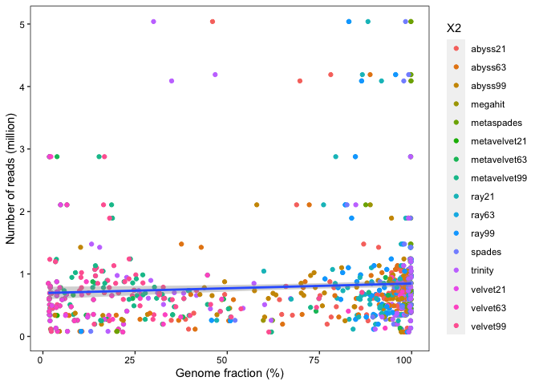

### alaysis


```r
library(tidyverse)
library(reshape2)
x = read_tsv("~/Gdrive_tutorial_edits/Assembly_COVID19/covid19-Assembly/files/bioRxiv_1074_assembly_report_PE_amplicon_viralRNA.tsv")
x2 = melt(x, id.vars = "Assembly")
x2$Assembly = gsub("# ", "", x2$Assembly)
x3 = data.frame(str_split_fixed(x2$variable, "_", 3), value = as.numeric(x2$value), x2)

#
setwd("~/Gdrive_tutorial_edits/Assembly_COVID19/covid19-Assembly/plots/")
make_boxplot = function(variableToPlot)
{
  x4 = x3 %>% filter(Assembly == variableToPlot) 
  stat = x4 %>%
    group_by(X2) %>%
    summarize(mean = mean(value, na.rm = TRUE),
            median = median(value, na.rm = TRUE))
  
  print(stat)
  ggplot(x4, aes(X2, value)) +
    geom_boxplot(aes(color = X2)) +
    geom_jitter(aes(color = X2), alpha = .5, width = .1) +
    xlab("") +
    ylab(variableToPlot) +
    theme(panel.background = element_rect(fill = "white"),
        panel.border = element_rect(fill = NA, colour = "black", size = .5),
        axis.text = element_text(color = "black", angle = 90, hjust = 1),
        legend.position = "none")
  
  #filename = str_replace_all(variableToPlot, "[[:punct:]]", "")
  #ggsave(filename=paste(filename,"color.pdf", sep="_"), width = 15, height = 10, units = "cm", device = 'pdf')
}

make_boxplot("Genome fraction (%)")
```

```
## # A tibble: 16 x 3
##    X2            mean median
##    <fct>        <dbl>  <dbl>
##  1 abyss21      84.8   94.8 
##  2 abyss63      83.5   95.6 
##  3 abyss99      70.6   81.5 
##  4 megahit      97.5   99.7 
##  5 metaspades   97.5   99.7 
##  6 metavelvet21  7.03   3.89
##  7 metavelvet63 23.5   10.6 
##  8 metavelvet99 25.2   21.3 
##  9 ray21        90.4   94.8 
## 10 ray63        91.6   95.0 
## 11 ray99        91.6   95.0 
## 12 spades       96.7   99.2 
## 13 trinity      81.4   98.0 
## 14 velvet21      7.15   4.78
## 15 velvet63     23.8   11.2 
## 16 velvet99     25.7   21.1
```

<!-- -->

```r
make_boxplot("Largest contig")
```

```
## # A tibble: 16 x 3
##    X2             mean median
##    <fct>         <dbl>  <dbl>
##  1 abyss21      12912. 12340.
##  2 abyss63      10376.  6950 
##  3 abyss99       5917.  2826 
##  4 megahit      23680. 28204 
##  5 metaspades   23846. 29828 
##  6 metavelvet21   755.   667 
##  7 metavelvet63  1521.   814 
##  8 metavelvet99  1120.   991 
##  9 ray21        15248. 14898.
## 10 ray63        14237. 13042 
## 11 ray99        14216. 13042 
## 12 spades       18965. 17698.
## 13 trinity      16179. 17251 
## 14 velvet21       755.   667 
## 15 velvet63      1512.   810 
## 16 velvet99      1140.  1008
```

<!-- -->

```r
make_boxplot("Total length")
```

```
## # A tibble: 16 x 3
##    X2             mean median
##    <fct>         <dbl>  <dbl>
##  1 abyss21      25718. 28690.
##  2 abyss63      25518. 28960 
##  3 abyss99      21873. 25571 
##  4 megahit      32533. 29884.
##  5 metaspades   31636. 29892.
##  6 metavelvet21  2804.  1430 
##  7 metavelvet63  7677.  3507 
##  8 metavelvet99  8651.  6620 
##  9 ray21        30382. 30377 
## 10 ray63        30308. 29811 
## 11 ray99        30306. 29811 
## 12 spades       39610. 30484.
## 13 trinity      32700. 29827 
## 14 velvet21      2803.  1430 
## 15 velvet63      7741.  3523 
## 16 velvet99      8799.  6710
```

<!-- -->

```r
make_boxplot("contigs")
```

```
## # A tibble: 16 x 3
##    X2            mean median
##    <fct>        <dbl>  <dbl>
##  1 abyss21       7.76    5  
##  2 abyss63      10.2     9  
##  3 abyss99      13.9    14.5
##  4 megahit       6.52    2  
##  5 metaspades    5.37    2  
##  6 metavelvet21  4.32    2  
##  7 metavelvet63  8       5  
##  8 metavelvet99 11.4    10  
##  9 ray21         7.56    4.5
## 10 ray63         8.11    5  
## 11 ray99         8.12    5  
## 12 spades        8.48    5  
## 13 trinity       8.79    3.5
## 14 velvet21      4.32    2  
## 15 velvet63      8.14    5  
## 16 velvet99     11.6    10
```

<!-- -->

```r
make_boxplot("contigs (>= 1000 bp)")
```

```
## # A tibble: 16 x 3
##    X2            mean median
##    <fct>        <dbl>  <dbl>
##  1 abyss21       3.88    3  
##  2 abyss63       5.38    5  
##  3 abyss99       5.36    5.5
##  4 megahit       3.09    2  
##  5 metaspades    2.79    1  
##  6 metavelvet21  0.32    0  
##  7 metavelvet63  1.76    0  
##  8 metavelvet99  1.56    0  
##  9 ray21         5.45    4  
## 10 ray63         5.89    4  
## 11 ray99         5.90    4  
## 12 spades        5.67    4  
## 13 trinity       4.54    3  
## 14 velvet21      0.32    0  
## 15 velvet63      1.71    0  
## 16 velvet99      1.56    1
```

<!-- -->

```r
make_boxplot("Largest alignment")
```

```
## # A tibble: 16 x 3
##    X2             mean median
##    <fct>         <dbl>  <dbl>
##  1 abyss21      13111. 12314.
##  2 abyss63      10592.  6996 
##  3 abyss99       6017.  2917 
##  4 megahit      23870. 29079 
##  5 metaspades   24064. 29815 
##  6 metavelvet21   779.   681 
##  7 metavelvet63  1593.   841 
##  8 metavelvet99  1080.   969 
##  9 ray21        14817. 13799 
## 10 ray63        14233. 13346 
## 11 ray99        14212. 13346 
## 12 spades       18527. 18945 
## 13 trinity      15790  16706 
## 14 velvet21       782.   681 
## 15 velvet63      1585.   822.
## 16 velvet99      1098    967
```

<!-- -->

```r
make_boxplot("mismatches per 100 kbp")
```

```
## # A tibble: 16 x 3
##    X2            mean median
##    <fct>        <dbl>  <dbl>
##  1 abyss21       24.6   25.3
##  2 abyss63       27.1   26.9
##  3 abyss99       27.4   25.6
##  4 megahit       28.8   27.2
##  5 metaspades    26.6   26.8
##  6 metavelvet21  61.1    0  
##  7 metavelvet63  40.4   19.6
##  8 metavelvet99  58.1   31.1
##  9 ray21         38.9   36.9
## 10 ray63         39.4   37.7
## 11 ray99         39.3   37.7
## 12 spades        55.2   36.9
## 13 trinity       35.8   30.8
## 14 velvet21      61.1    0  
## 15 velvet63      40.2   19.4
## 16 velvet99      61.8   34.8
```

<!-- -->

```r
make_boxplot("indels per 100 kbp")
```

```
## # A tibble: 16 x 3
##    X2             mean median
##    <fct>         <dbl>  <dbl>
##  1 abyss21       9.77    3.48
##  2 abyss63       5.69    3.39
##  3 abyss99       7.38    0   
##  4 megahit       1.80    0   
##  5 metaspades    0.966   0   
##  6 metavelvet21  4.52    0   
##  7 metavelvet63  4.21    0   
##  8 metavelvet99 23.0     0   
##  9 ray21         7.23    3.35
## 10 ray63         9.44    3.61
## 11 ray99         9.41    3.61
## 12 spades       12.1     3.42
## 13 trinity       4.80    0   
## 14 velvet21      2.87    0   
## 15 velvet63      3.48    0   
## 16 velvet99     25.6     0
```

<!-- -->

```r
make_boxplot("Total aligned length")
```

```
## # A tibble: 16 x 3
##    X2             mean median
##    <fct>         <dbl>  <dbl>
##  1 abyss21      25541. 28664.
##  2 abyss63      25150. 28892 
##  3 abyss99      21509. 25098.
##  4 megahit      29217. 29814 
##  5 metaspades   29203. 29821 
##  6 metavelvet21  2103.  1165 
##  7 metavelvet63  7078.  3156.
##  8 metavelvet99  7585.  6362.
##  9 ray21        29294. 29823 
## 10 ray63        29062. 29740 
## 11 ray99        29060. 29740 
## 12 spades       36456. 29930 
## 13 trinity      30214. 29819 
## 14 velvet21      2139.  1430 
## 15 velvet63      7143.  3334.
## 16 velvet99      7733.  6378
```

<!-- -->

```r
make_boxplot("misassemblies")
```

```
## # A tibble: 16 x 3
##    X2             mean median
##    <fct>         <dbl>  <dbl>
##  1 abyss21      0.0128      0
##  2 abyss63      0.0270      0
##  3 abyss99      0.0938      0
##  4 megahit      0.111       0
##  5 metaspades   0           0
##  6 metavelvet21 0           0
##  7 metavelvet63 0           0
##  8 metavelvet99 0.258       0
##  9 ray21        0.617       0
## 10 ray63        0.235       0
## 11 ray99        0.235       0
## 12 spades       0.370       0
## 13 trinity      0.0494      0
## 14 velvet21     0           0
## 15 velvet63     0           0
## 16 velvet99     0.226       0
```

<!-- -->

```r
#make_boxplot("unaligned contigs")
make_boxplot("N50")
```

```
## # A tibble: 16 x 3
##    X2             mean median
##    <fct>         <dbl>  <dbl>
##  1 abyss21      11643.  8250.
##  2 abyss63       8927.  4117 
##  3 abyss99       4241.  1278.
##  4 megahit      22997. 28204 
##  5 metaspades   23082. 29828 
##  6 metavelvet21   671.   596 
##  7 metavelvet63   890.   648 
##  8 metavelvet99   708.   658 
##  9 ray21        13430. 12080.
## 10 ray63        12477.  8068 
## 11 ray99        12477.  8068 
## 12 spades       16764. 15790.
## 13 trinity      15029. 13837 
## 14 velvet21       673.   596 
## 15 velvet63       880.   629 
## 16 velvet99       706.   663
```

<!-- -->

```r
make_boxplot("N75")
```

```
## # A tibble: 16 x 3
##    X2             mean median
##    <fct>         <dbl>  <dbl>
##  1 abyss21       8296.  5720.
##  2 abyss63       6135.  2545 
##  3 abyss99       2238.   713 
##  4 megahit      19433. 26626 
##  5 metaspades   19953. 29431 
##  6 metavelvet21   593.   556 
##  7 metavelvet63   704.   560 
##  8 metavelvet99   608.   584 
##  9 ray21         9378.  6886.
## 10 ray63         9410.  6212.
## 11 ray99         9410.  6212.
## 12 spades       11730.  7612.
## 13 trinity      11173.  7110.
## 14 velvet21       593.   558 
## 15 velvet63       721.   560 
## 16 velvet99       610.   586
```

<!-- -->

```r
make_boxplot("L50")
```

```
## # A tibble: 16 x 3
##    X2            mean median
##    <fct>        <dbl>  <dbl>
##  1 abyss21       2.56      2
##  2 abyss63       3.22      3
##  3 abyss99       4.88      4
##  4 megahit       1.85      1
##  5 metaspades    1.59      1
##  6 metavelvet21  2.28      1
##  7 metavelvet63  3.39      2
##  8 metavelvet99  4.98      5
##  9 ray21         2.41      2
## 10 ray63         2.60      2
## 11 ray99         2.61      2
## 12 spades        2.37      2
## 13 trinity       2.39      1
## 14 velvet21      2.28      1
## 15 velvet63      3.51      3
## 16 velvet99      5.08      5
```

<!-- -->

```r
make_boxplot("L75")
```

```
## # A tibble: 16 x 3
##    X2            mean median
##    <fct>        <dbl>  <dbl>
##  1 abyss21       4.4     3  
##  2 abyss63       5.79    5  
##  3 abyss99       8.65    7.5
##  4 megahit       3.27    1  
##  5 metaspades    2.60    1  
##  6 metavelvet21  3.44    2  
##  7 metavelvet63  5.59    4  
##  8 metavelvet99  8.10    7  
##  9 ray21         4.13    2  
## 10 ray63         4.55    3  
## 11 ray99         4.56    3  
## 12 spades        4.20    3  
## 13 trinity       4.39    2  
## 14 velvet21      3.44    2  
## 15 velvet63      5.78    4  
## 16 velvet99      8.21    7
```

<!-- -->

```r
make_boxplot("NA50")
```

```
## # A tibble: 16 x 3
##    X2             mean median
##    <fct>         <dbl>  <dbl>
##  1 abyss21      12311.  8610 
##  2 abyss63       9431.  4624.
##  3 abyss99       4517.  1480 
##  4 megahit      24052. 29576 
##  5 metaspades   23844. 29815 
##  6 metavelvet21   692.   657 
##  7 metavelvet63   945.   629 
##  8 metavelvet99   685.   641 
##  9 ray21        13095. 11269 
## 10 ray63        12850.  8323 
## 11 ray99        12849.  8323 
## 12 spades       16582. 15378 
## 13 trinity      14977. 16192 
## 14 velvet21       692.   657 
## 15 velvet63       933.   628 
## 16 velvet99       682.   644
```

<!-- -->

```r
make_boxplot("NA75")
```

```
## # A tibble: 16 x 3
##    X2             mean median
##    <fct>         <dbl>  <dbl>
##  1 abyss21       8901.  6368 
##  2 abyss63       6416.  3052.
##  3 abyss99       2379.   866.
##  4 megahit      21131. 29576 
##  5 metaspades   21652. 29819 
##  6 metavelvet21   618.   579 
##  7 metavelvet63   735.   560 
##  8 metavelvet99   576.   560.
##  9 ray21         9177.  6428 
## 10 ray63         9688.  6361 
## 11 ray99         9688.  6361 
## 12 spades       12399.  7651 
## 13 trinity      11455.  7424 
## 14 velvet21       618.   579 
## 15 velvet63       753.   564 
## 16 velvet99       581.   570.
```

<!-- -->

```r
make_boxplot("LA50")
```

```
## # A tibble: 16 x 3
##    X2            mean median
##    <fct>        <dbl>  <dbl>
##  1 abyss21       2.28    2  
##  2 abyss63       3.14    3  
##  3 abyss99       4.82    4  
##  4 megahit       1.17    1  
##  5 metaspades    1.25    1  
##  6 metavelvet21  1.65    1  
##  7 metavelvet63  3.08    2  
##  8 metavelvet99  4.72    5  
##  9 ray21         2.38    2  
## 10 ray63         2.37    2  
## 11 ray99         2.38    2  
## 12 spades        1.95    1.5
## 13 trinity       2.09    1  
## 14 velvet21      1.65    1  
## 15 velvet63      3.18    2  
## 16 velvet99      4.84    5
```

<!-- -->

```r
make_boxplot("LA75")
```

```
## # A tibble: 16 x 3
##    X2            mean median
##    <fct>        <dbl>  <dbl>
##  1 abyss21       3.93    2  
##  2 abyss63       5.37    4.5
##  3 abyss99       8.58    8.5
##  4 megahit       1.59    1  
##  5 metaspades    1.59    1  
##  6 metavelvet21  2.47    2  
##  7 metavelvet63  5.10    4  
##  8 metavelvet99  7.48    7  
##  9 ray21         3.90    3  
## 10 ray63         4.04    3  
## 11 ray99         4.05    3  
## 12 spades        3.30    2  
## 13 trinity       3.04    2  
## 14 velvet21      2.47    2  
## 15 velvet63      5.28    4  
## 16 velvet99      7.61    7
```

<!-- -->

```r
# genomic feature
x4 = x3 %>% filter(Assembly == "genomic features") 
x4$value.1 = gsub("part", "", x4$value.1)
x5 = data.frame(str_split_fixed(x4$value.1,"\\+", 2), x4) 
x6 = data.frame(assembly = x5$X2, match = as.numeric(as.character(x5$X1.1)), mismatch = as.numeric(as.character(x5$X2.1)))

# 
  ggplot(x6, aes(assembly, 100*(match/49))) +
    geom_boxplot(aes(color = assembly)) +
    geom_jitter(aes(color = assembly), alpha = .5, width = .1) +
    xlab("") +
    ylab("% features mapped") +
    theme(panel.background = element_rect(fill = "white"),
        panel.border = element_rect(fill = NA, colour = "black", size = .5),
        axis.text = element_text(color = "black", angle = 90, hjust = 1),
        legend.position = "none") 
```

<!-- -->

```r
ggsave("percent_features_mapped_color.pdf", width = 15, height = 10, units = "cm")
```

### 90% of the genome is covered by single contig


```r
library(tidyverse)
#90%=29903*.9
contig = x3 %>% filter(Assembly == "Largest contig") %>% filter(value >=26912.7)
ggplot(contig, aes(X2)) +
    geom_histogram(stat = "count") +
    xlab("") +
    ylab("Count") +
    theme(panel.background = element_rect(fill = "white"),
        panel.border = element_rect(fill = NA, colour = "black", size = .5),
        axis.text = element_text(color = "black", angle = 90, hjust = 1),
        legend.position = "none") 
```

<!-- -->

```r
ggsave("90_percent_genome_single_contig.pdf", width = 15, height = 10, units = "cm")
```

### correlation read vs genome


```r
library(tidyverse)
r = read.table("~/Gdrive_tutorial_edits/Assembly_COVID19/covid19-Assembly/files/read_QC_matrix.txt")[,c(1,4)]
r2 = data.frame(id = str_split_fixed(r$V1, "_", 2), read = r$V4)
head(r2$id[,1])
```

```
## NULL
```

```r
#sum every two rows of PE data
r3 = data.frame(id = unique(r2$id.1), read = (rowsum(r2[,3], as.integer(gl(nrow(r2), 2, nrow(r2))))))
rx = x3 %>% filter(Assembly == "Genome fraction (%)")
rx2 = inner_join(r3, rx, by = c("id" = "X1"))

ggplot(rx2, aes(value, read/1e6)) +
    geom_point(aes(color = X2)) +
    geom_smooth(method='lm', formula= y~x) +
    xlab("Genome fraction (%)") +
    ylab("Number of reads (million)") +
    theme(panel.background = element_rect(fill = "white"),
        panel.border = element_rect(fill = NA, colour = "black", size = .5),
        axis.text = element_text(color = "black", angle = 0, hjust = 1)) 
```

<!-- -->

```r
ggsave("readVsGenome.pdf", width = 20, height = 15, units = "cm")

rx3 = na.omit(rx2)
cor(rx3$value, rx3$read, method = "spearman")
```

```
## [1] 0.1937081
```

```r
cor(rx3$value, rx3$read, method = "pearson")
```

```
## [1] 0.07455972
```

```r
#read dist; not needed
```


### sample to assembler


```r
library(tidyverse)
rx2 %>% filter(Assembly == "Genome fraction (%)") %>% na.omit() %>%
    ggplot(aes(fct_reorder(id, read), X2, color = X2)) +
    geom_point(aes(size = value, alpha = .5)) +
    ylab("") +
    xlab("Samples are sorted by number of reads") + 
    theme(panel.background = element_rect(fill = "white"),
        panel.border = element_rect(fill = NA, colour = "black", size = .5),
        axis.text = element_text(color = "black", angle = 0, hjust = 1),
        axis.text.x=element_blank()) 
```

<!-- -->

```r
ggsave("sampleVsassembler_color_bk.pdf", width = 30, height = 20, units = "cm")

# select 4 samples with high and low mean frac to plot in mvista
#high = SRR11578289 (97.4), SRR11597206 (94.4)
#low = SRR11828432, SRR11828424
#ref: MN908947.3

mvista = x3 %>% filter(Assembly == "Genome fraction (%)") %>% na.omit() %>%
    group_by(X1) %>%
    summarise(mean = mean(value)) %>% arrange(mean)
```


### align fasta to reference


```r
#https://www.biostars.org/p/110213/
# Build reference genome database
cd /projects/epigenomics3/temp/rislam/assembly/rajan/asm_pe/output_bioRxiv_100samples/ref/

gmap_build -D dir/ -d refgenome MN908947.3.fasta
# Alignment
gmap -D dir/refgenome/ -d refgenome -f samse -t 8 ../*fasta | samtools view -Shb - | samtools sort - alignment

samtools index aligment.bam
```


### dataset 


```r
library(tidyverse)
library(knitr)

c = read_tsv("~/Gdrive_tutorial_edits/Assembly_COVID19/covid19-Assembly/files/SraRunTable_COVID19_14.06.20.txt")

c2 = tibble(c$Platform, c$Run, c$SRA_Sample, c$Instrument, c$LibraryLayout, c$Assay_Type, c$LibrarySelection, c$LibrarySource, c$Organism, c$geo_loc_name, c$host, c$host_disease, c$Consent)

names(c2) <- gsub("c\\$", "", names(c2))
colSums(!is.na(c2))
```

```
##         Platform              Run       SRA_Sample       Instrument 
##            15007            15007            15007            15007 
##    LibraryLayout       Assay_Type LibrarySelection    LibrarySource 
##            15007            15007            15007            15007 
##         Organism     geo_loc_name             host     host_disease 
##            15007             5508             5373             5297 
##          Consent 
##            15007
```

```r
#
#write_csv(c2, "~/Gdrive_tutorial_edits/Assembly_COVID19/covid19-Assembly/files/COVID19_14.06.20_metadata_final.csv")

# summarise metadata
#colnames(c2)

#good code example: https://uc-r.github.io/descriptives_categorical
table3 <- table(c2$Instrument, c2$Assay_Type)
table3 <- table( c2$Assay_Type, c2$LibrarySource)
table3 <- table(c2$Assay_Type, c2$LibrarySource, c2$LibraryLayout)
ftable(table3)
```

```
##                                      PAIRED SINGLE
##                                                   
## AMPLICON         GENOMIC                  0      0
##                  METAGENOMIC              0     41
##                  METATRANSCRIPTOMIC       0      0
##                  SYNTHETIC                0    136
##                  TRANSCRIPTOMIC           0      0
##                  VIRAL RNA             5254   6507
## OTHER            GENOMIC                  0      0
##                  METAGENOMIC              1      0
##                  METATRANSCRIPTOMIC       0      0
##                  SYNTHETIC                0      0
##                  TRANSCRIPTOMIC           0      0
##                  VIRAL RNA               68      0
## RNA-Seq          GENOMIC                  1      0
##                  METAGENOMIC              9      9
##                  METATRANSCRIPTOMIC       9      0
##                  SYNTHETIC                0      0
##                  TRANSCRIPTOMIC          16      3
##                  VIRAL RNA              682    654
## Targeted-Capture GENOMIC                  0      0
##                  METAGENOMIC              0      0
##                  METATRANSCRIPTOMIC       0      0
##                  SYNTHETIC                0      0
##                  TRANSCRIPTOMIC           0      0
##                  VIRAL RNA              194    241
## WGA              GENOMIC                  6      0
##                  METAGENOMIC              5      0
##                  METATRANSCRIPTOMIC       0      0
##                  SYNTHETIC                0      0
##                  TRANSCRIPTOMIC           0      0
##                  VIRAL RNA             1061      0
## WGS              GENOMIC                 11      0
##                  METAGENOMIC              6      0
##                  METATRANSCRIPTOMIC       0      0
##                  SYNTHETIC                0      0
##                  TRANSCRIPTOMIC           0      0
##                  VIRAL RNA               93      0
```

```r
# will add table paper
df = c2 %>% 
    group_by(Assay_Type, LibrarySource, LibraryLayout) %>%
    tally() 

kable(df, caption = "Summary of all data. This table will add table paper")
```


Table: Summary of all data. This table will add table paper

|Assay_Type       |LibrarySource      |LibraryLayout |    n|
|:----------------|:------------------|:-------------|----:|
|AMPLICON         |METAGENOMIC        |SINGLE        |   41|
|AMPLICON         |SYNTHETIC          |SINGLE        |  136|
|AMPLICON         |VIRAL RNA          |PAIRED        | 5254|
|AMPLICON         |VIRAL RNA          |SINGLE        | 6507|
|OTHER            |METAGENOMIC        |PAIRED        |    1|
|OTHER            |VIRAL RNA          |PAIRED        |   68|
|RNA-Seq          |GENOMIC            |PAIRED        |    1|
|RNA-Seq          |METAGENOMIC        |PAIRED        |    9|
|RNA-Seq          |METAGENOMIC        |SINGLE        |    9|
|RNA-Seq          |METATRANSCRIPTOMIC |PAIRED        |    9|
|RNA-Seq          |TRANSCRIPTOMIC     |PAIRED        |   16|
|RNA-Seq          |TRANSCRIPTOMIC     |SINGLE        |    3|
|RNA-Seq          |VIRAL RNA          |PAIRED        |  682|
|RNA-Seq          |VIRAL RNA          |SINGLE        |  654|
|Targeted-Capture |VIRAL RNA          |PAIRED        |  194|
|Targeted-Capture |VIRAL RNA          |SINGLE        |  241|
|WGA              |GENOMIC            |PAIRED        |    6|
|WGA              |METAGENOMIC        |PAIRED        |    5|
|WGA              |VIRAL RNA          |PAIRED        | 1061|
|WGS              |GENOMIC            |PAIRED        |   11|
|WGS              |METAGENOMIC        |PAIRED        |    6|
|WGS              |VIRAL RNA          |PAIRED        |   93|

```r
#write_tsv(df, "~/Gdrive_tutorial_edits/Assembly_COVID19/covid19-Assembly/files/summary_data.tsv")

df2 = df %>% filter(LibrarySource == "VIRAL RNA")
kable(df2, caption = "Summary of VIRAL RNA data")
```


Table: Summary of VIRAL RNA data

|Assay_Type       |LibrarySource |LibraryLayout |    n|
|:----------------|:-------------|:-------------|----:|
|AMPLICON         |VIRAL RNA     |PAIRED        | 5254|
|AMPLICON         |VIRAL RNA     |SINGLE        | 6507|
|OTHER            |VIRAL RNA     |PAIRED        |   68|
|RNA-Seq          |VIRAL RNA     |PAIRED        |  682|
|RNA-Seq          |VIRAL RNA     |SINGLE        |  654|
|Targeted-Capture |VIRAL RNA     |PAIRED        |  194|
|Targeted-Capture |VIRAL RNA     |SINGLE        |  241|
|WGA              |VIRAL RNA     |PAIRED        | 1061|
|WGS              |VIRAL RNA     |PAIRED        |   93|

```r
##subsample main paper
#PE
set.seed(2020)
a1 = c2 %>% filter(LibraryLayout == "PAIRED" & Assay_Type == "AMPLICON" & LibrarySource == "VIRAL RNA") %>%
    mutate(LibType = "PE: AMPLICON of VIRAL RNA") %>% sample_n(100)

set.seed(2020)
a2 = c2 %>% filter(LibraryLayout == "PAIRED" & Assay_Type == "OTHER" & LibrarySource == "VIRAL RNA") %>%
    mutate(LibType = "PE: OTHER of VIRAL RNA")

set.seed(2020)
a3 = c2 %>% filter(LibraryLayout == "PAIRED" & Assay_Type == "RNA-Seq" & LibrarySource == "VIRAL RNA") %>%
    mutate(LibType = "PE: RNA-Seq of VIRAL RNA") %>% sample_n(100)

set.seed(2020)
a4 = c2 %>% filter(LibraryLayout == "PAIRED" & Assay_Type == "Targeted-Capture" & LibrarySource == "VIRAL RNA") %>%
    mutate(LibType = "PE: Targeted-Capture of VIRAL RNA") %>% sample_n(100)

set.seed(2020)
a5 = c2 %>% filter(LibraryLayout == "PAIRED" & Assay_Type == "WGA" & LibrarySource == "VIRAL RNA") %>%
    mutate(LibType = "PE: WGA of VIRAL RNA") %>% sample_n(100)

set.seed(2020)
a6 = c2 %>% filter(LibraryLayout == "PAIRED" & Assay_Type == "WGS" & LibrarySource == "VIRAL RNA") %>%
    mutate(LibType = "PE: WGS of VIRAL RNA")

#SE
set.seed(2020)
b1 = c2 %>% filter(LibraryLayout == "SINGLE" & Assay_Type == "AMPLICON" & LibrarySource == "VIRAL RNA") %>%
    mutate(LibType = "SE: AMPLICON of VIRAL RNA") %>% sample_n(100)

set.seed(2020)
b2 = c2 %>% filter(LibraryLayout == "SINGLE" & Assay_Type == "RNA-Seq" & LibrarySource == "VIRAL RNA") %>%
    mutate(LibType = "SE: RNA-Seq of VIRAL RNA") %>% sample_n(100)

set.seed(2020)
b3 = c2 %>% filter(LibraryLayout == "SINGLE" & Assay_Type == "Targeted-Capture" & LibrarySource == "VIRAL RNA") %>%
    mutate(LibType = "SE: Targeted-Capture of VIRAL RNA") %>% sample_n(100)

#dataset
ab_pe = rbind(a1, a2, a3, a4, a5, a6)
ab_se = rbind(b1, b2, b3)
#write_csv(ab_pe, "~/Gdrive_tutorial_edits/Assembly_COVID19/covid19-Assembly/files/PE_561samples_final.csv")
#write_csv(ab_se, "~/Gdrive_tutorial_edits/Assembly_COVID19/covid19-Assembly/files/SE_300samples_final.csv")
#write.table(ab_pe$Run, "~/Gdrive_tutorial_edits/Assembly_COVID19/covid19-Assembly/files/PE_561samples_final_561runs.txt", col.names = F, row.names = F, quote = F)
#write.table(ab_se$Run, "~/Gdrive_tutorial_edits/Assembly_COVID19/covid19-Assembly/files/SE_300samples_final_300runs.txt", col.names = F, row.names = F, quote = F)
#write_csv(a1, "~/Gdrive_tutorial_edits/Assembly_COVID19/covid19-Assembly/files/PE_100samples_amplicon_bioRxiv.csv")
#write.table(a1[,2], "~/Gdrive_tutorial_edits/Assembly_COVID19/covid19-Assembly/files/PE_100samples_amplicon_bioRxiv_100runs.txt", col.names = F, row.names = F, quote = F)

# test ram and cpu
set.seed(2020)
#20 samples will be selected from amplicon with similar depth
#ram = a1 %>% sample_n(20)

ab = rbind(ab_pe, ab_se)
ab2 = ab %>% group_by(LibType) %>% tally()
kable(ab2, caption = "List of total 9 different categories. Maximum 100 samples are randomly selected")
```


Table: List of total 9 different categories. Maximum 100 samples are randomly selected

|LibType                           |   n|
|:---------------------------------|---:|
|PE: AMPLICON of VIRAL RNA         | 100|
|PE: OTHER of VIRAL RNA            |  68|
|PE: RNA-Seq of VIRAL RNA          | 100|
|PE: Targeted-Capture of VIRAL RNA | 100|
|PE: WGA of VIRAL RNA              | 100|
|PE: WGS of VIRAL RNA              |  93|
|SE: AMPLICON of VIRAL RNA         | 100|
|SE: RNA-Seq of VIRAL RNA          | 100|
|SE: Targeted-Capture of VIRAL RNA | 100|

### check read quality


```r
#unzip files
cd /projects/epigenomics3/temp/rislam/assembly/rajan/asm_pe/output_bioRxiv_100samples/trimmed_fastqc
for f in *RR*/fastqc_data.txt; do echo $f; grep "Total Sequences\|Sequences flagged as poor quality\|Sequence length\|%GC" $f; done | paste - - - - -  | awk '{gsub("/fastqc_data.txt", ""); print }' >read_QC_matrix.txt
```


