### alaysis


```r
library(tidyverse)
library(reshape2)
x = read_tsv("~/Gdrive_tutorial_edits/Assembly_COVID19/covid19-Assembly/files/bioRxiv_1074_assembly_report_PE_amplicon_viralRNA.tsv")
x2 = melt(x, id.vars = "Assembly")
x2$Assembly = gsub("# ", "", x2$Assembly)
x3 = data.frame(str_split_fixed(x2$variable, "_", 3), value = as.numeric(x2$value), x2)

#
setwd("~/Gdrive_tutorial_edits/Assembly_COVID19/covid19-Assembly/plots/")
make_boxplot = function(variableToPlot)
{
  x4 = x3 %>% filter(Assembly == variableToPlot) 
  ggplot(x4, aes(X2, value)) +
    geom_boxplot() +
    geom_jitter(alpha = .5, width = .1) +
    xlab("") +
    ylab(variableToPlot) +
    theme(panel.background = element_rect(fill = "white"),
        panel.border = element_rect(fill = NA, colour = "black", size = .5),
        axis.text = element_text(color = "black", angle = 90, hjust = 1)) 
  
  #filename = str_replace_all(variableToPlot, "[[:punct:]]", "")
  #ggsave(filename=paste(filename,".pdf", sep="_"), width = 15, height = 10, units = "cm", device = 'pdf')
}

make_boxplot("Genome fraction (%)")
```

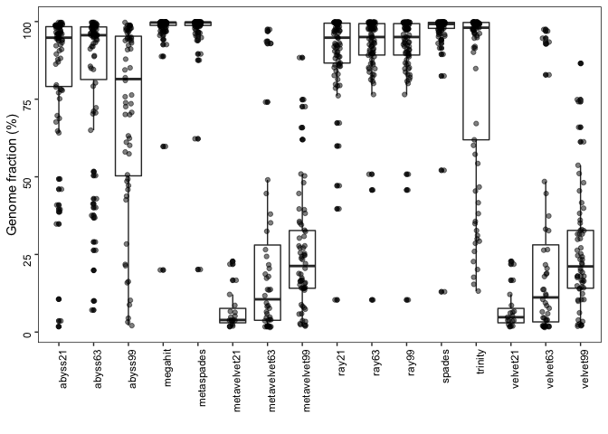<!-- -->

```r
make_boxplot("Largest contig")
```

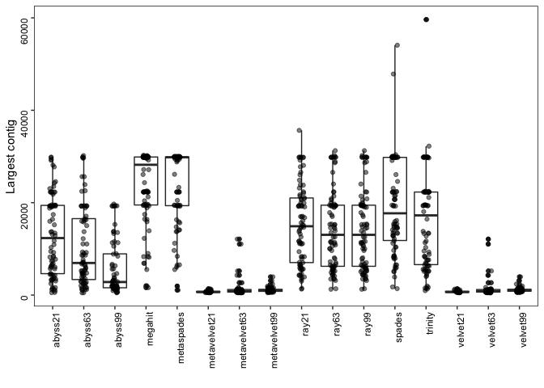<!-- -->

```r
make_boxplot("Total length")
```

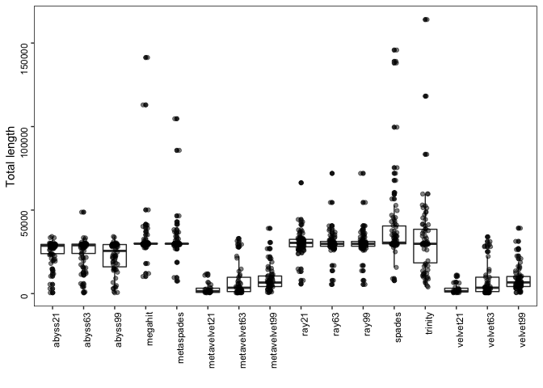<!-- -->

```r
make_boxplot("contigs")
```

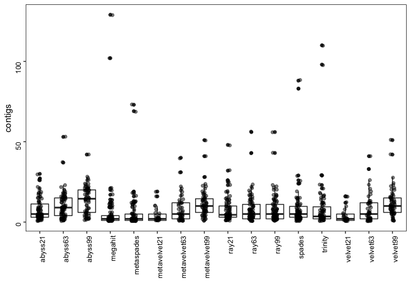<!-- -->

```r
make_boxplot("contigs (>= 1000 bp)")
```

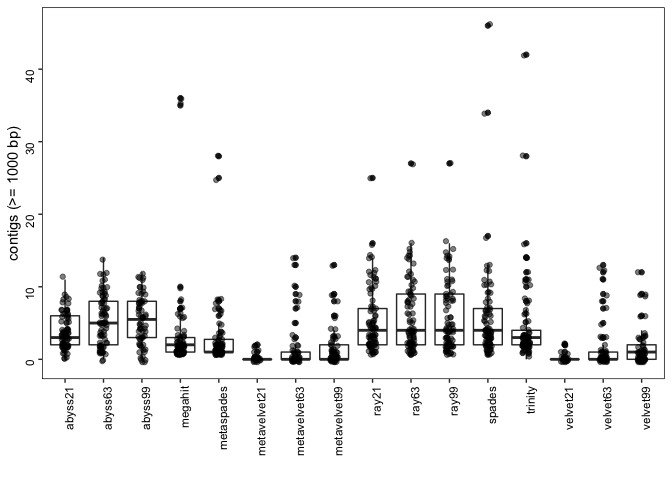<!-- -->

```r
make_boxplot("Largest alignment")
```

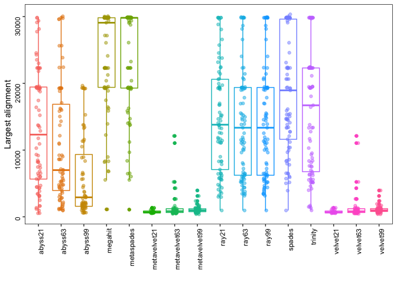<!-- -->

```r
make_boxplot("mismatches per 100 kbp")
```

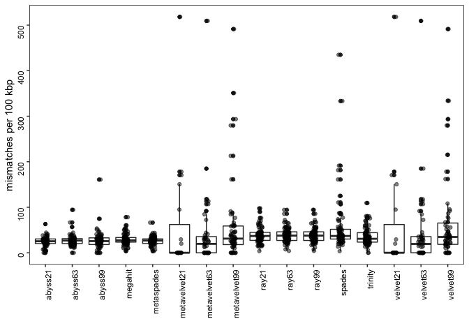<!-- -->

```r
make_boxplot("indels per 100 kbp")
```

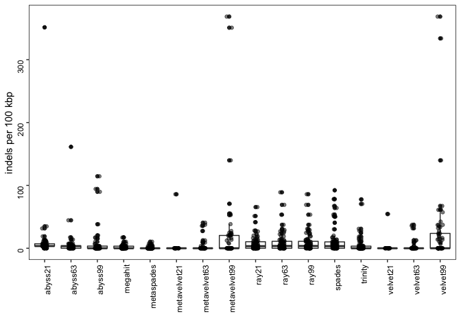<!-- -->

```r
make_boxplot("Total aligned length")
```

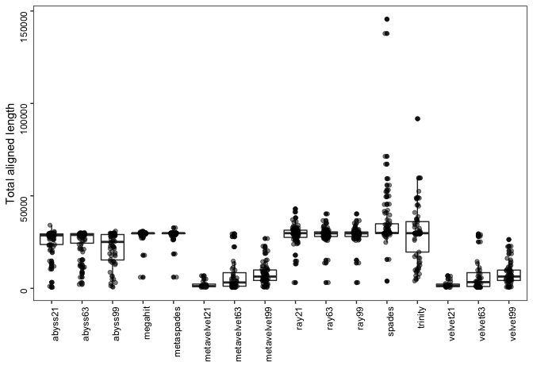<!-- -->

```r
make_boxplot("misassemblies")
```

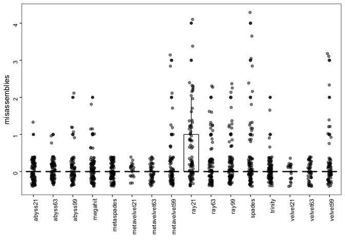<!-- -->

```r
make_boxplot("N50")
```

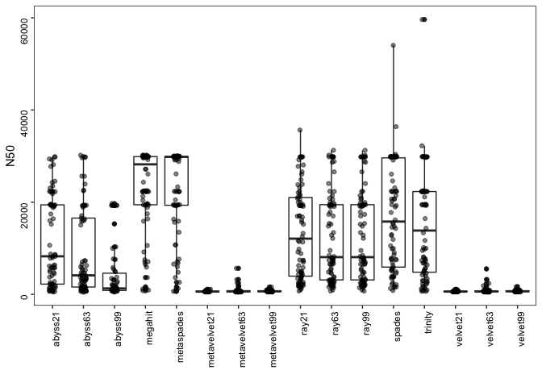<!-- -->

```r
make_boxplot("N75")
```

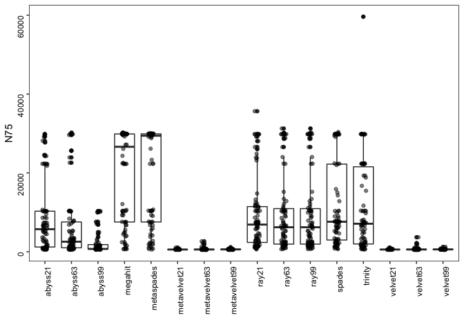<!-- -->

```r
make_boxplot("L50")
```

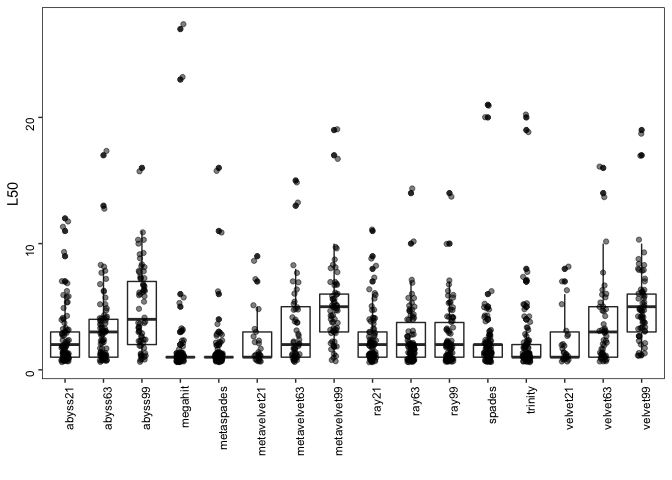<!-- -->

```r
make_boxplot("L75")
```

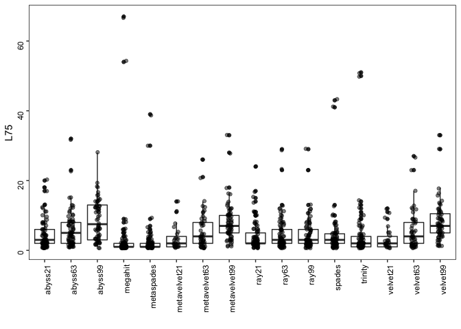<!-- -->

```r
make_boxplot("NA50")
```

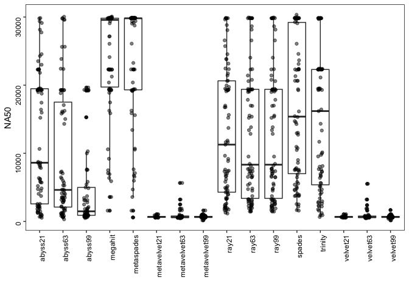<!-- -->

```r
make_boxplot("NA75")
```

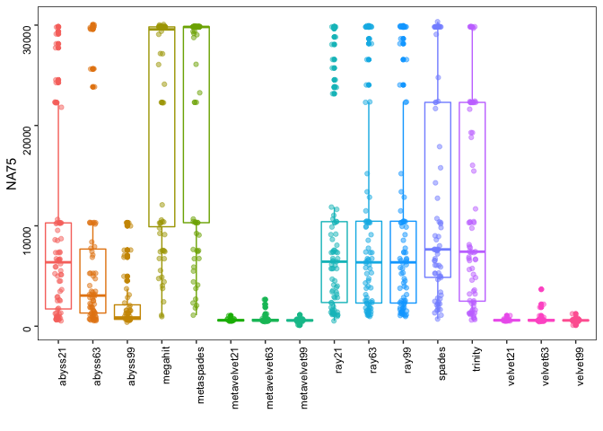<!-- -->

```r
make_boxplot("LA50")
```

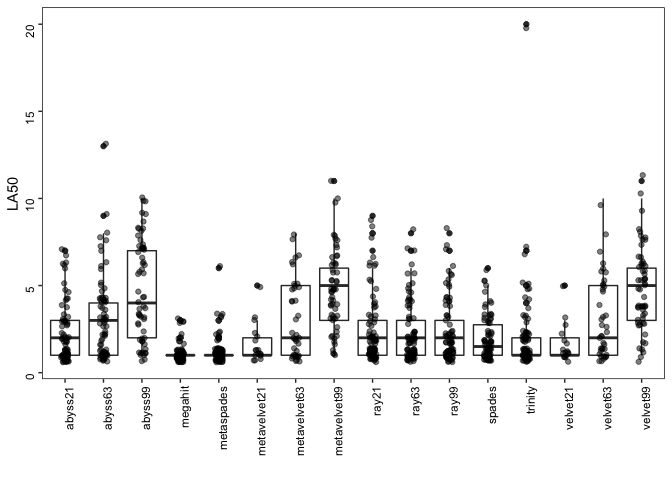<!-- -->

```r
make_boxplot("LA75")
```

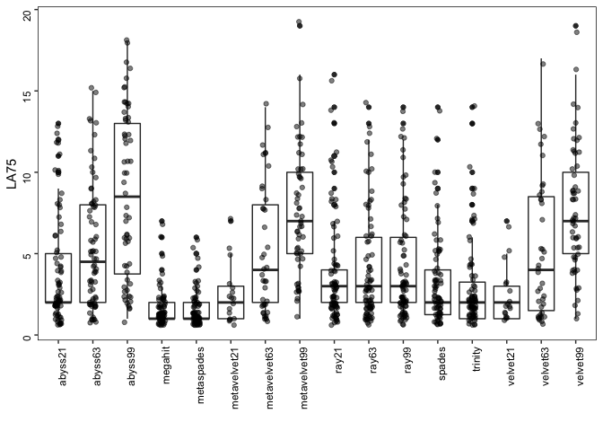<!-- -->

```r
# genomic feature
x4 = x3 %>% filter(Assembly == "genomic features") 
x4$value.1 = gsub("part", "", x4$value.1)
x5 = data.frame(str_split_fixed(x4$value.1,"\\+", 2), x4) 
x6 = data.frame(assembly = x5$X2, match = as.numeric(as.character(x5$X1.1)), mismatch = as.numeric(as.character(x5$X2.1)))

# 
  ggplot(x6, aes(assembly, match/49)) +
    geom_boxplot() +
    geom_jitter(alpha = .5, width = .1) +
    xlab("") +
    ylab("% features mapped") +
    theme(panel.background = element_rect(fill = "white"),
        panel.border = element_rect(fill = NA, colour = "black", size = .5),
        axis.text = element_text(color = "black", angle = 90, hjust = 1)) 
```

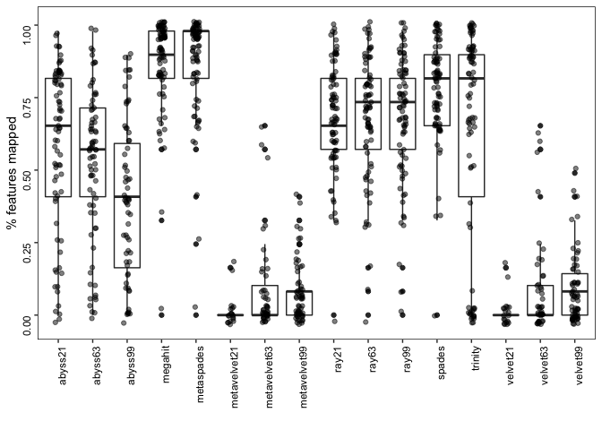<!-- -->

```r
ggsave("percent features mapped.pdf", width = 15, height = 10, units = "cm")
```

### correlation read vs genome


```r
library(tidyverse)
```

```
## ── Attaching packages ───────────────────────────────────────────────────────────────── tidyverse 1.3.0 ──
```

```
## ✓ ggplot2 3.3.2     ✓ purrr   0.3.4
## ✓ tibble  3.0.3     ✓ dplyr   1.0.1
## ✓ tidyr   1.1.1     ✓ stringr 1.4.0
## ✓ readr   1.3.1     ✓ forcats 0.5.0
```

```
## ── Conflicts ──────────────────────────────────────────────────────────────────── tidyverse_conflicts() ──
## x dplyr::filter() masks stats::filter()
## x dplyr::lag()    masks stats::lag()
```

```r
r = read.table("~/Gdrive_tutorial_edits/Assembly_COVID19/covid19-Assembly/files/read_QC_matrix.txt")[,c(1,4)]
r2 = data.frame(id = str_split_fixed(r$V1, "_", 2), read = r$V4)
head(r2$id[,1])
```

```
## NULL
```

```r
#sum every two rows of PE data
r3 = data.frame(id = unique(r2$id.1), read = (rowsum(r2[,3], as.integer(gl(nrow(r2), 2, nrow(r2))))))
rx = x3 %>% filter(Assembly == "Genome fraction (%)")
rx2 = inner_join(r3, rx, by = c("id" = "X1"))

ggplot(rx2, aes(value, read/1e6)) +
    geom_point(aes(color = X2)) +
    geom_smooth(method='lm', formula= y~x) +
    xlab("Genome fraction (%)") +
    ylab("Number of reads (million)") +
    theme(panel.background = element_rect(fill = "white"),
        panel.border = element_rect(fill = NA, colour = "black", size = .5),
        axis.text = element_text(color = "black", angle = 0, hjust = 1)) 
```

```
## Warning: Removed 38 rows containing non-finite values (stat_smooth).
```

```
## Warning: Removed 38 rows containing missing values (geom_point).
```

<!-- -->

```r
ggsave("readVsGenome.pdf", width = 20, height = 15, units = "cm")
```

```
## Warning: Removed 38 rows containing non-finite values (stat_smooth).

## Warning: Removed 38 rows containing missing values (geom_point).
```

```r
rx3 = na.omit(rx2)
cor(rx3$value, rx3$read, method = "spearman")
```

```
## [1] 0.1937081
```


### dataset 


```r
library(tidyverse)
library(knitr)

c = read_tsv("~/Gdrive_tutorial_edits/Assembly_COVID19/covid19-Assembly/files/SraRunTable_COVID19_14.06.20.txt")

c2 = tibble(c$Platform, c$Run, c$SRA_Sample, c$Instrument, c$LibraryLayout, c$Assay_Type, c$LibrarySelection, c$LibrarySource, c$Organism, c$geo_loc_name, c$host, c$host_disease, c$Consent)

names(c2) <- gsub("c\\$", "", names(c2))
colSums(!is.na(c2))
```

```
##         Platform              Run       SRA_Sample       Instrument 
##            15007            15007            15007            15007 
##    LibraryLayout       Assay_Type LibrarySelection    LibrarySource 
##            15007            15007            15007            15007 
##         Organism     geo_loc_name             host     host_disease 
##            15007             5508             5373             5297 
##          Consent 
##            15007
```

```r
#
#write_csv(c2, "~/Gdrive_tutorial_edits/Assembly_COVID19/covid19-Assembly/files/COVID19_14.06.20_metadata_final.csv")

# summarise metadata
#colnames(c2)

#good code example: https://uc-r.github.io/descriptives_categorical
table3 <- table(c2$Instrument, c2$Assay_Type)
table3 <- table( c2$Assay_Type, c2$LibrarySource)
table3 <- table(c2$Assay_Type, c2$LibrarySource, c2$LibraryLayout)
ftable(table3)
```

```
##                                      PAIRED SINGLE
##                                                   
## AMPLICON         GENOMIC                  0      0
##                  METAGENOMIC              0     41
##                  METATRANSCRIPTOMIC       0      0
##                  SYNTHETIC                0    136
##                  TRANSCRIPTOMIC           0      0
##                  VIRAL RNA             5254   6507
## OTHER            GENOMIC                  0      0
##                  METAGENOMIC              1      0
##                  METATRANSCRIPTOMIC       0      0
##                  SYNTHETIC                0      0
##                  TRANSCRIPTOMIC           0      0
##                  VIRAL RNA               68      0
## RNA-Seq          GENOMIC                  1      0
##                  METAGENOMIC              9      9
##                  METATRANSCRIPTOMIC       9      0
##                  SYNTHETIC                0      0
##                  TRANSCRIPTOMIC          16      3
##                  VIRAL RNA              682    654
## Targeted-Capture GENOMIC                  0      0
##                  METAGENOMIC              0      0
##                  METATRANSCRIPTOMIC       0      0
##                  SYNTHETIC                0      0
##                  TRANSCRIPTOMIC           0      0
##                  VIRAL RNA              194    241
## WGA              GENOMIC                  6      0
##                  METAGENOMIC              5      0
##                  METATRANSCRIPTOMIC       0      0
##                  SYNTHETIC                0      0
##                  TRANSCRIPTOMIC           0      0
##                  VIRAL RNA             1061      0
## WGS              GENOMIC                 11      0
##                  METAGENOMIC              6      0
##                  METATRANSCRIPTOMIC       0      0
##                  SYNTHETIC                0      0
##                  TRANSCRIPTOMIC           0      0
##                  VIRAL RNA               93      0
```

```r
# will add table paper
df = c2 %>% 
    group_by(Assay_Type, LibrarySource, LibraryLayout) %>%
    tally() 

kable(df, caption = "Summary of all data. This table will add table paper")
```


Table: Summary of all data. This table will add table paper

|Assay_Type       |LibrarySource      |LibraryLayout |    n|
|:----------------|:------------------|:-------------|----:|
|AMPLICON         |METAGENOMIC        |SINGLE        |   41|
|AMPLICON         |SYNTHETIC          |SINGLE        |  136|
|AMPLICON         |VIRAL RNA          |PAIRED        | 5254|
|AMPLICON         |VIRAL RNA          |SINGLE        | 6507|
|OTHER            |METAGENOMIC        |PAIRED        |    1|
|OTHER            |VIRAL RNA          |PAIRED        |   68|
|RNA-Seq          |GENOMIC            |PAIRED        |    1|
|RNA-Seq          |METAGENOMIC        |PAIRED        |    9|
|RNA-Seq          |METAGENOMIC        |SINGLE        |    9|
|RNA-Seq          |METATRANSCRIPTOMIC |PAIRED        |    9|
|RNA-Seq          |TRANSCRIPTOMIC     |PAIRED        |   16|
|RNA-Seq          |TRANSCRIPTOMIC     |SINGLE        |    3|
|RNA-Seq          |VIRAL RNA          |PAIRED        |  682|
|RNA-Seq          |VIRAL RNA          |SINGLE        |  654|
|Targeted-Capture |VIRAL RNA          |PAIRED        |  194|
|Targeted-Capture |VIRAL RNA          |SINGLE        |  241|
|WGA              |GENOMIC            |PAIRED        |    6|
|WGA              |METAGENOMIC        |PAIRED        |    5|
|WGA              |VIRAL RNA          |PAIRED        | 1061|
|WGS              |GENOMIC            |PAIRED        |   11|
|WGS              |METAGENOMIC        |PAIRED        |    6|
|WGS              |VIRAL RNA          |PAIRED        |   93|

```r
#write_tsv(df, "~/Gdrive_tutorial_edits/Assembly_COVID19/covid19-Assembly/files/summary_data.tsv")

df2 = df %>% filter(LibrarySource == "VIRAL RNA")
kable(df2, caption = "Summary of VIRAL RNA data")
```


Table: Summary of VIRAL RNA data

|Assay_Type       |LibrarySource |LibraryLayout |    n|
|:----------------|:-------------|:-------------|----:|
|AMPLICON         |VIRAL RNA     |PAIRED        | 5254|
|AMPLICON         |VIRAL RNA     |SINGLE        | 6507|
|OTHER            |VIRAL RNA     |PAIRED        |   68|
|RNA-Seq          |VIRAL RNA     |PAIRED        |  682|
|RNA-Seq          |VIRAL RNA     |SINGLE        |  654|
|Targeted-Capture |VIRAL RNA     |PAIRED        |  194|
|Targeted-Capture |VIRAL RNA     |SINGLE        |  241|
|WGA              |VIRAL RNA     |PAIRED        | 1061|
|WGS              |VIRAL RNA     |PAIRED        |   93|

```r
##subsample main paper
#PE
set.seed(2020)
a1 = c2 %>% filter(LibraryLayout == "PAIRED" & Assay_Type == "AMPLICON" & LibrarySource == "VIRAL RNA") %>%
    mutate(LibType = "PE: AMPLICON of VIRAL RNA") %>% sample_n(100)

set.seed(2020)
a2 = c2 %>% filter(LibraryLayout == "PAIRED" & Assay_Type == "OTHER" & LibrarySource == "VIRAL RNA") %>%
    mutate(LibType = "PE: OTHER of VIRAL RNA")

set.seed(2020)
a3 = c2 %>% filter(LibraryLayout == "PAIRED" & Assay_Type == "RNA-Seq" & LibrarySource == "VIRAL RNA") %>%
    mutate(LibType = "PE: RNA-Seq of VIRAL RNA") %>% sample_n(100)

set.seed(2020)
a4 = c2 %>% filter(LibraryLayout == "PAIRED" & Assay_Type == "Targeted-Capture" & LibrarySource == "VIRAL RNA") %>%
    mutate(LibType = "PE: Targeted-Capture of VIRAL RNA") %>% sample_n(100)

set.seed(2020)
a5 = c2 %>% filter(LibraryLayout == "PAIRED" & Assay_Type == "WGA" & LibrarySource == "VIRAL RNA") %>%
    mutate(LibType = "PE: WGA of VIRAL RNA") %>% sample_n(100)

set.seed(2020)
a6 = c2 %>% filter(LibraryLayout == "PAIRED" & Assay_Type == "WGS" & LibrarySource == "VIRAL RNA") %>%
    mutate(LibType = "PE: WGS of VIRAL RNA")

#SE
set.seed(2020)
b1 = c2 %>% filter(LibraryLayout == "SINGLE" & Assay_Type == "AMPLICON" & LibrarySource == "VIRAL RNA") %>%
    mutate(LibType = "SE: AMPLICON of VIRAL RNA") %>% sample_n(100)

set.seed(2020)
b2 = c2 %>% filter(LibraryLayout == "SINGLE" & Assay_Type == "RNA-Seq" & LibrarySource == "VIRAL RNA") %>%
    mutate(LibType = "SE: RNA-Seq of VIRAL RNA") %>% sample_n(100)

set.seed(2020)
b3 = c2 %>% filter(LibraryLayout == "SINGLE" & Assay_Type == "Targeted-Capture" & LibrarySource == "VIRAL RNA") %>%
    mutate(LibType = "SE: Targeted-Capture of VIRAL RNA") %>% sample_n(100)

#dataset
ab_pe = rbind(a1, a2, a3, a4, a5, a6)
ab_se = rbind(b1, b2, b3)
#write_csv(ab_pe, "~/Gdrive_tutorial_edits/Assembly_COVID19/covid19-Assembly/files/PE_561samples_final.csv")
#write_csv(ab_se, "~/Gdrive_tutorial_edits/Assembly_COVID19/covid19-Assembly/files/SE_300samples_final.csv")
#write.table(ab_pe$Run, "~/Gdrive_tutorial_edits/Assembly_COVID19/covid19-Assembly/files/PE_561samples_final_561runs.txt", col.names = F, row.names = F, quote = F)
#write.table(ab_se$Run, "~/Gdrive_tutorial_edits/Assembly_COVID19/covid19-Assembly/files/SE_300samples_final_300runs.txt", col.names = F, row.names = F, quote = F)
#write_csv(a1, "~/Gdrive_tutorial_edits/Assembly_COVID19/covid19-Assembly/files/PE_100samples_amplicon_bioRxiv.csv")
#write.table(a1[,2], "~/Gdrive_tutorial_edits/Assembly_COVID19/covid19-Assembly/files/PE_100samples_amplicon_bioRxiv_100runs.txt", col.names = F, row.names = F, quote = F)

# test ram and cpu
set.seed(2020)
#20 samples will be selected from amplicon with similar depth
#ram = a1 %>% sample_n(20)

ab = rbind(ab_pe, ab_se)
ab2 = ab %>% group_by(LibType) %>% tally()
kable(ab2, caption = "List of total 9 different categories. Maximum 100 samples are randomly selected")
```


Table: List of total 9 different categories. Maximum 100 samples are randomly selected

|LibType                           |   n|
|:---------------------------------|---:|
|PE: AMPLICON of VIRAL RNA         | 100|
|PE: OTHER of VIRAL RNA            |  68|
|PE: RNA-Seq of VIRAL RNA          | 100|
|PE: Targeted-Capture of VIRAL RNA | 100|
|PE: WGA of VIRAL RNA              | 100|
|PE: WGS of VIRAL RNA              |  93|
|SE: AMPLICON of VIRAL RNA         | 100|
|SE: RNA-Seq of VIRAL RNA          | 100|
|SE: Targeted-Capture of VIRAL RNA | 100|

### check read quality


```r
#unzip files
cd /projects/epigenomics3/temp/rislam/assembly/rajan/asm_pe/output_bioRxiv_100samples/trimmed_fastqc
for f in *RR*/fastqc_data.txt; do echo $f; grep "Total Sequences\|Sequences flagged as poor quality\|Sequence length\|%GC" $f; done | paste - - - - -  | awk '{gsub("/fastqc_data.txt", ""); print }' >read_QC_matrix.txt
```


