>agree disagree read count


```r
x = read.table("/Users/rashedulislam/Documents/research/asm/bam/bwa_alignment/disagreement_MetaSpades_Megahit/merged_vcf/agree_disagree.bed.readcount")

x %>% select(V12, V4) %>%
  ggplot(aes(V4, V12)) +
  geom_boxplot()
```


### Spike variants


```r
library(tidyverse)
library(reshape2)

setwd("~/Documents/research/asm/covid19-Assembly/plots/")

s = read.table("~/Documents/research/asm/covid19-Assembly/files/SpikeSNVsDetails.txt")
s2 = data.frame(str_split_fixed(s$V1, "_", 3), s)

#number of samples used for variant calling
length(unique(s2$X1))
```

```
## [1] 347
```

```r
s3 = s2 %>% group_by(X2, V5) %>%
  summarise(n = n())

ggplot(s3, aes(X2, n, fill = V5)) +
  geom_bar(position="stack", stat="identity") + 
    xlab("") +
    ylab("Total variants in 347 samples at Spike locus") +
    theme(panel.background = element_rect(fill = "white"),
        panel.border = element_rect(fill = NA, colour = "black", size = .5),
        axis.text = element_text(color = "black", angle = 90, hjust = 1),
        strip.background =element_rect(fill="white"),
        legend.position = "right")
```

<!-- -->

```r
ggsave("Variant_count_spike.pdf", width = 18, height = 13, units = "cm", device = 'pdf')

# mega and meta had 100% spike
t = read.table("~/Documents/research/asm/covid19-Assembly/files/intersected_samples_list.txt")

mgs = read.table("~/Documents/research/asm/covid19-Assembly/files/spike_intersected_megahit_SRR.txt")
table(duplicated(mgs))
```

```
## 
## FALSE 
##   294
```

```r
mts = read.table("~/Documents/research/asm/covid19-Assembly/files/spike_intersected_metaspades_SRR.txt")
table(duplicated(mts))
```

```
## 
## FALSE  TRUE 
##   292    12
```

```r
mts2 = data.frame(V1 = mts[!duplicated(mts$V1), ])
length(unique(intersect(mgs$V1, mts2$V1)))
```

```
## [1] 285
```

```r
se_temp = s2 %>% select(X1, X2, V5)
mg = left_join(mgs, se_temp, by = c("V1" = "X1")) %>% filter(X2 %in% c("megahit"))
mt = left_join(mts2, se_temp, by = c("V1" = "X1")) %>% filter(X2 %in% c( "metaspades"))

length(unique(intersect(mg$V1, mt$V1)))
```

```
## [1] 222
```

```r
ms_common = inner_join(mg, mt, by = c("V1" = "V1")) 

s3 %>% filter(X2 %in% c("megahit", "metaspades")) %>%
ggplot(aes(X2, n, fill = V5)) +
  geom_bar(position="stack", stat="identity") + 
    xlab("") +
    ylab("Total variants at Spike locus") +
    theme(panel.background = element_rect(fill = "white"),
        panel.border = element_rect(fill = NA, colour = "black", size = .5),
        axis.text = element_text(color = "black", angle = 90, hjust = 1),
        strip.background =element_rect(fill="white"),
        legend.position = "right")
```

<!-- -->

```r
ggsave("Variant_count_spike_mega_meta.pdf", width = 10, height = 13, units = "cm", device = 'pdf')


## total count of variants
v = read.table("~/Documents/research/asm/covid19-Assembly/files/Variant_count_all_assembler.txt")

ggplot(v, aes(V1, V2, fill = V1)) +
  geom_bar(position="stack", stat="identity") + 
    xlab("") +
    ylab("Total variants in 416 samples") +
    theme(panel.background = element_rect(fill = "white"),
        panel.border = element_rect(fill = NA, colour = "black", size = .5),
        axis.text = element_text(color = "black", angle = 90, hjust = 1),
        strip.background =element_rect(fill="white"),
        legend.position = "none")
```

<!-- -->

```r
ggsave("Variant_count_all.pdf", width = 18, height = 13, units = "cm", device = 'pdf')

# correlation variant_count and %GF
x = read_tsv("~/Documents/research/asm/covid19-Assembly/files/report_metaquast_PE_all.tsv")

x2 = melt(x, id.vars = "Assembly")
x2$Assembly = gsub("# ", "", x2$Assembly)
x3 = data.frame(str_split_fixed(x2$variable, "_", 3), value = as.numeric(x2$value), x2)

x4 = x3 %>% filter(Assembly == "Genome fraction (%)") %>% na.omit() %>%
  group_by(X2) %>%
  summarise(mean = mean(value))

cor(v$V2, x4$mean)
```

```
## [1] 0.734553
```

```r
#0.734553

# variants per sample
df = read_csv("~/Documents/research/asm/covid19-Assembly/files/sample_variants_count.csv")
# replace -32 with NA
df[df == -32] <- NA
df2 = melt(df)

ggplot(df2, aes(variable, value)) +
  geom_boxplot() + 
    xlab("") +
    ylab("Variants per sample") +
    theme(panel.background = element_rect(fill = "white"),
        panel.border = element_rect(fill = NA, colour = "black", size = .5),
        axis.text = element_text(color = "black", angle = 90, hjust = 1),
        strip.background =element_rect(fill="white"),
        legend.position = "none")
```

<!-- -->

```r
ggsave("Variant_count_per_sample.pdf", width = 18, height = 13, units = "cm", device = 'pdf')


df3 = df2 %>% 
  group_by(variable) %>%
  summarise(mean = mean(value, na.rm = T),
            median = median(value, na.rm = T),
            sd = sd(value, na.rm = T))

ggplot(df3, aes(variable, mean)) + 
    geom_col() +  
    geom_errorbar(aes(ymin = mean - sd, ymax = mean + sd), width=0.2) +
    xlab("") +
    ylab("Variants per sample") +
    theme(panel.background = element_rect(fill = "white"),
        panel.border = element_rect(fill = NA, colour = "black", size = .5),
        axis.text = element_text(color = "black", angle = 90, hjust = 1),
        strip.background =element_rect(fill="white"),
        legend.position = "none")
```

<!-- -->

```r
print(df3, n = Inf)
```

```
## # A tibble: 16 x 4
##    variable      mean median    sd
##    <fct>        <dbl>  <dbl> <dbl>
##  1 abyss21       5.41    6    3.72
##  2 abyss63       5.54    6    3.76
##  3 abyss99       6.26    7    5.32
##  4 megahit       7.31    7    3.61
##  5 metaspades    7.48    8    3.62
##  6 metavelvet21  1.37    0    2.84
##  7 metavelvet63  3.31    2.5  3.62
##  8 metavelvet99  8.08    6   12.6 
##  9 ray21         7.50    8    4.37
## 10 ray63         7.60    8    4.41
## 11 ray99         7.60    8    4.41
## 12 spades        9.08    8    5.76
## 13 trinity       6.89    7    3.65
## 14 velvet21      1.40    0    2.92
## 15 velvet63      3.36    2.5  3.65
## 16 velvet99      8.11    6   12.4
```

### CPU and RAM


```r
library(tidyverse)
setwd("~/Documents/research/asm/covid19-Assembly/plots/")

c = read_csv("~/Documents/research/asm/covid19-Assembly/files/CPU_time.csv")
ggplot(c, aes(Assembler, `Time(s)`)) +
    geom_jitter(alpha = .5, width = .1, aes(color = Assembler)) +
    geom_boxplot(alpha = 0.3) +
    #scale_color_viridis(discrete=TRUE) +
    #scale_fill_material("red") +
    xlab("") +
    #ylab(variableToPlot) +
    #facet_grid(Assay_Type~.) +
    theme(panel.background = element_rect(fill = "white"),
        panel.border = element_rect(fill = NA, colour = "black", size = .5),
        axis.text = element_text(color = "black", angle = 90, hjust = 1),
        strip.background =element_rect(fill="white"),
        legend.position = "none")
```

<!-- -->

```r
ggsave("CPU_times.pdf", width = 18, height = 13, units = "cm", device = 'pdf')

#ram
c = read_csv("~/Documents/research/asm/covid19-Assembly/files/RAM.csv")
ggplot(c, aes(Assembler, Ram_percentage)) +
    geom_jitter(alpha = .5, width = .1, aes(color = Assembler)) +
    geom_boxplot(alpha = 0.3) +
    #scale_color_viridis(discrete=TRUE) +
    #scale_fill_material("red") +
    xlab("") +
    #ylab(variableToPlot) +
    #facet_grid(Assay_Type~.) +
    theme(panel.background = element_rect(fill = "white"),
        panel.border = element_rect(fill = NA, colour = "black", size = .5),
        axis.text = element_text(color = "black", angle = 90, hjust = 1),
        strip.background =element_rect(fill="white"),
        legend.position = "none")
```

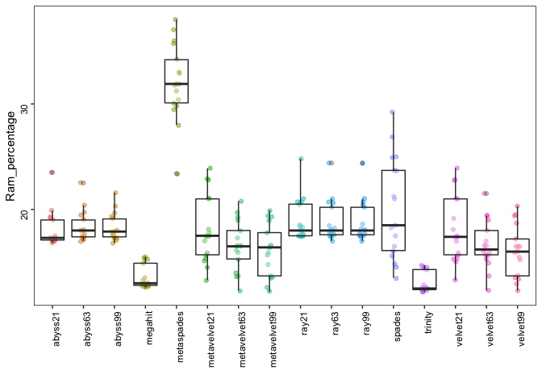<!-- -->

```r
ggsave("RAM_usage.pdf", width = 18, height = 13, units = "cm", device = 'pdf')
```

### variant heatmap


```r
library(pheatmap)
library(tidyverse)

meta = read_csv("~/Documents/research/asm/covid19-Assembly/files/PE_561samples_final.csv")
mh = read.table("~/Documents/research/asm/covid19-Assembly/files/megahit_alignment_matrix_50bp.tsv", head = F)
ms = read.table("~/Documents/research/asm/covid19-Assembly/files/metaspade_alignment_matrix_50bp.tsv", head = F)
ab = read.table("~/Documents/research/asm/covid19-Assembly/files/abyss63_alignment_matrix_50bp.tsv", head = F)
tr = read.table("~/Documents/research/asm/covid19-Assembly/files/trinity_alignment_matrix_50bp.tsv", head = F)

hs = cbind(mh, ms, ab, tr)
hst = data.frame(t(hs))
hst2 = hst %>% filter(X1 != "A.ID.megahit.50bp_overlap") %>% 
    filter(X1 != "A.ID.metaspade.50bp_overlap") %>% 
    filter(X1 != "A.ID.abyss63.50bp_overlap") %>% 
    filter(X1 != "A.ID.trinity.50bp_overlap")

hst3 = data.frame(str_split_fixed(hst2$X1, "_", 3), hst2)

megahit = hst3 %>% filter(hst3$X2.1 == "megahit") %>% select(-X2.1) %>% select(-X3.1) %>% select(-X1)
metaspades = hst3 %>% filter(hst3$X2.1 == "metaspades") %>% select(-X2.1) %>% select(-X3.1) %>% select(-X1)
abyss = hst3 %>% filter(hst3$X2.1 == "abyss63") %>% select(-X2.1) %>% select(-X3.1) %>% select(-X1)
trinity = hst3 %>% filter(hst3$X2.1 == "trinity") %>% select(-X2.1) %>% select(-X3.1) %>% select(-X1)

both = merge(megahit, metaspades, by.x = "X1.1", by.y = "X1.1") 
both = inner_join(megahit, metaspades, by = c("X1.1" = "X1.1")) %>% 
    inner_join(abyss, by = c("X1.1" = "X1.1")) %>%
    inner_join(trinity, by = c("X1.1" = "X1.1"))

both2 = inner_join(meta, both, by = c( "Run" = "X1.1"))
both3 = both2[, c(2,6, 15:ncol(both2))] 
both3 %>% group_by(Assay_Type) %>%
    summarise(n = n())
```

```
## # A tibble: 5 x 2
##   Assay_Type           n
##   <chr>            <int>
## 1 AMPLICON            81
## 2 OTHER               60
## 3 RNA-Seq             41
## 4 Targeted-Capture    83
## 5 WGA                 97
```

```r
#write.table(both3, "~/Documents/research/asm/covid19-Assembly/files/megahit_metaspades_heatmap_matrix.tsv", sep = "\t", quote = F, row.names = F, col.names = F)

both4 = data.frame(both3[,3:ncol(both3)]) 

#conver factor to numeric
both5 = both4 %>% 
  mutate_all(~as.numeric(as.character(.)))
rownames(both5) = both3$Run

#pheatmap(both5, cluster_cols = F, cluster_rows = F, show_rownames = F, show_colnames = F, color = colorRampPalette(c("red", "white", "gray"))(1000), border_color = NA, gaps_col = 599)

#add annotation
anno = data.frame(Assay = both3$Assay_Type)
rownames(anno) = rownames(both5)

pheatmap(both5, annotation_row = anno, cluster_cols = F, cluster_rows = F, show_rownames = F, show_colnames = F, color = colorRampPalette(c("red", "white", "gray"))(1000), border_color = NA, gaps_col = c(599, 599+599, 599+599+599), gaps_row = c(82, 82+65, 82+65+58, 82+65+58+88))
```

<!-- -->

```r
plot.new()
```

<!-- -->

```r
jpeg("~/Documents/research/asm/covid19-Assembly/plots/heatmap_v2.jpg", width = 1800, height = 1000)
pheatmap(both5, annotation_row = anno, cluster_cols = F, cluster_rows = F, show_rownames = F, show_colnames = F, color = colorRampPalette(c("red", "white", "gray"))(1000), border_color = NA, gaps_col = c(599, 599+599, 599+599+599), gaps_row = c(81, 81+60, 81+60+41, 81+60+41+83))
dev.off()
```

```
## quartz_off_screen 
##                 3
```

```r
#colmeans
cm = data.frame(colMeans(both5))

#get best and worst asm
worst = data.frame(asm = rowSums(both5)) %>% arrange(asm) %>% head() 
best = data.frame(asm = rowSums(both5)) %>% arrange(asm) %>% tail()
write.table(rbind(worst, best), "~/Documents/research/asm/covid19-Assembly/files/wrostAndBest_asm.tsv", col.names = F, quote = F)

#heatmap of worst and best
make_heatmap = function(SRR) {
  SRR12182155 = hst3 %>% filter(hst3$X1.1 == SRR)  %>% select(-X3.1) %>% select(-X1)
  SRR12182155_v2 = SRR12182155 %>% select(-X1.1) %>% select(-X2.1)
  #conver factor to numeric
  SRR12182155_v3 = SRR12182155_v2 %>% 
  mutate_all(~as.numeric(as.character(.)))
  rownames(SRR12182155_v3) = SRR12182155$X2.1

#
pheatmap(SRR12182155_v3, cluster_cols = F, cluster_rows = F, show_rownames = T, show_colnames = F, color = colorRampPalette(c("red", "white", "gray"))(1000), border_color = "black", gaps_row = c(1:3))
}

#worst 3
plot.new()
pdf("SRR11783612.pdf", width = 18, height = 2)
make_heatmap("SRR11783612") #Targeted-Capture
dev.off()
```

```
## quartz_off_screen 
##                 3
```

```r
plot.new()
pdf("SRR11954291.pdf", width = 18, height = 2)
make_heatmap("SRR11954291") #RNA-seq; 4th
dev.off()
```

```
## quartz_off_screen 
##                 3
```

```r
make_heatmap("SRR11783580") #Targeted-Capture
make_heatmap("ERR4321689") #WGA


#best 3
plot.new()
pdf("SRR12182155.pdf", width = 18, height = 2)
make_heatmap("SRR12182155") #OTHER
dev.off()
```

```
## quartz_off_screen 
##                 3
```

```r
plot.new()
pdf("SRR11903415.pdf", width = 18, height = 2)
make_heatmap("SRR11903415") #Targeted-Capture; 6th and rest of them are Other
dev.off()
```

```
## quartz_off_screen 
##                 3
```

```r
make_heatmap("SRR12182119") #OTHER
make_heatmap("SRR12182157") #OTHER
make_heatmap("SRR11903415") #Targeted-Capture; 6th and rest of them are Other


SRR12182155 = hst3 %>% filter(hst3$X1.1 == "SRR12182155")  %>% select(-X3.1) %>% select(-X1)
SRR12182155_v2 = SRR12182155 %>% select(-X1.1) %>% select(-X2.1)
#conver factor to numeric
SRR12182155_v3 = SRR12182155_v2 %>% 
  mutate_all(~as.numeric(as.character(.)))
rownames(SRR12182155_v3) = SRR12182155$X2.1

pheatmap(SRR12182155_v3, cluster_cols = F, cluster_rows = F, show_rownames = T, show_colnames = F, color = colorRampPalette(c("red", "white", "gray"))(1000), border_color = "black", gaps_row = c(1:3))


#make genome. hand draw
g = read.table("~/Documents/research/asm/covid19-Assembly/files/GeneBank_Genes.bed")
g2 = data.frame(gene = g$V4, len = g$V3-g$V2, sp = g$V1)

ggplot(g2, aes(sp, len, fill = gene)) + 
  geom_bar(stat = "identity", aes(alpha = .0), color = "black") +
  coord_flip()
```

### assembly quality


```r
library(tidyverse)
library(reshape2)
library(viridis)
library(ggsci)

#x = read_tsv("~/Documents/research/asm/covid19-Assembly/files/backup/bioRxiv_1074_assembly_report_PE_amplicon_viralRNA.tsv")
x = read_tsv("~/Documents/research/asm/covid19-Assembly/files/report_metaquast_PE_all.tsv")

x2 = melt(x, id.vars = "Assembly")
x2$Assembly = gsub("# ", "", x2$Assembly)
x3 = data.frame(str_split_fixed(x2$variable, "_", 3), value = as.numeric(x2$value), x2)

# temp: query samples by %GF
temp = x3 %>% filter(Assembly == "Genome fraction (%)")  %>% arrange(-value)

#mega and mega
temp %>% filter(X2 == "megahit") %>% head(n=10)
```

```
##             X1      X2 X3   value            Assembly               variable
## 1  SRR11783601 megahit PE 100.000 Genome fraction (%) SRR11783601_megahit_PE
## 2   ERR4206143 megahit PE  99.957 Genome fraction (%)  ERR4206143_megahit_PE
## 3  SRR11783610 megahit PE  99.957 Genome fraction (%) SRR11783610_megahit_PE
## 4  SRR12182126 megahit PE  99.950 Genome fraction (%) SRR12182126_megahit_PE
## 5   ERR4204166 megahit PE  99.920 Genome fraction (%)  ERR4204166_megahit_PE
## 6  SRR11409417 megahit PE  99.920 Genome fraction (%) SRR11409417_megahit_PE
## 7   ERR4204410 megahit PE  99.913 Genome fraction (%)  ERR4204410_megahit_PE
## 8   ERR4205160 megahit PE  99.910 Genome fraction (%)  ERR4205160_megahit_PE
## 9  SRR11953751 megahit PE  99.910 Genome fraction (%) SRR11953751_megahit_PE
## 10 SRR12182120 megahit PE  99.910 Genome fraction (%) SRR12182120_megahit_PE
##    value.1
## 1  100.000
## 2   99.957
## 3   99.957
## 4   99.950
## 5   99.920
## 6   99.920
## 7   99.913
## 8   99.910
## 9   99.910
## 10  99.910
```

```r
temp %>% filter(X2 == "metaspades") %>% head(n=10)
```

```
##             X1         X2 X3  value            Assembly
## 1  SRR11783620 metaspades PE 99.953 Genome fraction (%)
## 2   ERR4204410 metaspades PE 99.923 Genome fraction (%)
## 3   ERR4204166 metaspades PE 99.920 Genome fraction (%)
## 4  SRR12182126 metaspades PE 99.916 Genome fraction (%)
## 5  SRR12182120 metaspades PE 99.910 Genome fraction (%)
## 6  SRR12182140 metaspades PE 99.910 Genome fraction (%)
## 7  SRR11783571 metaspades PE 99.900 Genome fraction (%)
## 8  SRR12182149 metaspades PE 99.896 Genome fraction (%)
## 9   ERR4305225 metaspades PE 99.893 Genome fraction (%)
## 10 SRR11783573 metaspades PE 99.893 Genome fraction (%)
##                     variable value.1
## 1  SRR11783620_metaspades_PE  99.953
## 2   ERR4204410_metaspades_PE  99.923
## 3   ERR4204166_metaspades_PE  99.920
## 4  SRR12182126_metaspades_PE  99.916
## 5  SRR12182120_metaspades_PE  99.910
## 6  SRR12182140_metaspades_PE  99.910
## 7  SRR11783571_metaspades_PE  99.900
## 8  SRR12182149_metaspades_PE  99.896
## 9   ERR4305225_metaspades_PE  99.893
## 10 SRR11783573_metaspades_PE  99.893
```

```r
temp %>% filter(value >= 70) %>% 
  group_by(X1) %>%
  summarise(n = n()) %>%
  arrange(-n)
```

```
## # A tibble: 355 x 2
##    X1              n
##    <chr>       <int>
##  1 SRR12182137    16
##  2 SRR12182146    16
##  3 SRR12182151    16
##  4 SRR12182152    16
##  5 ERR4204337     14
##  6 ERR4204912     14
##  7 ERR4206040     14
##  8 ERR4207355     14
##  9 ERR4208822     14
## 10 SRR12182120    14
## # … with 345 more rows
```

```r
# end temp

meta = read_csv("~/Documents/research/asm/covid19-Assembly/files/PE_561samples_final.csv")
meta2 = meta %>% select(Run, Assay_Type)

xm = left_join(x3, meta2, by = c("X1" = "Run"))

#number of samples in each category
xm %>% distinct(variable, .keep_all = T) %>% 
    filter(Assembly == "contigs (>= 0 bp)") %>%
    group_by(Assay_Type, X2) %>% 
    summarise(n = n()) %>% 
    filter(n == max(n)) %>%
    distinct(Assay_Type, .keep_all = T)
```

```
## # A tibble: 5 x 3
## # Groups:   Assay_Type [5]
##   Assay_Type       X2          n
##   <chr>            <chr>   <int>
## 1 AMPLICON         megahit    82
## 2 OTHER            abyss63    66
## 3 RNA-Seq          abyss21    75
## 4 Targeted-Capture abyss63    93
## 5 WGA              abyss21   100
```

```r
#
setwd("~/Documents/research/asm/covid19-Assembly/plots/")
make_boxplot = function(variableToPlot)
{
  x4 = xm %>% filter(Assembly == variableToPlot) 
  stat = x4 %>%
    group_by(Assay_Type, X2) %>%
    summarize(mean = mean(value, na.rm = TRUE),
            median = median(value, na.rm = TRUE))
  #kable(stat)
  
  print(stat, n = Inf)
  plot = ggplot(x4, aes(X2, value)) +
    geom_jitter(alpha = .5, width = .1, aes(color = X2)) +
    geom_boxplot(alpha = 0.1) +
    #scale_color_viridis(discrete=TRUE) +
    #scale_fill_material("red") +
    xlab("") +
    ylab(variableToPlot) +
    facet_grid(Assay_Type~.) +
    theme(panel.background = element_rect(fill = "white"),
        panel.border = element_rect(fill = NA, colour = "black", size = .5),
        axis.text = element_text(color = "black", angle = 90, hjust = 1),
        strip.background =element_rect(fill="white"),
        legend.position = "none") 
  print(plot)
  
  filename = str_replace_all(variableToPlot, "[[:punct:]]", "")
  ggsave(filename=paste(filename,".pdf", sep="_"), width = 12, height = 18, units = "cm", device = 'pdf')
}

make_boxplot("Genome fraction (%)")
```

```
## # A tibble: 80 x 4
## # Groups:   Assay_Type [5]
##    Assay_Type       X2            mean median
##    <chr>            <chr>        <dbl>  <dbl>
##  1 AMPLICON         abyss21      84.8   94.8 
##  2 AMPLICON         abyss63      83.5   95.6 
##  3 AMPLICON         abyss99      70.6   81.5 
##  4 AMPLICON         megahit      97.5   99.7 
##  5 AMPLICON         metaspades   97.5   99.7 
##  6 AMPLICON         metavelvet21  7.03   3.89
##  7 AMPLICON         metavelvet63 23.5   10.6 
##  8 AMPLICON         metavelvet99 25.2   21.3 
##  9 AMPLICON         ray21        90.4   94.8 
## 10 AMPLICON         ray63        91.6   95.0 
## 11 AMPLICON         ray99        91.6   95.0 
## 12 AMPLICON         spades       96.7   99.2 
## 13 AMPLICON         trinity      81.4   98.0 
## 14 AMPLICON         velvet21      7.15   4.78
## 15 AMPLICON         velvet63     23.8   11.2 
## 16 AMPLICON         velvet99     25.7   21.1 
## 17 OTHER            abyss21      81.0   94.1 
## 18 OTHER            abyss63      84.3   97.9 
## 19 OTHER            abyss99      83.7   99.5 
## 20 OTHER            megahit      92.3   99.8 
## 21 OTHER            metaspades   92.3   99.8 
## 22 OTHER            metavelvet21 39.8   33.8 
## 23 OTHER            metavelvet63 36.3   24.5 
## 24 OTHER            metavelvet99 47.5   55.4 
## 25 OTHER            ray21        81.4   97.8 
## 26 OTHER            ray63        87.6   99.2 
## 27 OTHER            ray99        87.6   99.2 
## 28 OTHER            spades       89.9   99.9 
## 29 OTHER            trinity      91.6   99.9 
## 30 OTHER            velvet21     39.6   33.8 
## 31 OTHER            velvet63     37.5   26.0 
## 32 OTHER            velvet99     47.8   57.5 
## 33 RNA-Seq          abyss21      23.2    8.85
## 34 RNA-Seq          abyss63      56.2   64.3 
## 35 RNA-Seq          abyss99      69.8   90.1 
## 36 RNA-Seq          megahit      81.8   99.8 
## 37 RNA-Seq          metaspades   82.6   99.8 
## 38 RNA-Seq          metavelvet21 12.0    4.25
## 39 RNA-Seq          metavelvet63 48.6   55.6 
## 40 RNA-Seq          metavelvet99 59.3   65.2 
## 41 RNA-Seq          ray21        88.7   99.8 
## 42 RNA-Seq          ray63        86.6   99.8 
## 43 RNA-Seq          ray99        86.6   99.8 
## 44 RNA-Seq          spades       85.4   99.8 
## 45 RNA-Seq          trinity      81.4   95.9 
## 46 RNA-Seq          velvet21     12.4    3.99
## 47 RNA-Seq          velvet63     48.6   55.6 
## 48 RNA-Seq          velvet99     59.4   65.2 
## 49 Targeted-Capture abyss21      85.1   95.2 
## 50 Targeted-Capture abyss63      74.1   98.0 
## 51 Targeted-Capture abyss99      71.6   97.4 
## 52 Targeted-Capture megahit      92.3   99.8 
## 53 Targeted-Capture metaspades   89.4   99.8 
## 54 Targeted-Capture metavelvet21 22.2   14.1 
## 55 Targeted-Capture metavelvet63 32.0   25.3 
## 56 Targeted-Capture metavelvet99 58.4   73.1 
## 57 Targeted-Capture ray21        84.3   97.8 
## 58 Targeted-Capture ray63        84.4   96.9 
## 59 Targeted-Capture ray99        84.4   96.9 
## 60 Targeted-Capture spades       93.1   99.8 
## 61 Targeted-Capture trinity      76.3   88.0 
## 62 Targeted-Capture velvet21     22.0   14.1 
## 63 Targeted-Capture velvet63     32.1   27.6 
## 64 Targeted-Capture velvet99     60.0   74.9 
## 65 WGA              abyss21      87.4   98.2 
## 66 WGA              abyss63      88.8   98.8 
## 67 WGA              abyss99      71.9   82.9 
## 68 WGA              megahit      93.6   99.7 
## 69 WGA              metaspades   94.4   99.7 
## 70 WGA              metavelvet21  7.12   2.19
## 71 WGA              metavelvet63 14.7    9.61
## 72 WGA              metavelvet99 21.6   21.2 
## 73 WGA              ray21        89.4   99.4 
## 74 WGA              ray63        90.0   99.2 
## 75 WGA              ray99        90.0   99.2 
## 76 WGA              spades       93.8   99.7 
## 77 WGA              trinity      95.3   99.7 
## 78 WGA              velvet21      7.34   2.93
## 79 WGA              velvet63     14.8    9.99
## 80 WGA              velvet99     21.3   20.5
```

<!-- -->

```r
make_boxplot("Largest contig")
```

```
## # A tibble: 80 x 4
## # Groups:   Assay_Type [5]
##    Assay_Type       X2             mean median
##    <chr>            <chr>         <dbl>  <dbl>
##  1 AMPLICON         abyss21      12912. 12340.
##  2 AMPLICON         abyss63      10376.  6950 
##  3 AMPLICON         abyss99       5917.  2826 
##  4 AMPLICON         megahit      23680. 28204 
##  5 AMPLICON         metaspades   23846. 29828 
##  6 AMPLICON         metavelvet21   755.   667 
##  7 AMPLICON         metavelvet63  1521.   814 
##  8 AMPLICON         metavelvet99  1120.   991 
##  9 AMPLICON         ray21        15248. 14898.
## 10 AMPLICON         ray63        14237. 13042 
## 11 AMPLICON         ray99        14216. 13042 
## 12 AMPLICON         spades       18965. 17698.
## 13 AMPLICON         trinity      16179. 17251 
## 14 AMPLICON         velvet21       755.   667 
## 15 AMPLICON         velvet63      1512.   810 
## 16 AMPLICON         velvet99      1140.  1008 
## 17 OTHER            abyss21      13277.  9763 
## 18 OTHER            abyss63      16164. 16418 
## 19 OTHER            abyss99      18346. 20620.
## 20 OTHER            megahit      22914. 29860.
## 21 OTHER            metaspades   20734. 25414 
## 22 OTHER            metavelvet21  1373.   977 
## 23 OTHER            metavelvet63  1708.  1103 
## 24 OTHER            metavelvet99  2325.  1764 
## 25 OTHER            ray21        17657. 24671 
## 26 OTHER            ray63        19362. 27522 
## 27 OTHER            ray99        19338. 27522 
## 28 OTHER            spades       21998. 29858.
## 29 OTHER            trinity      20004. 27898 
## 30 OTHER            velvet21      1335.   968 
## 31 OTHER            velvet63      1762.  1149 
## 32 OTHER            velvet99      2382.  1893 
## 33 RNA-Seq          abyss21       2264.  1630 
## 34 RNA-Seq          abyss63       3564.  1746.
## 35 RNA-Seq          abyss99       4425.   884 
## 36 RNA-Seq          megahit      19432. 28035 
## 37 RNA-Seq          metaspades   17937. 22139 
## 38 RNA-Seq          metavelvet21  1009.   936 
## 39 RNA-Seq          metavelvet63  2007.  1447 
## 40 RNA-Seq          metavelvet99  1914.  1535 
## 41 RNA-Seq          ray21        19262. 15401 
## 42 RNA-Seq          ray63        16517. 15085 
## 43 RNA-Seq          ray99        16517. 15085 
## 44 RNA-Seq          spades       24970. 28525 
## 45 RNA-Seq          trinity      11322.  6911 
## 46 RNA-Seq          velvet21      1024.   968.
## 47 RNA-Seq          velvet63      1993.  1399 
## 48 RNA-Seq          velvet99      1935.  1535 
## 49 Targeted-Capture abyss21      13851. 12703 
## 50 Targeted-Capture abyss63      14562.  7349 
## 51 Targeted-Capture abyss99      13963.  6738.
## 52 Targeted-Capture megahit      20637. 29853 
## 53 Targeted-Capture metaspades   19423. 25414 
## 54 Targeted-Capture metavelvet21   965.   777 
## 55 Targeted-Capture metavelvet63  1470.   988.
## 56 Targeted-Capture metavelvet99  3822.  2390 
## 57 Targeted-Capture ray21        17318. 20228 
## 58 Targeted-Capture ray63        16779. 19716 
## 59 Targeted-Capture ray99        16779. 19716 
## 60 Targeted-Capture spades       22070. 29850 
## 61 Targeted-Capture trinity      12757.  9994 
## 62 Targeted-Capture velvet21       974.   792.
## 63 Targeted-Capture velvet63      1449.   997 
## 64 Targeted-Capture velvet99      3783.  2367 
## 65 WGA              abyss21      16229. 22264.
## 66 WGA              abyss63      11023   9808.
## 67 WGA              abyss99       4135.  2970.
## 68 WGA              megahit      25966. 29842.
## 69 WGA              metaspades   25836. 29844 
## 70 WGA              metavelvet21   895.   726.
## 71 WGA              metavelvet63  1011.   873 
## 72 WGA              metavelvet99  1132.  1080.
## 73 WGA              ray21        24301. 28606.
## 74 WGA              ray63        23888. 28856.
## 75 WGA              ray99        23888. 28856.
## 76 WGA              spades       15932. 15251 
## 77 WGA              trinity      24308. 29819 
## 78 WGA              velvet21       889.   726.
## 79 WGA              velvet63      1027.   874 
## 80 WGA              velvet99      1154.  1072.
```

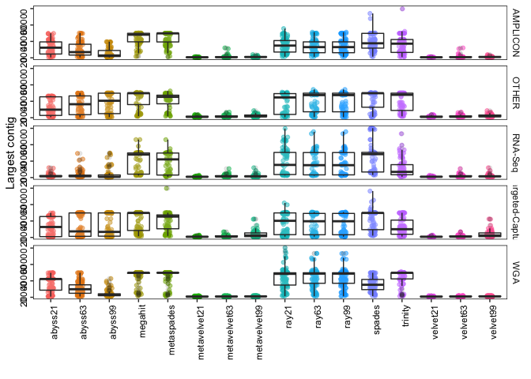<!-- -->

```r
make_boxplot("Total length")
```

```
## # A tibble: 80 x 4
## # Groups:   Assay_Type [5]
##    Assay_Type       X2               mean  median
##    <chr>            <chr>           <dbl>   <dbl>
##  1 AMPLICON         abyss21        25718.  28690.
##  2 AMPLICON         abyss63        25518.  28960 
##  3 AMPLICON         abyss99        21873.  25571 
##  4 AMPLICON         megahit        32533.  29884.
##  5 AMPLICON         metaspades     31636.  29892.
##  6 AMPLICON         metavelvet21    2804.   1430 
##  7 AMPLICON         metavelvet63    7677.   3507 
##  8 AMPLICON         metavelvet99    8651.   6620 
##  9 AMPLICON         ray21          30382.  30377 
## 10 AMPLICON         ray63          30308.  29811 
## 11 AMPLICON         ray99          30306.  29811 
## 12 AMPLICON         spades         39610.  30484.
## 13 AMPLICON         trinity        32700.  29827 
## 14 AMPLICON         velvet21        2803.   1430 
## 15 AMPLICON         velvet63        7741.   3523 
## 16 AMPLICON         velvet99        8799.   6710 
## 17 OTHER            abyss21        41145.  28522 
## 18 OTHER            abyss63        41983.  29727 
## 19 OTHER            abyss99        38973.  29865 
## 20 OTHER            megahit        82116.  37682.
## 21 OTHER            metaspades     73609.  37646 
## 22 OTHER            metavelvet21   30511.   5816 
## 23 OTHER            metavelvet63   27464.   7386 
## 24 OTHER            metavelvet99   30918.  20079 
## 25 OTHER            ray21          43684.  32588.
## 26 OTHER            ray63          44620.  32438 
## 27 OTHER            ray99          44612.  32438 
## 28 OTHER            spades         72647.  36342 
## 29 OTHER            trinity       106164.  53000.
## 30 OTHER            velvet21       30349.   5564 
## 31 OTHER            velvet63       28805.   8920.
## 32 OTHER            velvet99       31052.  20382 
## 33 RNA-Seq          abyss21       381196.  47320 
## 34 RNA-Seq          abyss63       150567.  24854 
## 35 RNA-Seq          abyss99        13802.   3444 
## 36 RNA-Seq          megahit       710616. 162712 
## 37 RNA-Seq          metaspades    797222. 191014 
## 38 RNA-Seq          metavelvet21  108844.  18099 
## 39 RNA-Seq          metavelvet63  139454.  22344 
## 40 RNA-Seq          metavelvet99   10470.   3655 
## 41 RNA-Seq          ray21         340292.  78097 
## 42 RNA-Seq          ray63         261610.  58810 
## 43 RNA-Seq          ray99         261634.  58810 
## 44 RNA-Seq          spades       1322823. 517283 
## 45 RNA-Seq          trinity       822573. 202200 
## 46 RNA-Seq          velvet21      110241.  24172.
## 47 RNA-Seq          velvet63      139480.  22481 
## 48 RNA-Seq          velvet99       10527.   3655 
## 49 Targeted-Capture abyss21        24382.  28166.
## 50 Targeted-Capture abyss63        24165.  27627 
## 51 Targeted-Capture abyss99        24829.  27872.
## 52 Targeted-Capture megahit       106973.  29882 
## 53 Targeted-Capture metaspades    109558.  29971 
## 54 Targeted-Capture metavelvet21   48069.   3492.
## 55 Targeted-Capture metavelvet63   31935.   7293 
## 56 Targeted-Capture metavelvet99   31915.  22440 
## 57 Targeted-Capture ray21          51052.  29870 
## 58 Targeted-Capture ray63          46045.  29859 
## 59 Targeted-Capture ray99          46017.  29859 
## 60 Targeted-Capture spades        295058.  36229 
## 61 Targeted-Capture trinity        91350.  34724 
## 62 Targeted-Capture velvet21       48257.   3472.
## 63 Targeted-Capture velvet63       32006.   7336.
## 64 Targeted-Capture velvet99       31934.  22694 
## 65 WGA              abyss21        31399.  29622.
## 66 WGA              abyss63        36442.  29858.
## 67 WGA              abyss99        30938.  27638 
## 68 WGA              megahit        62158.  36598 
## 69 WGA              metaspades     55143.  35172 
## 70 WGA              metavelvet21   11704.   2616.
## 71 WGA              metavelvet63   16290.   6121 
## 72 WGA              metavelvet99   17129.   9537 
## 73 WGA              ray21          44307.  34880.
## 74 WGA              ray63          45074.  33598.
## 75 WGA              ray99          45081.  33598.
## 76 WGA              spades         55083.  33648.
## 77 WGA              trinity        65325.  39306.
## 78 WGA              velvet21       11787.   2892.
## 79 WGA              velvet63       16298.   6313 
## 80 WGA              velvet99       17133.   9277
```

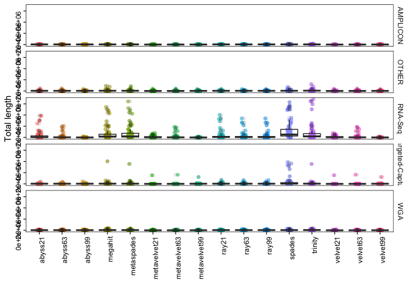<!-- -->

```r
make_boxplot("contigs")
```

```
## # A tibble: 80 x 4
## # Groups:   Assay_Type [5]
##    Assay_Type       X2             mean median
##    <chr>            <chr>         <dbl>  <dbl>
##  1 AMPLICON         abyss21        7.76    5  
##  2 AMPLICON         abyss63       10.2     9  
##  3 AMPLICON         abyss99       13.9    14.5
##  4 AMPLICON         megahit        6.52    2  
##  5 AMPLICON         metaspades     5.37    2  
##  6 AMPLICON         metavelvet21   4.32    2  
##  7 AMPLICON         metavelvet63   8       5  
##  8 AMPLICON         metavelvet99  11.4    10  
##  9 AMPLICON         ray21          7.56    4.5
## 10 AMPLICON         ray63          8.11    5  
## 11 AMPLICON         ray99          8.12    5  
## 12 AMPLICON         spades         8.48    5  
## 13 AMPLICON         trinity        8.79    3.5
## 14 AMPLICON         velvet21       4.32    2  
## 15 AMPLICON         velvet63       8.14    5  
## 16 AMPLICON         velvet99      11.6    10  
## 17 OTHER            abyss21       32.0     8  
## 18 OTHER            abyss63       28.8     5.5
## 19 OTHER            abyss99       22.7     3.5
## 20 OTHER            megahit       65.8    11.5
## 21 OTHER            metaspades    57.2    12  
## 22 OTHER            metavelvet21  42.1     9  
## 23 OTHER            metavelvet63  36.1    11  
## 24 OTHER            metavelvet99  36.3    18  
## 25 OTHER            ray21         24.3     9  
## 26 OTHER            ray63         23.5     8  
## 27 OTHER            ray99         23.5     8  
## 28 OTHER            spades        47.5    10  
## 29 OTHER            trinity       77.6    19.5
## 30 OTHER            velvet21      42.0     8  
## 31 OTHER            velvet63      37.8    13.5
## 32 OTHER            velvet99      36.3    18  
## 33 RNA-Seq          abyss21      438.     68  
## 34 RNA-Seq          abyss63      183.     26  
## 35 RNA-Seq          abyss99       10.1     3  
## 36 RNA-Seq          megahit      629.    160  
## 37 RNA-Seq          metaspades   754.    189  
## 38 RNA-Seq          metavelvet21 175.     31  
## 39 RNA-Seq          metavelvet63 179.     27  
## 40 RNA-Seq          metavelvet99  10.4     3  
## 41 RNA-Seq          ray21        314.     52  
## 42 RNA-Seq          ray63        253.     44  
## 43 RNA-Seq          ray99        254.     44  
## 44 RNA-Seq          spades       787.    277  
## 45 RNA-Seq          trinity      863.    206  
## 46 RNA-Seq          velvet21     178.     41.5
## 47 RNA-Seq          velvet63     179.     28  
## 48 RNA-Seq          velvet99      10.4     3  
## 49 Targeted-Capture abyss21       10.9     5  
## 50 Targeted-Capture abyss63       10.8     4  
## 51 Targeted-Capture abyss99       11.9     4  
## 52 Targeted-Capture megahit      109.      4  
## 53 Targeted-Capture metaspades   106.      5  
## 54 Targeted-Capture metavelvet21  73.5     6  
## 55 Targeted-Capture metavelvet63  45.9    10.5
## 56 Targeted-Capture metavelvet99  34      11  
## 57 Targeted-Capture ray21         38.9     7  
## 58 Targeted-Capture ray63         34.6    10  
## 59 Targeted-Capture ray99         34.6    10  
## 60 Targeted-Capture spades       182.      3  
## 61 Targeted-Capture trinity       82.7     9  
## 62 Targeted-Capture velvet21      73.9     6  
## 63 Targeted-Capture velvet63      46.0    10  
## 64 Targeted-Capture velvet99      34.1    11  
## 65 WGA              abyss21       13.7     4  
## 66 WGA              abyss63       21.9     7  
## 67 WGA              abyss99       29.0    21  
## 68 WGA              megahit       43.9    10.5
## 69 WGA              metaspades    35.6     8.5
## 70 WGA              metavelvet21  17.7     4.5
## 71 WGA              metavelvet63  24.1    10  
## 72 WGA              metavelvet99  24.9    14.5
## 73 WGA              ray21         17.9     5  
## 74 WGA              ray63         19.9     4  
## 75 WGA              ray99         19.9     4  
## 76 WGA              spades        34.9     8  
## 77 WGA              trinity       45.6    12  
## 78 WGA              velvet21      17.9     5  
## 79 WGA              velvet63      24.0    10  
## 80 WGA              velvet99      24.9    13.5
```

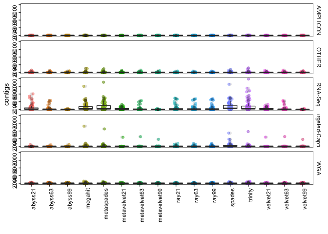<!-- -->

```r
make_boxplot("contigs (>= 1000 bp)")
```

```
## # A tibble: 80 x 4
## # Groups:   Assay_Type [5]
##    Assay_Type       X2             mean median
##    <chr>            <chr>         <dbl>  <dbl>
##  1 AMPLICON         abyss21        3.88    3  
##  2 AMPLICON         abyss63        5.38    5  
##  3 AMPLICON         abyss99        5.36    5.5
##  4 AMPLICON         megahit        3.09    2  
##  5 AMPLICON         metaspades     2.79    1  
##  6 AMPLICON         metavelvet21   0.32    0  
##  7 AMPLICON         metavelvet63   1.76    0  
##  8 AMPLICON         metavelvet99   1.56    0  
##  9 AMPLICON         ray21          5.45    4  
## 10 AMPLICON         ray63          5.89    4  
## 11 AMPLICON         ray99          5.90    4  
## 12 AMPLICON         spades         5.67    4  
## 13 AMPLICON         trinity        4.54    3  
## 14 AMPLICON         velvet21       0.32    0  
## 15 AMPLICON         velvet63       1.71    0  
## 16 AMPLICON         velvet99       1.56    1  
## 17 OTHER            abyss21        7.38    3  
## 18 OTHER            abyss63        7.35    2  
## 19 OTHER            abyss99        5.36    2  
## 20 OTHER            megahit       15.3     5  
## 21 OTHER            metaspades    14.5     5.5
## 22 OTHER            metavelvet21   4.4     0  
## 23 OTHER            metavelvet63   4.83    1  
## 24 OTHER            metavelvet99   7.16    5  
## 25 OTHER            ray21          9.03    5  
## 26 OTHER            ray63          8.57    5  
## 27 OTHER            ray99          8.57    5  
## 28 OTHER            spades        14.0     4  
## 29 OTHER            trinity       22.8    10  
## 30 OTHER            velvet21       4.29    0  
## 31 OTHER            velvet63       5.08    1  
## 32 OTHER            velvet99       7.06    5  
## 33 RNA-Seq          abyss21       92.1     4  
## 34 RNA-Seq          abyss63       31.5     5  
## 35 RNA-Seq          abyss99        2.44    0  
## 36 RNA-Seq          megahit      174.     31  
## 37 RNA-Seq          metaspades   194.     26  
## 38 RNA-Seq          metavelvet21   3.90    0  
## 39 RNA-Seq          metavelvet63  28.4     5  
## 40 RNA-Seq          metavelvet99   3.12    2  
## 41 RNA-Seq          ray21         95.6    15  
## 42 RNA-Seq          ray63         70.9    15  
## 43 RNA-Seq          ray99         70.9    15  
## 44 RNA-Seq          spades       272.    123  
## 45 RNA-Seq          trinity      202.     37  
## 46 RNA-Seq          velvet21       3.86    0  
## 47 RNA-Seq          velvet63      28.4     5  
## 48 RNA-Seq          velvet99       3.15    2  
## 49 Targeted-Capture abyss21        3.46    2  
## 50 Targeted-Capture abyss63        3.19    1  
## 51 Targeted-Capture abyss99        3.63    1  
## 52 Targeted-Capture megahit       16.0     3  
## 53 Targeted-Capture metaspades    19.2     3  
## 54 Targeted-Capture metavelvet21   4.56    0  
## 55 Targeted-Capture metavelvet63   3.87    0  
## 56 Targeted-Capture metavelvet99   6.64    5  
## 57 Targeted-Capture ray21          7.57    2  
## 58 Targeted-Capture ray63          6.95    2  
## 59 Targeted-Capture ray99          6.91    2  
## 60 Targeted-Capture spades        33.0     3  
## 61 Targeted-Capture trinity       18.1     5  
## 62 Targeted-Capture velvet21       4.58    0  
## 63 Targeted-Capture velvet63       3.89    0.5
## 64 Targeted-Capture velvet99       6.88    5  
## 65 WGA              abyss21        3.82    3  
## 66 WGA              abyss63        7.42    6  
## 67 WGA              abyss99        8.76    9  
## 68 WGA              megahit        9.55    2  
## 69 WGA              metaspades     8.52    2  
## 70 WGA              metavelvet21   1.10    0  
## 71 WGA              metavelvet63   1.76    0  
## 72 WGA              metavelvet99   2.25    1  
## 73 WGA              ray21          6.27    2  
## 74 WGA              ray63          6.8     2  
## 75 WGA              ray99          6.8     2  
## 76 WGA              spades        11.0     5  
## 77 WGA              trinity        9.61    3  
## 78 WGA              velvet21       1.15    0  
## 79 WGA              velvet63       1.92    0  
## 80 WGA              velvet99       2.32    1
```

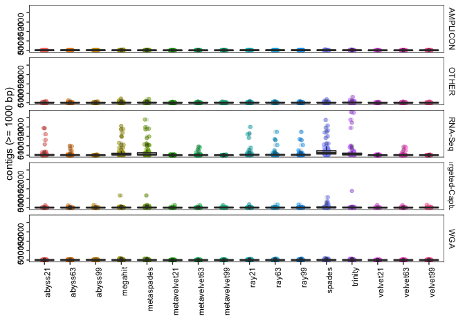<!-- -->

```r
make_boxplot("Largest alignment")
```

```
## # A tibble: 80 x 4
## # Groups:   Assay_Type [5]
##    Assay_Type       X2             mean median
##    <chr>            <chr>         <dbl>  <dbl>
##  1 AMPLICON         abyss21      13111. 12314.
##  2 AMPLICON         abyss63      10592.  6996 
##  3 AMPLICON         abyss99       6017.  2917 
##  4 AMPLICON         megahit      23870. 29079 
##  5 AMPLICON         metaspades   24064. 29815 
##  6 AMPLICON         metavelvet21   779.   681 
##  7 AMPLICON         metavelvet63  1593.   841 
##  8 AMPLICON         metavelvet99  1080.   969 
##  9 AMPLICON         ray21        14817. 13799 
## 10 AMPLICON         ray63        14233. 13346 
## 11 AMPLICON         ray99        14212. 13346 
## 12 AMPLICON         spades       18527. 18945 
## 13 AMPLICON         trinity      15790  16706 
## 14 AMPLICON         velvet21       782.   681 
## 15 AMPLICON         velvet63      1585.   822.
## 16 AMPLICON         velvet99      1098    967 
## 17 OTHER            abyss21      14366. 12821 
## 18 OTHER            abyss63      17993. 20560 
## 19 OTHER            abyss99      19405. 27571 
## 20 OTHER            megahit      23181. 29834.
## 21 OTHER            metaspades   20801. 25414 
## 22 OTHER            metavelvet21  1785.  1410 
## 23 OTHER            metavelvet63  1845.  1155 
## 24 OTHER            metavelvet99  2234.  1804 
## 25 OTHER            ray21        17366. 22939 
## 26 OTHER            ray63        19797. 27601 
## 27 OTHER            ray99        19771. 27601 
## 28 OTHER            spades       22337. 29856.
## 29 OTHER            trinity      20306. 29850 
## 30 OTHER            velvet21      1806.  1410 
## 31 OTHER            velvet63      1843.  1072.
## 32 OTHER            velvet99      2278.  1869 
## 33 RNA-Seq          abyss21       1583.   824.
## 34 RNA-Seq          abyss63       5355.  2833 
## 35 RNA-Seq          abyss99       8550.  4142 
## 36 RNA-Seq          megahit      21627. 29831 
## 37 RNA-Seq          metaspades   20421. 29798 
## 38 RNA-Seq          metavelvet21   755.   724.
## 39 RNA-Seq          metavelvet63  2407.  1858 
## 40 RNA-Seq          metavelvet99  3105.  1699 
## 41 RNA-Seq          ray21        21508. 25418 
## 42 RNA-Seq          ray63        20577. 25122 
## 43 RNA-Seq          ray99        20577. 25122 
## 44 RNA-Seq          spades       22124. 29839 
## 45 RNA-Seq          trinity       9685.  7338.
## 46 RNA-Seq          velvet21       760    727 
## 47 RNA-Seq          velvet63      2407.  1858 
## 48 RNA-Seq          velvet99      3100.  1699 
## 49 Targeted-Capture abyss21      18033. 24962.
## 50 Targeted-Capture abyss63      16996. 25428 
## 51 Targeted-Capture abyss99      15980. 12836 
## 52 Targeted-Capture megahit      21403. 29850.
## 53 Targeted-Capture metaspades   19491. 25414 
## 54 Targeted-Capture metavelvet21  1027.   882.
## 55 Targeted-Capture metavelvet63  1609   1174 
## 56 Targeted-Capture metavelvet99  4081.  2914 
## 57 Targeted-Capture ray21        18079. 22934 
## 58 Targeted-Capture ray63        17771. 26737 
## 59 Targeted-Capture ray99        17771. 26737 
## 60 Targeted-Capture spades       21153. 29790 
## 61 Targeted-Capture trinity      13278. 10347 
## 62 Targeted-Capture velvet21      1033.   883 
## 63 Targeted-Capture velvet63      1583.  1174 
## 64 Targeted-Capture velvet99      4133.  2914 
## 65 WGA              abyss21      17413. 22277 
## 66 WGA              abyss63      11329.  9994 
## 67 WGA              abyss99       4083.  3084 
## 68 WGA              megahit      26165  29819 
## 69 WGA              metaspades   26407. 29818 
## 70 WGA              metavelvet21   701.   624 
## 71 WGA              metavelvet63   856.   765 
## 72 WGA              metavelvet99   933.   846.
## 73 WGA              ray21        22195. 26497 
## 74 WGA              ray63        22741. 27092 
## 75 WGA              ray99        22741. 27092 
## 76 WGA              spades       16099. 15298 
## 77 WGA              trinity      25182. 29819 
## 78 WGA              velvet21       698.   638.
## 79 WGA              velvet63       866.   758.
## 80 WGA              velvet99       934.   863
```

<!-- -->

```r
make_boxplot("mismatches per 100 kbp")
```

```
## # A tibble: 80 x 4
## # Groups:   Assay_Type [5]
##    Assay_Type       X2            mean median
##    <chr>            <chr>        <dbl>  <dbl>
##  1 AMPLICON         abyss21       24.6  25.3 
##  2 AMPLICON         abyss63       27.1  26.9 
##  3 AMPLICON         abyss99       27.4  25.6 
##  4 AMPLICON         megahit       28.8  27.2 
##  5 AMPLICON         metaspades    26.6  26.8 
##  6 AMPLICON         metavelvet21  61.1   0   
##  7 AMPLICON         metavelvet63  40.4  19.6 
##  8 AMPLICON         metavelvet99  58.1  31.1 
##  9 AMPLICON         ray21         38.9  36.9 
## 10 AMPLICON         ray63         39.4  37.7 
## 11 AMPLICON         ray99         39.3  37.7 
## 12 AMPLICON         spades        55.2  36.9 
## 13 AMPLICON         trinity       35.8  30.8 
## 14 AMPLICON         velvet21      61.1   0   
## 15 AMPLICON         velvet63      40.2  19.4 
## 16 AMPLICON         velvet99      61.8  34.8 
## 17 OTHER            abyss21       31.0  28.1 
## 18 OTHER            abyss63       29.8  27.4 
## 19 OTHER            abyss99       29.2  26.9 
## 20 OTHER            megahit       38.1  33.5 
## 21 OTHER            metaspades    36.5  33.5 
## 22 OTHER            metavelvet21  64.5  32.1 
## 23 OTHER            metavelvet63  40.0  27.2 
## 24 OTHER            metavelvet99  41.2  25.4 
## 25 OTHER            ray21         34.8  30.8 
## 26 OTHER            ray63         33.6  30.7 
## 27 OTHER            ray99         33.5  30.7 
## 28 OTHER            spades        61.0  36.8 
## 29 OTHER            trinity       55.7  43.5 
## 30 OTHER            velvet21      63.6  45.9 
## 31 OTHER            velvet63      42.0  27.5 
## 32 OTHER            velvet99      42.6  25.6 
## 33 RNA-Seq          abyss21       33.0   0   
## 34 RNA-Seq          abyss63       19.3  19.4 
## 35 RNA-Seq          abyss99       25.7  26.2 
## 36 RNA-Seq          megahit       32.5  26.8 
## 37 RNA-Seq          metaspades    36.9  26.8 
## 38 RNA-Seq          metavelvet21  60.7  14.4 
## 39 RNA-Seq          metavelvet63  18.9  18.1 
## 40 RNA-Seq          metavelvet99  36.1  25.2 
## 41 RNA-Seq          ray21         42.8  40.2 
## 42 RNA-Seq          ray63         33.3  32.5 
## 43 RNA-Seq          ray99         33.3  32.5 
## 44 RNA-Seq          spades       798.   43.6 
## 45 RNA-Seq          trinity       61.2  38.9 
## 46 RNA-Seq          velvet21      51.2   8.66
## 47 RNA-Seq          velvet63      18.9  18.1 
## 48 RNA-Seq          velvet99      36.0  25.2 
## 49 Targeted-Capture abyss21       24.6  24.7 
## 50 Targeted-Capture abyss63       27.4  25.0 
## 51 Targeted-Capture abyss99       28.4  26.0 
## 52 Targeted-Capture megahit       37.9  26.8 
## 53 Targeted-Capture metaspades    38.6  27.1 
## 54 Targeted-Capture metavelvet21  27.8  21.1 
## 55 Targeted-Capture metavelvet63  31.1  25.5 
## 56 Targeted-Capture metavelvet99  26.5  19.2 
## 57 Targeted-Capture ray21         32.1  30.1 
## 58 Targeted-Capture ray63         35.8  30.1 
## 59 Targeted-Capture ray99         35.8  30.1 
## 60 Targeted-Capture spades       245.   40.2 
## 61 Targeted-Capture trinity       64.6  36.8 
## 62 Targeted-Capture velvet21      28.1  21.1 
## 63 Targeted-Capture velvet63      31.6  23.9 
## 64 Targeted-Capture velvet99      27.8  20.7 
## 65 WGA              abyss21       26.8  23.8 
## 66 WGA              abyss63       26.4  23.9 
## 67 WGA              abyss99       23.8  24.2 
## 68 WGA              megahit       32.3  26.8 
## 69 WGA              metaspades    28.9  26.8 
## 70 WGA              metavelvet21  26.4   0   
## 71 WGA              metavelvet63  31.6  21.5 
## 72 WGA              metavelvet99  49.9  45.1 
## 73 WGA              ray21         43.1  33.5 
## 74 WGA              ray63         36.5  33.5 
## 75 WGA              ray99         36.5  33.5 
## 76 WGA              spades        29.7  26.8 
## 77 WGA              trinity       33.3  28.0 
## 78 WGA              velvet21      28.8   0   
## 79 WGA              velvet63      31.4  22.0 
## 80 WGA              velvet99      43.0  35.4
```

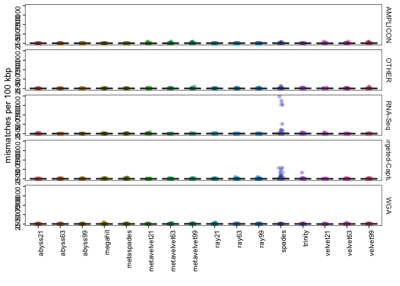<!-- -->

```r
make_boxplot("indels per 100 kbp")
```

```
## # A tibble: 80 x 4
## # Groups:   Assay_Type [5]
##    Assay_Type       X2             mean median
##    <chr>            <chr>         <dbl>  <dbl>
##  1 AMPLICON         abyss21       9.77    3.48
##  2 AMPLICON         abyss63       5.69    3.39
##  3 AMPLICON         abyss99       7.38    0   
##  4 AMPLICON         megahit       1.80    0   
##  5 AMPLICON         metaspades    0.966   0   
##  6 AMPLICON         metavelvet21  4.52    0   
##  7 AMPLICON         metavelvet63  4.21    0   
##  8 AMPLICON         metavelvet99 23.0     0   
##  9 AMPLICON         ray21         7.23    3.35
## 10 AMPLICON         ray63         9.44    3.61
## 11 AMPLICON         ray99         9.41    3.61
## 12 AMPLICON         spades       12.1     3.42
## 13 AMPLICON         trinity       4.80    0   
## 14 AMPLICON         velvet21      2.87    0   
## 15 AMPLICON         velvet63      3.48    0   
## 16 AMPLICON         velvet99     25.6     0   
## 17 OTHER            abyss21       2.49    0   
## 18 OTHER            abyss63       2.29    0   
## 19 OTHER            abyss99       1.15    0   
## 20 OTHER            megahit       1.54    0   
## 21 OTHER            metaspades    0.939   0   
## 22 OTHER            metavelvet21  4.61    0   
## 23 OTHER            metavelvet63  1.26    0   
## 24 OTHER            metavelvet99  1.27    0   
## 25 OTHER            ray21         0.625   0   
## 26 OTHER            ray63         0.656   0   
## 27 OTHER            ray99         0.656   0   
## 28 OTHER            spades        4.38    0   
## 29 OTHER            trinity       3.61    0   
## 30 OTHER            velvet21      4.69    0   
## 31 OTHER            velvet63      1.05    0   
## 32 OTHER            velvet99      1.05    0   
## 33 RNA-Seq          abyss21       0.499   0   
## 34 RNA-Seq          abyss63       3.75    0   
## 35 RNA-Seq          abyss99       1.80    0   
## 36 RNA-Seq          megahit       0.120   0   
## 37 RNA-Seq          metaspades    8.70    0   
## 38 RNA-Seq          metavelvet21  0       0   
## 39 RNA-Seq          metavelvet63  0       0   
## 40 RNA-Seq          metavelvet99  0       0   
## 41 RNA-Seq          ray21         0.316   0   
## 42 RNA-Seq          ray63         0.237   0   
## 43 RNA-Seq          ray99         0.237   0   
## 44 RNA-Seq          spades        7.41    0   
## 45 RNA-Seq          trinity       1.01    0   
## 46 RNA-Seq          velvet21      0       0   
## 47 RNA-Seq          velvet63      0       0   
## 48 RNA-Seq          velvet99      0       0   
## 49 Targeted-Capture abyss21       7.20    3.5 
## 50 Targeted-Capture abyss63       8.36    3.35
## 51 Targeted-Capture abyss99       3.10    3.35
## 52 Targeted-Capture megahit       6.09    0   
## 53 Targeted-Capture metaspades   12.8     0   
## 54 Targeted-Capture metavelvet21  6.67    0   
## 55 Targeted-Capture metavelvet63  6.41    0   
## 56 Targeted-Capture metavelvet99  1.37    0   
## 57 Targeted-Capture ray21         2.54    0   
## 58 Targeted-Capture ray63         3.41    0   
## 59 Targeted-Capture ray99         3.41    0   
## 60 Targeted-Capture spades       56.4     6.7 
## 61 Targeted-Capture trinity      15.8     3.35
## 62 Targeted-Capture velvet21     17.9     0   
## 63 Targeted-Capture velvet63      5.70    0   
## 64 Targeted-Capture velvet99      1.37    0   
## 65 WGA              abyss21       7.14    0   
## 66 WGA              abyss63       5.13    0   
## 67 WGA              abyss99       4.16    0   
## 68 WGA              megahit       7.78    0   
## 69 WGA              metaspades    2.28    0   
## 70 WGA              metavelvet21  6.16    0   
## 71 WGA              metavelvet63  7.47    0   
## 72 WGA              metavelvet99 22.0    17.2 
## 73 WGA              ray21        15.0     6.71
## 74 WGA              ray63         8.91    3.44
## 75 WGA              ray99         8.91    3.44
## 76 WGA              spades        4.01    0   
## 77 WGA              trinity       6.66    0   
## 78 WGA              velvet21      6.81    0   
## 79 WGA              velvet63      8.93    0   
## 80 WGA              velvet99     19.9    16.8
```

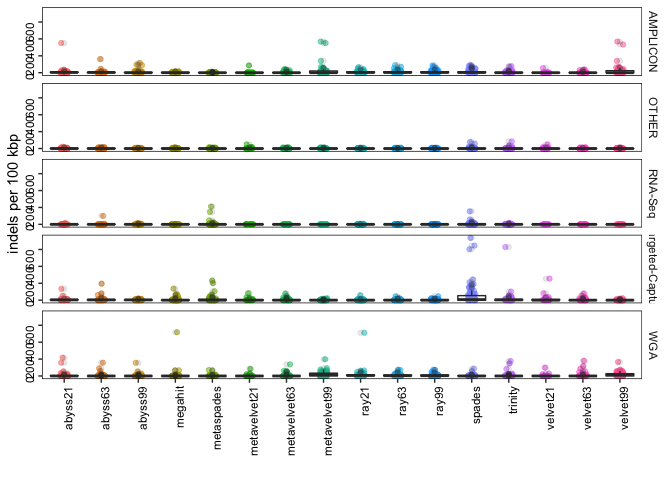<!-- -->

```r
make_boxplot("Total aligned length")
```

```
## # A tibble: 80 x 4
## # Groups:   Assay_Type [5]
##    Assay_Type       X2              mean median
##    <chr>            <chr>          <dbl>  <dbl>
##  1 AMPLICON         abyss21       25541. 28664.
##  2 AMPLICON         abyss63       25150. 28892 
##  3 AMPLICON         abyss99       21509. 25098.
##  4 AMPLICON         megahit       29217. 29814 
##  5 AMPLICON         metaspades    29203. 29821 
##  6 AMPLICON         metavelvet21   2103.  1165 
##  7 AMPLICON         metavelvet63   7078.  3156.
##  8 AMPLICON         metavelvet99   7585.  6362.
##  9 AMPLICON         ray21         29294. 29823 
## 10 AMPLICON         ray63         29062. 29740 
## 11 AMPLICON         ray99         29060. 29740 
## 12 AMPLICON         spades        36456. 29930 
## 13 AMPLICON         trinity       30214. 29819 
## 14 AMPLICON         velvet21       2139.  1430 
## 15 AMPLICON         velvet63       7143.  3334.
## 16 AMPLICON         velvet99       7733.  6378 
## 17 OTHER            abyss21       24277. 28223 
## 18 OTHER            abyss63       25334. 29417 
## 19 OTHER            abyss99       25135. 29846 
## 20 OTHER            megahit       27789. 29869 
## 21 OTHER            metaspades    27803. 29928.
## 22 OTHER            metavelvet21  11915. 10127 
## 23 OTHER            metavelvet63  10915.  7386 
## 24 OTHER            metavelvet99  14350. 16673 
## 25 OTHER            ray21         25581. 29851 
## 26 OTHER            ray63         26903. 29862.
## 27 OTHER            ray99         26895. 29862.
## 28 OTHER            spades        32666. 29868.
## 29 OTHER            trinity       42546. 33988 
## 30 OTHER            velvet21      11846. 10127 
## 31 OTHER            velvet63      11272.  7785 
## 32 OTHER            velvet99      14431. 17285 
## 33 RNA-Seq          abyss21        6962.  2647 
## 34 RNA-Seq          abyss63       16939. 19314.
## 35 RNA-Seq          abyss99       21120. 27400 
## 36 RNA-Seq          megahit       24467. 29836 
## 37 RNA-Seq          metaspades    24726. 29840.
## 38 RNA-Seq          metavelvet21   3598   1270.
## 39 RNA-Seq          metavelvet63  14660. 16758.
## 40 RNA-Seq          metavelvet99  18100. 19903 
## 41 RNA-Seq          ray21         35962. 30580 
## 42 RNA-Seq          ray63         31561. 30476.
## 43 RNA-Seq          ray99         31561. 30476.
## 44 RNA-Seq          spades       491775. 29904.
## 45 RNA-Seq          trinity       47853. 40355 
## 46 RNA-Seq          velvet21       3713.  1192 
## 47 RNA-Seq          velvet63      14679. 16758.
## 48 RNA-Seq          velvet99      18145. 19903 
## 49 Targeted-Capture abyss21       25497. 28497 
## 50 Targeted-Capture abyss63       22195. 29428.
## 51 Targeted-Capture abyss99       21532. 29289 
## 52 Targeted-Capture megahit       27742. 29855 
## 53 Targeted-Capture metaspades    32992. 29859 
## 54 Targeted-Capture metavelvet21   6642.  4230 
## 55 Targeted-Capture metavelvet63   9588.  7561 
## 56 Targeted-Capture metavelvet99  17572. 22024 
## 57 Targeted-Capture ray21         26393. 29856 
## 58 Targeted-Capture ray63         26159. 29854 
## 59 Targeted-Capture ray99         26142. 29854 
## 60 Targeted-Capture spades       180248. 29873 
## 61 Targeted-Capture trinity       36206. 32353 
## 62 Targeted-Capture velvet21       6590.  4229 
## 63 Targeted-Capture velvet63       9619.  8266 
## 64 Targeted-Capture velvet99      18047. 22434 
## 65 WGA              abyss21       26214. 29506.
## 66 WGA              abyss63       26751. 29680.
## 67 WGA              abyss99       22042. 25441 
## 68 WGA              megahit       28036. 29821 
## 69 WGA              metaspades    28267. 29819 
## 70 WGA              metavelvet21   2131.   656.
## 71 WGA              metavelvet63   4413.  2906.
## 72 WGA              metavelvet99   6479.  6386.
## 73 WGA              ray21         31125. 29842.
## 74 WGA              ray63         30057. 29829 
## 75 WGA              ray99         30057. 29829 
## 76 WGA              spades        28812. 29874 
## 77 WGA              trinity       33503. 29850.
## 78 WGA              velvet21       2195.   876.
## 79 WGA              velvet63       4430.  3019 
## 80 WGA              velvet99       6403.  6214
```

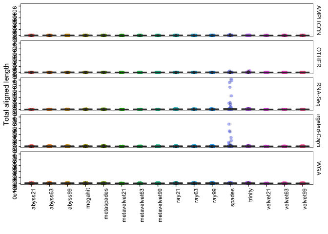<!-- -->

```r
#make_boxplot("unaligned contigs")
make_boxplot("N50")
```

```
## # A tibble: 80 x 4
## # Groups:   Assay_Type [5]
##    Assay_Type       X2             mean median
##    <chr>            <chr>         <dbl>  <dbl>
##  1 AMPLICON         abyss21      11643.  8250.
##  2 AMPLICON         abyss63       8927.  4117 
##  3 AMPLICON         abyss99       4241.  1278.
##  4 AMPLICON         megahit      22997. 28204 
##  5 AMPLICON         metaspades   23082. 29828 
##  6 AMPLICON         metavelvet21   671.   596 
##  7 AMPLICON         metavelvet63   890.   648 
##  8 AMPLICON         metavelvet99   708.   658 
##  9 AMPLICON         ray21        13430. 12080.
## 10 AMPLICON         ray63        12477.  8068 
## 11 AMPLICON         ray99        12477.  8068 
## 12 AMPLICON         spades       16764. 15790.
## 13 AMPLICON         trinity      15029. 13837 
## 14 AMPLICON         velvet21       673.   596 
## 15 AMPLICON         velvet63       880.   629 
## 16 AMPLICON         velvet99       706.   663 
## 17 OTHER            abyss21      12138.  6523 
## 18 OTHER            abyss63      15189. 16418 
## 19 OTHER            abyss99      16780. 18796 
## 20 OTHER            megahit      18282. 28185 
## 21 OTHER            metaspades   16174. 21584 
## 22 OTHER            metavelvet21   763    662 
## 23 OTHER            metavelvet63   805.   701 
## 24 OTHER            metavelvet99  1075.   792 
## 25 OTHER            ray21        15143.  9286.
## 26 OTHER            ray63        16331. 17003 
## 27 OTHER            ray99        16336. 17003 
## 28 OTHER            spades       17970. 26503 
## 29 OTHER            trinity      15079. 12610.
## 30 OTHER            velvet21       781.   665 
## 31 OTHER            velvet63       839.   710.
## 32 OTHER            velvet99      1070.   792 
## 33 RNA-Seq          abyss21        885.   696 
## 34 RNA-Seq          abyss63       1233.   758 
## 35 RNA-Seq          abyss99       3561.   700 
## 36 RNA-Seq          megahit       2992.   919 
## 37 RNA-Seq          metaspades    2902.   813 
## 38 RNA-Seq          metavelvet21   589.   583 
## 39 RNA-Seq          metavelvet63   783.   734 
## 40 RNA-Seq          metavelvet99  1312.  1014.
## 41 RNA-Seq          ray21         6800.  1273 
## 42 RNA-Seq          ray63         6099.  1234 
## 43 RNA-Seq          ray99         6097.  1228 
## 44 RNA-Seq          spades        7600.  2000 
## 45 RNA-Seq          trinity       2213.   895 
## 46 RNA-Seq          velvet21       585.   584 
## 47 RNA-Seq          velvet63       781.   729 
## 48 RNA-Seq          velvet99      1317.  1034 
## 49 Targeted-Capture abyss21      13101.  8657 
## 50 Targeted-Capture abyss63      13778.  3266 
## 51 Targeted-Capture abyss99      12933.  2678 
## 52 Targeted-Capture megahit      16162. 16225 
## 53 Targeted-Capture metaspades   16179. 25414 
## 54 Targeted-Capture metavelvet21   652.   594.
## 55 Targeted-Capture metavelvet63   865.   708.
## 56 Targeted-Capture metavelvet99  2458.  1038 
## 57 Targeted-Capture ray21        14766.  5998 
## 58 Targeted-Capture ray63        14280.  4193 
## 59 Targeted-Capture ray99        14288.  4193 
## 60 Targeted-Capture spades       18501. 28971 
## 61 Targeted-Capture trinity      10320.  6489 
## 62 Targeted-Capture velvet21       672.   629 
## 63 Targeted-Capture velvet63       869.   706.
## 64 Targeted-Capture velvet99      2377.  1053 
## 65 WGA              abyss21      15478. 22264.
## 66 WGA              abyss63       8825.  5290.
## 67 WGA              abyss99       2141.  1230.
## 68 WGA              megahit      21716. 29839 
## 69 WGA              metaspades   21808. 29840 
## 70 WGA              metavelvet21   626.   629 
## 71 WGA              metavelvet63   653.   629 
## 72 WGA              metavelvet99   647.   632.
## 73 WGA              ray21        21991. 27294.
## 74 WGA              ray63        21569. 27993 
## 75 WGA              ray99        21569. 27993 
## 76 WGA              spades       12524.  9287 
## 77 WGA              trinity      21034. 29817 
## 78 WGA              velvet21       625.   624 
## 79 WGA              velvet63       655.   634 
## 80 WGA              velvet99       648.   628
```

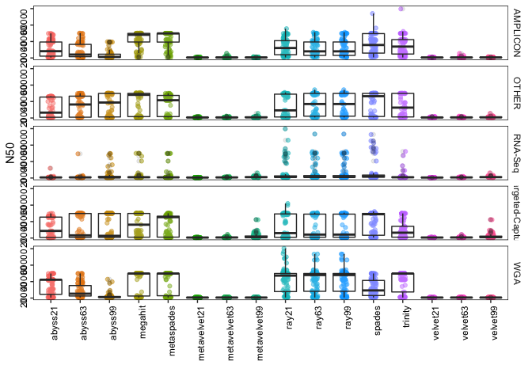<!-- -->

```r
make_boxplot("N75")
```

```
## # A tibble: 80 x 4
## # Groups:   Assay_Type [5]
##    Assay_Type       X2             mean median
##    <chr>            <chr>         <dbl>  <dbl>
##  1 AMPLICON         abyss21       8296.  5720.
##  2 AMPLICON         abyss63       6135.  2545 
##  3 AMPLICON         abyss99       2238.   713 
##  4 AMPLICON         megahit      19433. 26626 
##  5 AMPLICON         metaspades   19953. 29431 
##  6 AMPLICON         metavelvet21   593.   556 
##  7 AMPLICON         metavelvet63   704.   560 
##  8 AMPLICON         metavelvet99   608.   584 
##  9 AMPLICON         ray21         9378.  6886.
## 10 AMPLICON         ray63         9410.  6212.
## 11 AMPLICON         ray99         9410.  6212.
## 12 AMPLICON         spades       11730.  7612.
## 13 AMPLICON         trinity      11173.  7110.
## 14 AMPLICON         velvet21       593.   558 
## 15 AMPLICON         velvet63       721.   560 
## 16 AMPLICON         velvet99       610.   586 
## 17 OTHER            abyss21      10849.  2901 
## 18 OTHER            abyss63      12882.  4747 
## 19 OTHER            abyss99      15833. 12065 
## 20 OTHER            megahit      13674.  3486.
## 21 OTHER            metaspades    7465.  1836 
## 22 OTHER            metavelvet21   622.   571 
## 23 OTHER            metavelvet63   635.   587 
## 24 OTHER            metavelvet99   730.   608 
## 25 OTHER            ray21        10226.  2140.
## 26 OTHER            ray63        11503.  2839 
## 27 OTHER            ray99        11504.  2839 
## 28 OTHER            spades       12898.  4170.
## 29 OTHER            trinity       5104.  1646 
## 30 OTHER            velvet21       618.   572 
## 31 OTHER            velvet63       658.   594 
## 32 OTHER            velvet99       749.   633 
## 33 RNA-Seq          abyss21        745.   569 
## 34 RNA-Seq          abyss63       1025.   606.
## 35 RNA-Seq          abyss99       2637.   633 
## 36 RNA-Seq          megahit       1228.   648 
## 37 RNA-Seq          metaspades    1604.   617 
## 38 RNA-Seq          metavelvet21   543.   534 
## 39 RNA-Seq          metavelvet63   606.   590 
## 40 RNA-Seq          metavelvet99   953.   788.
## 41 RNA-Seq          ray21         2310.   776 
## 42 RNA-Seq          ray63         1766.   781 
## 43 RNA-Seq          ray99         1770.   781 
## 44 RNA-Seq          spades        3867.   902 
## 45 RNA-Seq          trinity        935.   620 
## 46 RNA-Seq          velvet21       542.   536.
## 47 RNA-Seq          velvet63       606.   589 
## 48 RNA-Seq          velvet99       954.   806 
## 49 Targeted-Capture abyss21      12054.  5664.
## 50 Targeted-Capture abyss63      13548.  1926 
## 51 Targeted-Capture abyss99      12228.  1072 
## 52 Targeted-Capture megahit      15248.  9211 
## 53 Targeted-Capture metaspades   14706. 14101 
## 54 Targeted-Capture metavelvet21   582.   551 
## 55 Targeted-Capture metavelvet63   679.   578.
## 56 Targeted-Capture metavelvet99  1733.   754 
## 57 Targeted-Capture ray21        13918.  2950 
## 58 Targeted-Capture ray63        13516.  2070 
## 59 Targeted-Capture ray99        13521.  2220 
## 60 Targeted-Capture spades       16637. 21340 
## 61 Targeted-Capture trinity       7605.  2533 
## 62 Targeted-Capture velvet21       595.   554 
## 63 Targeted-Capture velvet63       676.   576 
## 64 Targeted-Capture velvet99      1726.   750 
## 65 WGA              abyss21      13161. 11025 
## 66 WGA              abyss63       5769.  3188.
## 67 WGA              abyss99       1490.   788.
## 68 WGA              megahit      17146. 29822 
## 69 WGA              metaspades   18249. 29836 
## 70 WGA              metavelvet21   565.   562.
## 71 WGA              metavelvet63   580.   550 
## 72 WGA              metavelvet99   562.   554 
## 73 WGA              ray21        18047. 12058 
## 74 WGA              ray63        18708. 24722.
## 75 WGA              ray99        18708. 24722.
## 76 WGA              spades        8464.  4127 
## 77 WGA              trinity      14603.  7420.
## 78 WGA              velvet21       567.   562.
## 79 WGA              velvet63       575.   555 
## 80 WGA              velvet99       564.   553
```

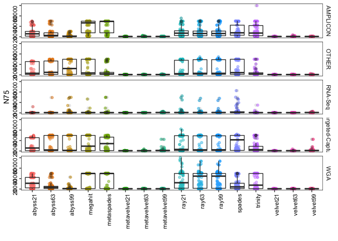<!-- -->

```r
#make_boxplot("L50")
make_boxplot("L75")
```

```
## # A tibble: 80 x 4
## # Groups:   Assay_Type [5]
##    Assay_Type       X2             mean median
##    <chr>            <chr>         <dbl>  <dbl>
##  1 AMPLICON         abyss21        4.4     3  
##  2 AMPLICON         abyss63        5.79    5  
##  3 AMPLICON         abyss99        8.65    7.5
##  4 AMPLICON         megahit        3.27    1  
##  5 AMPLICON         metaspades     2.60    1  
##  6 AMPLICON         metavelvet21   3.44    2  
##  7 AMPLICON         metavelvet63   5.59    4  
##  8 AMPLICON         metavelvet99   8.10    7  
##  9 AMPLICON         ray21          4.13    2  
## 10 AMPLICON         ray63          4.55    3  
## 11 AMPLICON         ray99          4.56    3  
## 12 AMPLICON         spades         4.20    3  
## 13 AMPLICON         trinity        4.39    2  
## 14 AMPLICON         velvet21       3.44    2  
## 15 AMPLICON         velvet63       5.78    4  
## 16 AMPLICON         velvet99       8.21    7  
## 17 OTHER            abyss21       19.0     3  
## 18 OTHER            abyss63       17.0     3  
## 19 OTHER            abyss99       13.7     1.5
## 20 OTHER            megahit       36.5     2  
## 21 OTHER            metaspades    31.3     3  
## 22 OTHER            metavelvet21  28.4     7  
## 23 OTHER            metavelvet63  24       8  
## 24 OTHER            metavelvet99  23.4    11  
## 25 OTHER            ray21         12.1     2.5
## 26 OTHER            ray63         11.3     3  
## 27 OTHER            ray99         11.3     3  
## 28 OTHER            spades        25       2  
## 29 OTHER            trinity       41.3     8  
## 30 OTHER            velvet21      28.4     6  
## 31 OTHER            velvet63      25.2     9.5
## 32 OTHER            velvet99      23.3    11  
## 33 RNA-Seq          abyss21      277.     42  
## 34 RNA-Seq          abyss63      116.     16.5
## 35 RNA-Seq          abyss99        6.46    3  
## 36 RNA-Seq          megahit      365.     94  
## 37 RNA-Seq          metaspades   447.    128  
## 38 RNA-Seq          metavelvet21 124.     23  
## 39 RNA-Seq          metavelvet63 116.     18  
## 40 RNA-Seq          metavelvet99   6.95    3  
## 41 RNA-Seq          ray21        178.     24  
## 42 RNA-Seq          ray63        146.     19  
## 43 RNA-Seq          ray99        146.     19  
## 44 RNA-Seq          spades       397.    111  
## 45 RNA-Seq          trinity      519.    111  
## 46 RNA-Seq          velvet21     125.     30.5
## 47 RNA-Seq          velvet63     116.     19  
## 48 RNA-Seq          velvet99       6.97    3  
## 49 Targeted-Capture abyss21        5.71    2  
## 50 Targeted-Capture abyss63        6.65    3  
## 51 Targeted-Capture abyss99        7.18    3  
## 52 Targeted-Capture megahit       69.0     2  
## 53 Targeted-Capture metaspades    65.1     2  
## 54 Targeted-Capture metavelvet21  51.1     5  
## 55 Targeted-Capture metavelvet63  31.6     7  
## 56 Targeted-Capture metavelvet99  22.3     7  
## 57 Targeted-Capture ray21         23.4     4  
## 58 Targeted-Capture ray63         21.2     5  
## 59 Targeted-Capture ray99         21.1     5  
## 60 Targeted-Capture spades        86.4     2  
## 61 Targeted-Capture trinity       49.2     5  
## 62 Targeted-Capture velvet21      51.3     5  
## 63 Targeted-Capture velvet63      31.6     7  
## 64 Targeted-Capture velvet99      22.3     7  
## 65 WGA              abyss21        8.39    2  
## 66 WGA              abyss63       13.4     4  
## 67 WGA              abyss99       18.4    13  
## 68 WGA              megahit       23.3     1  
## 69 WGA              metaspades    18.6     1  
## 70 WGA              metavelvet21  12.6     3.5
## 71 WGA              metavelvet63  16.9     8  
## 72 WGA              metavelvet99  17.4    11  
## 73 WGA              ray21          9.12    2  
## 74 WGA              ray63         10.0     1  
## 75 WGA              ray99         10.0     1  
## 76 WGA              spades        18.4     3  
## 77 WGA              trinity       24.4     2  
## 78 WGA              velvet21      12.8     4  
## 79 WGA              velvet63      16.7     7  
## 80 WGA              velvet99      17.4    10
```

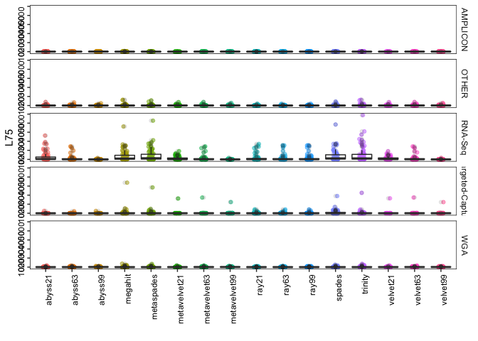<!-- -->

```r
make_boxplot("NA50")
```

```
## # A tibble: 80 x 4
## # Groups:   Assay_Type [5]
##    Assay_Type       X2             mean median
##    <chr>            <chr>         <dbl>  <dbl>
##  1 AMPLICON         abyss21      12311.  8610 
##  2 AMPLICON         abyss63       9431.  4624.
##  3 AMPLICON         abyss99       4517.  1480 
##  4 AMPLICON         megahit      24052. 29576 
##  5 AMPLICON         metaspades   23844. 29815 
##  6 AMPLICON         metavelvet21   692.   657 
##  7 AMPLICON         metavelvet63   945.   629 
##  8 AMPLICON         metavelvet99   685.   641 
##  9 AMPLICON         ray21        13095. 11269 
## 10 AMPLICON         ray63        12850.  8323 
## 11 AMPLICON         ray99        12849.  8323 
## 12 AMPLICON         spades       16582. 15378 
## 13 AMPLICON         trinity      14977. 16192 
## 14 AMPLICON         velvet21       692.   657 
## 15 AMPLICON         velvet63       933.   628 
## 16 AMPLICON         velvet99       682.   644 
## 17 OTHER            abyss21      13954. 12461 
## 18 OTHER            abyss63      18055. 24782 
## 19 OTHER            abyss99      20017. 27631 
## 20 OTHER            megahit      23159. 29831 
## 21 OTHER            metaspades   20154. 24810 
## 22 OTHER            metavelvet21   991.   732 
## 23 OTHER            metavelvet63   928.   783 
## 24 OTHER            metavelvet99  1250.  1128.
## 25 OTHER            ray21        16659. 24313 
## 26 OTHER            ray63        18842. 27680 
## 27 OTHER            ray99        18846. 27680 
## 28 OTHER            spades       21927. 29822 
## 29 OTHER            trinity      18770. 24148 
## 30 OTHER            velvet21      1045.   734 
## 31 OTHER            velvet63       937.   794.
## 32 OTHER            velvet99      1238.  1093 
## 33 RNA-Seq          abyss21       2257.   562 
## 34 RNA-Seq          abyss63       4235.  1354 
## 35 RNA-Seq          abyss99       7991.  3324 
## 36 RNA-Seq          megahit      27302. 29826 
## 37 RNA-Seq          metaspades   24294  29694.
## 38 RNA-Seq          metavelvet21   522    522 
## 39 RNA-Seq          metavelvet63  1111.  1058.
## 40 RNA-Seq          metavelvet99  1716.   823 
## 41 RNA-Seq          ray21        20410  22429 
## 42 RNA-Seq          ray63        19170. 22405 
## 43 RNA-Seq          ray99        19170. 22405 
## 44 RNA-Seq          spades       22049. 21438 
## 45 RNA-Seq          trinity       7027   3868 
## 46 RNA-Seq          velvet21       563    563 
## 47 RNA-Seq          velvet63      1049   1058.
## 48 RNA-Seq          velvet99      1716.   823 
## 49 Targeted-Capture abyss21      17890. 25017 
## 50 Targeted-Capture abyss63      18046. 27292 
## 51 Targeted-Capture abyss99      15943. 20376 
## 52 Targeted-Capture megahit      22721. 29853 
## 53 Targeted-Capture metaspades   22049. 26501 
## 54 Targeted-Capture metavelvet21   680.   649 
## 55 Targeted-Capture metavelvet63   945.   768 
## 56 Targeted-Capture metavelvet99  2820.  1297 
## 57 Targeted-Capture ray21        20049. 28592 
## 58 Targeted-Capture ray63        18926. 28367 
## 59 Targeted-Capture ray99        18937. 28367 
## 60 Targeted-Capture spades       23079. 29852 
## 61 Targeted-Capture trinity      13276.  9350.
## 62 Targeted-Capture velvet21       698.   670.
## 63 Targeted-Capture velvet63       949.   768 
## 64 Targeted-Capture velvet99      2755.  1302 
## 65 WGA              abyss21      18930. 22283 
## 66 WGA              abyss63      10582.  6212.
## 67 WGA              abyss99       2435.  1306.
## 68 WGA              megahit      28827. 29821 
## 69 WGA              metaspades   28976. 29820.
## 70 WGA              metavelvet21   659    664 
## 71 WGA              metavelvet63   596.   571 
## 72 WGA              metavelvet99   608.   590.
## 73 WGA              ray21        23264. 26559 
## 74 WGA              ray63        23400. 28610 
## 75 WGA              ray99        23400. 28610 
## 76 WGA              spades       16004. 15306.
## 77 WGA              trinity      27302. 29822 
## 78 WGA              velvet21       666.   666.
## 79 WGA              velvet63       601.   571 
## 80 WGA              velvet99       597.   584.
```

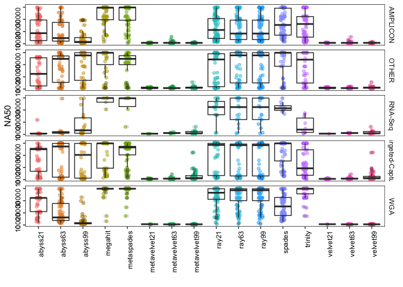<!-- -->

```r
make_boxplot("NA75")
```

```
## # A tibble: 80 x 4
## # Groups:   Assay_Type [5]
##    Assay_Type       X2             mean median
##    <chr>            <chr>         <dbl>  <dbl>
##  1 AMPLICON         abyss21       8901.  6368 
##  2 AMPLICON         abyss63       6416.  3052.
##  3 AMPLICON         abyss99       2379.   866.
##  4 AMPLICON         megahit      21131. 29576 
##  5 AMPLICON         metaspades   21652. 29819 
##  6 AMPLICON         metavelvet21   618.   579 
##  7 AMPLICON         metavelvet63   735.   560 
##  8 AMPLICON         metavelvet99   576.   560.
##  9 AMPLICON         ray21         9177.  6428 
## 10 AMPLICON         ray63         9688.  6361 
## 11 AMPLICON         ray99         9688.  6361 
## 12 AMPLICON         spades       12399.  7651 
## 13 AMPLICON         trinity      11455.  7424 
## 14 AMPLICON         velvet21       618.   579 
## 15 AMPLICON         velvet63       753.   564 
## 16 AMPLICON         velvet99       581.   570.
## 17 OTHER            abyss21      12678.  6860 
## 18 OTHER            abyss63      15859. 25333 
## 19 OTHER            abyss99      19303. 27634.
## 20 OTHER            megahit      20221. 29830.
## 21 OTHER            metaspades   11205.  4740 
## 22 OTHER            metavelvet21   675.   620.
## 23 OTHER            metavelvet63   678.   604 
## 24 OTHER            metavelvet99   826.   784 
## 25 OTHER            ray21        12606.  3925 
## 26 OTHER            ray63        14420.  4818.
## 27 OTHER            ray99        14421.  4818.
## 28 OTHER            spades       18643. 27692.
## 29 OTHER            trinity       8432.  3705 
## 30 OTHER            velvet21       685.   620.
## 31 OTHER            velvet63       711.   655 
## 32 OTHER            velvet99       854.   791 
## 33 RNA-Seq          abyss21       3403.   609 
## 34 RNA-Seq          abyss63       6532.   669 
## 35 RNA-Seq          abyss99       5761.  1432 
## 36 RNA-Seq          megahit      17790. 17790.
## 37 RNA-Seq          metaspades   22845  29583 
## 38 RNA-Seq          metavelvet21   NaN     NA 
## 39 RNA-Seq          metavelvet63   648.   643 
## 40 RNA-Seq          metavelvet99   993.   687 
## 41 RNA-Seq          ray21        18728  19310 
## 42 RNA-Seq          ray63        14595.  8413 
## 43 RNA-Seq          ray99        14595.  8413 
## 44 RNA-Seq          spades       12962. 12097 
## 45 RNA-Seq          trinity       6586   4816 
## 46 RNA-Seq          velvet21       NaN     NA 
## 47 RNA-Seq          velvet63       648.   643 
## 48 RNA-Seq          velvet99       968.   687 
## 49 Targeted-Capture abyss21      16969. 25390 
## 50 Targeted-Capture abyss63      19125. 29044 
## 51 Targeted-Capture abyss99      15528. 15621 
## 52 Targeted-Capture megahit      21833. 29853 
## 53 Targeted-Capture metaspades   20403. 26386 
## 54 Targeted-Capture metavelvet21   595.   558 
## 55 Targeted-Capture metavelvet63   714.   593 
## 56 Targeted-Capture metavelvet99  2009.   910.
## 57 Targeted-Capture ray21        18821. 28552.
## 58 Targeted-Capture ray63        18997. 28375 
## 59 Targeted-Capture ray99        19004. 28375 
## 60 Targeted-Capture spades       21944. 29852 
## 61 Targeted-Capture trinity      10293.  5447 
## 62 Targeted-Capture velvet21       601.   561 
## 63 Targeted-Capture velvet63       709.   591 
## 64 Targeted-Capture velvet99      2021.   960 
## 65 WGA              abyss21      16104. 22281 
## 66 WGA              abyss63       6894.  3974.
## 67 WGA              abyss99       1700.   968 
## 68 WGA              megahit      28869  29821 
## 69 WGA              metaspades   28621  29821 
## 70 WGA              metavelvet21   647    647 
## 71 WGA              metavelvet63   547.   520.
## 72 WGA              metavelvet99   534.   536 
## 73 WGA              ray21        20305. 26248.
## 74 WGA              ray63        22866. 29146 
## 75 WGA              ray99        22866. 29146 
## 76 WGA              spades       12177.  7571 
## 77 WGA              trinity      23711. 29822.
## 78 WGA              velvet21       647    647 
## 79 WGA              velvet63       549.   530.
## 80 WGA              velvet99       527.   528.
```

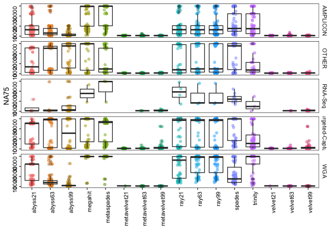<!-- -->

```r
#make_boxplot("LA50")
make_boxplot("LA75")
```

```
## # A tibble: 80 x 4
## # Groups:   Assay_Type [5]
##    Assay_Type       X2             mean median
##    <chr>            <chr>         <dbl>  <dbl>
##  1 AMPLICON         abyss21        3.93    2  
##  2 AMPLICON         abyss63        5.37    4.5
##  3 AMPLICON         abyss99        8.58    8.5
##  4 AMPLICON         megahit        1.59    1  
##  5 AMPLICON         metaspades     1.59    1  
##  6 AMPLICON         metavelvet21   2.47    2  
##  7 AMPLICON         metavelvet63   5.10    4  
##  8 AMPLICON         metavelvet99   7.48    7  
##  9 AMPLICON         ray21          3.90    3  
## 10 AMPLICON         ray63          4.04    3  
## 11 AMPLICON         ray99          4.05    3  
## 12 AMPLICON         spades         3.30    2  
## 13 AMPLICON         trinity        3.04    2  
## 14 AMPLICON         velvet21       2.47    2  
## 15 AMPLICON         velvet63       5.28    4  
## 16 AMPLICON         velvet99       7.61    7  
## 17 OTHER            abyss21        3.87    2  
## 18 OTHER            abyss63        2.51    1  
## 19 OTHER            abyss99        2.37    1  
## 20 OTHER            megahit        2.68    1  
## 21 OTHER            metaspades     3.07    2  
## 22 OTHER            metavelvet21   8.93    9.5
## 23 OTHER            metavelvet63   8.35    9  
## 24 OTHER            metavelvet99  10.2    11  
## 25 OTHER            ray21          4.41    2  
## 26 OTHER            ray63          3.18    2  
## 27 OTHER            ray99          3.18    2  
## 28 OTHER            spades         2.77    1  
## 29 OTHER            trinity        6.77    3  
## 30 OTHER            velvet21       8.93    9.5
## 31 OTHER            velvet63       8.64   10  
## 32 OTHER            velvet99      10.1    10.5
## 33 RNA-Seq          abyss21        9.5     8  
## 34 RNA-Seq          abyss63        8.4     8  
## 35 RNA-Seq          abyss99        7       6  
## 36 RNA-Seq          megahit        1.5     1.5
## 37 RNA-Seq          metaspades     1.33    1  
## 38 RNA-Seq          metavelvet21 NaN      NA  
## 39 RNA-Seq          metavelvet63  10.3    14  
## 40 RNA-Seq          metavelvet99  11.5    10  
## 41 RNA-Seq          ray21          2.25    2  
## 42 RNA-Seq          ray63          2.33    2  
## 43 RNA-Seq          ray99          2.33    2  
## 44 RNA-Seq          spades        76.9    54  
## 45 RNA-Seq          trinity       18.3     4  
## 46 RNA-Seq          velvet21     NaN      NA  
## 47 RNA-Seq          velvet63      10.3    14  
## 48 RNA-Seq          velvet99      11.7    11  
## 49 Targeted-Capture abyss21        2.59    1  
## 50 Targeted-Capture abyss63        3.08    1  
## 51 Targeted-Capture abyss99        3.71    1.5
## 52 Targeted-Capture megahit        2.20    1  
## 53 Targeted-Capture metaspades     2.33    1  
## 54 Targeted-Capture metavelvet21   6.27    5  
## 55 Targeted-Capture metavelvet63   6.98    8  
## 56 Targeted-Capture metavelvet99   7.24    7  
## 57 Targeted-Capture ray21          3.58    1  
## 58 Targeted-Capture ray63          3.98    1  
## 59 Targeted-Capture ray99          3.98    1  
## 60 Targeted-Capture spades         8.49    1  
## 61 Targeted-Capture trinity        5.43    2  
## 62 Targeted-Capture velvet21       6.23    5  
## 63 Targeted-Capture velvet63       7.06    7  
## 64 Targeted-Capture velvet99       7.40    7  
## 65 WGA              abyss21        1.98    1  
## 66 WGA              abyss63        4.20    3  
## 67 WGA              abyss99       11.9    12  
## 68 WGA              megahit        1.05    1  
## 69 WGA              metaspades     1.06    1  
## 70 WGA              metavelvet21   1       1  
## 71 WGA              metavelvet63   4.42    3  
## 72 WGA              metavelvet99   8.54    9  
## 73 WGA              ray21          1.62    1  
## 74 WGA              ray63          1.37    1  
## 75 WGA              ray99          1.37    1  
## 76 WGA              spades         2.37    2  
## 77 WGA              trinity        1.43    1  
## 78 WGA              velvet21       1       1  
## 79 WGA              velvet63       4.04    3  
## 80 WGA              velvet99       8.65    8.5
```

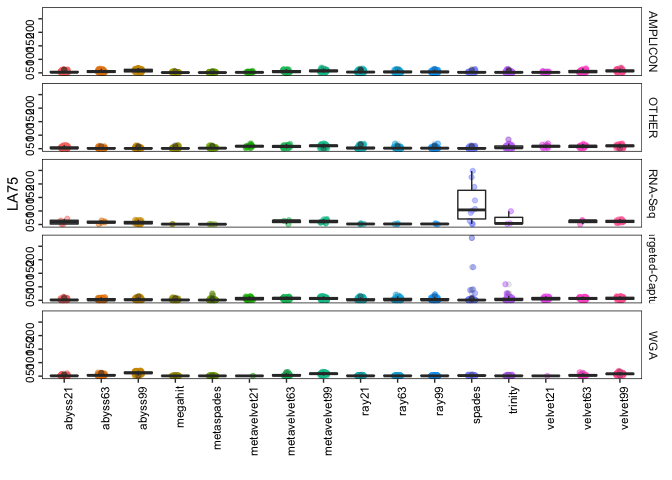<!-- -->

```r
make_boxplot("unaligned mis. contigs")
```

```
## # A tibble: 80 x 4
## # Groups:   Assay_Type [5]
##    Assay_Type       X2             mean median
##    <chr>            <chr>         <dbl>  <dbl>
##  1 AMPLICON         abyss21      0.0256      0
##  2 AMPLICON         abyss63      0           0
##  3 AMPLICON         abyss99      0           0
##  4 AMPLICON         megahit      0           0
##  5 AMPLICON         metaspades   0           0
##  6 AMPLICON         metavelvet21 0           0
##  7 AMPLICON         metavelvet63 0           0
##  8 AMPLICON         metavelvet99 0           0
##  9 AMPLICON         ray21        0           0
## 10 AMPLICON         ray63        0           0
## 11 AMPLICON         ray99        0           0
## 12 AMPLICON         spades       0           0
## 13 AMPLICON         trinity      0           0
## 14 AMPLICON         velvet21     0           0
## 15 AMPLICON         velvet63     0           0
## 16 AMPLICON         velvet99     0           0
## 17 OTHER            abyss21      0           0
## 18 OTHER            abyss63      0           0
## 19 OTHER            abyss99      0           0
## 20 OTHER            megahit      0.0781      0
## 21 OTHER            metaspades   0           0
## 22 OTHER            metavelvet21 0           0
## 23 OTHER            metavelvet63 0           0
## 24 OTHER            metavelvet99 0           0
## 25 OTHER            ray21        0           0
## 26 OTHER            ray63        0.0161      0
## 27 OTHER            ray99        0.0161      0
## 28 OTHER            spades       0.0156      0
## 29 OTHER            trinity      0           0
## 30 OTHER            velvet21     0           0
## 31 OTHER            velvet63     0           0
## 32 OTHER            velvet99     0           0
## 33 RNA-Seq          abyss21      0           0
## 34 RNA-Seq          abyss63      0           0
## 35 RNA-Seq          abyss99      0           0
## 36 RNA-Seq          megahit      0           0
## 37 RNA-Seq          metaspades   0           0
## 38 RNA-Seq          metavelvet21 0           0
## 39 RNA-Seq          metavelvet63 0           0
## 40 RNA-Seq          metavelvet99 0           0
## 41 RNA-Seq          ray21        0           0
## 42 RNA-Seq          ray63        0           0
## 43 RNA-Seq          ray99        0           0
## 44 RNA-Seq          spades       0           0
## 45 RNA-Seq          trinity      0           0
## 46 RNA-Seq          velvet21     0           0
## 47 RNA-Seq          velvet63     0           0
## 48 RNA-Seq          velvet99     0           0
## 49 Targeted-Capture abyss21      0           0
## 50 Targeted-Capture abyss63      0           0
## 51 Targeted-Capture abyss99      0           0
## 52 Targeted-Capture megahit      0.0341      0
## 53 Targeted-Capture metaspades   0           0
## 54 Targeted-Capture metavelvet21 0           0
## 55 Targeted-Capture metavelvet63 0           0
## 56 Targeted-Capture metavelvet99 0           0
## 57 Targeted-Capture ray21        0           0
## 58 Targeted-Capture ray63        0           0
## 59 Targeted-Capture ray99        0           0
## 60 Targeted-Capture spades       0.0112      0
## 61 Targeted-Capture trinity      0           0
## 62 Targeted-Capture velvet21     0           0
## 63 Targeted-Capture velvet63     0           0
## 64 Targeted-Capture velvet99     0           0
## 65 WGA              abyss21      0           0
## 66 WGA              abyss63      0           0
## 67 WGA              abyss99      0           0
## 68 WGA              megahit      0           0
## 69 WGA              metaspades   0           0
## 70 WGA              metavelvet21 0           0
## 71 WGA              metavelvet63 0           0
## 72 WGA              metavelvet99 0           0
## 73 WGA              ray21        0           0
## 74 WGA              ray63        0           0
## 75 WGA              ray99        0           0
## 76 WGA              spades       0           0
## 77 WGA              trinity      0           0
## 78 WGA              velvet21     0           0
## 79 WGA              velvet63     0           0
## 80 WGA              velvet99     0           0
```

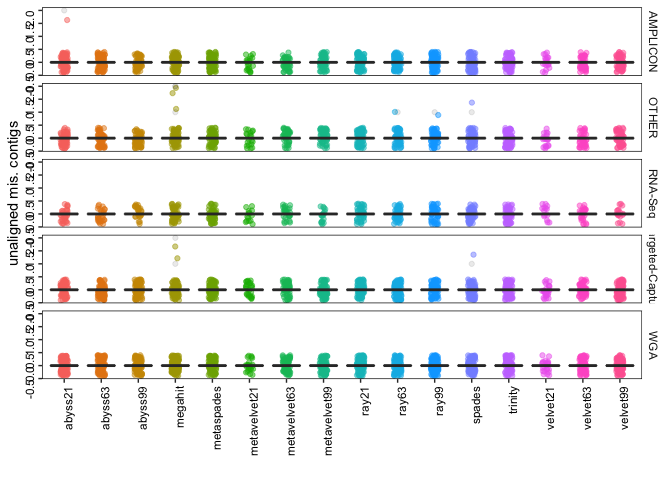<!-- -->

```r
make_boxplot("N's per 100 kbp")
```

```
## # A tibble: 80 x 4
## # Groups:   Assay_Type [5]
##    Assay_Type       X2              mean median
##    <chr>            <chr>          <dbl>  <dbl>
##  1 AMPLICON         abyss21       813.    132. 
##  2 AMPLICON         abyss63       919.    166. 
##  3 AMPLICON         abyss99      1209.      0  
##  4 AMPLICON         megahit         0       0  
##  5 AMPLICON         metaspades      8.54    0  
##  6 AMPLICON         metavelvet21    0       0  
##  7 AMPLICON         metavelvet63    0       0  
##  8 AMPLICON         metavelvet99    0       0  
##  9 AMPLICON         ray21         311.      0  
## 10 AMPLICON         ray63         357.      0  
## 11 AMPLICON         ray99         357.      0  
## 12 AMPLICON         spades         16.4     0  
## 13 AMPLICON         trinity         0       0  
## 14 AMPLICON         velvet21        0       0  
## 15 AMPLICON         velvet63        0       0  
## 16 AMPLICON         velvet99        0       0  
## 17 OTHER            abyss21       126.      0  
## 18 OTHER            abyss63       118.      0  
## 19 OTHER            abyss99       141.      0  
## 20 OTHER            megahit         0       0  
## 21 OTHER            metaspades     12.1     0  
## 22 OTHER            metavelvet21    0       0  
## 23 OTHER            metavelvet63    0       0  
## 24 OTHER            metavelvet99    0       0  
## 25 OTHER            ray21         234.      0  
## 26 OTHER            ray63         177.      0  
## 27 OTHER            ray99         177.      0  
## 28 OTHER            spades          1.25    0  
## 29 OTHER            trinity         0       0  
## 30 OTHER            velvet21        0       0  
## 31 OTHER            velvet63        0       0  
## 32 OTHER            velvet99        0       0  
## 33 RNA-Seq          abyss21       243.      0  
## 34 RNA-Seq          abyss63       342.      0  
## 35 RNA-Seq          abyss99        77.0     0  
## 36 RNA-Seq          megahit         0       0  
## 37 RNA-Seq          metaspades    211.    116. 
## 38 RNA-Seq          metavelvet21    0       0  
## 39 RNA-Seq          metavelvet63    0       0  
## 40 RNA-Seq          metavelvet99    0       0  
## 41 RNA-Seq          ray21         399.    255. 
## 42 RNA-Seq          ray63         413.    187. 
## 43 RNA-Seq          ray99         417.    205. 
## 44 RNA-Seq          spades        104.     29.5
## 45 RNA-Seq          trinity         0       0  
## 46 RNA-Seq          velvet21        0       0  
## 47 RNA-Seq          velvet63        0       0  
## 48 RNA-Seq          velvet99        0       0  
## 49 Targeted-Capture abyss21      2561.    174. 
## 50 Targeted-Capture abyss63      1281.    167. 
## 51 Targeted-Capture abyss99       357.    149. 
## 52 Targeted-Capture megahit         0       0  
## 53 Targeted-Capture metaspades    114.     32.2
## 54 Targeted-Capture metavelvet21    0       0  
## 55 Targeted-Capture metavelvet63    0       0  
## 56 Targeted-Capture metavelvet99    0       0  
## 57 Targeted-Capture ray21         413.      0  
## 58 Targeted-Capture ray63         415.      0  
## 59 Targeted-Capture ray99         417.      0  
## 60 Targeted-Capture spades        516.     33.8
## 61 Targeted-Capture trinity         0       0  
## 62 Targeted-Capture velvet21        0       0  
## 63 Targeted-Capture velvet63        0       0  
## 64 Targeted-Capture velvet99        0       0  
## 65 WGA              abyss21       207.      0  
## 66 WGA              abyss63        63.4     0  
## 67 WGA              abyss99         1.36    0  
## 68 WGA              megahit         0       0  
## 69 WGA              metaspades      3.97    0  
## 70 WGA              metavelvet21    0       0  
## 71 WGA              metavelvet63    0       0  
## 72 WGA              metavelvet99    0       0  
## 73 WGA              ray21          83.4     0  
## 74 WGA              ray63          58.5     0  
## 75 WGA              ray99          58.5     0  
## 76 WGA              spades          1.55    0  
## 77 WGA              trinity         0       0  
## 78 WGA              velvet21        0       0  
## 79 WGA              velvet63        0       0  
## 80 WGA              velvet99        0       0
```

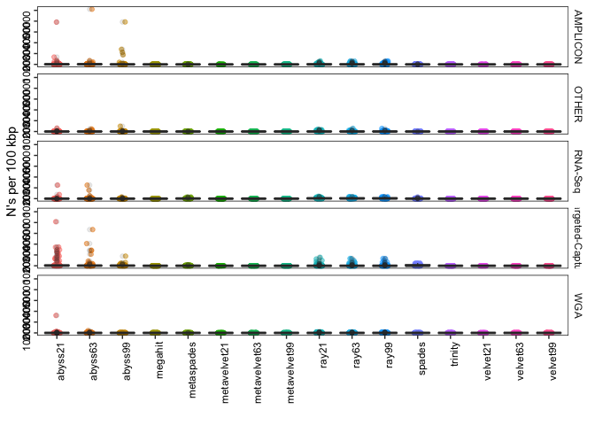<!-- -->

```r
#n50
make_boxplot_v2 = function(variableToPlot)
{
  x4 = xm %>% filter(Assembly == variableToPlot) 
  stat = x4 %>%
    group_by(X2, Assay_Type) %>%
    summarize(mean = mean(value, na.rm = TRUE),
            median = median(value, na.rm = TRUE),
            maximum = max(value, na.rm = TRUE))
            
print(stat, n = Inf)
    
stat2 = x4 %>%
    group_by(X2, Assay_Type) %>%
    tally(value)

  print("print sum of all i.e., total")
  print(stat2, n = Inf)

  plot = ggplot(x4, aes(X2, value)) +
    geom_jitter(alpha = .5, width = .1, aes(color = X2)) +
    geom_boxplot(alpha = 0.1) +
    #scale_color_viridis(discrete=TRUE) +
    #scale_fill_material("red") +
    xlab("") +
    ylab(variableToPlot) +
    facet_grid(Assay_Type~., scales = "free") +
    theme(panel.background = element_rect(fill = "white"),
        panel.border = element_rect(fill = NA, colour = "black", size = .5),
        axis.text = element_text(color = "black", angle = 90, hjust = 1),
        strip.background =element_rect(fill="white"),
        legend.position = "none") 
  print(plot)
  
  filename = str_replace_all(variableToPlot, "[[:punct:]]", "")
  ggsave(filename=paste(filename,".pdf", sep="_"), width = 12, height = 18, units = "cm", device = 'pdf')
}

#la50
make_boxplot_v2("L50")
```

```
## # A tibble: 80 x 5
## # Groups:   X2 [16]
##    X2           Assay_Type         mean median maximum
##    <chr>        <chr>             <dbl>  <dbl>   <dbl>
##  1 abyss21      AMPLICON           2.56    2        12
##  2 abyss21      OTHER             10.6     2       220
##  3 abyss21      RNA-Seq          155.     24      1478
##  4 abyss21      Targeted-Capture   3.33    1       135
##  5 abyss21      WGA                5.08    1       117
##  6 abyss63      AMPLICON           3.22    3        17
##  7 abyss63      OTHER              9.18    1       180
##  8 abyss63      RNA-Seq           62.4     9       783
##  9 abyss63      Targeted-Capture   3.80    2       109
## 10 abyss63      WGA                7.51    2       104
## 11 abyss99      AMPLICON           4.88    4        16
## 12 abyss99      OTHER              7.41    1       130
## 13 abyss99      RNA-Seq            3.70    2        80
## 14 abyss99      Targeted-Capture   3.97    2       130
## 15 abyss99      WGA               10.3     7        65
## 16 megahit      AMPLICON           1.85    1        27
## 17 megahit      OTHER             17.3     1       331
## 18 megahit      RNA-Seq          185.     45      1872
## 19 megahit      Targeted-Capture  36.1     1      1789
## 20 megahit      WGA               10.9     1       216
## 21 metaspades   AMPLICON           1.59    1        16
## 22 metaspades   OTHER             14.5     1       273
## 23 metaspades   RNA-Seq          232.     61      2215
## 24 metaspades   Targeted-Capture  33.9     1      1454
## 25 metaspades   WGA                8.97    1       196
## 26 metavelvet21 AMPLICON           2.28    1         9
## 27 metavelvet21 OTHER             16.6     4       219
## 28 metavelvet21 RNA-Seq           75.6    15       558
## 29 metavelvet21 Targeted-Capture  30.3     3       961
## 30 metavelvet21 WGA                7.74    2.5     117
## 31 metavelvet63 AMPLICON           3.39    2        15
## 32 metavelvet63 OTHER             13.7     5       218
## 33 metavelvet63 RNA-Seq           64.4    10       778
## 34 metavelvet63 Targeted-Capture  18.8     4      1021
## 35 metavelvet63 WGA               10.1     5       111
## 36 metavelvet99 AMPLICON           4.98    5        19
## 37 metavelvet99 OTHER             13.0     6       153
## 38 metavelvet99 RNA-Seq            4.05    2        88
## 39 metavelvet99 Targeted-Capture  12.9     4       719
## 40 metavelvet99 WGA               10.4     7        65
## 41 ray21        AMPLICON           2.41    2        11
## 42 ray21        OTHER              5.77    1        92
## 43 ray21        RNA-Seq           87.1     9       867
## 44 ray21        Targeted-Capture  11.7     2       200
## 45 ray21        WGA                4.65    1        61
## 46 ray63        AMPLICON           2.60    2        14
## 47 ray63        OTHER              5.2     1        90
## 48 ray63        RNA-Seq           71.5     9       811
## 49 ray63        Targeted-Capture  11.0     3       194
## 50 ray63        WGA                5.04    1        63
## 51 ray99        AMPLICON           2.61    2        14
## 52 ray99        OTHER              5.17    1        89
## 53 ray99        RNA-Seq           71.5     9       811
## 54 ray99        Targeted-Capture  10.9     3       193
## 55 ray99        WGA                5.03    1        63
## 56 spades       AMPLICON           2.37    2        21
## 57 spades       OTHER             11.6     1       212
## 58 spades       RNA-Seq          186.     51      1926
## 59 spades       Targeted-Capture  38.1     1       702
## 60 spades       WGA                8.94    2       142
## 61 trinity      AMPLICON           2.39    1        20
## 62 trinity      OTHER             18.8     2       301
## 63 trinity      RNA-Seq          268.     58      2570
## 64 trinity      Targeted-Capture  24.4     3      1046
## 65 trinity      WGA               12.1     1       208
## 66 velvet21     AMPLICON           2.28    1         8
## 67 velvet21     OTHER             16.6     4       220
## 68 velvet21     RNA-Seq           76.6    19       555
## 69 velvet21     Targeted-Capture  30.4     3       972
## 70 velvet21     WGA                7.85    3       117
## 71 velvet63     AMPLICON           3.51    3        16
## 72 velvet63     OTHER             14.4     5       219
## 73 velvet63     RNA-Seq           64.5    10       778
## 74 velvet63     Targeted-Capture  18.7     4      1023
## 75 velvet63     WGA               10       4       108
## 76 velvet99     AMPLICON           5.08    5        19
## 77 velvet99     OTHER             12.9     6       150
## 78 velvet99     RNA-Seq            4.05    2        87
## 79 velvet99     Targeted-Capture  13.0     4       714
## 80 velvet99     WGA               10.3     6        65
## [1] "print sum of all i.e., total"
## # A tibble: 80 x 3
## # Groups:   X2 [16]
##    X2           Assay_Type           n
##    <chr>        <chr>            <dbl>
##  1 abyss21      AMPLICON           205
##  2 abyss21      OTHER              692
##  3 abyss21      RNA-Seq          11601
##  4 abyss21      Targeted-Capture   300
##  5 abyss21      WGA                508
##  6 abyss63      AMPLICON           248
##  7 abyss63      OTHER              606
##  8 abyss63      RNA-Seq           4618
##  9 abyss63      Targeted-Capture   353
## 10 abyss63      WGA                751
## 11 abyss99      AMPLICON           322
## 12 abyss99      OTHER              474
## 13 abyss99      RNA-Seq            226
## 14 abyss99      Targeted-Capture   357
## 15 abyss99      WGA               1028
## 16 megahit      AMPLICON           152
## 17 megahit      OTHER             1139
## 18 megahit      RNA-Seq          13873
## 19 megahit      Targeted-Capture  3361
## 20 megahit      WGA               1090
## 21 metaspades   AMPLICON           130
## 22 metaspades   OTHER              959
## 23 metaspades   RNA-Seq          17375
## 24 metaspades   Targeted-Capture  3156
## 25 metaspades   WGA                897
## 26 metavelvet21 AMPLICON            57
## 27 metavelvet21 OTHER              747
## 28 metavelvet21 RNA-Seq           5368
## 29 metavelvet21 Targeted-Capture  1092
## 30 metavelvet21 WGA                480
## 31 metavelvet63 AMPLICON           166
## 32 metavelvet63 OTHER              891
## 33 metavelvet63 RNA-Seq           4698
## 34 metavelvet63 Targeted-Capture  1313
## 35 metavelvet63 WGA                877
## 36 metavelvet99 AMPLICON           314
## 37 metavelvet99 OTHER              818
## 38 metavelvet99 RNA-Seq            267
## 39 metavelvet99 Targeted-Capture  1098
## 40 metavelvet99 WGA               1036
## 41 ray21        AMPLICON           198
## 42 ray21        OTHER              381
## 43 ray21        RNA-Seq           6533
## 44 ray21        Targeted-Capture  1084
## 45 ray21        WGA                465
## 46 ray63        AMPLICON           213
## 47 ray63        OTHER              338
## 48 ray63        RNA-Seq           5365
## 49 ray63        Targeted-Capture  1022
## 50 ray63        WGA                504
## 51 ray99        AMPLICON           214
## 52 ray99        OTHER              336
## 53 ray99        RNA-Seq           5365
## 54 ray99        Targeted-Capture  1018
## 55 ray99        WGA                503
## 56 spades       AMPLICON           194
## 57 spades       OTHER              767
## 58 spades       RNA-Seq          13916
## 59 spades       Targeted-Capture  3539
## 60 spades       WGA                894
## 61 trinity      AMPLICON           196
## 62 trinity      OTHER             1239
## 63 trinity      RNA-Seq          20101
## 64 trinity      Targeted-Capture  2268
## 65 trinity      WGA               1212
## 66 velvet21     AMPLICON            57
## 67 velvet21     OTHER              749
## 68 velvet21     RNA-Seq           5359
## 69 velvet21     Targeted-Capture  1096
## 70 velvet21     WGA                487
## 71 velvet63     AMPLICON           172
## 72 velvet63     OTHER              891
## 73 velvet63     RNA-Seq           4707
## 74 velvet63     Targeted-Capture  1312
## 75 velvet63     WGA                870
## 76 velvet99     AMPLICON           320
## 77 velvet99     OTHER              814
## 78 velvet99     RNA-Seq            267
## 79 velvet99     Targeted-Capture  1103
## 80 velvet99     WGA               1032
```

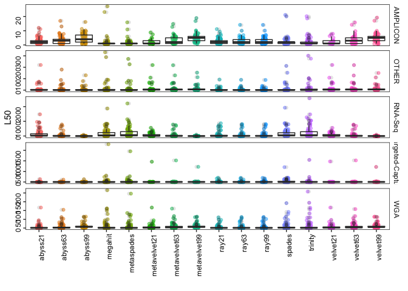<!-- -->

```r
make_boxplot_v2("LA50")
```

```
## # A tibble: 80 x 5
## # Groups:   X2 [16]
##    X2           Assay_Type        mean median maximum
##    <chr>        <chr>            <dbl>  <dbl>   <dbl>
##  1 abyss21      AMPLICON          2.28    2         7
##  2 abyss21      OTHER             2.54    1.5       9
##  3 abyss21      RNA-Seq           6.43    8        12
##  4 abyss21      Targeted-Capture  1.71    1         7
##  5 abyss21      WGA               1.38    1         4
##  6 abyss63      AMPLICON          3.14    3        13
##  7 abyss63      OTHER             1.84    1        15
##  8 abyss63      RNA-Seq           7.3     5.5      24
##  9 abyss63      Targeted-Capture  2.46    1        13
## 10 abyss63      WGA               2.38    2         7
## 11 abyss99      AMPLICON          4.82    4        10
## 12 abyss99      OTHER             1.68    1         6
## 13 abyss99      RNA-Seq           3.81    3         9
## 14 abyss99      Targeted-Capture  2.38    1        10
## 15 abyss99      WGA               6.79    7        19
## 16 megahit      AMPLICON          1.17    1         3
## 17 megahit      OTHER             1.84    1         8
## 18 megahit      RNA-Seq           1       1         1
## 19 megahit      Targeted-Capture  1.48    1         6
## 20 megahit      WGA               1.03    1         2
## 21 metaspades   AMPLICON          1.25    1         6
## 22 metaspades   OTHER             1.83    1         9
## 23 metaspades   RNA-Seq           1.17    1         2
## 24 metaspades   Targeted-Capture  1.85    1        24
## 25 metaspades   WGA               1.03    1         2
## 26 metavelvet21 AMPLICON          1.65    1         5
## 27 metavelvet21 OTHER             5.6     5        12
## 28 metavelvet21 RNA-Seq           4.5     4.5       7
## 29 metavelvet21 Targeted-Capture  3.85    3         9
## 30 metavelvet21 WGA               1.67    1         3
## 31 metavelvet63 AMPLICON          3.08    2         8
## 32 metavelvet63 OTHER             5.27    5        17
## 33 metavelvet63 RNA-Seq           8.25    8.5      13
## 34 metavelvet63 Targeted-Capture  4.21    5         8
## 35 metavelvet63 WGA               3.82    3        15
## 36 metavelvet99 AMPLICON          4.72    5        11
## 37 metavelvet99 OTHER             6.1     6        21
## 38 metavelvet99 RNA-Seq           6.93    6        12
## 39 metavelvet99 Targeted-Capture  4.34    4        11
## 40 metavelvet99 WGA               5.54    5.5       9
## 41 ray21        AMPLICON          2.38    2         9
## 42 ray21        OTHER             2.46    1        10
## 43 ray21        RNA-Seq           2.88    2        11
## 44 ray21        Targeted-Capture  2.27    1         9
## 45 ray21        WGA               1.37    1         6
## 46 ray63        AMPLICON          2.37    2         8
## 47 ray63        OTHER             1.85    1        10
## 48 ray63        RNA-Seq           3.59    1        19
## 49 ray63        Targeted-Capture  2.63    1        10
## 50 ray63        WGA               1.29    1         4
## 51 ray99        AMPLICON          2.38    2         8
## 52 ray99        OTHER             1.84    1        10
## 53 ray99        RNA-Seq           3.59    1        19
## 54 ray99        Targeted-Capture  2.62    1        10
## 55 ray99        WGA               1.29    1         4
## 56 spades       AMPLICON          1.95    1.5       6
## 57 spades       OTHER             2.04    1        10
## 58 spades       RNA-Seq          45.2    29.5     106
## 59 spades       Targeted-Capture  9.82    1       181
## 60 spades       WGA               1.72    1.5       7
## 61 trinity      AMPLICON          2.09    1        20
## 62 trinity      OTHER             3.21    1        17
## 63 trinity      RNA-Seq          13.3     8        31
## 64 trinity      Targeted-Capture  4.46    2        61
## 65 trinity      WGA               1.16    1         5
## 66 velvet21     AMPLICON          1.65    1         5
## 67 velvet21     OTHER             5.47    5        11
## 68 velvet21     RNA-Seq           6       6         6
## 69 velvet21     Targeted-Capture  3.77    3         9
## 70 velvet21     WGA               2       2         3
## 71 velvet63     AMPLICON          3.18    2        10
## 72 velvet63     OTHER             5.5     6        15
## 73 velvet63     RNA-Seq           8.38    8.5      13
## 74 velvet63     Targeted-Capture  4.23    5         8
## 75 velvet63     WGA               4.12    3        15
## 76 velvet99     AMPLICON          4.84    5        11
## 77 velvet99     OTHER             6.17    6        19
## 78 velvet99     RNA-Seq           7       7        12
## 79 velvet99     Targeted-Capture  4.47    4        12
## 80 velvet99     WGA               5.53    5.5      11
## [1] "print sum of all i.e., total"
## # A tibble: 80 x 3
## # Groups:   X2 [16]
##    X2           Assay_Type           n
##    <chr>        <chr>            <dbl>
##  1 abyss21      AMPLICON           171
##  2 abyss21      OTHER              142
##  3 abyss21      RNA-Seq             45
##  4 abyss21      Targeted-Capture   111
##  5 abyss21      WGA                112
##  6 abyss63      AMPLICON           226
##  7 abyss63      OTHER              101
##  8 abyss63      RNA-Seq             73
##  9 abyss63      Targeted-Capture   172
## 10 abyss63      WGA                195
## 11 abyss99      AMPLICON           294
## 12 abyss99      OTHER               89
## 13 abyss99      RNA-Seq             80
## 14 abyss99      Targeted-Capture   171
## 15 abyss99      WGA                557
## 16 megahit      AMPLICON            91
## 17 megahit      OTHER               94
## 18 megahit      RNA-Seq              5
## 19 megahit      Targeted-Capture    96
## 20 megahit      WGA                 76
## 21 metaspades   AMPLICON            99
## 22 metaspades   OTHER               95
## 23 metaspades   RNA-Seq              7
## 24 metaspades   Targeted-Capture   124
## 25 metaspades   WGA                 76
## 26 metavelvet21 AMPLICON            28
## 27 metavelvet21 OTHER               84
## 28 metavelvet21 RNA-Seq              9
## 29 metavelvet21 Targeted-Capture   100
## 30 metavelvet21 WGA                  5
## 31 metavelvet63 AMPLICON           120
## 32 metavelvet63 OTHER              174
## 33 metavelvet63 RNA-Seq             66
## 34 metavelvet63 Targeted-Capture   223
## 35 metavelvet63 WGA                126
## 36 metavelvet99 AMPLICON           269
## 37 metavelvet99 OTHER              244
## 38 metavelvet99 RNA-Seq            104
## 39 metavelvet99 Targeted-Capture   308
## 40 metavelvet99 WGA                377
## 41 ray21        AMPLICON           188
## 42 ray21        OTHER              140
## 43 ray21        RNA-Seq             46
## 44 ray21        Targeted-Capture   150
## 45 ray21        WGA                111
## 46 ray63        AMPLICON           185
## 47 ray63        OTHER              102
## 48 ray63        RNA-Seq             61
## 49 ray63        Targeted-Capture   179
## 50 ray63        WGA                107
## 51 ray99        AMPLICON           186
## 52 ray99        OTHER              101
## 53 ray99        RNA-Seq             61
## 54 ray99        Targeted-Capture   178
## 55 ray99        WGA                107
## 56 spades       AMPLICON           152
## 57 spades       OTHER              108
## 58 spades       RNA-Seq            542
## 59 spades       Targeted-Capture   707
## 60 spades       WGA                131
## 61 trinity      AMPLICON           165
## 62 trinity      OTHER              167
## 63 trinity      RNA-Seq            133
## 64 trinity      Targeted-Capture   312
## 65 trinity      WGA                 87
## 66 velvet21     AMPLICON            28
## 67 velvet21     OTHER               82
## 68 velvet21     RNA-Seq              6
## 69 velvet21     Targeted-Capture    98
## 70 velvet21     WGA                  4
## 71 velvet63     AMPLICON           124
## 72 velvet63     OTHER              176
## 73 velvet63     RNA-Seq             67
## 74 velvet63     Targeted-Capture   224
## 75 velvet63     WGA                136
## 76 velvet99     AMPLICON           276
## 77 velvet99     OTHER              253
## 78 velvet99     RNA-Seq            105
## 79 velvet99     Targeted-Capture   313
## 80 velvet99     WGA                376
```

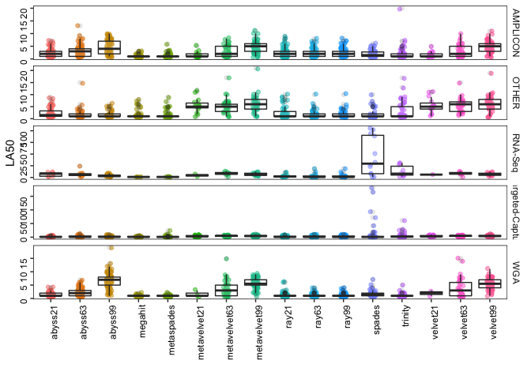<!-- -->

```r
make_boxplot_v2("Duplication ratio")
```

```
## # A tibble: 80 x 5
## # Groups:   X2 [16]
##    X2           Assay_Type        mean median maximum
##    <chr>        <chr>            <dbl>  <dbl>   <dbl>
##  1 abyss21      AMPLICON          1.02   1.00    2.08
##  2 abyss21      OTHER             1.00   1.00    1.01
##  3 abyss21      RNA-Seq           1.02   1       1.33
##  4 abyss21      Targeted-Capture  1.02   1.00    1.37
##  5 abyss21      WGA               1.01   1.00    1.92
##  6 abyss63      AMPLICON          1.02   1.01    1.99
##  7 abyss63      OTHER             1.00   1.00    1.03
##  8 abyss63      RNA-Seq           1.01   1.01    1.12
##  9 abyss63      Targeted-Capture  1.01   1.00    1.36
## 10 abyss63      WGA               1.01   1.01    1.18
## 11 abyss99      AMPLICON          1.03   1.02    1.56
## 12 abyss99      OTHER             1.01   1.00    1.18
## 13 abyss99      RNA-Seq           1.01   1.01    1.04
## 14 abyss99      Targeted-Capture  1.03   1.00    3.00
## 15 abyss99      WGA               1.02   1.03    1.06
## 16 megahit      AMPLICON          1.01   1.00    1.04
## 17 megahit      OTHER             1.01   1.00    1.17
## 18 megahit      RNA-Seq           1.00   1.00    1.03
## 19 megahit      Targeted-Capture  1.01   1.00    1.30
## 20 megahit      WGA               1.02   1.00    1.52
## 21 metaspades   AMPLICON          1.01   1.00    1.10
## 22 metaspades   OTHER             1.01   1.01    1.09
## 23 metaspades   RNA-Seq           1.20   1.02    3.66
## 24 metaspades   Targeted-Capture  1.24   1.01    4.57
## 25 metaspades   WGA               1.00   1.00    1.08
## 26 metavelvet21 AMPLICON          1.00   1       1.00
## 27 metavelvet21 OTHER             1.00   1.00    1.00
## 28 metavelvet21 RNA-Seq           1.00   1       1.01
## 29 metavelvet21 Targeted-Capture  1.00   1       1.00
## 30 metavelvet21 WGA               1.00   1       1.00
## 31 metavelvet63 AMPLICON          1.01   1       1.14
## 32 metavelvet63 OTHER             1.00   1       1.02
## 33 metavelvet63 RNA-Seq           1.01   1.01    1.02
## 34 metavelvet63 Targeted-Capture  1.00   1       1.02
## 35 metavelvet63 WGA               1.00   1       1.03
## 36 metavelvet99 AMPLICON          1.01   1.00    1.04
## 37 metavelvet99 OTHER             1.15   1.01    7.21
## 38 metavelvet99 RNA-Seq           1.02   1.01    1.04
## 39 metavelvet99 Targeted-Capture  1.05   1.00    4.02
## 40 metavelvet99 WGA               1.01   1.00    1.04
## 41 ray21        AMPLICON          1.09   1.06    1.50
## 42 ray21        OTHER             1.06   1.02    1.62
## 43 ray21        RNA-Seq           1.43   1.10    4.04
## 44 ray21        Targeted-Capture  1.08   1.03    1.82
## 45 ray21        WGA               1.18   1.03    2.64
## 46 ray63        AMPLICON          1.07   1.04    1.39
## 47 ray63        OTHER             1.03   1.02    1.20
## 48 ray63        RNA-Seq           1.32   1.06    4.62
## 49 ray63        Targeted-Capture  1.07   1.03    1.78
## 50 ray63        WGA               1.12   1.01    1.97
## 51 ray99        AMPLICON          1.07   1.04    1.39
## 52 ray99        OTHER             1.03   1.02    1.20
## 53 ray99        RNA-Seq           1.32   1.06    4.62
## 54 ray99        Targeted-Capture  1.07   1.03    1.78
## 55 ray99        WGA               1.12   1.01    1.97
## 56 spades       AMPLICON          1.26   1.01    4.90
## 57 spades       OTHER             1.20   1.00    8.14
## 58 spades       RNA-Seq          16.8    1.12  177.  
## 59 spades       Targeted-Capture  6.44   1.16  128.  
## 60 spades       WGA               1.03   1.01    1.91
## 61 trinity      AMPLICON          1.21   1.00    3.23
## 62 trinity      OTHER             1.53   1.16    9.81
## 63 trinity      RNA-Seq           1.87   1.42    5.82
## 64 trinity      Targeted-Capture  1.61   1.20    6.18
## 65 trinity      WGA               1.18   1.00    5.26
## 66 velvet21     AMPLICON          1.00   1       1.00
## 67 velvet21     OTHER             1.00   1.00    1.01
## 68 velvet21     RNA-Seq           1.00   1       1.00
## 69 velvet21     Targeted-Capture  1.00   1       1.00
## 70 velvet21     WGA               1.00   1       1.00
## 71 velvet63     AMPLICON          1.01   1       1.14
## 72 velvet63     OTHER             1.00   1.00    1.02
## 73 velvet63     RNA-Seq           1.01   1.01    1.02
## 74 velvet63     Targeted-Capture  1.00   1.00    1.02
## 75 velvet63     WGA               1.00   1       1.03
## 76 velvet99     AMPLICON          1.01   1.00    1.03
## 77 velvet99     OTHER             1.16   1.01    7.21
## 78 velvet99     RNA-Seq           1.02   1.01    1.04
## 79 velvet99     Targeted-Capture  1.05   1.00    3.93
## 80 velvet99     WGA               1.01   1.00    1.05
## [1] "print sum of all i.e., total"
## # A tibble: 80 x 3
## # Groups:   X2 [16]
##    X2           Assay_Type           n
##    <chr>        <chr>            <dbl>
##  1 abyss21      AMPLICON          79.7
##  2 abyss21      OTHER             59.2
##  3 abyss21      RNA-Seq           32.5
##  4 abyss21      Targeted-Capture  69.1
##  5 abyss21      WGA               93.2
##  6 abyss63      AMPLICON          75.6
##  7 abyss63      OTHER             58.3
##  8 abyss63      RNA-Seq           28.3
##  9 abyss63      Targeted-Capture  79.0
## 10 abyss63      WGA               96.9
## 11 abyss99      AMPLICON          66.2
## 12 abyss99      OTHER             59.5
## 13 abyss99      RNA-Seq           26.3
## 14 abyss99      Targeted-Capture  79.6
## 15 abyss99      WGA               97.4
## 16 megahit      AMPLICON          81.6
## 17 megahit      OTHER             64.9
## 18 megahit      RNA-Seq           56.2
## 19 megahit      Targeted-Capture  89.3
## 20 megahit      WGA               99.6
## 21 metaspades   AMPLICON          81.4
## 22 metaspades   OTHER             64.7
## 23 metaspades   RNA-Seq           67.2
## 24 metaspades   Targeted-Capture 110. 
## 25 metaspades   WGA               97.4
## 26 metavelvet21 AMPLICON          19.0
## 27 metavelvet21 OTHER             19.0
## 28 metavelvet21 RNA-Seq           14.0
## 29 metavelvet21 Targeted-Capture  26.0
## 30 metavelvet21 WGA               22.0
## 31 metavelvet63 AMPLICON          44.3
## 32 metavelvet63 OTHER             41.2
## 33 metavelvet63 RNA-Seq           26.2
## 34 metavelvet63 Targeted-Capture  55.1
## 35 metavelvet63 WGA               68.2
## 36 metavelvet99 AMPLICON          62.4
## 37 metavelvet99 OTHER             60.9
## 38 metavelvet99 RNA-Seq           18.3
## 39 metavelvet99 Targeted-Capture  80.5
## 40 metavelvet99 WGA               94.6
## 41 ray21        AMPLICON          88.2
## 42 ray21        OTHER             67.6
## 43 ray21        RNA-Seq           67.0
## 44 ray21        Targeted-Capture  91.5
## 45 ray21        WGA              116. 
## 46 ray63        AMPLICON          86.4
## 47 ray63        OTHER             63.9
## 48 ray63        RNA-Seq           60.6
## 49 ray63        Targeted-Capture  90.7
## 50 ray63        WGA              108. 
## 51 ray99        AMPLICON          86.4
## 52 ray99        OTHER             63.9
## 53 ray99        RNA-Seq           60.6
## 54 ray99        Targeted-Capture  90.5
## 55 ray99        WGA              108. 
## 56 spades       AMPLICON         102. 
## 57 spades       OTHER             76.8
## 58 spades       RNA-Seq          908. 
## 59 spades       Targeted-Capture 573. 
## 60 spades       WGA              100. 
## 61 trinity      AMPLICON          98.2
## 62 trinity      OTHER             98.0
## 63 trinity      RNA-Seq          101. 
## 64 trinity      Targeted-Capture 137. 
## 65 trinity      WGA              114. 
## 66 velvet21     AMPLICON          19.0
## 67 velvet21     OTHER             19.0
## 68 velvet21     RNA-Seq           14.0
## 69 velvet21     Targeted-Capture  26.0
## 70 velvet21     WGA               22.0
## 71 velvet63     AMPLICON          44.2
## 72 velvet63     OTHER             40.2
## 73 velvet63     RNA-Seq           26.2
## 74 velvet63     Targeted-Capture  55.1
## 75 velvet63     WGA               68.2
## 76 velvet99     AMPLICON          62.4
## 77 velvet99     OTHER             61.3
## 78 velvet99     RNA-Seq           18.3
## 79 velvet99     Targeted-Capture  78.5
## 80 velvet99     WGA               93.6
```

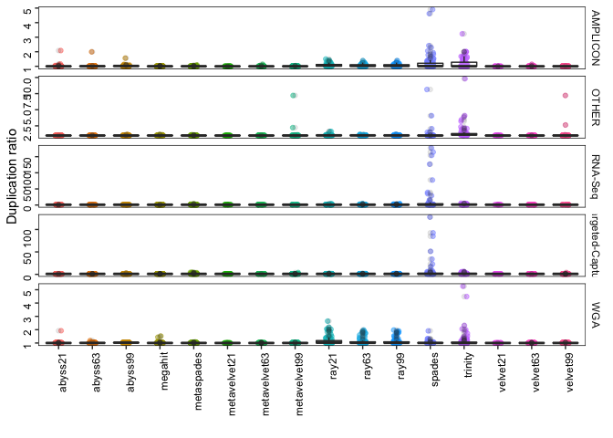<!-- -->

```r
make_boxplot_v2("misassemblies")
```

```
## # A tibble: 80 x 5
## # Groups:   X2 [16]
##    X2           Assay_Type          mean median maximum
##    <chr>        <chr>              <dbl>  <dbl>   <dbl>
##  1 abyss21      AMPLICON          0.0128      0       1
##  2 abyss21      OTHER             0.0169      0       1
##  3 abyss21      RNA-Seq           0.0312      0       1
##  4 abyss21      Targeted-Capture  0           0       0
##  5 abyss21      WGA               0           0       0
##  6 abyss63      AMPLICON          0.0270      0       1
##  7 abyss63      OTHER             0           0       0
##  8 abyss63      RNA-Seq           0           0       0
##  9 abyss63      Targeted-Capture  0.0128      0       1
## 10 abyss63      WGA               0           0       0
## 11 abyss99      AMPLICON          0.0938      0       2
## 12 abyss99      OTHER             0.0339      0       1
## 13 abyss99      RNA-Seq           0.0769      0       1
## 14 abyss99      Targeted-Capture  0           0       0
## 15 abyss99      WGA               0.221       0       2
## 16 megahit      AMPLICON          0.111       0       2
## 17 megahit      OTHER             0.0625      0       1
## 18 megahit      RNA-Seq           0.0357      0       1
## 19 megahit      Targeted-Capture  0.580       0      10
## 20 megahit      WGA               0.0612      0       1
## 21 metaspades   AMPLICON          0           0       0
## 22 metaspades   OTHER             0.0312      0       1
## 23 metaspades   RNA-Seq           0.0357      0       1
## 24 metaspades   Targeted-Capture  1.46        0      33
## 25 metaspades   WGA               0.0103      0       1
## 26 metavelvet21 AMPLICON          0           0       0
## 27 metavelvet21 OTHER             0           0       0
## 28 metavelvet21 RNA-Seq           0.0714      0       1
## 29 metavelvet21 Targeted-Capture  0           0       0
## 30 metavelvet21 WGA               0           0       0
## 31 metavelvet63 AMPLICON          0           0       0
## 32 metavelvet63 OTHER             0           0       0
## 33 metavelvet63 RNA-Seq           0           0       0
## 34 metavelvet63 Targeted-Capture  0           0       0
## 35 metavelvet63 WGA               0           0       0
## 36 metavelvet99 AMPLICON          0.258       0       3
## 37 metavelvet99 OTHER             0.0566      0       1
## 38 metavelvet99 RNA-Seq           0           0       0
## 39 metavelvet99 Targeted-Capture  0           0       0
## 40 metavelvet99 WGA               0.298       0       2
## 41 ray21        AMPLICON          0.617       0       4
## 42 ray21        OTHER             0.0781      0       1
## 43 ray21        RNA-Seq           1.23        1       6
## 44 ray21        Targeted-Capture  0.576       0       7
## 45 ray21        WGA               0.724       0       6
## 46 ray63        AMPLICON          0.235       0       2
## 47 ray63        OTHER             0.0484      0       2
## 48 ray63        RNA-Seq           1.11        1       6
## 49 ray63        Targeted-Capture  0.729       0      17
## 50 ray63        WGA               0.433       0       3
## 51 ray99        AMPLICON          0.235       0       2
## 52 ray99        OTHER             0.0323      0       2
## 53 ray99        RNA-Seq           1.11        1       6
## 54 ray99        Targeted-Capture  0.706       0      17
## 55 ray99        WGA               0.433       0       3
## 56 spades       AMPLICON          0.370       0       4
## 57 spades       OTHER             0.156       0       3
## 58 spades       RNA-Seq          13.7         0     173
## 59 spades       Targeted-Capture 11.6         0     206
## 60 spades       WGA               0.0619      0       1
## 61 trinity      AMPLICON          0.0494      0       2
## 62 trinity      OTHER             0.109       0       4
## 63 trinity      RNA-Seq           2.72        0      26
## 64 trinity      Targeted-Capture  3.06        0      55
## 65 trinity      WGA               0.104       0       4
## 66 velvet21     AMPLICON          0           0       0
## 67 velvet21     OTHER             0           0       0
## 68 velvet21     RNA-Seq           0.0714      0       1
## 69 velvet21     Targeted-Capture  0           0       0
## 70 velvet21     WGA               0           0       0
## 71 velvet63     AMPLICON          0           0       0
## 72 velvet63     OTHER             0           0       0
## 73 velvet63     RNA-Seq           0           0       0
## 74 velvet63     Targeted-Capture  0           0       0
## 75 velvet63     WGA               0           0       0
## 76 velvet99     AMPLICON          0.226       0       3
## 77 velvet99     OTHER             0.0755      0       1
## 78 velvet99     RNA-Seq           0           0       0
## 79 velvet99     Targeted-Capture  0           0       0
## 80 velvet99     WGA               0.344       0       3
## [1] "print sum of all i.e., total"
## # A tibble: 80 x 3
## # Groups:   X2 [16]
##    X2           Assay_Type           n
##    <chr>        <chr>            <dbl>
##  1 abyss21      AMPLICON             1
##  2 abyss21      OTHER                1
##  3 abyss21      RNA-Seq              1
##  4 abyss21      Targeted-Capture     0
##  5 abyss21      WGA                  0
##  6 abyss63      AMPLICON             2
##  7 abyss63      OTHER                0
##  8 abyss63      RNA-Seq              0
##  9 abyss63      Targeted-Capture     1
## 10 abyss63      WGA                  0
## 11 abyss99      AMPLICON             6
## 12 abyss99      OTHER                2
## 13 abyss99      RNA-Seq              2
## 14 abyss99      Targeted-Capture     0
## 15 abyss99      WGA                 21
## 16 megahit      AMPLICON             9
## 17 megahit      OTHER                4
## 18 megahit      RNA-Seq              2
## 19 megahit      Targeted-Capture    51
## 20 megahit      WGA                  6
## 21 metaspades   AMPLICON             0
## 22 metaspades   OTHER                2
## 23 metaspades   RNA-Seq              2
## 24 metaspades   Targeted-Capture   130
## 25 metaspades   WGA                  1
## 26 metavelvet21 AMPLICON             0
## 27 metavelvet21 OTHER                0
## 28 metavelvet21 RNA-Seq              1
## 29 metavelvet21 Targeted-Capture     0
## 30 metavelvet21 WGA                  0
## 31 metavelvet63 AMPLICON             0
## 32 metavelvet63 OTHER                0
## 33 metavelvet63 RNA-Seq              0
## 34 metavelvet63 Targeted-Capture     0
## 35 metavelvet63 WGA                  0
## 36 metavelvet99 AMPLICON            16
## 37 metavelvet99 OTHER                3
## 38 metavelvet99 RNA-Seq              0
## 39 metavelvet99 Targeted-Capture     0
## 40 metavelvet99 WGA                 28
## 41 ray21        AMPLICON            50
## 42 ray21        OTHER                5
## 43 ray21        RNA-Seq             58
## 44 ray21        Targeted-Capture    49
## 45 ray21        WGA                 71
## 46 ray63        AMPLICON            19
## 47 ray63        OTHER                3
## 48 ray63        RNA-Seq             51
## 49 ray63        Targeted-Capture    62
## 50 ray63        WGA                 42
## 51 ray99        AMPLICON            19
## 52 ray99        OTHER                2
## 53 ray99        RNA-Seq             51
## 54 ray99        Targeted-Capture    60
## 55 ray99        WGA                 42
## 56 spades       AMPLICON            30
## 57 spades       OTHER               10
## 58 spades       RNA-Seq            741
## 59 spades       Targeted-Capture  1033
## 60 spades       WGA                  6
## 61 trinity      AMPLICON             4
## 62 trinity      OTHER                7
## 63 trinity      RNA-Seq            147
## 64 trinity      Targeted-Capture   260
## 65 trinity      WGA                 10
## 66 velvet21     AMPLICON             0
## 67 velvet21     OTHER                0
## 68 velvet21     RNA-Seq              1
## 69 velvet21     Targeted-Capture     0
## 70 velvet21     WGA                  0
## 71 velvet63     AMPLICON             0
## 72 velvet63     OTHER                0
## 73 velvet63     RNA-Seq              0
## 74 velvet63     Targeted-Capture     0
## 75 velvet63     WGA                  0
## 76 velvet99     AMPLICON            14
## 77 velvet99     OTHER                4
## 78 velvet99     RNA-Seq              0
## 79 velvet99     Targeted-Capture     0
## 80 velvet99     WGA                 32
```

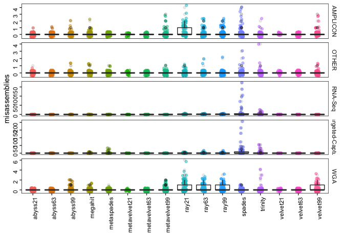<!-- -->

```r
#num of mis asm
xm %>% filter(Assembly == "misassemblies") %>% na.omit() %>%  dim()
```

```
## [1] 4912    8
```

```r
xm %>% filter(Assembly == "misassemblies") %>% na.omit() %>% filter(value == 0) %>% dim()
```

```
## [1] 4291    8
```

```r
#num of dup ratio
xm %>% filter(Assembly == "Duplication ratio") %>% na.omit() %>% dim()
```

```
## [1] 4912    8
```

```r
xm %>% filter(Assembly == "Duplication ratio") %>% na.omit() %>% filter(value == 1) %>% dim()
```

```
## [1] 1247    8
```

```r
# scatter plot
dr = xm %>% filter(Assembly == "Duplication ratio") 
mis = xm %>% filter(Assembly == "misassemblies") 
s3 = inner_join(mis, dr, by = c("variable" = "variable")) %>% 
  select(X1.x, X2.x, value.x, value.y, Assay_Type.y) %>% na.omit()
colnames(s3) = c("SRR", "asm", "mis", "dupliR", "assay")


ggplot(s3, aes(mis, dupliR)) +
  geom_jitter(aes(color = asm), shape = 18, size = 2.5) +
    xlab("Misassemblies") +
    ylab("Duplication ratio") +
    facet_grid(~assay, scales = "free") +
    theme(panel.background = element_rect(fill = "white"),
        panel.border = element_rect(fill = NA, colour = "black", size = .5),
        axis.text = element_text(color = "black", hjust = 1),
        strip.background =element_rect(fill="white"),
        legend.position = "bottom") +
  guides(color = guide_legend(override.aes = list(size = 3)))
```

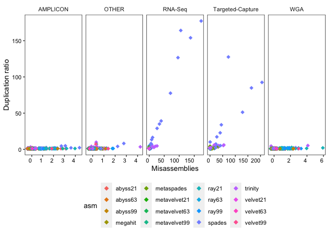<!-- -->

```r
ggsave("Scatter_misasm_dupliR.pdf", width = 24, height = 10, units = "cm")

s3 %>% group_by(asm, assay) %>%
  summarise(count = n())
```

```
## # A tibble: 80 x 3
## # Groups:   asm [16]
##    asm     assay            count
##    <chr>   <chr>            <int>
##  1 abyss21 AMPLICON            78
##  2 abyss21 OTHER               59
##  3 abyss21 RNA-Seq             32
##  4 abyss21 Targeted-Capture    68
##  5 abyss21 WGA                 92
##  6 abyss63 AMPLICON            74
##  7 abyss63 OTHER               58
##  8 abyss63 RNA-Seq             28
##  9 abyss63 Targeted-Capture    78
## 10 abyss63 WGA                 96
## # … with 70 more rows
```

```r
# genomic feature
x4 = xm %>% filter(Assembly == "genomic features") 
x4$value.1 = gsub("part", "", x4$value.1)
x5 = data.frame(str_split_fixed(x4$value.1,"\\+", 2), x4) 
x6 = data.frame(assembly = x5$X2, match = as.numeric(as.character(x5$X1.1)), mismatch = as.numeric(as.character(x5$X2.1))) 

# need to add assay_type
  ggplot(x6, aes(assembly, 100*(match/49))) +
    geom_boxplot(aes(color = assembly)) +
    geom_jitter(alpha = .5, width = .1, aes(color = assembly)) +
    xlab("") +
    ylab("% features mapped") +
    theme(panel.background = element_rect(fill = "white"),
        panel.border = element_rect(fill = NA, colour = "black", size = .5),
        axis.text = element_text(color = "black", angle = 90, hjust = 1)) 
```

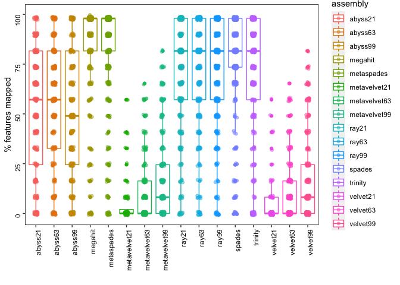<!-- -->

```r
ggsave("percent features mapped.pdf", width = 15, height = 10, units = "cm")


# average qualily across all samples
avg = xm %>% filter(Assembly %in% c("Genome fraction (%)", "Largest alignment", "Duplication ratio", "misassemblies", "N50", "NA50",  "L50", "LA50")) %>%
  group_by(Assembly, X2) %>%
  summarise(mean = mean(value, na.rm = T),
            median = median(value, na.rm = T),
            max = max(value, na.rm = T),
            min = min(value, na.rm = T),
            sd = sd(value, na.rm = T),
            count = n())

print(avg, n = Inf)
```

```
## # A tibble: 128 x 8
## # Groups:   Assembly [8]
##     Assembly        X2              mean  median     max     min        sd count
##     <chr>           <chr>          <dbl>   <dbl>   <dbl>   <dbl>     <dbl> <int>
##   1 Duplication ra… abyss21      1.01e+0  1.00e0  2.08e0   0.997   8.56e-2   410
##   2 Duplication ra… abyss63      1.01e+0  1.00e0  1.99e0   0.998   6.01e-2   410
##   3 Duplication ra… abyss99      1.02e+0  1.01e0  3.00e0   0.995   1.16e-1   381
##   4 Duplication ra… megahit      1.01e+0  1.00e0  1.52e0   0.999   4.13e-2   416
##   5 Duplication ra… metaspades   1.09e+0  1.00e0  4.57e0   0.997   4.08e-1   416
##   6 Duplication ra… metavelve…   1.00e+0  1.00e0  1.01e0   1       1.58e-3   239
##   7 Duplication ra… metavelve…   1.00e+0  1.00e0  1.14e0   0.997   1.04e-2   344
##   8 Duplication ra… metavelve…   1.04e+0  1.00e0  7.21e0   0.997   4.01e-1   377
##   9 Duplication ra… ray21        1.15e+0  1.04e0  4.04e0   0.997   3.15e-1   416
##  10 Duplication ra… ray63        1.10e+0  1.03e0  4.62e0   0.998   2.79e-1   415
##  11 Duplication ra… ray99        1.10e+0  1.03e0  4.62e0   0.998   2.79e-1   415
##  12 Duplication ra… spades       4.57e+0  1.01e0  1.77e2   0.994   1.90e+1   416
##  13 Duplication ra… trinity      1.44e+0  1.10e0  9.81e0   0.999   9.32e-1   416
##  14 Duplication ra… velvet21     1.00e+0  1.00e0  1.01e0   1       1.67e-3   238
##  15 Duplication ra… velvet63     1.00e+0  1.00e0  1.14e0   0.997   1.06e-2   341
##  16 Duplication ra… velvet99     1.04e+0  1.00e0  7.21e0   0.996   4.05e-1   377
##  17 Genome fractio… abyss21      7.89e+1  9.52e1  9.98e1   1.67    3.19e+1   410
##  18 Genome fractio… abyss63      8.07e+1  9.77e1  9.99e1   1.72    3.03e+1   410
##  19 Genome fractio… abyss99      7.36e+1  9.11e1  9.99e1   1.60    3.25e+1   381
##  20 Genome fractio… megahit      9.22e+1  9.97e1  1.00e2   1.21    2.25e+1   416
##  21 Genome fractio… metaspades   9.18e+1  9.97e1  1.00e2   1.44    2.26e+1   416
##  22 Genome fractio… metavelve…   1.79e+1  8.49e0  9.28e1   1.70    2.17e+1   239
##  23 Genome fractio… metavelve…   2.80e+1  1.73e1  9.80e1   1.48    2.77e+1   344
##  24 Genome fractio… metavelve…   3.84e+1  2.70e1  9.99e1   0.254   3.12e+1   377
##  25 Genome fractio… ray21        8.70e+1  9.81e1  1.00e2   1.26    2.39e+1   416
##  26 Genome fractio… ray63        8.83e+1  9.80e1  9.99e1   0.278   2.28e+1   415
##  27 Genome fractio… ray99        8.83e+1  9.80e1  9.99e1   0.278   2.28e+1   415
##  28 Genome fractio… spades       9.24e+1  9.97e1  1.00e2   1.27    2.15e+1   416
##  29 Genome fractio… trinity      8.55e+1  9.95e1  1.00e2   1.06    2.63e+1   416
##  30 Genome fractio… velvet21     1.79e+1  8.49e0  9.28e1   1.71    2.18e+1   238
##  31 Genome fractio… velvet63     2.82e+1  1.73e1  9.86e1   1.48    2.77e+1   341
##  32 Genome fractio… velvet99     3.88e+1  2.63e1  9.99e1   0.254   3.12e+1   377
##  33 L50             abyss21      3.25e+1  2.00e0  1.48e3   1       1.31e+2   410
##  34 L50             abyss63      1.60e+1  3.00e0  7.83e2   1       7.10e+1   410
##  35 L50             abyss99      6.32e+0  3.00e0  1.30e2   1       1.30e+1   381
##  36 L50             megahit      4.72e+1  1.00e0  1.87e3   1       1.70e+2   416
##  37 L50             metaspades   5.41e+1  1.00e0  2.22e3   1       1.91e+2   416
##  38 L50             metavelve…   3.24e+1  4.00e0  9.61e2   1       9.37e+1   239
##  39 L50             metavelve…   2.31e+1  5.00e0  1.02e3   1       9.60e+1   344
##  40 L50             metavelve…   9.37e+0  5.00e0  7.19e2   1       3.90e+1   377
##  41 L50             ray21        2.08e+1  2.00e0  8.67e2   1       8.79e+1   416
##  42 L50             ray63        1.79e+1  2.00e0  8.11e2   1       7.96e+1   415
##  43 L50             ray99        1.79e+1  2.00e0  8.11e2   1       7.96e+1   415
##  44 L50             spades       4.64e+1  2.00e0  1.93e3   1       1.52e+2   416
##  45 L50             trinity      6.01e+1  2.00e0  2.57e3   1       2.20e+2   416
##  46 L50             velvet21     3.26e+1  4.00e0  9.72e2   1       9.43e+1   238
##  47 L50             velvet63     2.33e+1  5.00e0  1.02e3   1       9.64e+1   341
##  48 L50             velvet99     9.38e+0  5.00e0  7.14e2   1       3.87e+1   377
##  49 LA50            abyss21      2.05e+0  1.00e0  1.20e1   1       1.80e+0   410
##  50 LA50            abyss63      2.65e+0  2.00e0  2.40e1   1       2.54e+0   410
##  51 LA50            abyss99      4.12e+0  3.00e0  1.90e1   1       3.17e+0   381
##  52 LA50            megahit      1.33e+0  1.00e0  8.00e0   1       1.00e+0   416
##  53 LA50            metaspades   1.44e+0  1.00e0  2.40e1   1       1.81e+0   416
##  54 LA50            metavelve…   3.59e+0  3.00e0  1.20e1   1       2.77e+0   239
##  55 LA50            metavelve…   4.27e+0  4.00e0  1.70e1   1       2.84e+0   344
##  56 LA50            metavelve…   5.19e+0  5.00e0  2.10e1   1       2.62e+0   377
##  57 LA50            ray21        2.12e+0  1.00e0  1.10e1   1       2.00e+0   416
##  58 LA50            ray63        2.11e+0  1.00e0  1.90e1   1       2.14e+0   415
##  59 LA50            ray99        2.10e+0  1.00e0  1.90e1   1       2.14e+0   415
##  60 LA50            spades       5.64e+0  1.00e0  1.81e2   1       1.97e+1   416
##  61 LA50            trinity      3.02e+0  1.00e0  6.10e1   1       5.66e+0   416
##  62 LA50            velvet21     3.57e+0  3.00e0  1.10e1   1       2.72e+0   238
##  63 LA50            velvet63     4.41e+0  4.00e0  1.50e1   1       2.92e+0   341
##  64 LA50            velvet99     5.27e+0  5.00e0  1.90e1   1       2.58e+0   377
##  65 Largest alignm… abyss21      1.44e+4  1.50e4  2.99e4 500       9.96e+3   410
##  66 Largest alignm… abyss63      1.31e+4  9.99e3  3.00e4 522       1.06e+4   410
##  67 Largest alignm… abyss99      1.05e+4  4.42e3  3.01e4  98       1.11e+4   381
##  68 Largest alignm… megahit      2.35e+4  2.98e4  3.01e4 361       1.00e+4   416
##  69 Largest alignm… metaspades   2.25e+4  2.74e4  2.99e4 433       9.83e+3   416
##  70 Largest alignm… metavelve…   1.01e+3  7.76e2  3.67e3 509       6.91e+2   239
##  71 Largest alignm… metavelve…   1.52e+3  9.70e2  1.21e4 442       1.61e+3   344
##  72 Largest alignm… metavelve…   2.12e+3  1.06e3  2.24e4  76       2.75e+3   377
##  73 Largest alignm… ray21        1.88e+4  2.17e4  3.08e4 340       1.08e+4   416
##  74 Largest alignm… ray63        1.90e+4  2.14e4  3.20e4  83       1.07e+4   415
##  75 Largest alignm… ray99        1.90e+4  2.14e4  3.20e4  83       1.08e+4   415
##  76 Largest alignm… spades       1.97e+4  2.20e4  3.06e4 410       1.03e+4   416
##  77 Largest alignm… trinity      1.75e+4  1.85e4  2.99e4 575       1.07e+4   416
##  78 Largest alignm… velvet21     1.02e+3  7.92e2  3.67e3 509       6.89e+2   238
##  79 Largest alignm… velvet63     1.51e+3  9.82e2  1.21e4 442       1.61e+3   341
##  80 Largest alignm… velvet99     2.13e+3  1.09e3  2.24e4  76       2.75e+3   377
##  81 misassemblies   abyss21      9.12e-3  0.      1.00e0   0       9.52e-2   410
##  82 misassemblies   abyss63      8.98e-3  0.      1.00e0   0       9.45e-2   410
##  83 misassemblies   abyss99      9.66e-2  0.      2.00e0   0       3.45e-1   381
##  84 misassemblies   megahit      1.86e-1  0.      1.00e1   0       9.50e-1   416
##  85 misassemblies   metaspades   3.49e-1  0.      3.30e1   0       2.64e+0   416
##  86 misassemblies   metavelve…   1.00e-2  0.      1.00e0   0       1.00e-1   239
##  87 misassemblies   metavelve…   0.       0.      0.       0       0.        344
##  88 misassemblies   metavelve…   1.55e-1  0.      3.00e0   0       4.73e-1   377
##  89 misassemblies   ray21        6.21e-1  0.      7.00e0   0       1.14e+0   416
##  90 misassemblies   ray63        4.77e-1  0.      1.70e1   0       1.31e+0   415
##  91 misassemblies   ray99        4.69e-1  0.      1.70e1   0       1.28e+0   415
##  92 misassemblies   spades       4.73e+0  0.      2.06e2   0       2.12e+1   416
##  93 misassemblies   trinity      1.13e+0  0.      5.50e1   0       5.24e+0   416
##  94 misassemblies   velvet21     1.00e-2  0.      1.00e0   0       1.00e-1   238
##  95 misassemblies   velvet63     0.       0.      0.       0       0.        341
##  96 misassemblies   velvet99     1.66e-1  0.      3.00e0   0       4.89e-1   377
##  97 N50             abyss21      1.10e+4  5.75e3  2.99e4 503       1.08e+4   410
##  98 N50             abyss63      9.62e+3  3.38e3  3.02e4 510       1.11e+4   410
##  99 N50             abyss99      7.74e+3  1.31e3  3.02e4 501       1.11e+4   381
## 100 N50             megahit      1.68e+4  2.23e4  3.09e4 655       1.34e+4   416
## 101 N50             metaspades   1.65e+4  2.16e4  3.01e4 556       1.30e+4   416
## 102 N50             metavelve…   6.49e+2  6.02e2  1.83e3 500       1.76e+2   239
## 103 N50             metavelve…   7.86e+2  6.82e2  5.64e3 503       4.49e+2   344
## 104 N50             metavelve…   1.25e+3  7.32e2  2.24e4 504       1.96e+3   377
## 105 N50             ray21        1.49e+4  9.29e3  6.04e4 569       1.38e+4   416
## 106 N50             ray63        1.45e+4  8.45e3  5.35e4 580       1.33e+4   415
## 107 N50             ray99        1.45e+4  8.45e3  5.35e4 580       1.33e+4   415
## 108 N50             spades       1.47e+4  1.02e4  5.40e4 625       1.27e+4   416
## 109 N50             trinity      1.31e+4  7.79e3  5.96e4 585       1.25e+4   416
## 110 N50             velvet21     6.55e+2  5.98e2  1.83e3 500       1.87e+2   238
## 111 N50             velvet63     7.92e+2  6.85e2  5.52e3 503       4.51e+2   341
## 112 N50             velvet99     1.24e+3  7.24e2  2.24e4 504       1.94e+3   377
## 113 NA50            abyss21      1.56e+4  1.93e4  2.99e4 518       1.00e+4   410
## 114 NA50            abyss63      1.33e+4  7.47e3  3.00e4 307       1.14e+4   410
## 115 NA50            abyss99      9.87e+3  2.26e3  3.01e4 483       1.19e+4   381
## 116 NA50            megahit      2.49e+4  2.98e4  3.01e4 850       8.83e+3   416
## 117 NA50            metaspades   2.41e+4  2.83e4  2.99e4 581       8.71e+3   416
## 118 NA50            metavelve…   7.51e+2  6.66e2  1.83e3 509       2.90e+2   239
## 119 NA50            metavelve…   8.81e+2  6.87e2  5.64e3 442       6.23e+2   344
## 120 NA50            metavelve…   1.42e+3  7.06e2  2.24e4 157       2.36e+3   377
## 121 NA50            ray21        1.85e+4  2.23e4  3.08e4 569       1.12e+4   416
## 122 NA50            ray63        1.86e+4  2.23e4  3.08e4 687       1.14e+4   415
## 123 NA50            ray99        1.86e+4  2.23e4  3.08e4 687       1.14e+4   415
## 124 NA50            spades       1.92e+4  2.20e4  3.03e4 716       1.04e+4   416
## 125 NA50            trinity      1.82e+4  2.23e4  2.99e4 467       1.12e+4   416
## 126 NA50            velvet21     7.78e+2  6.75e2  1.83e3 509       3.08e+2   238
## 127 NA50            velvet63     8.78e+2  7.03e2  5.52e3 442       6.19e+2   341
## 128 NA50            velvet99     1.39e+3  6.86e2  2.24e4 157       2.35e+3   377
```

```r
# supplementary file 1
med = xm %>% 
  group_by(Assembly, X2) %>%
  summarise(median = median(value, na.rm = T)) %>%
  spread(key = "X2", value = median, fill = NA)

print(med, n = Inf)
```

```
## # A tibble: 41 x 17
## # Groups:   Assembly [41]
##    Assembly abyss21 abyss63 abyss99 megahit metaspades metavelvet21 metavelvet63
##    <chr>      <dbl>   <dbl>   <dbl>   <dbl>      <dbl>        <dbl>        <dbl>
##  1 contigs   6.00e0  9.00e0  1.00e1  1.00e1       9            8            11  
##  2 contigs…  4.15e1  2.80e1  3.90e1  2.10e1      40.5       5662           488. 
##  3 contigs…  3.00e0  4.00e0  3.00e0  4.00e0       4            0             1  
##  4 contigs…  0.      0.      0.      1.00e0       1            0             0  
##  5 contigs…  0.      0.      0.      1.00e0       1            0             0  
##  6 contigs…  1.00e0  1.00e0  0.      1.00e0       1            0             0  
##  7 contigs…  0.      0.      0.      0.           0            0             0  
##  8 Duplica…  1.00e0  1.00e0  1.01e0  1.00e0       1.00         1             1  
##  9 Genome …  9.52e1  9.77e1  9.11e1  9.97e1      99.7          8.49         17.3
## 10 genomic… NA      NA      NA      NA           NA           NA            NA  
## 11 indels …  3.38e0  0.      0.      0.           0            0             0  
## 12 L50       2.00e0  3.00e0  3.00e0  1.00e0       1            4             5  
## 13 L75       3.00e0  5.00e0  6.00e0  2.00e0       2            6             8  
## 14 LA50      1.00e0  2.00e0  3.00e0  1.00e0       1            3             4  
## 15 LA75      2.00e0  3.00e0  6.00e0  1.00e0       1            4.5           6.5
## 16 Largest…  1.50e4  9.99e3  4.42e3  2.98e4   27419          776.          970. 
## 17 Largest…  9.46e3  6.99e3  3.31e3  2.98e4   27419          842          1091  
## 18 local m…  0.      0.      0.      0.           0            0             0  
## 19 misasse…  0.      0.      0.      0.           0            0             0  
## 20 Misasse…  0.      0.      0.      0.           0            0             0  
## 21 misasse…  0.      0.      0.      0.           0            0             0  
## 22 mismatc…  2.49e1  2.46e1  2.54e1  2.68e1      26.8         17.6          22.2
## 23 N's per…  0.      0.      0.      0.           0            0             0  
## 24 N50       5.75e3  3.38e3  1.31e3  2.23e4   21586          602           682  
## 25 N75       3.09e3  1.90e3  8.85e2  4.62e3    4740          550           574. 
## 26 NA50      1.93e4  7.47e3  2.26e3  2.98e4   28289          666           687  
## 27 NA75      1.02e4  4.72e3  1.28e3  2.98e4   27994          576.          579  
## 28 Referen…  2.99e4  2.99e4  2.99e4  2.99e4   29903        29903         29903  
## 29 scaffol…  0.      0.      0.      0.           0            0             0  
## 30 scaffol…  0.      0.      0.      0.           0            0             0  
## 31 Total a…  2.85e4  2.93e4  2.79e4  2.98e4   29829         2538          5183  
## 32 Total l…  2.90e4  2.96e4  2.80e4  3.30e4   32708.        5008          7847  
## 33 Total l…  3.14e4  3.15e4  3.17e4  3.85e4   45378.      576562         84112. 
## 34 Total l…  2.67e4  2.74e4  1.86e4  3.00e4   29940.           0          1094. 
## 35 Total l…  0.      0.      0.      2.98e4   27419            0             0  
## 36 Total l…  0.      0.      0.      2.98e4   27419            0             0  
## 37 Total l…  1.90e4  1.09e4  0.      2.99e4   29431            0             0  
## 38 Total l…  0.      0.      0.      0.           0            0             0  
## 39 unalign… NA      NA      NA      NA           NA           NA            NA  
## 40 Unalign…  0.      0.      0.      5.01e3    4151         2874          1728. 
## 41 unalign…  0.      0.      0.      0.           0            0             0  
## # … with 9 more variables: metavelvet99 <dbl>, ray21 <dbl>, ray63 <dbl>,
## #   ray99 <dbl>, spades <dbl>, trinity <dbl>, velvet21 <dbl>, velvet63 <dbl>,
## #   velvet99 <dbl>
```

```r
write.table(med, "~/Documents/research/asm/covid19-Assembly/Supplementary_files/Median_Assembly_Quality_assemblers.tsv", quote = F, row.names = F, sep = ",")

# k-mer quality across all samples
kmer = c("abyss21", "abyss63", "abyss99", "metavelvet21", "metavelvet63", "metavelvet99", "ray21", "ray63", "ray99", "velvet21", "velvet63", "velvet99")
xmk = xm %>% filter(X2 %in% kmer) 

#global averge
kmer_stats = xmk %>% 
  group_by(Assembly, X2) %>%
  summarise(mean = mean(value, na.rm = T),
            median = median(value, na.rm = T),
            max = max(value, na.rm = T),
            min = min(value, na.rm = T),
            sd = sd(value, na.rm = T),
            count = n())

print(kmer_stats, n = Inf)
```

```
## # A tibble: 492 x 8
## # Groups:   Assembly [41]
##     Assembly      X2            mean  median       max       min        sd count
##     <chr>         <chr>        <dbl>   <dbl>     <dbl>     <dbl>     <dbl> <int>
##   1 contigs       abyss21    9.25e+1  6.00e0    4.04e3     1       3.91e+2   410
##   2 contigs       abyss63    4.74e+1  9.00e0    2.29e3     1       2.14e+2   410
##   3 contigs       abyss99    1.83e+1  1.00e1    4.32e2     1       4.01e+1   381
##   4 contigs       metave…    7.61e+1  8.00e0    2.36e3     1       2.25e+2   239
##   5 contigs       metave…    6.13e+1  1.10e1    2.52e3     1       2.62e+2   344
##   6 contigs       metave…    2.41e+1  1.20e1    1.82e3     1       9.96e+1   377
##   7 contigs       ray21      7.50e+1  9.00e0    2.92e3     1       3.16e+2   416
##   8 contigs       ray63      6.36e+1  9.00e0    2.74e3     1       2.75e+2   415
##   9 contigs       ray99      6.37e+1  9.00e0    2.74e3     1       2.75e+2   415
##  10 contigs       velvet…    7.64e+1  8.00e0    2.39e3     1       2.26e+2   238
##  11 contigs       velvet…    6.19e+1  1.20e1    2.53e3     1       2.63e+2   341
##  12 contigs       velvet…    2.41e+1  1.20e1    1.81e3     1       9.92e+1   377
##  13 contigs (>= … abyss21    1.71e+4  4.15e1    4.14e5     1       4.01e+4   410
##  14 contigs (>= … abyss63    6.54e+3  2.80e1    2.19e5     1       1.93e+4   410
##  15 contigs (>= … abyss99    1.66e+3  3.90e1    1.51e5     1       1.12e+4   381
##  16 contigs (>= … metave…    1.68e+4  5.66e3    1.69e5   108       2.53e+4   239
##  17 contigs (>= … metave…    1.80e+3  4.88e2    7.93e4    19       5.23e+3   344
##  18 contigs (>= … metave…    3.91e+2  7.60e1    5.72e4     2       3.00e+3   377
##  19 contigs (>= … ray21      3.00e+3  1.92e2    5.62e4     1       6.71e+3   416
##  20 contigs (>= … ray63      2.36e+3  1.44e2    5.81e4     1       5.96e+3   415
##  21 contigs (>= … ray99      2.36e+3  1.44e2    5.81e4     1       5.96e+3   415
##  22 contigs (>= … velvet…    1.68e+4  5.77e3    1.69e5   114       2.54e+4   238
##  23 contigs (>= … velvet…    1.80e+3  4.82e2    7.92e4    19       5.25e+3   341
##  24 contigs (>= … velvet…    3.89e+2  7.40e1    5.71e4     2       2.99e+3   377
##  25 contigs (>= … abyss21    2.05e+1  3.00e0    1.44e3     0       1.25e+2   410
##  26 contigs (>= … abyss63    1.04e+1  4.00e0    4.97e2     0       4.15e+1   410
##  27 contigs (>= … abyss99    5.38e+0  3.00e0    1.35e2     0       9.37e+0   381
##  28 contigs (>= … metave…    2.99e+0  0.        1.30e2     0       1.05e+1   239
##  29 contigs (>= … metave…    8.42e+0  1.00e0    4.55e2     0       4.04e+1   344
##  30 contigs (>= … metave…    4.10e+0  1.00e0    1.32e2     0       8.93e+0   377
##  31 contigs (>= … ray21      2.29e+1  5.00e0    1.50e3     0       1.20e+2   416
##  32 contigs (>= … ray63      1.85e+1  5.00e0    1.24e3     0       8.91e+1   415
##  33 contigs (>= … ray99      1.85e+1  5.00e0    1.24e3     0       8.90e+1   415
##  34 contigs (>= … velvet…    2.97e+0  0.        1.34e2     0       1.07e+1   238
##  35 contigs (>= … velvet…    8.53e+0  1.00e0    4.54e2     0       4.06e+1   341
##  36 contigs (>= … velvet…    4.16e+0  1.00e0    1.47e2     0       9.44e+0   377
##  37 contigs (>= … abyss21    5.44e-1  0.        4.00e0     0       6.17e-1   410
##  38 contigs (>= … abyss63    4.46e-1  0.        2.00e0     0       5.67e-1   410
##  39 contigs (>= … abyss99    3.33e-1  0.        2.00e0     0       5.30e-1   381
##  40 contigs (>= … metave…    0.       0.        0.         0       0.        239
##  41 contigs (>= … metave…    8.72e-3  0.        1.00e0     0       9.31e-2   344
##  42 contigs (>= … metave…    1.59e-2  0.        1.00e0     0       1.25e-1   377
##  43 contigs (>= … ray21      7.69e-1  1.00e0    5.00e0     0       6.76e-1   416
##  44 contigs (>= … ray63      7.47e-1  1.00e0    4.00e0     0       6.34e-1   415
##  45 contigs (>= … ray99      7.47e-1  1.00e0    4.00e0     0       6.34e-1   415
##  46 contigs (>= … velvet…    0.       0.        0.         0       0.        238
##  47 contigs (>= … velvet…    8.80e-3  0.        1.00e0     0       9.35e-2   341
##  48 contigs (>= … velvet…    1.59e-2  0.        1.00e0     0       1.25e-1   377
##  49 contigs (>= … abyss21    1.78e-1  0.        1.00e0     0       3.83e-1   410
##  50 contigs (>= … abyss63    2.00e-1  0.        1.00e0     0       4.00e-1   410
##  51 contigs (>= … abyss99    1.78e-1  0.        1.00e0     0       3.83e-1   381
##  52 contigs (>= … metave…    0.       0.        0.         0       0.        239
##  53 contigs (>= … metave…    0.       0.        0.         0       0.        344
##  54 contigs (>= … metave…    0.       0.        0.         0       0.        377
##  55 contigs (>= … ray21      4.38e-1  0.        3.00e0     0       5.30e-1   416
##  56 contigs (>= … ray63      4.19e-1  0.        1.00e0     0       4.94e-1   415
##  57 contigs (>= … ray99      4.19e-1  0.        1.00e0     0       4.94e-1   415
##  58 contigs (>= … velvet…    0.       0.        0.         0       0.        238
##  59 contigs (>= … velvet…    0.       0.        0.         0       0.        341
##  60 contigs (>= … velvet…    0.       0.        0.         0       0.        377
##  61 contigs (>= … abyss21    1.14e+0  1.00e0    7.10e1     0       3.60e+0   410
##  62 contigs (>= … abyss63    9.20e-1  1.00e0    5.00e0     0       9.77e-1   410
##  63 contigs (>= … abyss99    5.85e-1  0.        3.00e0     0       8.22e-1   381
##  64 contigs (>= … metave…    0.       0.        0.         0       0.        239
##  65 contigs (>= … metave…    3.78e-2  0.        2.00e0     0       2.32e-1   344
##  66 contigs (>= … metave…    1.56e-1  0.        3.00e0     0       5.64e-1   377
##  67 contigs (>= … ray21      1.45e+0  1.00e0    4.80e1     0       3.23e+0   416
##  68 contigs (>= … ray63      1.29e+0  1.00e0    2.20e1     0       1.63e+0   415
##  69 contigs (>= … ray99      1.29e+0  1.00e0    2.20e1     0       1.64e+0   415
##  70 contigs (>= … velvet…    0.       0.        0.         0       0.        238
##  71 contigs (>= … velvet…    3.81e-2  0.        2.00e0     0       2.33e-1   341
##  72 contigs (>= … velvet…    1.49e-1  0.        3.00e0     0       5.45e-1   377
##  73 contigs (>= … abyss21    0.       0.        0.         0       0.        410
##  74 contigs (>= … abyss63    0.       0.        0.         0       0.        410
##  75 contigs (>= … abyss99    0.       0.        0.         0       0.        381
##  76 contigs (>= … metave…    0.       0.        0.         0       0.        239
##  77 contigs (>= … metave…    0.       0.        0.         0       0.        344
##  78 contigs (>= … metave…    0.       0.        0.         0       0.        377
##  79 contigs (>= … ray21      9.62e-3  0.        1.00e0     0       9.77e-2   416
##  80 contigs (>= … ray63      9.64e-3  0.        1.00e0     0       9.78e-2   415
##  81 contigs (>= … ray99      9.64e-3  0.        1.00e0     0       9.78e-2   415
##  82 contigs (>= … velvet…    0.       0.        0.         0       0.        238
##  83 contigs (>= … velvet…    0.       0.        0.         0       0.        341
##  84 contigs (>= … velvet…    0.       0.        0.         0       0.        377
##  85 Duplication … abyss21    1.01e+0  1.00e0    2.08e0     0.997   8.56e-2   410
##  86 Duplication … abyss63    1.01e+0  1.00e0    1.99e0     0.998   6.01e-2   410
##  87 Duplication … abyss99    1.02e+0  1.01e0    3.00e0     0.995   1.16e-1   381
##  88 Duplication … metave…    1.00e+0  1.00e0    1.01e0     1       1.58e-3   239
##  89 Duplication … metave…    1.00e+0  1.00e0    1.14e0     0.997   1.04e-2   344
##  90 Duplication … metave…    1.04e+0  1.00e0    7.21e0     0.997   4.01e-1   377
##  91 Duplication … ray21      1.15e+0  1.04e0    4.04e0     0.997   3.15e-1   416
##  92 Duplication … ray63      1.10e+0  1.03e0    4.62e0     0.998   2.79e-1   415
##  93 Duplication … ray99      1.10e+0  1.03e0    4.62e0     0.998   2.79e-1   415
##  94 Duplication … velvet…    1.00e+0  1.00e0    1.01e0     1       1.67e-3   238
##  95 Duplication … velvet…    1.00e+0  1.00e0    1.14e0     0.997   1.06e-2   341
##  96 Duplication … velvet…    1.04e+0  1.00e0    7.21e0     0.996   4.05e-1   377
##  97 Genome fract… abyss21    7.89e+1  9.52e1    9.98e1     1.67    3.19e+1   410
##  98 Genome fract… abyss63    8.07e+1  9.77e1    9.99e1     1.72    3.03e+1   410
##  99 Genome fract… abyss99    7.36e+1  9.11e1    9.99e1     1.60    3.25e+1   381
## 100 Genome fract… metave…    1.79e+1  8.49e0    9.28e1     1.70    2.17e+1   239
## 101 Genome fract… metave…    2.80e+1  1.73e1    9.80e1     1.48    2.77e+1   344
## 102 Genome fract… metave…    3.84e+1  2.70e1    9.99e1     0.254   3.12e+1   377
## 103 Genome fract… ray21      8.70e+1  9.81e1    1.00e2     1.26    2.39e+1   416
## 104 Genome fract… ray63      8.83e+1  9.80e1    9.99e1     0.278   2.28e+1   415
## 105 Genome fract… ray99      8.83e+1  9.80e1    9.99e1     0.278   2.28e+1   415
## 106 Genome fract… velvet…    1.79e+1  8.49e0    9.28e1     1.71    2.18e+1   238
## 107 Genome fract… velvet…    2.82e+1  1.73e1    9.86e1     1.48    2.77e+1   341
## 108 Genome fract… velvet…    3.88e+1  2.63e1    9.99e1     0.254   3.12e+1   377
## 109 genomic feat… abyss21  NaN       NA      -Inf        Inf      NA         410
## 110 genomic feat… abyss63  NaN       NA      -Inf        Inf      NA         410
## 111 genomic feat… abyss99  NaN       NA      -Inf        Inf      NA         381
## 112 genomic feat… metave…  NaN       NA      -Inf        Inf      NA         239
## 113 genomic feat… metave…  NaN       NA      -Inf        Inf      NA         344
## 114 genomic feat… metave…  NaN       NA      -Inf        Inf      NA         377
## 115 genomic feat… ray21    NaN       NA      -Inf        Inf      NA         416
## 116 genomic feat… ray63    NaN       NA      -Inf        Inf      NA         415
## 117 genomic feat… ray99    NaN       NA      -Inf        Inf      NA         415
## 118 genomic feat… velvet…  NaN       NA      -Inf        Inf      NA         238
## 119 genomic feat… velvet…  NaN       NA      -Inf        Inf      NA         341
## 120 genomic feat… velvet…  NaN       NA      -Inf        Inf      NA         377
## 121 indels per 1… abyss21    6.30e+0  3.38e0    3.51e2     0       2.58e+1   410
## 122 indels per 1… abyss63    5.40e+0  0.        1.95e2     0       1.92e+1   410
## 123 indels per 1… abyss99    3.80e+0  0.        1.56e2     0       1.39e+1   381
## 124 indels per 1… metave…    4.83e+0  0.        8.59e1     0       1.60e+1   239
## 125 indels per 1… metave…    4.69e+0  0.        1.38e2     0       1.45e+1   344
## 126 indels per 1… metave…    1.21e+1  0.        3.69e2     0       3.51e+1   377
## 127 indels per 1… ray21      6.20e+0  0.        5.12e2     0       2.79e+1   416
## 128 indels per 1… ray63      5.31e+0  0.        8.90e1     0       1.09e+1   415
## 129 indels per 1… ray99      5.31e+0  0.        8.60e1     0       1.09e+1   415
## 130 indels per 1… velvet…    7.58e+0  0.        2.55e2     0       2.95e+1   238
## 131 indels per 1… velvet…    4.79e+0  0.        1.80e2     0       1.78e+1   341
## 132 indels per 1… velvet…    1.19e+1  0.        3.69e2     0       3.37e+1   377
## 133 L50           abyss21    3.25e+1  2.00e0    1.48e3     1       1.31e+2   410
## 134 L50           abyss63    1.60e+1  3.00e0    7.83e2     1       7.10e+1   410
## 135 L50           abyss99    6.32e+0  3.00e0    1.30e2     1       1.30e+1   381
## 136 L50           metave…    3.24e+1  4.00e0    9.61e2     1       9.37e+1   239
## 137 L50           metave…    2.31e+1  5.00e0    1.02e3     1       9.60e+1   344
## 138 L50           metave…    9.37e+0  5.00e0    7.19e2     1       3.90e+1   377
## 139 L50           ray21      2.08e+1  2.00e0    8.67e2     1       8.79e+1   416
## 140 L50           ray63      1.79e+1  2.00e0    8.11e2     1       7.96e+1   415
## 141 L50           ray99      1.79e+1  2.00e0    8.11e2     1       7.96e+1   415
## 142 L50           velvet…    3.26e+1  4.00e0    9.72e2     1       9.43e+1   238
## 143 L50           velvet…    2.33e+1  5.00e0    1.02e3     1       9.64e+1   341
## 144 L50           velvet…    9.38e+0  5.00e0    7.14e2     1       3.87e+1   377
## 145 L75           abyss21    5.79e+1  3.00e0    2.63e3     1       2.40e+2   410
## 146 L75           abyss63    2.96e+1  5.00e0    1.44e3     1       1.34e+2   410
## 147 L75           abyss99    1.14e+1  6.00e0    2.54e2     1       2.48e+1   381
## 148 L75           metave…    5.34e+1  6.00e0    1.63e3     1       1.56e+2   239
## 149 L75           metave…    4.06e+1  8.00e0    1.73e3     1       1.71e+2   344
## 150 L75           metave…    1.61e+1  8.00e0    1.24e3     1       6.73e+1   377
## 151 L75           ray21      4.23e+1  3.00e0    1.71e3     1       1.78e+2   416
## 152 L75           ray63      3.62e+1  3.00e0    1.56e3     1       1.59e+2   415
## 153 L75           ray99      3.62e+1  3.00e0    1.56e3     1       1.59e+2   415
## 154 L75           velvet…    5.36e+1  6.00e0    1.65e3     1       1.57e+2   238
## 155 L75           velvet…    4.10e+1  8.00e0    1.74e3     1       1.72e+2   341
## 156 L75           velvet…    1.61e+1  8.00e0    1.23e3     1       6.70e+1   377
## 157 LA50          abyss21    2.05e+0  1.00e0    1.20e1     1       1.80e+0   410
## 158 LA50          abyss63    2.65e+0  2.00e0    2.40e1     1       2.54e+0   410
## 159 LA50          abyss99    4.12e+0  3.00e0    1.90e1     1       3.17e+0   381
## 160 LA50          metave…    3.59e+0  3.00e0    1.20e1     1       2.77e+0   239
## 161 LA50          metave…    4.27e+0  4.00e0    1.70e1     1       2.84e+0   344
## 162 LA50          metave…    5.19e+0  5.00e0    2.10e1     1       2.62e+0   377
## 163 LA50          ray21      2.12e+0  1.00e0    1.10e1     1       2.00e+0   416
## 164 LA50          ray63      2.11e+0  1.00e0    1.90e1     1       2.14e+0   415
## 165 LA50          ray99      2.10e+0  1.00e0    1.90e1     1       2.14e+0   415
## 166 LA50          velvet…    3.57e+0  3.00e0    1.10e1     1       2.72e+0   238
## 167 LA50          velvet…    4.41e+0  4.00e0    1.50e1     1       2.92e+0   341
## 168 LA50          velvet…    5.27e+0  5.00e0    1.90e1     1       2.58e+0   377
## 169 LA75          abyss21    3.12e+0  2.00e0    2.10e1     1       3.21e+0   410
## 170 LA75          abyss63    3.98e+0  3.00e0    1.50e1     1       3.34e+0   410
## 171 LA75          abyss99    7.07e+0  6.00e0    2.00e1     1       5.69e+0   381
## 172 LA75          metave…    5.71e+0  4.50e0    1.90e1     1       4.59e+0   239
## 173 LA75          metave…    6.43e+0  6.50e0    1.80e1     1       4.18e+0   344
## 174 LA75          metave…    8.31e+0  8.00e0    2.00e1     1       4.13e+0   377
## 175 LA75          ray21      3.27e+0  2.00e0    1.80e1     1       3.65e+0   416
## 176 LA75          ray63      3.14e+0  2.00e0    2.10e1     1       3.49e+0   415
## 177 LA75          ray99      3.15e+0  2.00e0    2.20e1     1       3.51e+0   415
## 178 LA75          velvet…    5.69e+0  4.00e0    1.90e1     1       4.62e+0   238
## 179 LA75          velvet…    6.46e+0  6.00e0    1.80e1     1       4.21e+0   341
## 180 LA75          velvet…    8.43e+0  8.00e0    2.00e1     1       4.12e+0   377
## 181 Largest alig… abyss21    1.44e+4  1.50e4    2.99e4   500       9.96e+3   410
## 182 Largest alig… abyss63    1.31e+4  9.99e3    3.00e4   522       1.06e+4   410
## 183 Largest alig… abyss99    1.05e+4  4.42e3    3.01e4    98       1.11e+4   381
## 184 Largest alig… metave…    1.01e+3  7.76e2    3.67e3   509       6.91e+2   239
## 185 Largest alig… metave…    1.52e+3  9.70e2    1.21e4   442       1.61e+3   344
## 186 Largest alig… metave…    2.12e+3  1.06e3    2.24e4    76       2.75e+3   377
## 187 Largest alig… ray21      1.88e+4  2.17e4    3.08e4   340       1.08e+4   416
## 188 Largest alig… ray63      1.90e+4  2.14e4    3.20e4    83       1.07e+4   415
## 189 Largest alig… ray99      1.90e+4  2.14e4    3.20e4    83       1.08e+4   415
## 190 Largest alig… velvet…    1.02e+3  7.92e2    3.67e3   509       6.89e+2   238
## 191 Largest alig… velvet…    1.51e+3  9.82e2    1.21e4   442       1.61e+3   341
## 192 Largest alig… velvet…    2.13e+3  1.09e3    2.24e4    76       2.75e+3   377
## 193 Largest cont… abyss21    1.20e+4  9.46e3    2.99e4   503       1.02e+4   410
## 194 Largest cont… abyss63    1.12e+4  6.99e3    3.02e4   510       1.05e+4   410
## 195 Largest cont… abyss99    9.20e+3  3.31e3    3.02e4   501       1.07e+4   381
## 196 Largest cont… metave…    1.01e+3  8.42e2    3.67e3   500       5.53e+2   239
## 197 Largest cont… metave…    1.52e+3  1.09e3    1.21e4   503       1.41e+3   344
## 198 Largest cont… metave…    2.07e+3  1.28e3    2.24e4   510       2.46e+3   377
## 199 Largest cont… ray21      1.90e+4  2.05e4    6.04e4   623       1.29e+4   416
## 200 Largest cont… ray63      1.83e+4  1.92e4    5.59e4   724       1.22e+4   415
## 201 Largest cont… ray99      1.83e+4  1.92e4    5.59e4   724       1.22e+4   415
## 202 Largest cont… velvet…    1.01e+3  8.38e2    3.67e3   500       5.47e+2   238
## 203 Largest cont… velvet…    1.52e+3  1.10e3    1.21e4   503       1.41e+3   341
## 204 Largest cont… velvet…    2.09e+3  1.26e3    2.24e4   507       2.46e+3   377
## 205 local misass… abyss21    4.56e-2  0.        2.00e0     0       2.23e-1   410
## 206 local misass… abyss63    2.99e-2  0.        2.00e0     0       1.87e-1   410
## 207 local misass… abyss99    1.06e-1  0.        3.00e0     0       3.64e-1   381
## 208 local misass… metave…    0.       0.        0.         0       0.        239
## 209 local misass… metave…    0.       0.        0.         0       0.        344
## 210 local misass… metave…    1.18e-1  0.        3.00e0     0       3.80e-1   377
## 211 local misass… ray21      1.55e-1  0.        5.00e0     0       5.50e-1   416
## 212 local misass… ray63      1.81e-1  0.        7.00e0     0       7.29e-1   415
## 213 local misass… ray99      1.78e-1  0.        7.00e0     0       7.17e-1   415
## 214 local misass… velvet…    0.       0.        0.         0       0.        238
## 215 local misass… velvet…    0.       0.        0.         0       0.        341
## 216 local misass… velvet…    1.16e-1  0.        3.00e0     0       3.87e-1   377
## 217 misassembled… abyss21    9.12e-3  0.        1.00e0     0       9.52e-2   410
## 218 misassembled… abyss63    8.98e-3  0.        1.00e0     0       9.45e-2   410
## 219 misassembled… abyss99    9.35e-2  0.        2.00e0     0       3.32e-1   381
## 220 misassembled… metave…    1.00e-2  0.        1.00e0     0       1.00e-1   239
## 221 misassembled… metave…    0.       0.        0.         0       0.        344
## 222 misassembled… metave…    1.41e-1  0.        2.00e0     0       4.18e-1   377
## 223 misassembled… ray21      5.23e-1  0.        6.00e0     0       9.19e-1   416
## 224 misassembled… ray63      4.07e-1  0.        1.00e1     0       9.83e-1   415
## 225 misassembled… ray99      3.99e-1  0.        1.00e1     0       9.46e-1   415
## 226 misassembled… velvet…    1.00e-2  0.        1.00e0     0       1.00e-1   238
## 227 misassembled… velvet…    0.       0.        0.         0       0.        341
## 228 misassembled… velvet…    1.53e-1  0.        3.00e0     0       4.36e-1   377
## 229 Misassembled… abyss21    4.38e+1  0.        1.31e4     0       7.26e+2   410
## 230 Misassembled… abyss63    7.41e+1  0.        1.65e4     0       9.96e+2   410
## 231 Misassembled… abyss99    2.38e+2  0.        2.78e4     0       1.83e+3   381
## 232 Misassembled… metave…    6.34e+0  0.        6.34e2     0       6.34e+1   239
## 233 Misassembled… metave…    0.       0.        0.         0       0.        344
## 234 Misassembled… metave…    9.57e+1  0.        1.61e3     0       2.88e+2   377
## 235 Misassembled… ray21      8.06e+3  0.        7.89e4     0       1.56e+4   416
## 236 Misassembled… ray63      5.77e+3  0.        8.64e4     0       1.34e+4   415
## 237 Misassembled… ray99      5.76e+3  0.        8.64e4     0       1.34e+4   415
## 238 Misassembled… velvet…    6.34e+0  0.        6.34e2     0       6.34e+1   238
## 239 Misassembled… velvet…    0.       0.        0.         0       0.        341
## 240 Misassembled… velvet…    1.04e+2  0.        2.02e3     0       3.04e+2   377
## 241 misassemblies abyss21    9.12e-3  0.        1.00e0     0       9.52e-2   410
## 242 misassemblies abyss63    8.98e-3  0.        1.00e0     0       9.45e-2   410
## 243 misassemblies abyss99    9.66e-2  0.        2.00e0     0       3.45e-1   381
## 244 misassemblies metave…    1.00e-2  0.        1.00e0     0       1.00e-1   239
## 245 misassemblies metave…    0.       0.        0.         0       0.        344
## 246 misassemblies metave…    1.55e-1  0.        3.00e0     0       4.73e-1   377
## 247 misassemblies ray21      6.21e-1  0.        7.00e0     0       1.14e+0   416
## 248 misassemblies ray63      4.77e-1  0.        1.70e1     0       1.31e+0   415
## 249 misassemblies ray99      4.69e-1  0.        1.70e1     0       1.28e+0   415
## 250 misassemblies velvet…    1.00e-2  0.        1.00e0     0       1.00e-1   238
## 251 misassemblies velvet…    0.       0.        0.         0       0.        341
## 252 misassemblies velvet…    1.66e-1  0.        3.00e0     0       4.89e-1   377
## 253 mismatches p… abyss21    2.72e+1  2.49e1    2.95e2     0       2.48e+1   410
## 254 mismatches p… abyss63    2.68e+1  2.46e1    1.95e2     0       1.90e+1   410
## 255 mismatches p… abyss99    2.68e+1  2.54e1    2.07e2     0       2.18e+1   381
## 256 mismatches p… metave…    4.54e+1  1.76e1    5.18e2     0       7.95e+1   239
## 257 mismatches p… metave…    3.32e+1  2.22e1    5.09e2     0       5.20e+1   344
## 258 mismatches p… metave…    4.33e+1  2.89e1    5.63e2     0       6.21e+1   377
## 259 mismatches p… ray21      3.83e+1  3.35e1    5.12e2     0       3.21e+1   416
## 260 mismatches p… ray63      3.61e+1  3.30e1    5.28e2     0       3.34e+1   415
## 261 mismatches p… ray99      3.61e+1  3.30e1    5.28e2     0       3.34e+1   415
## 262 mismatches p… velvet…    4.45e+1  1.90e1    5.18e2     0       7.77e+1   238
## 263 mismatches p… velvet…    3.36e+1  2.23e1    5.09e2     0       5.21e+1   341
## 264 mismatches p… velvet…    4.26e+1  2.69e1    5.63e2     0       6.19e+1   377
## 265 N's per 100 … abyss21    8.36e+2  0.        4.08e4     0       3.67e+3   410
## 266 N's per 100 … abyss63    5.59e+2  0.        5.10e4     0       3.45e+3   410
## 267 N's per 100 … abyss99    3.30e+2  0.        3.93e4     0       2.32e+3   381
## 268 N's per 100 … metave…    0.       0.        0.         0       0.        239
## 269 N's per 100 … metave…    0.       0.        0.         0       0.        344
## 270 N's per 100 … metave…    0.       0.        0.         0       0.        377
## 271 N's per 100 … ray21      2.83e+2  0.        7.79e3     0       7.32e+2   416
## 272 N's per 100 … ray63      2.80e+2  0.        6.73e3     0       7.34e+2   415
## 273 N's per 100 … ray99      2.81e+2  0.        6.73e3     0       7.36e+2   415
## 274 N's per 100 … velvet…    0.       0.        0.         0       0.        238
## 275 N's per 100 … velvet…    0.       0.        0.         0       0.        341
## 276 N's per 100 … velvet…    0.       0.        0.         0       0.        377
## 277 N50           abyss21    1.10e+4  5.75e3    2.99e4   503       1.08e+4   410
## 278 N50           abyss63    9.62e+3  3.38e3    3.02e4   510       1.11e+4   410
## 279 N50           abyss99    7.74e+3  1.31e3    3.02e4   501       1.11e+4   381
## 280 N50           metave…    6.49e+2  6.02e2    1.83e3   500       1.76e+2   239
## 281 N50           metave…    7.86e+2  6.82e2    5.64e3   503       4.49e+2   344
## 282 N50           metave…    1.25e+3  7.32e2    2.24e4   504       1.96e+3   377
## 283 N50           ray21      1.49e+4  9.29e3    6.04e4   569       1.38e+4   416
## 284 N50           ray63      1.45e+4  8.45e3    5.35e4   580       1.33e+4   415
## 285 N50           ray99      1.45e+4  8.45e3    5.35e4   580       1.33e+4   415
## 286 N50           velvet…    6.55e+2  5.98e2    1.83e3   500       1.87e+2   238
## 287 N50           velvet…    7.92e+2  6.85e2    5.52e3   503       4.51e+2   341
## 288 N50           velvet…    1.24e+3  7.24e2    2.24e4   504       1.94e+3   377
## 289 N75           abyss21    9.33e+3  3.09e3    2.99e4   500       1.07e+4   410
## 290 N75           abyss63    7.89e+3  1.90e3    3.02e4   504       1.10e+4   410
## 291 N75           abyss99    6.75e+3  8.85e2    3.02e4   501       1.09e+4   381
## 292 N75           metave…    5.75e+2  5.50e2    1.06e3   500       8.96e+1   239
## 293 N75           metave…    6.34e+2  5.74e2    3.79e3   500       2.62e+2   344
## 294 N75           metave…    9.30e+2  5.99e2    2.24e4   502       1.71e+3   377
## 295 N75           ray21      1.13e+4  3.30e3    6.04e4   534       1.33e+4   416
## 296 N75           ray63      1.15e+4  2.84e3    5.35e4   513       1.32e+4   415
## 297 N75           ray99      1.15e+4  2.84e3    5.35e4   513       1.32e+4   415
## 298 N75           velvet…    5.76e+2  5.49e2    1.06e3   500       8.92e+1   238
## 299 N75           velvet…    6.38e+2  5.74e2    3.79e3   503       2.88e+2   341
## 300 N75           velvet…    9.33e+2  5.98e2    2.24e4   502       1.71e+3   377
## 301 NA50          abyss21    1.56e+4  1.93e4    2.99e4   518       1.00e+4   410
## 302 NA50          abyss63    1.33e+4  7.47e3    3.00e4   307       1.14e+4   410
## 303 NA50          abyss99    9.87e+3  2.26e3    3.01e4   483       1.19e+4   381
## 304 NA50          metave…    7.51e+2  6.66e2    1.83e3   509       2.90e+2   239
## 305 NA50          metave…    8.81e+2  6.87e2    5.64e3   442       6.23e+2   344
## 306 NA50          metave…    1.42e+3  7.06e2    2.24e4   157       2.36e+3   377
## 307 NA50          ray21      1.85e+4  2.23e4    3.08e4   569       1.12e+4   416
## 308 NA50          ray63      1.86e+4  2.23e4    3.08e4   687       1.14e+4   415
## 309 NA50          ray99      1.86e+4  2.23e4    3.08e4   687       1.14e+4   415
## 310 NA50          velvet…    7.78e+2  6.75e2    1.83e3   509       3.08e+2   238
## 311 NA50          velvet…    8.78e+2  7.03e2    5.52e3   442       6.19e+2   341
## 312 NA50          velvet…    1.39e+3  6.86e2    2.24e4   157       2.35e+3   377
## 313 NA75          abyss21    1.35e+4  1.02e4    2.99e4   532       1.08e+4   410
## 314 NA75          abyss63    1.14e+4  4.72e3    3.00e4   514       1.19e+4   410
## 315 NA75          abyss99    8.80e+3  1.28e3    3.01e4   398       1.19e+4   381
## 316 NA75          metave…    6.22e+2  5.76e2    1.06e3   505       1.31e+2   239
## 317 NA75          metave…    6.84e+2  5.79e2    3.79e3   442       3.80e+2   344
## 318 NA75          metave…    1.05e+3  5.92e2    2.24e4    96       2.16e+3   377
## 319 NA75          ray21      1.53e+4  1.04e4    3.08e4   529       1.22e+4   416
## 320 NA75          ray63      1.64e+4  1.36e4    3.08e4   245       1.24e+4   415
## 321 NA75          ray99      1.64e+4  1.36e4    3.08e4   245       1.24e+4   415
## 322 NA75          velvet…    6.27e+2  5.76e2    1.06e3   505       1.31e+2   238
## 323 NA75          velvet…    6.94e+2  5.82e2    3.79e3   442       4.22e+2   341
## 324 NA75          velvet…    1.05e+3  5.98e2    2.24e4    96       2.17e+3   377
## 325 Reference le… abyss21    2.99e+4  2.99e4    2.99e4 29903       0.        410
## 326 Reference le… abyss63    2.99e+4  2.99e4    2.99e4 29903       0.        410
## 327 Reference le… abyss99    2.99e+4  2.99e4    2.99e4 29903       0.        381
## 328 Reference le… metave…    2.99e+4  2.99e4    2.99e4 29903       0.        239
## 329 Reference le… metave…    2.99e+4  2.99e4    2.99e4 29903       0.        344
## 330 Reference le… metave…    2.99e+4  2.99e4    2.99e4 29903       0.        377
## 331 Reference le… ray21      2.99e+4  2.99e4    2.99e4 29903       0.        416
## 332 Reference le… ray63      2.99e+4  2.99e4    2.99e4 29903       0.        415
## 333 Reference le… ray99      2.99e+4  2.99e4    2.99e4 29903       0.        415
## 334 Reference le… velvet…    2.99e+4  2.99e4    2.99e4 29903       0.        238
## 335 Reference le… velvet…    2.99e+4  2.99e4    2.99e4 29903       0.        341
## 336 Reference le… velvet…    2.99e+4  2.99e4    2.99e4 29903       0.        377
## 337 scaffold gap… abyss21    3.04e-3  0.        1.00e0     0       5.51e-2   410
## 338 scaffold gap… abyss63    2.99e-3  0.        1.00e0     0       5.47e-2   410
## 339 scaffold gap… abyss99    3.12e-3  0.        1.00e0     0       5.58e-2   381
## 340 scaffold gap… metave…    0.       0.        0.         0       0.        239
## 341 scaffold gap… metave…    0.       0.        0.         0       0.        344
## 342 scaffold gap… metave…    0.       0.        0.         0       0.        377
## 343 scaffold gap… ray21      8.00e-3  0.        1.00e0     0       8.92e-2   416
## 344 scaffold gap… ray63      0.       0.        0.         0       0.        415
## 345 scaffold gap… ray99      0.       0.        0.         0       0.        415
## 346 scaffold gap… velvet…    0.       0.        0.         0       0.        238
## 347 scaffold gap… velvet…    0.       0.        0.         0       0.        341
## 348 scaffold gap… velvet…    0.       0.        0.         0       0.        377
## 349 scaffold gap… abyss21    1.22e-1  0.        7.00e0     0       5.39e-1   410
## 350 scaffold gap… abyss63    2.57e-1  0.        2.40e1     0       1.44e+0   410
## 351 scaffold gap… abyss99    2.71e-1  0.        1.60e1     0       1.18e+0   381
## 352 scaffold gap… metave…    0.       0.        0.         0       0.        239
## 353 scaffold gap… metave…    0.       0.        0.         0       0.        344
## 354 scaffold gap… metave…    0.       0.        0.         0       0.        377
## 355 scaffold gap… ray21      4.77e-1  0.        1.40e1     0       1.67e+0   416
## 356 scaffold gap… ray63      4.64e-1  0.        1.60e1     0       1.73e+0   415
## 357 scaffold gap… ray99      4.66e-1  0.        1.70e1     0       1.75e+0   415
## 358 scaffold gap… velvet…    0.       0.        0.         0       0.        238
## 359 scaffold gap… velvet…    0.       0.        0.         0       0.        341
## 360 scaffold gap… velvet…    0.       0.        0.         0       0.        377
## 361 Total aligne… abyss21    2.37e+4  2.85e4    3.41e4   500       9.59e+3   410
## 362 Total aligne… abyss63    2.43e+4  2.93e4    3.02e4   522       9.12e+3   410
## 363 Total aligne… abyss99    2.23e+4  2.79e4    3.10e4   479       9.84e+3   381
## 364 Total aligne… metave…    5.36e+3  2.54e3    2.78e4   509       6.51e+3   239
## 365 Total aligne… metave…    8.41e+3  5.18e3    2.95e4   442       8.34e+3   344
## 366 Total aligne… metave…    1.16e+4  8.10e3    3.02e4    76       9.42e+3   377
## 367 Total aligne… ray21      2.93e+4  2.99e4    1.05e5   526       1.11e+4   416
## 368 Total aligne… ray63      2.86e+4  2.98e4    8.64e4    83       9.38e+3   415
## 369 Total aligne… ray99      2.86e+4  2.98e4    8.64e4    83       9.38e+3   415
## 370 Total aligne… velvet…    5.37e+3  2.54e3    2.78e4   511       6.52e+3   238
## 371 Total aligne… velvet…    8.49e+3  5.22e3    2.98e4   442       8.35e+3   341
## 372 Total aligne… velvet…    1.17e+4  7.92e3    3.02e4    76       9.42e+3   377
## 373 Total length  abyss21    9.43e+4  2.90e4    3.90e6   503       3.82e+5   410
## 374 Total length  abyss63    5.31e+4  2.96e4    2.05e6   510       1.78e+5   410
## 375 Total length  abyss99    2.65e+4  2.80e4    4.27e5   501       3.39e+4   381
## 376 Total length  metave…    4.86e+4  5.01e3    1.53e6   500       1.43e+5   239
## 377 Total length  metave…    4.65e+4  7.85e3    1.89e6   503       1.99e+5   344
## 378 Total length  metave…    2.02e+4  9.24e3    1.22e6   510       6.79e+4   377
## 379 Total length  ray21      9.63e+4  3.22e4    4.01e6   623       3.57e+5   416
## 380 Total length  ray63      8.14e+4  3.12e4    3.40e6   724       2.81e+5   415
## 381 Total length  ray99      8.14e+4  3.12e4    3.40e6   724       2.81e+5   415
## 382 Total length  velvet…    4.88e+4  4.83e3    1.54e6   503       1.44e+5   238
## 383 Total length  velvet…    4.69e+4  8.27e3    1.89e6   503       2.00e+5   341
## 384 Total length  velvet…    2.02e+4  9.40e3    1.22e6   507       6.79e+4   377
## 385 Total length… abyss21    9.84e+5  3.14e4    1.98e7  4905       2.21e+6   410
## 386 Total length… abyss63    7.45e+5  3.15e4    2.23e7  5130       2.08e+6   410
## 387 Total length… abyss99    2.67e+5  3.17e4    2.48e7  3148       1.68e+6   381
## 388 Total length… metave…    1.94e+6  5.77e5    2.22e7 22400       3.06e+6   239
## 389 Total length… metave…    4.27e+5  8.41e4    2.14e7  9043       1.37e+6   344
## 390 Total length… metave…    1.22e+5  3.21e4    1.75e7  1655       9.15e+5   377
## 391 Total length… ray21      5.61e+5  6.13e4    9.71e6  9933       1.23e+6   416
## 392 Total length… ray63      4.80e+5  5.44e4    1.00e7  9385       1.13e+6   415
## 393 Total length… ray99      4.80e+5  5.44e4    1.00e7  9385       1.13e+6   415
## 394 Total length… velvet…    1.94e+6  5.87e5    2.22e7 21781       3.07e+6   238
## 395 Total length… velvet…    4.30e+5  8.06e4    2.14e7  9043       1.38e+6   341
## 396 Total length… velvet…    1.22e+5  3.22e4    1.75e7  1657       9.14e+5   377
## 397 Total length… abyss21    4.63e+4  2.67e4    3.21e6     0       2.26e+5   410
## 398 Total length… abyss63    2.85e+4  2.74e4    8.39e5     0       6.35e+4   410
## 399 Total length… abyss99    1.77e+4  1.86e4    2.20e5     0       1.75e+4   381
## 400 Total length… metave…    3.80e+3  0.        1.58e5     0       1.30e+4   239
## 401 Total length… metave…    1.21e+4  1.09e3    6.53e5     0       5.67e+4   344
## 402 Total length… metave…    7.30e+3  2.16e3    1.66e5     0       1.36e+4   377
## 403 Total length… ray21      6.12e+4  3.05e4    3.19e6     0       2.32e+5   416
## 404 Total length… ray63      5.10e+4  2.99e4    2.35e6     0       1.59e+5   415
## 405 Total length… ray99      5.10e+4  2.99e4    2.35e6     0       1.59e+5   415
## 406 Total length… velvet…    3.77e+3  0.        1.63e5     0       1.31e+4   238
## 407 Total length… velvet…    1.22e+4  1.10e3    6.53e5     0       5.69e+4   341
## 408 Total length… velvet…    7.40e+3  2.11e3    1.81e5     0       1.41e+4   377
## 409 Total length… abyss21    1.11e+4  0.        4.18e4     0       1.20e+4   410
## 410 Total length… abyss63    9.51e+3  0.        3.30e4     0       1.22e+4   410
## 411 Total length… abyss99    7.63e+3  0.        3.02e4     0       1.22e+4   381
## 412 Total length… metave…    0.       0.        0.         0       0.        239
## 413 Total length… metave…    9.88e+1  0.        1.21e4     0       1.06e+3   344
## 414 Total length… metave…    2.48e+2  0.        2.24e4     0       2.05e+3   377
## 415 Total length… ray21      1.92e+4  2.33e4    1.05e5     0       1.70e+4   416
## 416 Total length… ray63      1.82e+4  2.23e4    8.64e4     0       1.52e+4   415
## 417 Total length… ray99      1.82e+4  2.23e4    8.64e4     0       1.52e+4   415
## 418 Total length… velvet…    0.       0.        0.         0       0.        238
## 419 Total length… velvet…    9.96e+1  0.        1.21e4     0       1.06e+3   341
## 420 Total length… velvet…    2.48e+2  0.        2.24e4     0       2.05e+3   377
## 421 Total length… abyss21    4.78e+3  0.        2.99e4     0       1.03e+4   410
## 422 Total length… abyss63    5.72e+3  0.        3.02e4     0       1.15e+4   410
## 423 Total length… abyss99    5.28e+3  0.        3.02e4     0       1.13e+4   381
## 424 Total length… metave…    0.       0.        0.         0       0.        239
## 425 Total length… metave…    0.       0.        0.         0       0.        344
## 426 Total length… metave…    0.       0.        0.         0       0.        377
## 427 Total length… ray21      1.38e+4  0.        1.05e5     0       1.74e+4   416
## 428 Total length… ray63      1.29e+4  0.        5.59e4     0       1.55e+4   415
## 429 Total length… ray99      1.29e+4  0.        5.59e4     0       1.55e+4   415
## 430 Total length… velvet…    0.       0.        0.         0       0.        238
## 431 Total length… velvet…    0.       0.        0.         0       0.        341
## 432 Total length… velvet…    0.       0.        0.         0       0.        377
## 433 Total length… abyss21    1.51e+4  1.90e4    4.50e5     0       2.49e+4   410
## 434 Total length… abyss63    1.26e+4  1.09e4    4.63e4     0       1.25e+4   410
## 435 Total length… abyss99    9.32e+3  0.        3.11e4     0       1.26e+4   381
## 436 Total length… metave…    0.       0.        0.         0       0.        239
## 437 Total length… metave…    2.74e+2  0.        1.67e4     0       1.71e+3   344
## 438 Total length… metave…    1.18e+3  0.        2.91e4     0       4.41e+3   377
## 439 Total length… ray21      2.38e+4  2.84e4    3.54e5     0       2.75e+4   416
## 440 Total length… ray63      2.18e+4  2.83e4    1.77e5     0       1.73e+4   415
## 441 Total length… ray99      2.18e+4  2.83e4    1.77e5     0       1.73e+4   415
## 442 Total length… velvet…    0.       0.        0.         0       0.        238
## 443 Total length… velvet…    2.76e+2  0.        1.66e4     0       1.71e+3   341
## 444 Total length… velvet…    1.13e+3  0.        2.91e4     0       4.30e+3   377
## 445 Total length… abyss21    0.       0.        0.         0       0.        410
## 446 Total length… abyss63    0.       0.        0.         0       0.        410
## 447 Total length… abyss99    0.       0.        0.         0       0.        381
## 448 Total length… metave…    0.       0.        0.         0       0.        239
## 449 Total length… metave…    0.       0.        0.         0       0.        344
## 450 Total length… metave…    0.       0.        0.         0       0.        377
## 451 Total length… ray21      5.54e+2  0.        6.04e4     0       5.64e+3   416
## 452 Total length… ray63      5.21e+2  0.        5.59e4     0       5.29e+3   415
## 453 Total length… ray99      5.21e+2  0.        5.59e4     0       5.29e+3   415
## 454 Total length… velvet…    0.       0.        0.         0       0.        238
## 455 Total length… velvet…    0.       0.        0.         0       0.        341
## 456 Total length… velvet…    0.       0.        0.         0       0.        377
## 457 unaligned co… abyss21  NaN       NA      -Inf        Inf      NA         410
## 458 unaligned co… abyss63  NaN       NA      -Inf        Inf      NA         410
## 459 unaligned co… abyss99  NaN       NA      -Inf        Inf      NA         381
## 460 unaligned co… metave…  NaN       NA      -Inf        Inf      NA         239
## 461 unaligned co… metave…  NaN       NA      -Inf        Inf      NA         344
## 462 unaligned co… metave…  NaN       NA      -Inf        Inf      NA         377
## 463 unaligned co… ray21    NaN       NA      -Inf        Inf      NA         416
## 464 unaligned co… ray63    NaN       NA      -Inf        Inf      NA         415
## 465 unaligned co… ray99    NaN       NA      -Inf        Inf      NA         415
## 466 unaligned co… velvet…  NaN       NA      -Inf        Inf      NA         238
## 467 unaligned co… velvet…  NaN       NA      -Inf        Inf      NA         341
## 468 unaligned co… velvet…  NaN       NA      -Inf        Inf      NA         377
## 469 Unaligned le… abyss21    7.52e+4  0.        3.90e6     0       3.85e+5   410
## 470 Unaligned le… abyss63    3.33e+4  0.        2.02e6     0       1.79e+5   410
## 471 Unaligned le… abyss99    7.70e+3  0.        4.26e5     0       3.47e+4   381
## 472 Unaligned le… metave…    4.64e+4  2.87e3    1.53e6     0       1.44e+5   239
## 473 Unaligned le… metave…    4.08e+4  1.73e3    1.87e6     0       1.98e+5   344
## 474 Unaligned le… metave…    1.08e+4  6.14e2    1.22e6     0       6.79e+4   377
## 475 Unaligned le… ray21      6.95e+4  1.37e3    3.89e6     0       3.54e+5   416
## 476 Unaligned le… ray63      5.55e+4  1.25e3    3.32e6     0       2.79e+5   415
## 477 Unaligned le… ray99      5.55e+4  1.25e3    3.32e6     0       2.79e+5   415
## 478 Unaligned le… velvet…    4.66e+4  2.53e3    1.54e6     0       1.44e+5   238
## 479 Unaligned le… velvet…    4.11e+4  1.92e3    1.87e6     0       1.99e+5   341
## 480 Unaligned le… velvet…    1.09e+4  5.95e2    1.22e6     0       6.79e+4   377
## 481 unaligned mi… abyss21    6.08e-3  0.        2.00e0     0       1.10e-1   410
## 482 unaligned mi… abyss63    0.       0.        0.         0       0.        410
## 483 unaligned mi… abyss99    0.       0.        0.         0       0.        381
## 484 unaligned mi… metave…    0.       0.        0.         0       0.        239
## 485 unaligned mi… metave…    0.       0.        0.         0       0.        344
## 486 unaligned mi… metave…    0.       0.        0.         0       0.        377
## 487 unaligned mi… ray21      0.       0.        0.         0       0.        416
## 488 unaligned mi… ray63      2.70e-3  0.        1.00e0     0       5.19e-2   415
## 489 unaligned mi… ray99      2.70e-3  0.        1.00e0     0       5.19e-2   415
## 490 unaligned mi… velvet…    0.       0.        0.         0       0.        238
## 491 unaligned mi… velvet…    0.       0.        0.         0       0.        341
## 492 unaligned mi… velvet…    0.       0.        0.         0       0.        377
```

```r
kmer_stats %>% filter(Assembly %in% c("Genome fraction (%)", "Largest alignment", "Duplication ratio", "misassemblies", "N50", "NA50",  "L50", "LA50")) %>%
  ggplot( aes(X2, mean)) +
  geom_col() +
  facet_grid(Assembly~., scales = "free") +
  xlab("") +
  ylab("Mean") +
  theme(panel.background = element_rect(fill = "white"),
        panel.border = element_rect(fill = NA, colour = "black", size = .5),
        axis.text = element_text(color = "black", angle = 90, hjust = 1)) 
```

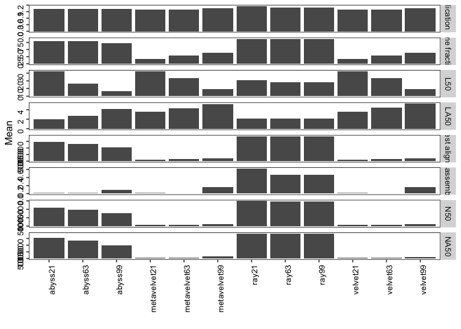<!-- -->

```r
ggsave("k-mer_stats.pdf", width = 25, height = 40, units = "cm")
```

### 90% of the genome is covered by single contig


```r
library(tidyverse)
setwd("~/Documents/research/asm/covid19-Assembly/plots/")

#90%=29903*.9
contig = xm %>% filter(Assembly == "Largest contig") %>% filter(value >=26912.7)
#
contig2 = contig %>% group_by(X2, Assay_Type) %>% summarise(count = n())
print(contig2, n = Inf)
```

```
## # A tibble: 46 x 3
## # Groups:   X2 [10]
##    X2         Assay_Type       count
##    <chr>      <chr>            <int>
##  1 abyss21    AMPLICON             6
##  2 abyss21    Targeted-Capture     3
##  3 abyss21    WGA                 11
##  4 abyss63    AMPLICON             5
##  5 abyss63    OTHER               15
##  6 abyss63    RNA-Seq              1
##  7 abyss63    Targeted-Capture    35
##  8 abyss63    WGA                  6
##  9 abyss99    OTHER               30
## 10 abyss99    RNA-Seq              3
## 11 abyss99    Targeted-Capture    34
## 12 megahit    AMPLICON            43
## 13 megahit    OTHER               43
## 14 megahit    RNA-Seq             38
## 15 megahit    Targeted-Capture    53
## 16 megahit    WGA                 78
## 17 metaspades AMPLICON            47
## 18 metaspades OTHER               27
## 19 metaspades RNA-Seq             34
## 20 metaspades Targeted-Capture    26
## 21 metaspades WGA                 77
## 22 ray21      AMPLICON            10
## 23 ray21      OTHER               28
## 24 ray21      RNA-Seq             29
## 25 ray21      Targeted-Capture    42
## 26 ray21      WGA                 52
## 27 ray63      AMPLICON            11
## 28 ray63      OTHER               34
## 29 ray63      RNA-Seq             26
## 30 ray63      Targeted-Capture    42
## 31 ray63      WGA                 54
## 32 ray99      AMPLICON            11
## 33 ray99      OTHER               34
## 34 ray99      RNA-Seq             26
## 35 ray99      Targeted-Capture    42
## 36 ray99      WGA                 54
## 37 spades     AMPLICON            23
## 38 spades     OTHER               41
## 39 spades     RNA-Seq             38
## 40 spades     Targeted-Capture    53
## 41 spades     WGA                 13
## 42 trinity    AMPLICON            15
## 43 trinity    OTHER               33
## 44 trinity    RNA-Seq              8
## 45 trinity    Targeted-Capture    18
## 46 trinity    WGA                 60
```

```r
ggplot(contig, aes(X2)) +
    geom_histogram(stat = "count") +
    xlab("") +
    ylab("Count") +
    facet_grid(~Assay_Type) +
    theme(panel.background = element_rect(fill = "white"),
        panel.border = element_rect(fill = NA, colour = "black", size = .5),
        strip.background =element_rect(fill="white"),
        axis.text = element_text(color = "black", angle = 90, hjust = 1)) 
```

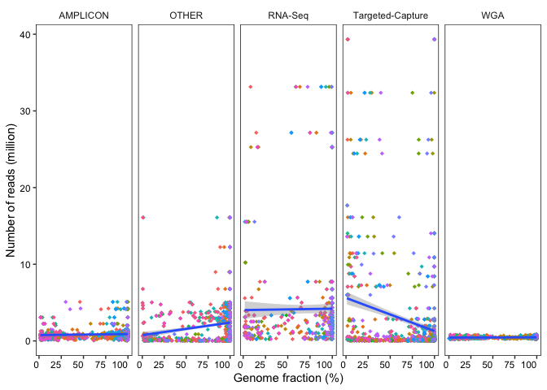<!-- -->

```r
ggsave("90_percent_genome_single_contig.pdf", width = 20, height = 6, units = "cm")
```

### correlation read vs genome


```r
library(tidyverse)
setwd("~/Documents/research/asm/covid19-Assembly/plots/")
#r = read.table("~/Documents/research/asm/covid19-Assembly/files//read_QC_matrix.txt")[,c(1,4)]
r = read.table("~/Documents/research/asm/covid19-Assembly/files/read_QC_matrix.txt")[,c(1,4)]

r2 = data.frame(id = str_split_fixed(r$V1, "_", 2), read = r$V4)

#sum every two rows of PE data
r3 = data.frame(id = unique(r2$id.1), read = (rowsum(r2[,3], as.integer(gl(nrow(r2), 2, nrow(r2))))))
rx = xm %>% filter(Assembly == "Genome fraction (%)")
rx2 = inner_join(r3, rx, by = c("id" = "X1"))
#rxm = left_join(rx2, meta2, by = c("id" = "Run"))
subset(is.na(rx2)) %>% dim()
```

```
## [1] 6027    9
```

```r
subset(!is.na(rx2)) %>% dim()
```

```
## [1] 6027    9
```

```r
# metavelve and ray have lots of NA genome frac values

ggplot(rx2, aes(value, read/1e6)) +
    geom_point(aes(color = X2), shape = 18) +
    geom_smooth(method='lm', formula= y~x) +
    xlab("Genome fraction (%)") +
    ylab("Number of reads (million)") + 
    facet_grid(~Assay_Type, scales = "free") +
    theme(panel.background = element_rect(fill = "white"),
        panel.border = element_rect(fill = NA, colour = "black", size = .5),
        strip.background =element_rect(fill="white"),
        axis.text = element_text(color = "black", angle = 0, hjust = 1),
        legend.position = "none") 
```

<!-- -->

```r
ggsave("readVsGenome.pdf", width = 20, height = 6, units = "cm")

#global cor
rx3 = na.omit(rx2)
cor(rx3$value, rx3$read, method = "spearman")
```

```
## [1] 0.09714612
```

```r
correlation = rx2 %>% filter(Assay_Type == "AMPLICON") %>% na.omit()
cor(correlation$value, correlation$read)
```

```
## [1] 0.06137333
```

```r
cor(correlation$value, correlation$read, method = "spearman")
```

```
## [1] 0.1618316
```

```r
correlation = rx2 %>% filter(Assay_Type == "Targeted-Capture") %>% na.omit()
cor(correlation$value, correlation$read)
```

```
## [1] -0.2388118
```

```r
cor(correlation$value, correlation$read, method = "spearman")
```

```
## [1] -0.03389161
```

```r
correlation = rx2 %>% filter(Assay_Type == "WGA") %>% na.omit()
cor(correlation$value, correlation$read)
```

```
## [1] 0.1314957
```

```r
cor(correlation$value, correlation$read, method = "spearman")
```

```
## [1] 0.1226009
```

```r
correlation = rx2 %>% filter(Assay_Type == "RNA-Seq") %>% na.omit()
cor(correlation$value, correlation$read)
```

```
## [1] 0.01013915
```

```r
cor(correlation$value, correlation$read, method = "spearman")
```

```
## [1] 0.1870429
```

```r
correlation = rx2 %>% filter(Assay_Type == "OTHER") %>% na.omit()
cor(correlation$value, correlation$read)
```

```
## [1] 0.2078841
```

```r
cor(correlation$value, correlation$read, method = "spearman")
```

```
## [1] 0.3073505
```

```r
#read dist
dist = rx2 %>% distinct(id, .keep_all = T)
ggplot(dist, aes(Assay_Type, log10(read))) +
    geom_boxplot(notch = T, width = .5) +
    geom_jitter(alpha = .5, width = .1) +
    xlab("") +
    ylab("log10(Number of reads)") + 
    theme(panel.background = element_rect(fill = "white"),
        panel.border = element_rect(fill = NA, colour = "black", size = .5),
        strip.background =element_rect(fill="white"),
        axis.text = element_text(color = "black", angle = 90, hjust = 1)) 
```

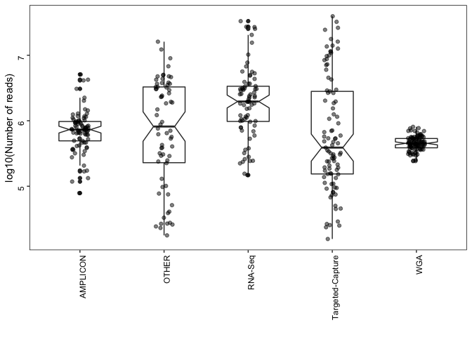<!-- -->

```r
ggsave("readDist.pdf", width = 7, height = 10, units = "cm")
```


### sample to assembler


```r
library(tidyverse)
setwd("~/Documents/research/asm/covid19-Assembly/plots/")

rx2 %>% filter(Assembly == "Genome fraction (%)") %>% na.omit() %>%
    ggplot(aes(fct_reorder(id, read), X2, color = X2)) +
    geom_point(aes(size = value, alpha = .5)) +
    ylab("") +
    xlab("Samples are sorted by number of reads") + 
    theme(panel.background = element_rect(fill = "white"),
        panel.border = element_rect(fill = NA, colour = "black", size = .5),
        axis.text = element_text(color = "black", angle = 0, hjust = 1),
        axis.text.x=element_blank()) 
```

<!-- -->

```r
ggsave("sampleVsassembler_color_bk.pdf", width = 30, height = 20, units = "cm")

# select 4 samples with high and low mean frac to plot in mvista
#high = SRR11578289 (97.4), SRR11597206 (94.4)
#low = SRR11828432, SRR11828424
#ref: MN908947.3

mvista = x3 %>% filter(Assembly == "Genome fraction (%)") %>% na.omit() %>%
    group_by(X1) %>%
    summarise(mean = mean(value)) %>% arrange(mean)
```

### dataset preparation


```r
library(tidyverse)
library(knitr)

c = read_tsv("~/Documents/research/asm/covid19-Assembly/files/SraRunTable_COVID19_14.06.20.txt")

c2 = tibble(c$Platform, c$Run, c$SRA_Sample, c$Instrument, c$LibraryLayout, c$Assay_Type, c$LibrarySelection, c$LibrarySource, c$Organism, c$geo_loc_name, c$host, c$host_disease, c$Consent)

names(c2) <- gsub("c\\$", "", names(c2))
colSums(!is.na(c2))
```

```
##         Platform              Run       SRA_Sample       Instrument 
##            15007            15007            15007            15007 
##    LibraryLayout       Assay_Type LibrarySelection    LibrarySource 
##            15007            15007            15007            15007 
##         Organism     geo_loc_name             host     host_disease 
##            15007             5508             5373             5297 
##          Consent 
##            15007
```

```r
#
#write_csv(c2, "~/Documents/research/asm/covid19-Assembly/files//COVID19_14.06.20_metadata_final.csv")

# summarise metadata
#colnames(c2)

#good code example: https://uc-r.github.io/descriptives_categorical
table3 <- table(c2$Instrument, c2$Assay_Type)
table3 <- table( c2$Assay_Type, c2$LibrarySource)
table3 <- table(c2$Assay_Type, c2$LibrarySource, c2$LibraryLayout)
ftable(table3)
```

```
##                                      PAIRED SINGLE
##                                                   
## AMPLICON         GENOMIC                  0      0
##                  METAGENOMIC              0     41
##                  METATRANSCRIPTOMIC       0      0
##                  SYNTHETIC                0    136
##                  TRANSCRIPTOMIC           0      0
##                  VIRAL RNA             5254   6507
## OTHER            GENOMIC                  0      0
##                  METAGENOMIC              1      0
##                  METATRANSCRIPTOMIC       0      0
##                  SYNTHETIC                0      0
##                  TRANSCRIPTOMIC           0      0
##                  VIRAL RNA               68      0
## RNA-Seq          GENOMIC                  1      0
##                  METAGENOMIC              9      9
##                  METATRANSCRIPTOMIC       9      0
##                  SYNTHETIC                0      0
##                  TRANSCRIPTOMIC          16      3
##                  VIRAL RNA              682    654
## Targeted-Capture GENOMIC                  0      0
##                  METAGENOMIC              0      0
##                  METATRANSCRIPTOMIC       0      0
##                  SYNTHETIC                0      0
##                  TRANSCRIPTOMIC           0      0
##                  VIRAL RNA              194    241
## WGA              GENOMIC                  6      0
##                  METAGENOMIC              5      0
##                  METATRANSCRIPTOMIC       0      0
##                  SYNTHETIC                0      0
##                  TRANSCRIPTOMIC           0      0
##                  VIRAL RNA             1061      0
## WGS              GENOMIC                 11      0
##                  METAGENOMIC              6      0
##                  METATRANSCRIPTOMIC       0      0
##                  SYNTHETIC                0      0
##                  TRANSCRIPTOMIC           0      0
##                  VIRAL RNA               93      0
```

```r
# will add table paper
df = c2 %>% 
    group_by(Assay_Type, LibrarySource, LibraryLayout) %>%
    tally() 

kable(df, caption = "Summary of all data. This table will add table paper")
```


Table: Summary of all data. This table will add table paper

|Assay_Type       |LibrarySource      |LibraryLayout |    n|
|:----------------|:------------------|:-------------|----:|
|AMPLICON         |METAGENOMIC        |SINGLE        |   41|
|AMPLICON         |SYNTHETIC          |SINGLE        |  136|
|AMPLICON         |VIRAL RNA          |PAIRED        | 5254|
|AMPLICON         |VIRAL RNA          |SINGLE        | 6507|
|OTHER            |METAGENOMIC        |PAIRED        |    1|
|OTHER            |VIRAL RNA          |PAIRED        |   68|
|RNA-Seq          |GENOMIC            |PAIRED        |    1|
|RNA-Seq          |METAGENOMIC        |PAIRED        |    9|
|RNA-Seq          |METAGENOMIC        |SINGLE        |    9|
|RNA-Seq          |METATRANSCRIPTOMIC |PAIRED        |    9|
|RNA-Seq          |TRANSCRIPTOMIC     |PAIRED        |   16|
|RNA-Seq          |TRANSCRIPTOMIC     |SINGLE        |    3|
|RNA-Seq          |VIRAL RNA          |PAIRED        |  682|
|RNA-Seq          |VIRAL RNA          |SINGLE        |  654|
|Targeted-Capture |VIRAL RNA          |PAIRED        |  194|
|Targeted-Capture |VIRAL RNA          |SINGLE        |  241|
|WGA              |GENOMIC            |PAIRED        |    6|
|WGA              |METAGENOMIC        |PAIRED        |    5|
|WGA              |VIRAL RNA          |PAIRED        | 1061|
|WGS              |GENOMIC            |PAIRED        |   11|
|WGS              |METAGENOMIC        |PAIRED        |    6|
|WGS              |VIRAL RNA          |PAIRED        |   93|

```r
#write_tsv(df, "~/Documents/research/asm/covid19-Assembly/files//summary_data.tsv")

df2 = df %>% filter(LibrarySource == "VIRAL RNA")
kable(df2, caption = "Summary of VIRAL RNA data")
```


Table: Summary of VIRAL RNA data

|Assay_Type       |LibrarySource |LibraryLayout |    n|
|:----------------|:-------------|:-------------|----:|
|AMPLICON         |VIRAL RNA     |PAIRED        | 5254|
|AMPLICON         |VIRAL RNA     |SINGLE        | 6507|
|OTHER            |VIRAL RNA     |PAIRED        |   68|
|RNA-Seq          |VIRAL RNA     |PAIRED        |  682|
|RNA-Seq          |VIRAL RNA     |SINGLE        |  654|
|Targeted-Capture |VIRAL RNA     |PAIRED        |  194|
|Targeted-Capture |VIRAL RNA     |SINGLE        |  241|
|WGA              |VIRAL RNA     |PAIRED        | 1061|
|WGS              |VIRAL RNA     |PAIRED        |   93|

```r
##subsample main paper
#PE
set.seed(2020)
a1 = c2 %>% filter(LibraryLayout == "PAIRED" & Assay_Type == "AMPLICON" & LibrarySource == "VIRAL RNA") %>%
    mutate(LibType = "PE: AMPLICON of VIRAL RNA") %>% sample_n(100)

set.seed(2020)
a2 = c2 %>% filter(LibraryLayout == "PAIRED" & Assay_Type == "OTHER" & LibrarySource == "VIRAL RNA") %>%
    mutate(LibType = "PE: OTHER of VIRAL RNA")

set.seed(2020)
a3 = c2 %>% filter(LibraryLayout == "PAIRED" & Assay_Type == "RNA-Seq" & LibrarySource == "VIRAL RNA") %>%
    mutate(LibType = "PE: RNA-Seq of VIRAL RNA") %>% sample_n(100)

set.seed(2020)
a4 = c2 %>% filter(LibraryLayout == "PAIRED" & Assay_Type == "Targeted-Capture" & LibrarySource == "VIRAL RNA") %>%
    mutate(LibType = "PE: Targeted-Capture of VIRAL RNA") %>% sample_n(100)

set.seed(2020)
a5 = c2 %>% filter(LibraryLayout == "PAIRED" & Assay_Type == "WGA" & LibrarySource == "VIRAL RNA") %>%
    mutate(LibType = "PE: WGA of VIRAL RNA") %>% sample_n(100)

set.seed(2020)
a6 = c2 %>% filter(LibraryLayout == "PAIRED" & Assay_Type == "WGS" & LibrarySource == "VIRAL RNA") %>%
    mutate(LibType = "PE: WGS of VIRAL RNA")

#SE
set.seed(2020)
b1 = c2 %>% filter(LibraryLayout == "SINGLE" & Assay_Type == "AMPLICON" & LibrarySource == "VIRAL RNA") %>%
    mutate(LibType = "SE: AMPLICON of VIRAL RNA") %>% sample_n(100)

set.seed(2020)
b2 = c2 %>% filter(LibraryLayout == "SINGLE" & Assay_Type == "RNA-Seq" & LibrarySource == "VIRAL RNA") %>%
    mutate(LibType = "SE: RNA-Seq of VIRAL RNA") %>% sample_n(100)

set.seed(2020)
b3 = c2 %>% filter(LibraryLayout == "SINGLE" & Assay_Type == "Targeted-Capture" & LibrarySource == "VIRAL RNA") %>%
    mutate(LibType = "SE: Targeted-Capture of VIRAL RNA") %>% sample_n(100)

#dataset
ab_pe = rbind(a1, a2, a3, a4, a5, a6)
ab_se = rbind(b1, b2, b3)
#write_csv(ab_pe, "~/Documents/research/asm/covid19-Assembly/files//PE_561samples_final.csv")
#write_csv(ab_se, "~/Documents/research/asm/covid19-Assembly/files//SE_300samples_final.csv")
#write.table(ab_pe$Run, "~/Documents/research/asm/covid19-Assembly/files//PE_561samples_final_561runs.txt", col.names = F, row.names = F, quote = F)
#write.table(ab_se$Run, "~/Documents/research/asm/covid19-Assembly/files//SE_300samples_final_300runs.txt", col.names = F, row.names = F, quote = F)
#write_csv(a1, "~/Documents/research/asm/covid19-Assembly/files//PE_100samples_amplicon_bioRxiv.csv")
#write.table(a1[,2], "~/Documents/research/asm/covid19-Assembly/files//PE_100samples_amplicon_bioRxiv_100runs.txt", col.names = F, row.names = F, quote = F)

# test ram and cpu
set.seed(2020)
#20 samples will be selected from amplicon with similar depth
#ram = a1 %>% sample_n(20)

ab = rbind(ab_pe, ab_se)
ab2 = ab %>% group_by(LibType) %>% tally()
kable(ab2, caption = "List of total 9 different categories. Maximum 100 samples are randomly selected")
```


Table: List of total 9 different categories. Maximum 100 samples are randomly selected

|LibType                           |   n|
|:---------------------------------|---:|
|PE: AMPLICON of VIRAL RNA         | 100|
|PE: OTHER of VIRAL RNA            |  68|
|PE: RNA-Seq of VIRAL RNA          | 100|
|PE: Targeted-Capture of VIRAL RNA | 100|
|PE: WGA of VIRAL RNA              | 100|
|PE: WGS of VIRAL RNA              |  93|
|SE: AMPLICON of VIRAL RNA         | 100|
|SE: RNA-Seq of VIRAL RNA          | 100|
|SE: Targeted-Capture of VIRAL RNA | 100|

