### variant heatmap


```r
library(pheatmap)
library(tidyverse)

meta = read_csv("/Volumes/rony/drive/asm/covid19-Assembly/files/PE_561samples_final.csv")
mh = read.table("/Volumes/rony/drive/asm/covid19-Assembly/files/megahit_alignment_matrix_50bp.tsv", head = F)
ms = read.table("/Volumes/rony/drive/asm/covid19-Assembly/files/metaspade_alignment_matrix_50bp.tsv", head = F)
ab = read.table("/Volumes/rony/drive/asm/covid19-Assembly/files/abyss63_alignment_matrix_50bp.tsv", head = F)
tr = read.table("/Volumes/rony/drive/asm/covid19-Assembly/files/trinity_alignment_matrix_50bp.tsv", head = F)

hs = cbind(mh, ms, ab, tr)
hst = data.frame(t(hs))
hst2 = hst %>% filter(X1 != "A.ID.megahit.50bp_overlap") %>% 
    filter(X1 != "A.ID.metaspade.50bp_overlap") %>% 
    filter(X1 != "A.ID.abyss63.50bp_overlap") %>% 
    filter(X1 != "A.ID.trinity.50bp_overlap")

hst3 = data.frame(str_split_fixed(hst2$X1, "_", 3), hst2)

megahit = hst3 %>% filter(hst3$X2.1 == "megahit") %>% select(-X2.1) %>% select(-X3.1) %>% select(-X1)
metaspades = hst3 %>% filter(hst3$X2.1 == "metaspades") %>% select(-X2.1) %>% select(-X3.1) %>% select(-X1)
abyss = hst3 %>% filter(hst3$X2.1 == "abyss63") %>% select(-X2.1) %>% select(-X3.1) %>% select(-X1)
trinity = hst3 %>% filter(hst3$X2.1 == "trinity") %>% select(-X2.1) %>% select(-X3.1) %>% select(-X1)

both = merge(megahit, metaspades, by.x = "X1.1", by.y = "X1.1") 
both = inner_join(megahit, metaspades, by = c("X1.1" = "X1.1")) %>% 
    inner_join(abyss, by = c("X1.1" = "X1.1")) %>%
    inner_join(trinity, by = c("X1.1" = "X1.1"))

both2 = inner_join(meta, both, by = c( "Run" = "X1.1"))
both3 = both2[, c(2,6, 15:ncol(both2))] 
both3 %>% group_by(Assay_Type) %>%
    summarise(n = n())
```

```
## # A tibble: 5 x 2
##   Assay_Type           n
##   <chr>            <int>
## 1 AMPLICON            81
## 2 OTHER               60
## 3 RNA-Seq             41
## 4 Targeted-Capture    83
## 5 WGA                 97
```

```r
#write.table(both3, "/Volumes/rony/drive/asm/covid19-Assembly/files/megahit_metaspades_heatmap_matrix.tsv", sep = "\t", quote = F, row.names = F, col.names = F)

both4 = data.frame(both3[,3:ncol(both3)]) 

#conver factor to numeric
both5 = both4 %>% 
  mutate_all(~as.numeric(as.character(.)))
rownames(both5) = both3$Run

#pheatmap(both5, cluster_cols = F, cluster_rows = F, show_rownames = F, show_colnames = F, color = colorRampPalette(c("red", "white", "gray"))(1000), border_color = NA, gaps_col = 599)

#add annotation
anno = data.frame(Assay = both3$Assay_Type)
rownames(anno) = rownames(both5)

pheatmap(both5, annotation_row = anno, cluster_cols = F, cluster_rows = F, show_rownames = F, show_colnames = F, color = colorRampPalette(c("red", "white", "gray"))(1000), border_color = NA, gaps_col = c(599, 599+599, 599+599+599), gaps_row = c(82, 82+65, 82+65+58, 82+65+58+88))
```

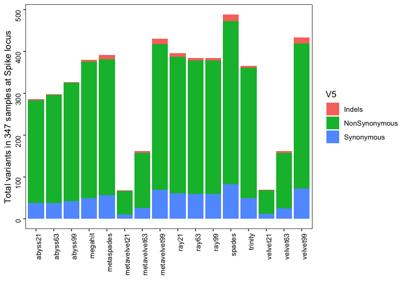<!-- -->

```r
plot.new()
```

<!-- -->

```r
jpeg("/Volumes/rony/drive/asm/covid19-Assembly/plots/heatmap_v2.jpg", width = 1800, height = 1000)
pheatmap(both5, annotation_row = anno, cluster_cols = F, cluster_rows = F, show_rownames = F, show_colnames = F, color = colorRampPalette(c("red", "white", "gray"))(1000), border_color = NA, gaps_col = c(599, 599+599, 599+599+599), gaps_row = c(81, 81+60, 81+60+41, 81+60+41+83))
dev.off()
```

```
## quartz_off_screen 
##                 3
```

```r
#make genome
g = read.table("/Volumes/rony/drive/asm/covid19-Assembly/files/GeneBank_Genes.bed")
```

### assembly quality


```r
library(tidyverse)
library(reshape2)
library(viridis)
library(ggsci)

x = read_tsv("/Volumes/rony/drive/asm/covid19-Assembly/files/backup/bioRxiv_1074_assembly_report_PE_amplicon_viralRNA.tsv")
x = read_tsv("/Volumes/rony/drive/asm/covid19-Assembly/files/report_metaquast_PE_all.tsv")

x2 = melt(x, id.vars = "Assembly")
x2$Assembly = gsub("# ", "", x2$Assembly)
x3 = data.frame(str_split_fixed(x2$variable, "_", 3), value = as.numeric(x2$value), x2)

meta = read_csv("/Volumes/rony/drive/asm/covid19-Assembly/files/PE_561samples_final.csv")
meta2 = meta %>% select(Run, Assay_Type)
    
xm = left_join(x3, meta2, by = c("X1" = "Run"))

#
setwd("/Volumes/rony/drive/asm/covid19-Assembly/plots/")
make_boxplot = function(variableToPlot)
{
  x4 = xm %>% filter(Assembly == variableToPlot) 
  stat = x4 %>%
    group_by(Assay_Type, X2) %>%
    summarize(mean = mean(value, na.rm = TRUE),
            median = median(value, na.rm = TRUE))
  #kable(stat)
  
  print(stat, n = Inf)
  plot = ggplot(x4, aes(X2, value)) +
    geom_jitter(alpha = .5, width = .1, aes(color = X2)) +
    geom_boxplot(alpha = 0.1) +
    #scale_color_viridis(discrete=TRUE) +
    #scale_fill_material("red") +
    xlab("") +
    ylab(variableToPlot) +
    facet_grid(Assay_Type~.) +
    theme(panel.background = element_rect(fill = "white"),
        panel.border = element_rect(fill = NA, colour = "black", size = .5),
        axis.text = element_text(color = "black", angle = 90, hjust = 1),
        strip.background =element_rect(fill="white"),
        legend.position = "none") 
  print(plot)
  
  filename = str_replace_all(variableToPlot, "[[:punct:]]", "")
  ggsave(filename=paste(filename,".pdf", sep="_"), width = 12, height = 18, units = "cm", device = 'pdf')
}

make_boxplot("Genome fraction (%)")
```

```
## # A tibble: 80 x 4
## # Groups:   Assay_Type [5]
##    Assay_Type       X2            mean median
##    <chr>            <fct>        <dbl>  <dbl>
##  1 AMPLICON         abyss21      84.8   94.8 
##  2 AMPLICON         abyss63      83.5   95.6 
##  3 AMPLICON         abyss99      70.6   81.5 
##  4 AMPLICON         megahit      97.5   99.7 
##  5 AMPLICON         metaspades   97.5   99.7 
##  6 AMPLICON         metavelvet21  7.03   3.89
##  7 AMPLICON         metavelvet63 23.5   10.6 
##  8 AMPLICON         metavelvet99 25.2   21.3 
##  9 AMPLICON         ray21        90.4   94.8 
## 10 AMPLICON         ray63        91.6   95.0 
## 11 AMPLICON         ray99        91.6   95.0 
## 12 AMPLICON         spades       96.7   99.2 
## 13 AMPLICON         trinity      81.4   98.0 
## 14 AMPLICON         velvet21      7.15   4.78
## 15 AMPLICON         velvet63     23.8   11.2 
## 16 AMPLICON         velvet99     25.7   21.1 
## 17 OTHER            abyss21      81.0   94.1 
## 18 OTHER            abyss63      84.3   97.9 
## 19 OTHER            abyss99      83.7   99.5 
## 20 OTHER            megahit      92.3   99.8 
## 21 OTHER            metaspades   92.3   99.8 
## 22 OTHER            metavelvet21 39.8   33.8 
## 23 OTHER            metavelvet63 36.3   24.5 
## 24 OTHER            metavelvet99 47.5   55.4 
## 25 OTHER            ray21        81.4   97.8 
## 26 OTHER            ray63        87.6   99.2 
## 27 OTHER            ray99        87.6   99.2 
## 28 OTHER            spades       89.9   99.9 
## 29 OTHER            trinity      91.6   99.9 
## 30 OTHER            velvet21     39.6   33.8 
## 31 OTHER            velvet63     37.5   26.0 
## 32 OTHER            velvet99     47.8   57.5 
## 33 RNA-Seq          abyss21      23.2    8.85
## 34 RNA-Seq          abyss63      56.2   64.3 
## 35 RNA-Seq          abyss99      69.8   90.1 
## 36 RNA-Seq          megahit      81.8   99.8 
## 37 RNA-Seq          metaspades   82.6   99.8 
## 38 RNA-Seq          metavelvet21 12.0    4.25
## 39 RNA-Seq          metavelvet63 48.6   55.6 
## 40 RNA-Seq          metavelvet99 59.3   65.2 
## 41 RNA-Seq          ray21        88.7   99.8 
## 42 RNA-Seq          ray63        86.6   99.8 
## 43 RNA-Seq          ray99        86.6   99.8 
## 44 RNA-Seq          spades       85.4   99.8 
## 45 RNA-Seq          trinity      81.4   95.9 
## 46 RNA-Seq          velvet21     12.4    3.99
## 47 RNA-Seq          velvet63     48.6   55.6 
## 48 RNA-Seq          velvet99     59.4   65.2 
## 49 Targeted-Capture abyss21      85.1   95.2 
## 50 Targeted-Capture abyss63      74.1   98.0 
## 51 Targeted-Capture abyss99      71.6   97.4 
## 52 Targeted-Capture megahit      92.3   99.8 
## 53 Targeted-Capture metaspades   89.4   99.8 
## 54 Targeted-Capture metavelvet21 22.2   14.1 
## 55 Targeted-Capture metavelvet63 32.0   25.3 
## 56 Targeted-Capture metavelvet99 58.4   73.1 
## 57 Targeted-Capture ray21        84.3   97.8 
## 58 Targeted-Capture ray63        84.4   96.9 
## 59 Targeted-Capture ray99        84.4   96.9 
## 60 Targeted-Capture spades       93.1   99.8 
## 61 Targeted-Capture trinity      76.3   88.0 
## 62 Targeted-Capture velvet21     22.0   14.1 
## 63 Targeted-Capture velvet63     32.1   27.6 
## 64 Targeted-Capture velvet99     60.0   74.9 
## 65 WGA              abyss21      87.4   98.2 
## 66 WGA              abyss63      88.8   98.8 
## 67 WGA              abyss99      71.9   82.9 
## 68 WGA              megahit      93.6   99.7 
## 69 WGA              metaspades   94.4   99.7 
## 70 WGA              metavelvet21  7.12   2.19
## 71 WGA              metavelvet63 14.7    9.61
## 72 WGA              metavelvet99 21.6   21.2 
## 73 WGA              ray21        89.4   99.4 
## 74 WGA              ray63        90.0   99.2 
## 75 WGA              ray99        90.0   99.2 
## 76 WGA              spades       93.8   99.7 
## 77 WGA              trinity      95.3   99.7 
## 78 WGA              velvet21      7.34   2.93
## 79 WGA              velvet63     14.8    9.99
## 80 WGA              velvet99     21.3   20.5
```

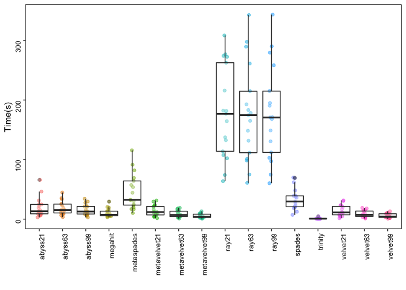<!-- -->

```r
make_boxplot("Largest contig")
```

```
## # A tibble: 80 x 4
## # Groups:   Assay_Type [5]
##    Assay_Type       X2             mean median
##    <chr>            <fct>         <dbl>  <dbl>
##  1 AMPLICON         abyss21      12912. 12340.
##  2 AMPLICON         abyss63      10376.  6950 
##  3 AMPLICON         abyss99       5917.  2826 
##  4 AMPLICON         megahit      23680. 28204 
##  5 AMPLICON         metaspades   23846. 29828 
##  6 AMPLICON         metavelvet21   755.   667 
##  7 AMPLICON         metavelvet63  1521.   814 
##  8 AMPLICON         metavelvet99  1120.   991 
##  9 AMPLICON         ray21        15248. 14898.
## 10 AMPLICON         ray63        14237. 13042 
## 11 AMPLICON         ray99        14216. 13042 
## 12 AMPLICON         spades       18965. 17698.
## 13 AMPLICON         trinity      16179. 17251 
## 14 AMPLICON         velvet21       755.   667 
## 15 AMPLICON         velvet63      1512.   810 
## 16 AMPLICON         velvet99      1140.  1008 
## 17 OTHER            abyss21      13277.  9763 
## 18 OTHER            abyss63      16164. 16418 
## 19 OTHER            abyss99      18346. 20620.
## 20 OTHER            megahit      22914. 29860.
## 21 OTHER            metaspades   20734. 25414 
## 22 OTHER            metavelvet21  1373.   977 
## 23 OTHER            metavelvet63  1708.  1103 
## 24 OTHER            metavelvet99  2325.  1764 
## 25 OTHER            ray21        17657. 24671 
## 26 OTHER            ray63        19362. 27522 
## 27 OTHER            ray99        19338. 27522 
## 28 OTHER            spades       21998. 29858.
## 29 OTHER            trinity      20004. 27898 
## 30 OTHER            velvet21      1335.   968 
## 31 OTHER            velvet63      1762.  1149 
## 32 OTHER            velvet99      2382.  1893 
## 33 RNA-Seq          abyss21       2264.  1630 
## 34 RNA-Seq          abyss63       3564.  1746.
## 35 RNA-Seq          abyss99       4425.   884 
## 36 RNA-Seq          megahit      19432. 28035 
## 37 RNA-Seq          metaspades   17937. 22139 
## 38 RNA-Seq          metavelvet21  1009.   936 
## 39 RNA-Seq          metavelvet63  2007.  1447 
## 40 RNA-Seq          metavelvet99  1914.  1535 
## 41 RNA-Seq          ray21        19262. 15401 
## 42 RNA-Seq          ray63        16517. 15085 
## 43 RNA-Seq          ray99        16517. 15085 
## 44 RNA-Seq          spades       24970. 28525 
## 45 RNA-Seq          trinity      11322.  6911 
## 46 RNA-Seq          velvet21      1024.   968.
## 47 RNA-Seq          velvet63      1993.  1399 
## 48 RNA-Seq          velvet99      1935.  1535 
## 49 Targeted-Capture abyss21      13851. 12703 
## 50 Targeted-Capture abyss63      14562.  7349 
## 51 Targeted-Capture abyss99      13963.  6738.
## 52 Targeted-Capture megahit      20637. 29853 
## 53 Targeted-Capture metaspades   19423. 25414 
## 54 Targeted-Capture metavelvet21   965.   777 
## 55 Targeted-Capture metavelvet63  1470.   988.
## 56 Targeted-Capture metavelvet99  3822.  2390 
## 57 Targeted-Capture ray21        17318. 20228 
## 58 Targeted-Capture ray63        16779. 19716 
## 59 Targeted-Capture ray99        16779. 19716 
## 60 Targeted-Capture spades       22070. 29850 
## 61 Targeted-Capture trinity      12757.  9994 
## 62 Targeted-Capture velvet21       974.   792.
## 63 Targeted-Capture velvet63      1449.   997 
## 64 Targeted-Capture velvet99      3783.  2367 
## 65 WGA              abyss21      16229. 22264.
## 66 WGA              abyss63      11023   9808.
## 67 WGA              abyss99       4135.  2970.
## 68 WGA              megahit      25966. 29842.
## 69 WGA              metaspades   25836. 29844 
## 70 WGA              metavelvet21   895.   726.
## 71 WGA              metavelvet63  1011.   873 
## 72 WGA              metavelvet99  1132.  1080.
## 73 WGA              ray21        24301. 28606.
## 74 WGA              ray63        23888. 28856.
## 75 WGA              ray99        23888. 28856.
## 76 WGA              spades       15932. 15251 
## 77 WGA              trinity      24308. 29819 
## 78 WGA              velvet21       889.   726.
## 79 WGA              velvet63      1027.   874 
## 80 WGA              velvet99      1154.  1072.
```

<!-- -->

```r
make_boxplot("Total length")
```

```
## # A tibble: 80 x 4
## # Groups:   Assay_Type [5]
##    Assay_Type       X2               mean  median
##    <chr>            <fct>           <dbl>   <dbl>
##  1 AMPLICON         abyss21        25718.  28690.
##  2 AMPLICON         abyss63        25518.  28960 
##  3 AMPLICON         abyss99        21873.  25571 
##  4 AMPLICON         megahit        32533.  29884.
##  5 AMPLICON         metaspades     31636.  29892.
##  6 AMPLICON         metavelvet21    2804.   1430 
##  7 AMPLICON         metavelvet63    7677.   3507 
##  8 AMPLICON         metavelvet99    8651.   6620 
##  9 AMPLICON         ray21          30382.  30377 
## 10 AMPLICON         ray63          30308.  29811 
## 11 AMPLICON         ray99          30306.  29811 
## 12 AMPLICON         spades         39610.  30484.
## 13 AMPLICON         trinity        32700.  29827 
## 14 AMPLICON         velvet21        2803.   1430 
## 15 AMPLICON         velvet63        7741.   3523 
## 16 AMPLICON         velvet99        8799.   6710 
## 17 OTHER            abyss21        41145.  28522 
## 18 OTHER            abyss63        41983.  29727 
## 19 OTHER            abyss99        38973.  29865 
## 20 OTHER            megahit        82116.  37682.
## 21 OTHER            metaspades     73609.  37646 
## 22 OTHER            metavelvet21   30511.   5816 
## 23 OTHER            metavelvet63   27464.   7386 
## 24 OTHER            metavelvet99   30918.  20079 
## 25 OTHER            ray21          43684.  32588.
## 26 OTHER            ray63          44620.  32438 
## 27 OTHER            ray99          44612.  32438 
## 28 OTHER            spades         72647.  36342 
## 29 OTHER            trinity       106164.  53000.
## 30 OTHER            velvet21       30349.   5564 
## 31 OTHER            velvet63       28805.   8920.
## 32 OTHER            velvet99       31052.  20382 
## 33 RNA-Seq          abyss21       381196.  47320 
## 34 RNA-Seq          abyss63       150567.  24854 
## 35 RNA-Seq          abyss99        13802.   3444 
## 36 RNA-Seq          megahit       710616. 162712 
## 37 RNA-Seq          metaspades    797222. 191014 
## 38 RNA-Seq          metavelvet21  108844.  18099 
## 39 RNA-Seq          metavelvet63  139454.  22344 
## 40 RNA-Seq          metavelvet99   10470.   3655 
## 41 RNA-Seq          ray21         340292.  78097 
## 42 RNA-Seq          ray63         261610.  58810 
## 43 RNA-Seq          ray99         261634.  58810 
## 44 RNA-Seq          spades       1322823. 517283 
## 45 RNA-Seq          trinity       822573. 202200 
## 46 RNA-Seq          velvet21      110241.  24172.
## 47 RNA-Seq          velvet63      139480.  22481 
## 48 RNA-Seq          velvet99       10527.   3655 
## 49 Targeted-Capture abyss21        24382.  28166.
## 50 Targeted-Capture abyss63        24165.  27627 
## 51 Targeted-Capture abyss99        24829.  27872.
## 52 Targeted-Capture megahit       106973.  29882 
## 53 Targeted-Capture metaspades    109558.  29971 
## 54 Targeted-Capture metavelvet21   48069.   3492.
## 55 Targeted-Capture metavelvet63   31935.   7293 
## 56 Targeted-Capture metavelvet99   31915.  22440 
## 57 Targeted-Capture ray21          51052.  29870 
## 58 Targeted-Capture ray63          46045.  29859 
## 59 Targeted-Capture ray99          46017.  29859 
## 60 Targeted-Capture spades        295058.  36229 
## 61 Targeted-Capture trinity        91350.  34724 
## 62 Targeted-Capture velvet21       48257.   3472.
## 63 Targeted-Capture velvet63       32006.   7336.
## 64 Targeted-Capture velvet99       31934.  22694 
## 65 WGA              abyss21        31399.  29622.
## 66 WGA              abyss63        36442.  29858.
## 67 WGA              abyss99        30938.  27638 
## 68 WGA              megahit        62158.  36598 
## 69 WGA              metaspades     55143.  35172 
## 70 WGA              metavelvet21   11704.   2616.
## 71 WGA              metavelvet63   16290.   6121 
## 72 WGA              metavelvet99   17129.   9537 
## 73 WGA              ray21          44307.  34880.
## 74 WGA              ray63          45074.  33598.
## 75 WGA              ray99          45081.  33598.
## 76 WGA              spades         55083.  33648.
## 77 WGA              trinity        65325.  39306.
## 78 WGA              velvet21       11787.   2892.
## 79 WGA              velvet63       16298.   6313 
## 80 WGA              velvet99       17133.   9277
```

<!-- -->

```r
make_boxplot("contigs")
```

```
## # A tibble: 80 x 4
## # Groups:   Assay_Type [5]
##    Assay_Type       X2             mean median
##    <chr>            <fct>         <dbl>  <dbl>
##  1 AMPLICON         abyss21        7.76    5  
##  2 AMPLICON         abyss63       10.2     9  
##  3 AMPLICON         abyss99       13.9    14.5
##  4 AMPLICON         megahit        6.52    2  
##  5 AMPLICON         metaspades     5.37    2  
##  6 AMPLICON         metavelvet21   4.32    2  
##  7 AMPLICON         metavelvet63   8       5  
##  8 AMPLICON         metavelvet99  11.4    10  
##  9 AMPLICON         ray21          7.56    4.5
## 10 AMPLICON         ray63          8.11    5  
## 11 AMPLICON         ray99          8.12    5  
## 12 AMPLICON         spades         8.48    5  
## 13 AMPLICON         trinity        8.79    3.5
## 14 AMPLICON         velvet21       4.32    2  
## 15 AMPLICON         velvet63       8.14    5  
## 16 AMPLICON         velvet99      11.6    10  
## 17 OTHER            abyss21       32.0     8  
## 18 OTHER            abyss63       28.8     5.5
## 19 OTHER            abyss99       22.7     3.5
## 20 OTHER            megahit       65.8    11.5
## 21 OTHER            metaspades    57.2    12  
## 22 OTHER            metavelvet21  42.1     9  
## 23 OTHER            metavelvet63  36.1    11  
## 24 OTHER            metavelvet99  36.3    18  
## 25 OTHER            ray21         24.3     9  
## 26 OTHER            ray63         23.5     8  
## 27 OTHER            ray99         23.5     8  
## 28 OTHER            spades        47.5    10  
## 29 OTHER            trinity       77.6    19.5
## 30 OTHER            velvet21      42.0     8  
## 31 OTHER            velvet63      37.8    13.5
## 32 OTHER            velvet99      36.3    18  
## 33 RNA-Seq          abyss21      438.     68  
## 34 RNA-Seq          abyss63      183.     26  
## 35 RNA-Seq          abyss99       10.1     3  
## 36 RNA-Seq          megahit      629.    160  
## 37 RNA-Seq          metaspades   754.    189  
## 38 RNA-Seq          metavelvet21 175.     31  
## 39 RNA-Seq          metavelvet63 179.     27  
## 40 RNA-Seq          metavelvet99  10.4     3  
## 41 RNA-Seq          ray21        314.     52  
## 42 RNA-Seq          ray63        253.     44  
## 43 RNA-Seq          ray99        254.     44  
## 44 RNA-Seq          spades       787.    277  
## 45 RNA-Seq          trinity      863.    206  
## 46 RNA-Seq          velvet21     178.     41.5
## 47 RNA-Seq          velvet63     179.     28  
## 48 RNA-Seq          velvet99      10.4     3  
## 49 Targeted-Capture abyss21       10.9     5  
## 50 Targeted-Capture abyss63       10.8     4  
## 51 Targeted-Capture abyss99       11.9     4  
## 52 Targeted-Capture megahit      109.      4  
## 53 Targeted-Capture metaspades   106.      5  
## 54 Targeted-Capture metavelvet21  73.5     6  
## 55 Targeted-Capture metavelvet63  45.9    10.5
## 56 Targeted-Capture metavelvet99  34      11  
## 57 Targeted-Capture ray21         38.9     7  
## 58 Targeted-Capture ray63         34.6    10  
## 59 Targeted-Capture ray99         34.6    10  
## 60 Targeted-Capture spades       182.      3  
## 61 Targeted-Capture trinity       82.7     9  
## 62 Targeted-Capture velvet21      73.9     6  
## 63 Targeted-Capture velvet63      46.0    10  
## 64 Targeted-Capture velvet99      34.1    11  
## 65 WGA              abyss21       13.7     4  
## 66 WGA              abyss63       21.9     7  
## 67 WGA              abyss99       29.0    21  
## 68 WGA              megahit       43.9    10.5
## 69 WGA              metaspades    35.6     8.5
## 70 WGA              metavelvet21  17.7     4.5
## 71 WGA              metavelvet63  24.1    10  
## 72 WGA              metavelvet99  24.9    14.5
## 73 WGA              ray21         17.9     5  
## 74 WGA              ray63         19.9     4  
## 75 WGA              ray99         19.9     4  
## 76 WGA              spades        34.9     8  
## 77 WGA              trinity       45.6    12  
## 78 WGA              velvet21      17.9     5  
## 79 WGA              velvet63      24.0    10  
## 80 WGA              velvet99      24.9    13.5
```

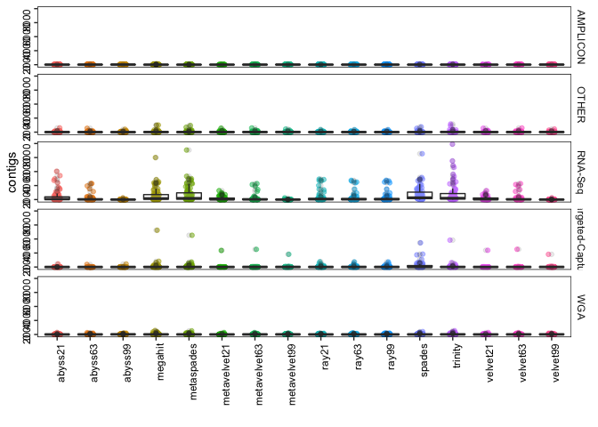<!-- -->

```r
make_boxplot("contigs (>= 1000 bp)")
```

```
## # A tibble: 80 x 4
## # Groups:   Assay_Type [5]
##    Assay_Type       X2             mean median
##    <chr>            <fct>         <dbl>  <dbl>
##  1 AMPLICON         abyss21        3.88    3  
##  2 AMPLICON         abyss63        5.38    5  
##  3 AMPLICON         abyss99        5.36    5.5
##  4 AMPLICON         megahit        3.09    2  
##  5 AMPLICON         metaspades     2.79    1  
##  6 AMPLICON         metavelvet21   0.32    0  
##  7 AMPLICON         metavelvet63   1.76    0  
##  8 AMPLICON         metavelvet99   1.56    0  
##  9 AMPLICON         ray21          5.45    4  
## 10 AMPLICON         ray63          5.89    4  
## 11 AMPLICON         ray99          5.90    4  
## 12 AMPLICON         spades         5.67    4  
## 13 AMPLICON         trinity        4.54    3  
## 14 AMPLICON         velvet21       0.32    0  
## 15 AMPLICON         velvet63       1.71    0  
## 16 AMPLICON         velvet99       1.56    1  
## 17 OTHER            abyss21        7.38    3  
## 18 OTHER            abyss63        7.35    2  
## 19 OTHER            abyss99        5.36    2  
## 20 OTHER            megahit       15.3     5  
## 21 OTHER            metaspades    14.5     5.5
## 22 OTHER            metavelvet21   4.4     0  
## 23 OTHER            metavelvet63   4.83    1  
## 24 OTHER            metavelvet99   7.16    5  
## 25 OTHER            ray21          9.03    5  
## 26 OTHER            ray63          8.57    5  
## 27 OTHER            ray99          8.57    5  
## 28 OTHER            spades        14.0     4  
## 29 OTHER            trinity       22.8    10  
## 30 OTHER            velvet21       4.29    0  
## 31 OTHER            velvet63       5.08    1  
## 32 OTHER            velvet99       7.06    5  
## 33 RNA-Seq          abyss21       92.1     4  
## 34 RNA-Seq          abyss63       31.5     5  
## 35 RNA-Seq          abyss99        2.44    0  
## 36 RNA-Seq          megahit      174.     31  
## 37 RNA-Seq          metaspades   194.     26  
## 38 RNA-Seq          metavelvet21   3.90    0  
## 39 RNA-Seq          metavelvet63  28.4     5  
## 40 RNA-Seq          metavelvet99   3.12    2  
## 41 RNA-Seq          ray21         95.6    15  
## 42 RNA-Seq          ray63         70.9    15  
## 43 RNA-Seq          ray99         70.9    15  
## 44 RNA-Seq          spades       272.    123  
## 45 RNA-Seq          trinity      202.     37  
## 46 RNA-Seq          velvet21       3.86    0  
## 47 RNA-Seq          velvet63      28.4     5  
## 48 RNA-Seq          velvet99       3.15    2  
## 49 Targeted-Capture abyss21        3.46    2  
## 50 Targeted-Capture abyss63        3.19    1  
## 51 Targeted-Capture abyss99        3.63    1  
## 52 Targeted-Capture megahit       16.0     3  
## 53 Targeted-Capture metaspades    19.2     3  
## 54 Targeted-Capture metavelvet21   4.56    0  
## 55 Targeted-Capture metavelvet63   3.87    0  
## 56 Targeted-Capture metavelvet99   6.64    5  
## 57 Targeted-Capture ray21          7.57    2  
## 58 Targeted-Capture ray63          6.95    2  
## 59 Targeted-Capture ray99          6.91    2  
## 60 Targeted-Capture spades        33.0     3  
## 61 Targeted-Capture trinity       18.1     5  
## 62 Targeted-Capture velvet21       4.58    0  
## 63 Targeted-Capture velvet63       3.89    0.5
## 64 Targeted-Capture velvet99       6.88    5  
## 65 WGA              abyss21        3.82    3  
## 66 WGA              abyss63        7.42    6  
## 67 WGA              abyss99        8.76    9  
## 68 WGA              megahit        9.55    2  
## 69 WGA              metaspades     8.52    2  
## 70 WGA              metavelvet21   1.10    0  
## 71 WGA              metavelvet63   1.76    0  
## 72 WGA              metavelvet99   2.25    1  
## 73 WGA              ray21          6.27    2  
## 74 WGA              ray63          6.8     2  
## 75 WGA              ray99          6.8     2  
## 76 WGA              spades        11.0     5  
## 77 WGA              trinity        9.61    3  
## 78 WGA              velvet21       1.15    0  
## 79 WGA              velvet63       1.92    0  
## 80 WGA              velvet99       2.32    1
```

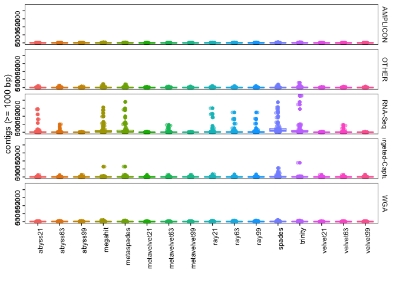<!-- -->

```r
make_boxplot("Largest alignment")
```

```
## # A tibble: 80 x 4
## # Groups:   Assay_Type [5]
##    Assay_Type       X2             mean median
##    <chr>            <fct>         <dbl>  <dbl>
##  1 AMPLICON         abyss21      13111. 12314.
##  2 AMPLICON         abyss63      10592.  6996 
##  3 AMPLICON         abyss99       6017.  2917 
##  4 AMPLICON         megahit      23870. 29079 
##  5 AMPLICON         metaspades   24064. 29815 
##  6 AMPLICON         metavelvet21   779.   681 
##  7 AMPLICON         metavelvet63  1593.   841 
##  8 AMPLICON         metavelvet99  1080.   969 
##  9 AMPLICON         ray21        14817. 13799 
## 10 AMPLICON         ray63        14233. 13346 
## 11 AMPLICON         ray99        14212. 13346 
## 12 AMPLICON         spades       18527. 18945 
## 13 AMPLICON         trinity      15790  16706 
## 14 AMPLICON         velvet21       782.   681 
## 15 AMPLICON         velvet63      1585.   822.
## 16 AMPLICON         velvet99      1098    967 
## 17 OTHER            abyss21      14366. 12821 
## 18 OTHER            abyss63      17993. 20560 
## 19 OTHER            abyss99      19405. 27571 
## 20 OTHER            megahit      23181. 29834.
## 21 OTHER            metaspades   20801. 25414 
## 22 OTHER            metavelvet21  1785.  1410 
## 23 OTHER            metavelvet63  1845.  1155 
## 24 OTHER            metavelvet99  2234.  1804 
## 25 OTHER            ray21        17366. 22939 
## 26 OTHER            ray63        19797. 27601 
## 27 OTHER            ray99        19771. 27601 
## 28 OTHER            spades       22337. 29856.
## 29 OTHER            trinity      20306. 29850 
## 30 OTHER            velvet21      1806.  1410 
## 31 OTHER            velvet63      1843.  1072.
## 32 OTHER            velvet99      2278.  1869 
## 33 RNA-Seq          abyss21       1583.   824.
## 34 RNA-Seq          abyss63       5355.  2833 
## 35 RNA-Seq          abyss99       8550.  4142 
## 36 RNA-Seq          megahit      21627. 29831 
## 37 RNA-Seq          metaspades   20421. 29798 
## 38 RNA-Seq          metavelvet21   755.   724.
## 39 RNA-Seq          metavelvet63  2407.  1858 
## 40 RNA-Seq          metavelvet99  3105.  1699 
## 41 RNA-Seq          ray21        21508. 25418 
## 42 RNA-Seq          ray63        20577. 25122 
## 43 RNA-Seq          ray99        20577. 25122 
## 44 RNA-Seq          spades       22124. 29839 
## 45 RNA-Seq          trinity       9685.  7338.
## 46 RNA-Seq          velvet21       760    727 
## 47 RNA-Seq          velvet63      2407.  1858 
## 48 RNA-Seq          velvet99      3100.  1699 
## 49 Targeted-Capture abyss21      18033. 24962.
## 50 Targeted-Capture abyss63      16996. 25428 
## 51 Targeted-Capture abyss99      15980. 12836 
## 52 Targeted-Capture megahit      21403. 29850.
## 53 Targeted-Capture metaspades   19491. 25414 
## 54 Targeted-Capture metavelvet21  1027.   882.
## 55 Targeted-Capture metavelvet63  1609   1174 
## 56 Targeted-Capture metavelvet99  4081.  2914 
## 57 Targeted-Capture ray21        18079. 22934 
## 58 Targeted-Capture ray63        17771. 26737 
## 59 Targeted-Capture ray99        17771. 26737 
## 60 Targeted-Capture spades       21153. 29790 
## 61 Targeted-Capture trinity      13278. 10347 
## 62 Targeted-Capture velvet21      1033.   883 
## 63 Targeted-Capture velvet63      1583.  1174 
## 64 Targeted-Capture velvet99      4133.  2914 
## 65 WGA              abyss21      17413. 22277 
## 66 WGA              abyss63      11329.  9994 
## 67 WGA              abyss99       4083.  3084 
## 68 WGA              megahit      26165  29819 
## 69 WGA              metaspades   26407. 29818 
## 70 WGA              metavelvet21   701.   624 
## 71 WGA              metavelvet63   856.   765 
## 72 WGA              metavelvet99   933.   846.
## 73 WGA              ray21        22195. 26497 
## 74 WGA              ray63        22741. 27092 
## 75 WGA              ray99        22741. 27092 
## 76 WGA              spades       16099. 15298 
## 77 WGA              trinity      25182. 29819 
## 78 WGA              velvet21       698.   638.
## 79 WGA              velvet63       866.   758.
## 80 WGA              velvet99       934.   863
```

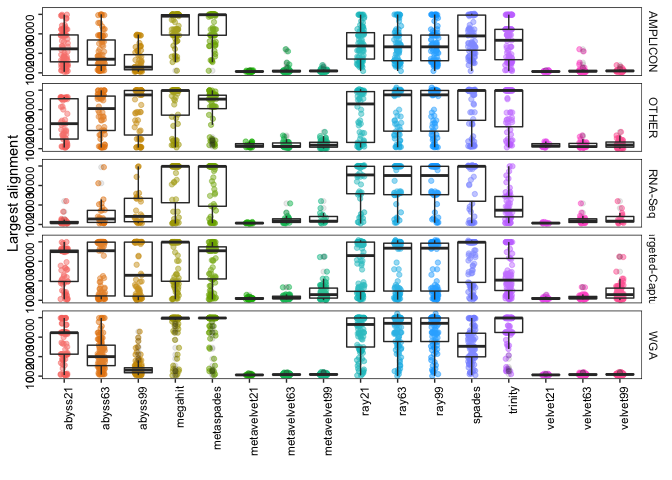<!-- -->

```r
make_boxplot("mismatches per 100 kbp")
```

```
## # A tibble: 80 x 4
## # Groups:   Assay_Type [5]
##    Assay_Type       X2            mean median
##    <chr>            <fct>        <dbl>  <dbl>
##  1 AMPLICON         abyss21       24.6  25.3 
##  2 AMPLICON         abyss63       27.1  26.9 
##  3 AMPLICON         abyss99       27.4  25.6 
##  4 AMPLICON         megahit       28.8  27.2 
##  5 AMPLICON         metaspades    26.6  26.8 
##  6 AMPLICON         metavelvet21  61.1   0   
##  7 AMPLICON         metavelvet63  40.4  19.6 
##  8 AMPLICON         metavelvet99  58.1  31.1 
##  9 AMPLICON         ray21         38.9  36.9 
## 10 AMPLICON         ray63         39.4  37.7 
## 11 AMPLICON         ray99         39.3  37.7 
## 12 AMPLICON         spades        55.2  36.9 
## 13 AMPLICON         trinity       35.8  30.8 
## 14 AMPLICON         velvet21      61.1   0   
## 15 AMPLICON         velvet63      40.2  19.4 
## 16 AMPLICON         velvet99      61.8  34.8 
## 17 OTHER            abyss21       31.0  28.1 
## 18 OTHER            abyss63       29.8  27.4 
## 19 OTHER            abyss99       29.2  26.9 
## 20 OTHER            megahit       38.1  33.5 
## 21 OTHER            metaspades    36.5  33.5 
## 22 OTHER            metavelvet21  64.5  32.1 
## 23 OTHER            metavelvet63  40.0  27.2 
## 24 OTHER            metavelvet99  41.2  25.4 
## 25 OTHER            ray21         34.8  30.8 
## 26 OTHER            ray63         33.6  30.7 
## 27 OTHER            ray99         33.5  30.7 
## 28 OTHER            spades        61.0  36.8 
## 29 OTHER            trinity       55.7  43.5 
## 30 OTHER            velvet21      63.6  45.9 
## 31 OTHER            velvet63      42.0  27.5 
## 32 OTHER            velvet99      42.6  25.6 
## 33 RNA-Seq          abyss21       33.0   0   
## 34 RNA-Seq          abyss63       19.3  19.4 
## 35 RNA-Seq          abyss99       25.7  26.2 
## 36 RNA-Seq          megahit       32.5  26.8 
## 37 RNA-Seq          metaspades    36.9  26.8 
## 38 RNA-Seq          metavelvet21  60.7  14.4 
## 39 RNA-Seq          metavelvet63  18.9  18.1 
## 40 RNA-Seq          metavelvet99  36.1  25.2 
## 41 RNA-Seq          ray21         42.8  40.2 
## 42 RNA-Seq          ray63         33.3  32.5 
## 43 RNA-Seq          ray99         33.3  32.5 
## 44 RNA-Seq          spades       798.   43.6 
## 45 RNA-Seq          trinity       61.2  38.9 
## 46 RNA-Seq          velvet21      51.2   8.66
## 47 RNA-Seq          velvet63      18.9  18.1 
## 48 RNA-Seq          velvet99      36.0  25.2 
## 49 Targeted-Capture abyss21       24.6  24.7 
## 50 Targeted-Capture abyss63       27.4  25.0 
## 51 Targeted-Capture abyss99       28.4  26.0 
## 52 Targeted-Capture megahit       37.9  26.8 
## 53 Targeted-Capture metaspades    38.6  27.1 
## 54 Targeted-Capture metavelvet21  27.8  21.1 
## 55 Targeted-Capture metavelvet63  31.1  25.5 
## 56 Targeted-Capture metavelvet99  26.5  19.2 
## 57 Targeted-Capture ray21         32.1  30.1 
## 58 Targeted-Capture ray63         35.8  30.1 
## 59 Targeted-Capture ray99         35.8  30.1 
## 60 Targeted-Capture spades       245.   40.2 
## 61 Targeted-Capture trinity       64.6  36.8 
## 62 Targeted-Capture velvet21      28.1  21.1 
## 63 Targeted-Capture velvet63      31.6  23.9 
## 64 Targeted-Capture velvet99      27.8  20.7 
## 65 WGA              abyss21       26.8  23.8 
## 66 WGA              abyss63       26.4  23.9 
## 67 WGA              abyss99       23.8  24.2 
## 68 WGA              megahit       32.3  26.8 
## 69 WGA              metaspades    28.9  26.8 
## 70 WGA              metavelvet21  26.4   0   
## 71 WGA              metavelvet63  31.6  21.5 
## 72 WGA              metavelvet99  49.9  45.1 
## 73 WGA              ray21         43.1  33.5 
## 74 WGA              ray63         36.5  33.5 
## 75 WGA              ray99         36.5  33.5 
## 76 WGA              spades        29.7  26.8 
## 77 WGA              trinity       33.3  28.0 
## 78 WGA              velvet21      28.8   0   
## 79 WGA              velvet63      31.4  22.0 
## 80 WGA              velvet99      43.0  35.4
```

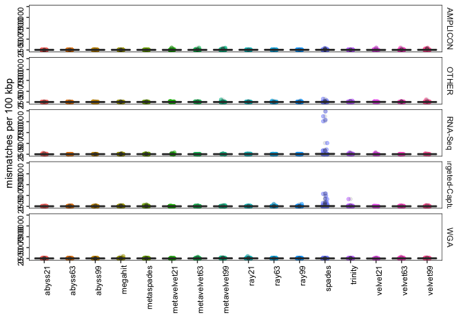<!-- -->

```r
make_boxplot("indels per 100 kbp")
```

```
## # A tibble: 80 x 4
## # Groups:   Assay_Type [5]
##    Assay_Type       X2             mean median
##    <chr>            <fct>         <dbl>  <dbl>
##  1 AMPLICON         abyss21       9.77    3.48
##  2 AMPLICON         abyss63       5.69    3.39
##  3 AMPLICON         abyss99       7.38    0   
##  4 AMPLICON         megahit       1.80    0   
##  5 AMPLICON         metaspades    0.966   0   
##  6 AMPLICON         metavelvet21  4.52    0   
##  7 AMPLICON         metavelvet63  4.21    0   
##  8 AMPLICON         metavelvet99 23.0     0   
##  9 AMPLICON         ray21         7.23    3.35
## 10 AMPLICON         ray63         9.44    3.61
## 11 AMPLICON         ray99         9.41    3.61
## 12 AMPLICON         spades       12.1     3.42
## 13 AMPLICON         trinity       4.80    0   
## 14 AMPLICON         velvet21      2.87    0   
## 15 AMPLICON         velvet63      3.48    0   
## 16 AMPLICON         velvet99     25.6     0   
## 17 OTHER            abyss21       2.49    0   
## 18 OTHER            abyss63       2.29    0   
## 19 OTHER            abyss99       1.15    0   
## 20 OTHER            megahit       1.54    0   
## 21 OTHER            metaspades    0.939   0   
## 22 OTHER            metavelvet21  4.61    0   
## 23 OTHER            metavelvet63  1.26    0   
## 24 OTHER            metavelvet99  1.27    0   
## 25 OTHER            ray21         0.625   0   
## 26 OTHER            ray63         0.656   0   
## 27 OTHER            ray99         0.656   0   
## 28 OTHER            spades        4.38    0   
## 29 OTHER            trinity       3.61    0   
## 30 OTHER            velvet21      4.69    0   
## 31 OTHER            velvet63      1.05    0   
## 32 OTHER            velvet99      1.05    0   
## 33 RNA-Seq          abyss21       0.499   0   
## 34 RNA-Seq          abyss63       3.75    0   
## 35 RNA-Seq          abyss99       1.80    0   
## 36 RNA-Seq          megahit       0.120   0   
## 37 RNA-Seq          metaspades    8.70    0   
## 38 RNA-Seq          metavelvet21  0       0   
## 39 RNA-Seq          metavelvet63  0       0   
## 40 RNA-Seq          metavelvet99  0       0   
## 41 RNA-Seq          ray21         0.316   0   
## 42 RNA-Seq          ray63         0.237   0   
## 43 RNA-Seq          ray99         0.237   0   
## 44 RNA-Seq          spades        7.41    0   
## 45 RNA-Seq          trinity       1.01    0   
## 46 RNA-Seq          velvet21      0       0   
## 47 RNA-Seq          velvet63      0       0   
## 48 RNA-Seq          velvet99      0       0   
## 49 Targeted-Capture abyss21       7.20    3.5 
## 50 Targeted-Capture abyss63       8.36    3.35
## 51 Targeted-Capture abyss99       3.10    3.35
## 52 Targeted-Capture megahit       6.09    0   
## 53 Targeted-Capture metaspades   12.8     0   
## 54 Targeted-Capture metavelvet21  6.67    0   
## 55 Targeted-Capture metavelvet63  6.41    0   
## 56 Targeted-Capture metavelvet99  1.37    0   
## 57 Targeted-Capture ray21         2.54    0   
## 58 Targeted-Capture ray63         3.41    0   
## 59 Targeted-Capture ray99         3.41    0   
## 60 Targeted-Capture spades       56.4     6.7 
## 61 Targeted-Capture trinity      15.8     3.35
## 62 Targeted-Capture velvet21     17.9     0   
## 63 Targeted-Capture velvet63      5.70    0   
## 64 Targeted-Capture velvet99      1.37    0   
## 65 WGA              abyss21       7.14    0   
## 66 WGA              abyss63       5.13    0   
## 67 WGA              abyss99       4.16    0   
## 68 WGA              megahit       7.78    0   
## 69 WGA              metaspades    2.28    0   
## 70 WGA              metavelvet21  6.16    0   
## 71 WGA              metavelvet63  7.47    0   
## 72 WGA              metavelvet99 22.0    17.2 
## 73 WGA              ray21        15.0     6.71
## 74 WGA              ray63         8.91    3.44
## 75 WGA              ray99         8.91    3.44
## 76 WGA              spades        4.01    0   
## 77 WGA              trinity       6.66    0   
## 78 WGA              velvet21      6.81    0   
## 79 WGA              velvet63      8.93    0   
## 80 WGA              velvet99     19.9    16.8
```

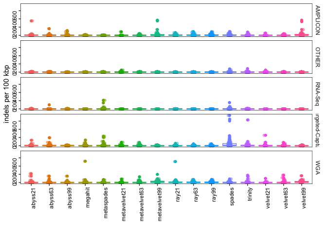<!-- -->

```r
make_boxplot("Total aligned length")
```

```
## # A tibble: 80 x 4
## # Groups:   Assay_Type [5]
##    Assay_Type       X2              mean median
##    <chr>            <fct>          <dbl>  <dbl>
##  1 AMPLICON         abyss21       25541. 28664.
##  2 AMPLICON         abyss63       25150. 28892 
##  3 AMPLICON         abyss99       21509. 25098.
##  4 AMPLICON         megahit       29217. 29814 
##  5 AMPLICON         metaspades    29203. 29821 
##  6 AMPLICON         metavelvet21   2103.  1165 
##  7 AMPLICON         metavelvet63   7078.  3156.
##  8 AMPLICON         metavelvet99   7585.  6362.
##  9 AMPLICON         ray21         29294. 29823 
## 10 AMPLICON         ray63         29062. 29740 
## 11 AMPLICON         ray99         29060. 29740 
## 12 AMPLICON         spades        36456. 29930 
## 13 AMPLICON         trinity       30214. 29819 
## 14 AMPLICON         velvet21       2139.  1430 
## 15 AMPLICON         velvet63       7143.  3334.
## 16 AMPLICON         velvet99       7733.  6378 
## 17 OTHER            abyss21       24277. 28223 
## 18 OTHER            abyss63       25334. 29417 
## 19 OTHER            abyss99       25135. 29846 
## 20 OTHER            megahit       27789. 29869 
## 21 OTHER            metaspades    27803. 29928.
## 22 OTHER            metavelvet21  11915. 10127 
## 23 OTHER            metavelvet63  10915.  7386 
## 24 OTHER            metavelvet99  14350. 16673 
## 25 OTHER            ray21         25581. 29851 
## 26 OTHER            ray63         26903. 29862.
## 27 OTHER            ray99         26895. 29862.
## 28 OTHER            spades        32666. 29868.
## 29 OTHER            trinity       42546. 33988 
## 30 OTHER            velvet21      11846. 10127 
## 31 OTHER            velvet63      11272.  7785 
## 32 OTHER            velvet99      14431. 17285 
## 33 RNA-Seq          abyss21        6962.  2647 
## 34 RNA-Seq          abyss63       16939. 19314.
## 35 RNA-Seq          abyss99       21120. 27400 
## 36 RNA-Seq          megahit       24467. 29836 
## 37 RNA-Seq          metaspades    24726. 29840.
## 38 RNA-Seq          metavelvet21   3598   1270.
## 39 RNA-Seq          metavelvet63  14660. 16758.
## 40 RNA-Seq          metavelvet99  18100. 19903 
## 41 RNA-Seq          ray21         35962. 30580 
## 42 RNA-Seq          ray63         31561. 30476.
## 43 RNA-Seq          ray99         31561. 30476.
## 44 RNA-Seq          spades       491775. 29904.
## 45 RNA-Seq          trinity       47853. 40355 
## 46 RNA-Seq          velvet21       3713.  1192 
## 47 RNA-Seq          velvet63      14679. 16758.
## 48 RNA-Seq          velvet99      18145. 19903 
## 49 Targeted-Capture abyss21       25497. 28497 
## 50 Targeted-Capture abyss63       22195. 29428.
## 51 Targeted-Capture abyss99       21532. 29289 
## 52 Targeted-Capture megahit       27742. 29855 
## 53 Targeted-Capture metaspades    32992. 29859 
## 54 Targeted-Capture metavelvet21   6642.  4230 
## 55 Targeted-Capture metavelvet63   9588.  7561 
## 56 Targeted-Capture metavelvet99  17572. 22024 
## 57 Targeted-Capture ray21         26393. 29856 
## 58 Targeted-Capture ray63         26159. 29854 
## 59 Targeted-Capture ray99         26142. 29854 
## 60 Targeted-Capture spades       180248. 29873 
## 61 Targeted-Capture trinity       36206. 32353 
## 62 Targeted-Capture velvet21       6590.  4229 
## 63 Targeted-Capture velvet63       9619.  8266 
## 64 Targeted-Capture velvet99      18047. 22434 
## 65 WGA              abyss21       26214. 29506.
## 66 WGA              abyss63       26751. 29680.
## 67 WGA              abyss99       22042. 25441 
## 68 WGA              megahit       28036. 29821 
## 69 WGA              metaspades    28267. 29819 
## 70 WGA              metavelvet21   2131.   656.
## 71 WGA              metavelvet63   4413.  2906.
## 72 WGA              metavelvet99   6479.  6386.
## 73 WGA              ray21         31125. 29842.
## 74 WGA              ray63         30057. 29829 
## 75 WGA              ray99         30057. 29829 
## 76 WGA              spades        28812. 29874 
## 77 WGA              trinity       33503. 29850.
## 78 WGA              velvet21       2195.   876.
## 79 WGA              velvet63       4430.  3019 
## 80 WGA              velvet99       6403.  6214
```

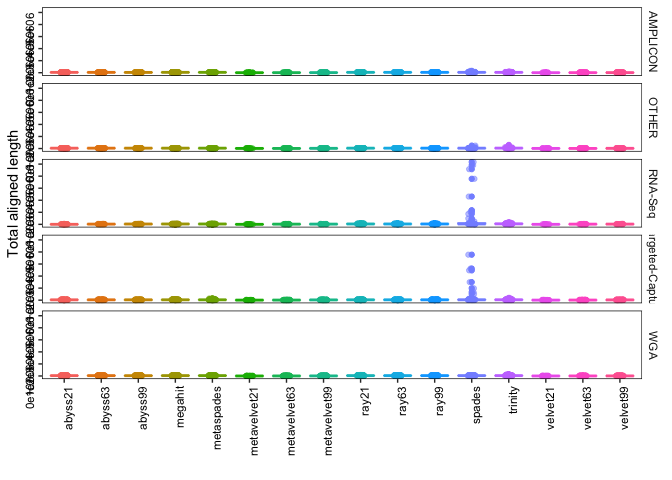<!-- -->

```r
make_boxplot("misassemblies")
```

```
## # A tibble: 80 x 4
## # Groups:   Assay_Type [5]
##    Assay_Type       X2              mean median
##    <chr>            <fct>          <dbl>  <dbl>
##  1 AMPLICON         abyss21       0.0128      0
##  2 AMPLICON         abyss63       0.0270      0
##  3 AMPLICON         abyss99       0.0938      0
##  4 AMPLICON         megahit       0.111       0
##  5 AMPLICON         metaspades    0           0
##  6 AMPLICON         metavelvet21  0           0
##  7 AMPLICON         metavelvet63  0           0
##  8 AMPLICON         metavelvet99  0.258       0
##  9 AMPLICON         ray21         0.617       0
## 10 AMPLICON         ray63         0.235       0
## 11 AMPLICON         ray99         0.235       0
## 12 AMPLICON         spades        0.370       0
## 13 AMPLICON         trinity       0.0494      0
## 14 AMPLICON         velvet21      0           0
## 15 AMPLICON         velvet63      0           0
## 16 AMPLICON         velvet99      0.226       0
## 17 OTHER            abyss21       0.0169      0
## 18 OTHER            abyss63       0           0
## 19 OTHER            abyss99       0.0339      0
## 20 OTHER            megahit       0.0625      0
## 21 OTHER            metaspades    0.0312      0
## 22 OTHER            metavelvet21  0           0
## 23 OTHER            metavelvet63  0           0
## 24 OTHER            metavelvet99  0.0566      0
## 25 OTHER            ray21         0.0781      0
## 26 OTHER            ray63         0.0484      0
## 27 OTHER            ray99         0.0323      0
## 28 OTHER            spades        0.156       0
## 29 OTHER            trinity       0.109       0
## 30 OTHER            velvet21      0           0
## 31 OTHER            velvet63      0           0
## 32 OTHER            velvet99      0.0755      0
## 33 RNA-Seq          abyss21       0.0312      0
## 34 RNA-Seq          abyss63       0           0
## 35 RNA-Seq          abyss99       0.0769      0
## 36 RNA-Seq          megahit       0.0357      0
## 37 RNA-Seq          metaspades    0.0357      0
## 38 RNA-Seq          metavelvet21  0.0714      0
## 39 RNA-Seq          metavelvet63  0           0
## 40 RNA-Seq          metavelvet99  0           0
## 41 RNA-Seq          ray21         1.23        1
## 42 RNA-Seq          ray63         1.11        1
## 43 RNA-Seq          ray99         1.11        1
## 44 RNA-Seq          spades       13.7         0
## 45 RNA-Seq          trinity       2.72        0
## 46 RNA-Seq          velvet21      0.0714      0
## 47 RNA-Seq          velvet63      0           0
## 48 RNA-Seq          velvet99      0           0
## 49 Targeted-Capture abyss21       0           0
## 50 Targeted-Capture abyss63       0.0128      0
## 51 Targeted-Capture abyss99       0           0
## 52 Targeted-Capture megahit       0.580       0
## 53 Targeted-Capture metaspades    1.46        0
## 54 Targeted-Capture metavelvet21  0           0
## 55 Targeted-Capture metavelvet63  0           0
## 56 Targeted-Capture metavelvet99  0           0
## 57 Targeted-Capture ray21         0.576       0
## 58 Targeted-Capture ray63         0.729       0
## 59 Targeted-Capture ray99         0.706       0
## 60 Targeted-Capture spades       11.6         0
## 61 Targeted-Capture trinity       3.06        0
## 62 Targeted-Capture velvet21      0           0
## 63 Targeted-Capture velvet63      0           0
## 64 Targeted-Capture velvet99      0           0
## 65 WGA              abyss21       0           0
## 66 WGA              abyss63       0           0
## 67 WGA              abyss99       0.221       0
## 68 WGA              megahit       0.0612      0
## 69 WGA              metaspades    0.0103      0
## 70 WGA              metavelvet21  0           0
## 71 WGA              metavelvet63  0           0
## 72 WGA              metavelvet99  0.298       0
## 73 WGA              ray21         0.724       0
## 74 WGA              ray63         0.433       0
## 75 WGA              ray99         0.433       0
## 76 WGA              spades        0.0619      0
## 77 WGA              trinity       0.104       0
## 78 WGA              velvet21      0           0
## 79 WGA              velvet63      0           0
## 80 WGA              velvet99      0.344       0
```

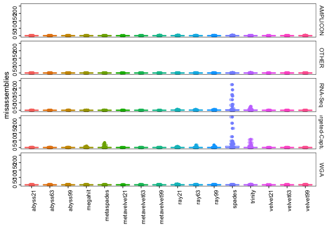<!-- -->

```r
#make_boxplot("unaligned contigs")
make_boxplot("N50")
```

```
## # A tibble: 80 x 4
## # Groups:   Assay_Type [5]
##    Assay_Type       X2             mean median
##    <chr>            <fct>         <dbl>  <dbl>
##  1 AMPLICON         abyss21      11643.  8250.
##  2 AMPLICON         abyss63       8927.  4117 
##  3 AMPLICON         abyss99       4241.  1278.
##  4 AMPLICON         megahit      22997. 28204 
##  5 AMPLICON         metaspades   23082. 29828 
##  6 AMPLICON         metavelvet21   671.   596 
##  7 AMPLICON         metavelvet63   890.   648 
##  8 AMPLICON         metavelvet99   708.   658 
##  9 AMPLICON         ray21        13430. 12080.
## 10 AMPLICON         ray63        12477.  8068 
## 11 AMPLICON         ray99        12477.  8068 
## 12 AMPLICON         spades       16764. 15790.
## 13 AMPLICON         trinity      15029. 13837 
## 14 AMPLICON         velvet21       673.   596 
## 15 AMPLICON         velvet63       880.   629 
## 16 AMPLICON         velvet99       706.   663 
## 17 OTHER            abyss21      12138.  6523 
## 18 OTHER            abyss63      15189. 16418 
## 19 OTHER            abyss99      16780. 18796 
## 20 OTHER            megahit      18282. 28185 
## 21 OTHER            metaspades   16174. 21584 
## 22 OTHER            metavelvet21   763    662 
## 23 OTHER            metavelvet63   805.   701 
## 24 OTHER            metavelvet99  1075.   792 
## 25 OTHER            ray21        15143.  9286.
## 26 OTHER            ray63        16331. 17003 
## 27 OTHER            ray99        16336. 17003 
## 28 OTHER            spades       17970. 26503 
## 29 OTHER            trinity      15079. 12610.
## 30 OTHER            velvet21       781.   665 
## 31 OTHER            velvet63       839.   710.
## 32 OTHER            velvet99      1070.   792 
## 33 RNA-Seq          abyss21        885.   696 
## 34 RNA-Seq          abyss63       1233.   758 
## 35 RNA-Seq          abyss99       3561.   700 
## 36 RNA-Seq          megahit       2992.   919 
## 37 RNA-Seq          metaspades    2902.   813 
## 38 RNA-Seq          metavelvet21   589.   583 
## 39 RNA-Seq          metavelvet63   783.   734 
## 40 RNA-Seq          metavelvet99  1312.  1014.
## 41 RNA-Seq          ray21         6800.  1273 
## 42 RNA-Seq          ray63         6099.  1234 
## 43 RNA-Seq          ray99         6097.  1228 
## 44 RNA-Seq          spades        7600.  2000 
## 45 RNA-Seq          trinity       2213.   895 
## 46 RNA-Seq          velvet21       585.   584 
## 47 RNA-Seq          velvet63       781.   729 
## 48 RNA-Seq          velvet99      1317.  1034 
## 49 Targeted-Capture abyss21      13101.  8657 
## 50 Targeted-Capture abyss63      13778.  3266 
## 51 Targeted-Capture abyss99      12933.  2678 
## 52 Targeted-Capture megahit      16162. 16225 
## 53 Targeted-Capture metaspades   16179. 25414 
## 54 Targeted-Capture metavelvet21   652.   594.
## 55 Targeted-Capture metavelvet63   865.   708.
## 56 Targeted-Capture metavelvet99  2458.  1038 
## 57 Targeted-Capture ray21        14766.  5998 
## 58 Targeted-Capture ray63        14280.  4193 
## 59 Targeted-Capture ray99        14288.  4193 
## 60 Targeted-Capture spades       18501. 28971 
## 61 Targeted-Capture trinity      10320.  6489 
## 62 Targeted-Capture velvet21       672.   629 
## 63 Targeted-Capture velvet63       869.   706.
## 64 Targeted-Capture velvet99      2377.  1053 
## 65 WGA              abyss21      15478. 22264.
## 66 WGA              abyss63       8825.  5290.
## 67 WGA              abyss99       2141.  1230.
## 68 WGA              megahit      21716. 29839 
## 69 WGA              metaspades   21808. 29840 
## 70 WGA              metavelvet21   626.   629 
## 71 WGA              metavelvet63   653.   629 
## 72 WGA              metavelvet99   647.   632.
## 73 WGA              ray21        21991. 27294.
## 74 WGA              ray63        21569. 27993 
## 75 WGA              ray99        21569. 27993 
## 76 WGA              spades       12524.  9287 
## 77 WGA              trinity      21034. 29817 
## 78 WGA              velvet21       625.   624 
## 79 WGA              velvet63       655.   634 
## 80 WGA              velvet99       648.   628
```

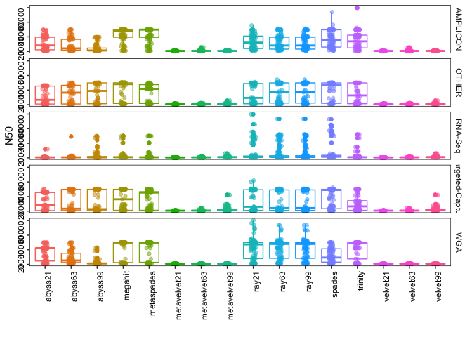<!-- -->

```r
make_boxplot("N75")
```

```
## # A tibble: 80 x 4
## # Groups:   Assay_Type [5]
##    Assay_Type       X2             mean median
##    <chr>            <fct>         <dbl>  <dbl>
##  1 AMPLICON         abyss21       8296.  5720.
##  2 AMPLICON         abyss63       6135.  2545 
##  3 AMPLICON         abyss99       2238.   713 
##  4 AMPLICON         megahit      19433. 26626 
##  5 AMPLICON         metaspades   19953. 29431 
##  6 AMPLICON         metavelvet21   593.   556 
##  7 AMPLICON         metavelvet63   704.   560 
##  8 AMPLICON         metavelvet99   608.   584 
##  9 AMPLICON         ray21         9378.  6886.
## 10 AMPLICON         ray63         9410.  6212.
## 11 AMPLICON         ray99         9410.  6212.
## 12 AMPLICON         spades       11730.  7612.
## 13 AMPLICON         trinity      11173.  7110.
## 14 AMPLICON         velvet21       593.   558 
## 15 AMPLICON         velvet63       721.   560 
## 16 AMPLICON         velvet99       610.   586 
## 17 OTHER            abyss21      10849.  2901 
## 18 OTHER            abyss63      12882.  4747 
## 19 OTHER            abyss99      15833. 12065 
## 20 OTHER            megahit      13674.  3486.
## 21 OTHER            metaspades    7465.  1836 
## 22 OTHER            metavelvet21   622.   571 
## 23 OTHER            metavelvet63   635.   587 
## 24 OTHER            metavelvet99   730.   608 
## 25 OTHER            ray21        10226.  2140.
## 26 OTHER            ray63        11503.  2839 
## 27 OTHER            ray99        11504.  2839 
## 28 OTHER            spades       12898.  4170.
## 29 OTHER            trinity       5104.  1646 
## 30 OTHER            velvet21       618.   572 
## 31 OTHER            velvet63       658.   594 
## 32 OTHER            velvet99       749.   633 
## 33 RNA-Seq          abyss21        745.   569 
## 34 RNA-Seq          abyss63       1025.   606.
## 35 RNA-Seq          abyss99       2637.   633 
## 36 RNA-Seq          megahit       1228.   648 
## 37 RNA-Seq          metaspades    1604.   617 
## 38 RNA-Seq          metavelvet21   543.   534 
## 39 RNA-Seq          metavelvet63   606.   590 
## 40 RNA-Seq          metavelvet99   953.   788.
## 41 RNA-Seq          ray21         2310.   776 
## 42 RNA-Seq          ray63         1766.   781 
## 43 RNA-Seq          ray99         1770.   781 
## 44 RNA-Seq          spades        3867.   902 
## 45 RNA-Seq          trinity        935.   620 
## 46 RNA-Seq          velvet21       542.   536.
## 47 RNA-Seq          velvet63       606.   589 
## 48 RNA-Seq          velvet99       954.   806 
## 49 Targeted-Capture abyss21      12054.  5664.
## 50 Targeted-Capture abyss63      13548.  1926 
## 51 Targeted-Capture abyss99      12228.  1072 
## 52 Targeted-Capture megahit      15248.  9211 
## 53 Targeted-Capture metaspades   14706. 14101 
## 54 Targeted-Capture metavelvet21   582.   551 
## 55 Targeted-Capture metavelvet63   679.   578.
## 56 Targeted-Capture metavelvet99  1733.   754 
## 57 Targeted-Capture ray21        13918.  2950 
## 58 Targeted-Capture ray63        13516.  2070 
## 59 Targeted-Capture ray99        13521.  2220 
## 60 Targeted-Capture spades       16637. 21340 
## 61 Targeted-Capture trinity       7605.  2533 
## 62 Targeted-Capture velvet21       595.   554 
## 63 Targeted-Capture velvet63       676.   576 
## 64 Targeted-Capture velvet99      1726.   750 
## 65 WGA              abyss21      13161. 11025 
## 66 WGA              abyss63       5769.  3188.
## 67 WGA              abyss99       1490.   788.
## 68 WGA              megahit      17146. 29822 
## 69 WGA              metaspades   18249. 29836 
## 70 WGA              metavelvet21   565.   562.
## 71 WGA              metavelvet63   580.   550 
## 72 WGA              metavelvet99   562.   554 
## 73 WGA              ray21        18047. 12058 
## 74 WGA              ray63        18708. 24722.
## 75 WGA              ray99        18708. 24722.
## 76 WGA              spades        8464.  4127 
## 77 WGA              trinity      14603.  7420.
## 78 WGA              velvet21       567.   562.
## 79 WGA              velvet63       575.   555 
## 80 WGA              velvet99       564.   553
```

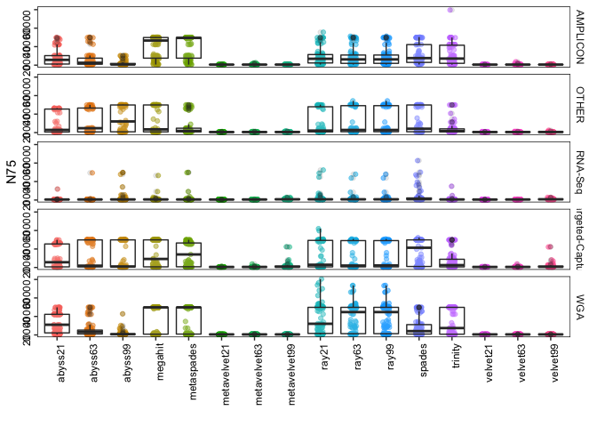<!-- -->

```r
make_boxplot("L50")
```

```
## # A tibble: 80 x 4
## # Groups:   Assay_Type [5]
##    Assay_Type       X2             mean median
##    <chr>            <fct>         <dbl>  <dbl>
##  1 AMPLICON         abyss21        2.56    2  
##  2 AMPLICON         abyss63        3.22    3  
##  3 AMPLICON         abyss99        4.88    4  
##  4 AMPLICON         megahit        1.85    1  
##  5 AMPLICON         metaspades     1.59    1  
##  6 AMPLICON         metavelvet21   2.28    1  
##  7 AMPLICON         metavelvet63   3.39    2  
##  8 AMPLICON         metavelvet99   4.98    5  
##  9 AMPLICON         ray21          2.41    2  
## 10 AMPLICON         ray63          2.60    2  
## 11 AMPLICON         ray99          2.61    2  
## 12 AMPLICON         spades         2.37    2  
## 13 AMPLICON         trinity        2.39    1  
## 14 AMPLICON         velvet21       2.28    1  
## 15 AMPLICON         velvet63       3.51    3  
## 16 AMPLICON         velvet99       5.08    5  
## 17 OTHER            abyss21       10.6     2  
## 18 OTHER            abyss63        9.18    1  
## 19 OTHER            abyss99        7.41    1  
## 20 OTHER            megahit       17.3     1  
## 21 OTHER            metaspades    14.5     1  
## 22 OTHER            metavelvet21  16.6     4  
## 23 OTHER            metavelvet63  13.7     5  
## 24 OTHER            metavelvet99  13.0     6  
## 25 OTHER            ray21          5.77    1  
## 26 OTHER            ray63          5.2     1  
## 27 OTHER            ray99          5.17    1  
## 28 OTHER            spades        11.6     1  
## 29 OTHER            trinity       18.8     2  
## 30 OTHER            velvet21      16.6     4  
## 31 OTHER            velvet63      14.4     5  
## 32 OTHER            velvet99      12.9     6  
## 33 RNA-Seq          abyss21      155.     24  
## 34 RNA-Seq          abyss63       62.4     9  
## 35 RNA-Seq          abyss99        3.70    2  
## 36 RNA-Seq          megahit      185.     45  
## 37 RNA-Seq          metaspades   232.     61  
## 38 RNA-Seq          metavelvet21  75.6    15  
## 39 RNA-Seq          metavelvet63  64.4    10  
## 40 RNA-Seq          metavelvet99   4.05    2  
## 41 RNA-Seq          ray21         87.1     9  
## 42 RNA-Seq          ray63         71.5     9  
## 43 RNA-Seq          ray99         71.5     9  
## 44 RNA-Seq          spades       186.     51  
## 45 RNA-Seq          trinity      268.     58  
## 46 RNA-Seq          velvet21      76.6    19  
## 47 RNA-Seq          velvet63      64.5    10  
## 48 RNA-Seq          velvet99       4.05    2  
## 49 Targeted-Capture abyss21        3.33    1  
## 50 Targeted-Capture abyss63        3.80    2  
## 51 Targeted-Capture abyss99        3.97    2  
## 52 Targeted-Capture megahit       36.1     1  
## 53 Targeted-Capture metaspades    33.9     1  
## 54 Targeted-Capture metavelvet21  30.3     3  
## 55 Targeted-Capture metavelvet63  18.8     4  
## 56 Targeted-Capture metavelvet99  12.9     4  
## 57 Targeted-Capture ray21         11.7     2  
## 58 Targeted-Capture ray63         11.0     3  
## 59 Targeted-Capture ray99         10.9     3  
## 60 Targeted-Capture spades        38.1     1  
## 61 Targeted-Capture trinity       24.4     3  
## 62 Targeted-Capture velvet21      30.4     3  
## 63 Targeted-Capture velvet63      18.7     4  
## 64 Targeted-Capture velvet99      13.0     4  
## 65 WGA              abyss21        5.08    1  
## 66 WGA              abyss63        7.51    2  
## 67 WGA              abyss99       10.3     7  
## 68 WGA              megahit       10.9     1  
## 69 WGA              metaspades     8.97    1  
## 70 WGA              metavelvet21   7.74    2.5
## 71 WGA              metavelvet63  10.1     5  
## 72 WGA              metavelvet99  10.4     7  
## 73 WGA              ray21          4.65    1  
## 74 WGA              ray63          5.04    1  
## 75 WGA              ray99          5.03    1  
## 76 WGA              spades         8.94    2  
## 77 WGA              trinity       12.1     1  
## 78 WGA              velvet21       7.85    3  
## 79 WGA              velvet63      10       4  
## 80 WGA              velvet99      10.3     6
```

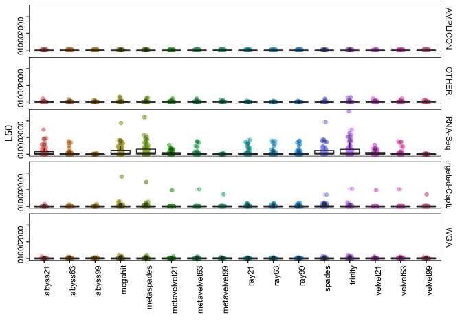<!-- -->

```r
make_boxplot("L75")
```

```
## # A tibble: 80 x 4
## # Groups:   Assay_Type [5]
##    Assay_Type       X2             mean median
##    <chr>            <fct>         <dbl>  <dbl>
##  1 AMPLICON         abyss21        4.4     3  
##  2 AMPLICON         abyss63        5.79    5  
##  3 AMPLICON         abyss99        8.65    7.5
##  4 AMPLICON         megahit        3.27    1  
##  5 AMPLICON         metaspades     2.60    1  
##  6 AMPLICON         metavelvet21   3.44    2  
##  7 AMPLICON         metavelvet63   5.59    4  
##  8 AMPLICON         metavelvet99   8.10    7  
##  9 AMPLICON         ray21          4.13    2  
## 10 AMPLICON         ray63          4.55    3  
## 11 AMPLICON         ray99          4.56    3  
## 12 AMPLICON         spades         4.20    3  
## 13 AMPLICON         trinity        4.39    2  
## 14 AMPLICON         velvet21       3.44    2  
## 15 AMPLICON         velvet63       5.78    4  
## 16 AMPLICON         velvet99       8.21    7  
## 17 OTHER            abyss21       19.0     3  
## 18 OTHER            abyss63       17.0     3  
## 19 OTHER            abyss99       13.7     1.5
## 20 OTHER            megahit       36.5     2  
## 21 OTHER            metaspades    31.3     3  
## 22 OTHER            metavelvet21  28.4     7  
## 23 OTHER            metavelvet63  24       8  
## 24 OTHER            metavelvet99  23.4    11  
## 25 OTHER            ray21         12.1     2.5
## 26 OTHER            ray63         11.3     3  
## 27 OTHER            ray99         11.3     3  
## 28 OTHER            spades        25       2  
## 29 OTHER            trinity       41.3     8  
## 30 OTHER            velvet21      28.4     6  
## 31 OTHER            velvet63      25.2     9.5
## 32 OTHER            velvet99      23.3    11  
## 33 RNA-Seq          abyss21      277.     42  
## 34 RNA-Seq          abyss63      116.     16.5
## 35 RNA-Seq          abyss99        6.46    3  
## 36 RNA-Seq          megahit      365.     94  
## 37 RNA-Seq          metaspades   447.    128  
## 38 RNA-Seq          metavelvet21 124.     23  
## 39 RNA-Seq          metavelvet63 116.     18  
## 40 RNA-Seq          metavelvet99   6.95    3  
## 41 RNA-Seq          ray21        178.     24  
## 42 RNA-Seq          ray63        146.     19  
## 43 RNA-Seq          ray99        146.     19  
## 44 RNA-Seq          spades       397.    111  
## 45 RNA-Seq          trinity      519.    111  
## 46 RNA-Seq          velvet21     125.     30.5
## 47 RNA-Seq          velvet63     116.     19  
## 48 RNA-Seq          velvet99       6.97    3  
## 49 Targeted-Capture abyss21        5.71    2  
## 50 Targeted-Capture abyss63        6.65    3  
## 51 Targeted-Capture abyss99        7.18    3  
## 52 Targeted-Capture megahit       69.0     2  
## 53 Targeted-Capture metaspades    65.1     2  
## 54 Targeted-Capture metavelvet21  51.1     5  
## 55 Targeted-Capture metavelvet63  31.6     7  
## 56 Targeted-Capture metavelvet99  22.3     7  
## 57 Targeted-Capture ray21         23.4     4  
## 58 Targeted-Capture ray63         21.2     5  
## 59 Targeted-Capture ray99         21.1     5  
## 60 Targeted-Capture spades        86.4     2  
## 61 Targeted-Capture trinity       49.2     5  
## 62 Targeted-Capture velvet21      51.3     5  
## 63 Targeted-Capture velvet63      31.6     7  
## 64 Targeted-Capture velvet99      22.3     7  
## 65 WGA              abyss21        8.39    2  
## 66 WGA              abyss63       13.4     4  
## 67 WGA              abyss99       18.4    13  
## 68 WGA              megahit       23.3     1  
## 69 WGA              metaspades    18.6     1  
## 70 WGA              metavelvet21  12.6     3.5
## 71 WGA              metavelvet63  16.9     8  
## 72 WGA              metavelvet99  17.4    11  
## 73 WGA              ray21          9.12    2  
## 74 WGA              ray63         10.0     1  
## 75 WGA              ray99         10.0     1  
## 76 WGA              spades        18.4     3  
## 77 WGA              trinity       24.4     2  
## 78 WGA              velvet21      12.8     4  
## 79 WGA              velvet63      16.7     7  
## 80 WGA              velvet99      17.4    10
```

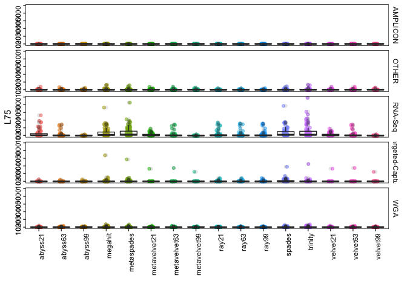<!-- -->

```r
make_boxplot("NA50")
```

```
## # A tibble: 80 x 4
## # Groups:   Assay_Type [5]
##    Assay_Type       X2             mean median
##    <chr>            <fct>         <dbl>  <dbl>
##  1 AMPLICON         abyss21      12311.  8610 
##  2 AMPLICON         abyss63       9431.  4624.
##  3 AMPLICON         abyss99       4517.  1480 
##  4 AMPLICON         megahit      24052. 29576 
##  5 AMPLICON         metaspades   23844. 29815 
##  6 AMPLICON         metavelvet21   692.   657 
##  7 AMPLICON         metavelvet63   945.   629 
##  8 AMPLICON         metavelvet99   685.   641 
##  9 AMPLICON         ray21        13095. 11269 
## 10 AMPLICON         ray63        12850.  8323 
## 11 AMPLICON         ray99        12849.  8323 
## 12 AMPLICON         spades       16582. 15378 
## 13 AMPLICON         trinity      14977. 16192 
## 14 AMPLICON         velvet21       692.   657 
## 15 AMPLICON         velvet63       933.   628 
## 16 AMPLICON         velvet99       682.   644 
## 17 OTHER            abyss21      13954. 12461 
## 18 OTHER            abyss63      18055. 24782 
## 19 OTHER            abyss99      20017. 27631 
## 20 OTHER            megahit      23159. 29831 
## 21 OTHER            metaspades   20154. 24810 
## 22 OTHER            metavelvet21   991.   732 
## 23 OTHER            metavelvet63   928.   783 
## 24 OTHER            metavelvet99  1250.  1128.
## 25 OTHER            ray21        16659. 24313 
## 26 OTHER            ray63        18842. 27680 
## 27 OTHER            ray99        18846. 27680 
## 28 OTHER            spades       21927. 29822 
## 29 OTHER            trinity      18770. 24148 
## 30 OTHER            velvet21      1045.   734 
## 31 OTHER            velvet63       937.   794.
## 32 OTHER            velvet99      1238.  1093 
## 33 RNA-Seq          abyss21       2257.   562 
## 34 RNA-Seq          abyss63       4235.  1354 
## 35 RNA-Seq          abyss99       7991.  3324 
## 36 RNA-Seq          megahit      27302. 29826 
## 37 RNA-Seq          metaspades   24294  29694.
## 38 RNA-Seq          metavelvet21   522    522 
## 39 RNA-Seq          metavelvet63  1111.  1058.
## 40 RNA-Seq          metavelvet99  1716.   823 
## 41 RNA-Seq          ray21        20410  22429 
## 42 RNA-Seq          ray63        19170. 22405 
## 43 RNA-Seq          ray99        19170. 22405 
## 44 RNA-Seq          spades       22049. 21438 
## 45 RNA-Seq          trinity       7027   3868 
## 46 RNA-Seq          velvet21       563    563 
## 47 RNA-Seq          velvet63      1049   1058.
## 48 RNA-Seq          velvet99      1716.   823 
## 49 Targeted-Capture abyss21      17890. 25017 
## 50 Targeted-Capture abyss63      18046. 27292 
## 51 Targeted-Capture abyss99      15943. 20376 
## 52 Targeted-Capture megahit      22721. 29853 
## 53 Targeted-Capture metaspades   22049. 26501 
## 54 Targeted-Capture metavelvet21   680.   649 
## 55 Targeted-Capture metavelvet63   945.   768 
## 56 Targeted-Capture metavelvet99  2820.  1297 
## 57 Targeted-Capture ray21        20049. 28592 
## 58 Targeted-Capture ray63        18926. 28367 
## 59 Targeted-Capture ray99        18937. 28367 
## 60 Targeted-Capture spades       23079. 29852 
## 61 Targeted-Capture trinity      13276.  9350.
## 62 Targeted-Capture velvet21       698.   670.
## 63 Targeted-Capture velvet63       949.   768 
## 64 Targeted-Capture velvet99      2755.  1302 
## 65 WGA              abyss21      18930. 22283 
## 66 WGA              abyss63      10582.  6212.
## 67 WGA              abyss99       2435.  1306.
## 68 WGA              megahit      28827. 29821 
## 69 WGA              metaspades   28976. 29820.
## 70 WGA              metavelvet21   659    664 
## 71 WGA              metavelvet63   596.   571 
## 72 WGA              metavelvet99   608.   590.
## 73 WGA              ray21        23264. 26559 
## 74 WGA              ray63        23400. 28610 
## 75 WGA              ray99        23400. 28610 
## 76 WGA              spades       16004. 15306.
## 77 WGA              trinity      27302. 29822 
## 78 WGA              velvet21       666.   666.
## 79 WGA              velvet63       601.   571 
## 80 WGA              velvet99       597.   584.
```

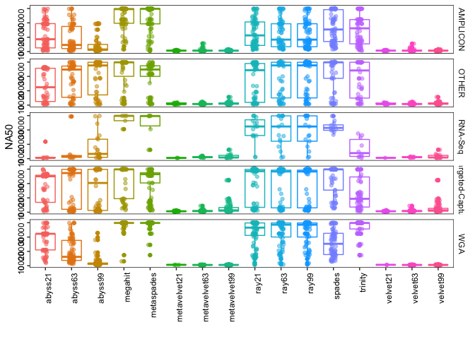<!-- -->

```r
make_boxplot("NA75")
```

```
## # A tibble: 80 x 4
## # Groups:   Assay_Type [5]
##    Assay_Type       X2             mean median
##    <chr>            <fct>         <dbl>  <dbl>
##  1 AMPLICON         abyss21       8901.  6368 
##  2 AMPLICON         abyss63       6416.  3052.
##  3 AMPLICON         abyss99       2379.   866.
##  4 AMPLICON         megahit      21131. 29576 
##  5 AMPLICON         metaspades   21652. 29819 
##  6 AMPLICON         metavelvet21   618.   579 
##  7 AMPLICON         metavelvet63   735.   560 
##  8 AMPLICON         metavelvet99   576.   560.
##  9 AMPLICON         ray21         9177.  6428 
## 10 AMPLICON         ray63         9688.  6361 
## 11 AMPLICON         ray99         9688.  6361 
## 12 AMPLICON         spades       12399.  7651 
## 13 AMPLICON         trinity      11455.  7424 
## 14 AMPLICON         velvet21       618.   579 
## 15 AMPLICON         velvet63       753.   564 
## 16 AMPLICON         velvet99       581.   570.
## 17 OTHER            abyss21      12678.  6860 
## 18 OTHER            abyss63      15859. 25333 
## 19 OTHER            abyss99      19303. 27634.
## 20 OTHER            megahit      20221. 29830.
## 21 OTHER            metaspades   11205.  4740 
## 22 OTHER            metavelvet21   675.   620.
## 23 OTHER            metavelvet63   678.   604 
## 24 OTHER            metavelvet99   826.   784 
## 25 OTHER            ray21        12606.  3925 
## 26 OTHER            ray63        14420.  4818.
## 27 OTHER            ray99        14421.  4818.
## 28 OTHER            spades       18643. 27692.
## 29 OTHER            trinity       8432.  3705 
## 30 OTHER            velvet21       685.   620.
## 31 OTHER            velvet63       711.   655 
## 32 OTHER            velvet99       854.   791 
## 33 RNA-Seq          abyss21       3403.   609 
## 34 RNA-Seq          abyss63       6532.   669 
## 35 RNA-Seq          abyss99       5761.  1432 
## 36 RNA-Seq          megahit      17790. 17790.
## 37 RNA-Seq          metaspades   22845  29583 
## 38 RNA-Seq          metavelvet21   NaN     NA 
## 39 RNA-Seq          metavelvet63   648.   643 
## 40 RNA-Seq          metavelvet99   993.   687 
## 41 RNA-Seq          ray21        18728  19310 
## 42 RNA-Seq          ray63        14595.  8413 
## 43 RNA-Seq          ray99        14595.  8413 
## 44 RNA-Seq          spades       12962. 12097 
## 45 RNA-Seq          trinity       6586   4816 
## 46 RNA-Seq          velvet21       NaN     NA 
## 47 RNA-Seq          velvet63       648.   643 
## 48 RNA-Seq          velvet99       968.   687 
## 49 Targeted-Capture abyss21      16969. 25390 
## 50 Targeted-Capture abyss63      19125. 29044 
## 51 Targeted-Capture abyss99      15528. 15621 
## 52 Targeted-Capture megahit      21833. 29853 
## 53 Targeted-Capture metaspades   20403. 26386 
## 54 Targeted-Capture metavelvet21   595.   558 
## 55 Targeted-Capture metavelvet63   714.   593 
## 56 Targeted-Capture metavelvet99  2009.   910.
## 57 Targeted-Capture ray21        18821. 28552.
## 58 Targeted-Capture ray63        18997. 28375 
## 59 Targeted-Capture ray99        19004. 28375 
## 60 Targeted-Capture spades       21944. 29852 
## 61 Targeted-Capture trinity      10293.  5447 
## 62 Targeted-Capture velvet21       601.   561 
## 63 Targeted-Capture velvet63       709.   591 
## 64 Targeted-Capture velvet99      2021.   960 
## 65 WGA              abyss21      16104. 22281 
## 66 WGA              abyss63       6894.  3974.
## 67 WGA              abyss99       1700.   968 
## 68 WGA              megahit      28869  29821 
## 69 WGA              metaspades   28621  29821 
## 70 WGA              metavelvet21   647    647 
## 71 WGA              metavelvet63   547.   520.
## 72 WGA              metavelvet99   534.   536 
## 73 WGA              ray21        20305. 26248.
## 74 WGA              ray63        22866. 29146 
## 75 WGA              ray99        22866. 29146 
## 76 WGA              spades       12177.  7571 
## 77 WGA              trinity      23711. 29822.
## 78 WGA              velvet21       647    647 
## 79 WGA              velvet63       549.   530.
## 80 WGA              velvet99       527.   528.
```

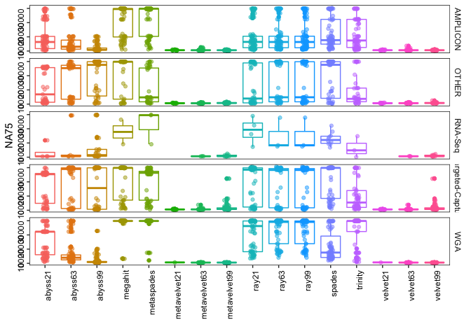<!-- -->

```r
make_boxplot("LA50")
```

```
## # A tibble: 80 x 4
## # Groups:   Assay_Type [5]
##    Assay_Type       X2            mean median
##    <chr>            <fct>        <dbl>  <dbl>
##  1 AMPLICON         abyss21       2.28    2  
##  2 AMPLICON         abyss63       3.14    3  
##  3 AMPLICON         abyss99       4.82    4  
##  4 AMPLICON         megahit       1.17    1  
##  5 AMPLICON         metaspades    1.25    1  
##  6 AMPLICON         metavelvet21  1.65    1  
##  7 AMPLICON         metavelvet63  3.08    2  
##  8 AMPLICON         metavelvet99  4.72    5  
##  9 AMPLICON         ray21         2.38    2  
## 10 AMPLICON         ray63         2.37    2  
## 11 AMPLICON         ray99         2.38    2  
## 12 AMPLICON         spades        1.95    1.5
## 13 AMPLICON         trinity       2.09    1  
## 14 AMPLICON         velvet21      1.65    1  
## 15 AMPLICON         velvet63      3.18    2  
## 16 AMPLICON         velvet99      4.84    5  
## 17 OTHER            abyss21       2.54    1.5
## 18 OTHER            abyss63       1.84    1  
## 19 OTHER            abyss99       1.68    1  
## 20 OTHER            megahit       1.84    1  
## 21 OTHER            metaspades    1.83    1  
## 22 OTHER            metavelvet21  5.6     5  
## 23 OTHER            metavelvet63  5.27    5  
## 24 OTHER            metavelvet99  6.1     6  
## 25 OTHER            ray21         2.46    1  
## 26 OTHER            ray63         1.85    1  
## 27 OTHER            ray99         1.84    1  
## 28 OTHER            spades        2.04    1  
## 29 OTHER            trinity       3.21    1  
## 30 OTHER            velvet21      5.47    5  
## 31 OTHER            velvet63      5.5     6  
## 32 OTHER            velvet99      6.17    6  
## 33 RNA-Seq          abyss21       6.43    8  
## 34 RNA-Seq          abyss63       7.3     5.5
## 35 RNA-Seq          abyss99       3.81    3  
## 36 RNA-Seq          megahit       1       1  
## 37 RNA-Seq          metaspades    1.17    1  
## 38 RNA-Seq          metavelvet21  4.5     4.5
## 39 RNA-Seq          metavelvet63  8.25    8.5
## 40 RNA-Seq          metavelvet99  6.93    6  
## 41 RNA-Seq          ray21         2.88    2  
## 42 RNA-Seq          ray63         3.59    1  
## 43 RNA-Seq          ray99         3.59    1  
## 44 RNA-Seq          spades       45.2    29.5
## 45 RNA-Seq          trinity      13.3     8  
## 46 RNA-Seq          velvet21      6       6  
## 47 RNA-Seq          velvet63      8.38    8.5
## 48 RNA-Seq          velvet99      7       7  
## 49 Targeted-Capture abyss21       1.71    1  
## 50 Targeted-Capture abyss63       2.46    1  
## 51 Targeted-Capture abyss99       2.38    1  
## 52 Targeted-Capture megahit       1.48    1  
## 53 Targeted-Capture metaspades    1.85    1  
## 54 Targeted-Capture metavelvet21  3.85    3  
## 55 Targeted-Capture metavelvet63  4.21    5  
## 56 Targeted-Capture metavelvet99  4.34    4  
## 57 Targeted-Capture ray21         2.27    1  
## 58 Targeted-Capture ray63         2.63    1  
## 59 Targeted-Capture ray99         2.62    1  
## 60 Targeted-Capture spades        9.82    1  
## 61 Targeted-Capture trinity       4.46    2  
## 62 Targeted-Capture velvet21      3.77    3  
## 63 Targeted-Capture velvet63      4.23    5  
## 64 Targeted-Capture velvet99      4.47    4  
## 65 WGA              abyss21       1.38    1  
## 66 WGA              abyss63       2.38    2  
## 67 WGA              abyss99       6.79    7  
## 68 WGA              megahit       1.03    1  
## 69 WGA              metaspades    1.03    1  
## 70 WGA              metavelvet21  1.67    1  
## 71 WGA              metavelvet63  3.82    3  
## 72 WGA              metavelvet99  5.54    5.5
## 73 WGA              ray21         1.37    1  
## 74 WGA              ray63         1.29    1  
## 75 WGA              ray99         1.29    1  
## 76 WGA              spades        1.72    1.5
## 77 WGA              trinity       1.16    1  
## 78 WGA              velvet21      2       2  
## 79 WGA              velvet63      4.12    3  
## 80 WGA              velvet99      5.53    5.5
```

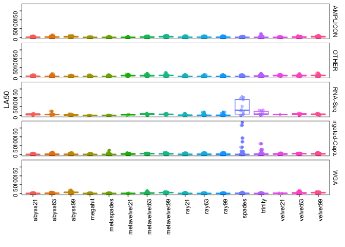<!-- -->

```r
make_boxplot("LA75")
```

```
## # A tibble: 80 x 4
## # Groups:   Assay_Type [5]
##    Assay_Type       X2             mean median
##    <chr>            <fct>         <dbl>  <dbl>
##  1 AMPLICON         abyss21        3.93    2  
##  2 AMPLICON         abyss63        5.37    4.5
##  3 AMPLICON         abyss99        8.58    8.5
##  4 AMPLICON         megahit        1.59    1  
##  5 AMPLICON         metaspades     1.59    1  
##  6 AMPLICON         metavelvet21   2.47    2  
##  7 AMPLICON         metavelvet63   5.10    4  
##  8 AMPLICON         metavelvet99   7.48    7  
##  9 AMPLICON         ray21          3.90    3  
## 10 AMPLICON         ray63          4.04    3  
## 11 AMPLICON         ray99          4.05    3  
## 12 AMPLICON         spades         3.30    2  
## 13 AMPLICON         trinity        3.04    2  
## 14 AMPLICON         velvet21       2.47    2  
## 15 AMPLICON         velvet63       5.28    4  
## 16 AMPLICON         velvet99       7.61    7  
## 17 OTHER            abyss21        3.87    2  
## 18 OTHER            abyss63        2.51    1  
## 19 OTHER            abyss99        2.37    1  
## 20 OTHER            megahit        2.68    1  
## 21 OTHER            metaspades     3.07    2  
## 22 OTHER            metavelvet21   8.93    9.5
## 23 OTHER            metavelvet63   8.35    9  
## 24 OTHER            metavelvet99  10.2    11  
## 25 OTHER            ray21          4.41    2  
## 26 OTHER            ray63          3.18    2  
## 27 OTHER            ray99          3.18    2  
## 28 OTHER            spades         2.77    1  
## 29 OTHER            trinity        6.77    3  
## 30 OTHER            velvet21       8.93    9.5
## 31 OTHER            velvet63       8.64   10  
## 32 OTHER            velvet99      10.1    10.5
## 33 RNA-Seq          abyss21        9.5     8  
## 34 RNA-Seq          abyss63        8.4     8  
## 35 RNA-Seq          abyss99        7       6  
## 36 RNA-Seq          megahit        1.5     1.5
## 37 RNA-Seq          metaspades     1.33    1  
## 38 RNA-Seq          metavelvet21 NaN      NA  
## 39 RNA-Seq          metavelvet63  10.3    14  
## 40 RNA-Seq          metavelvet99  11.5    10  
## 41 RNA-Seq          ray21          2.25    2  
## 42 RNA-Seq          ray63          2.33    2  
## 43 RNA-Seq          ray99          2.33    2  
## 44 RNA-Seq          spades        76.9    54  
## 45 RNA-Seq          trinity       18.3     4  
## 46 RNA-Seq          velvet21     NaN      NA  
## 47 RNA-Seq          velvet63      10.3    14  
## 48 RNA-Seq          velvet99      11.7    11  
## 49 Targeted-Capture abyss21        2.59    1  
## 50 Targeted-Capture abyss63        3.08    1  
## 51 Targeted-Capture abyss99        3.71    1.5
## 52 Targeted-Capture megahit        2.20    1  
## 53 Targeted-Capture metaspades     2.33    1  
## 54 Targeted-Capture metavelvet21   6.27    5  
## 55 Targeted-Capture metavelvet63   6.98    8  
## 56 Targeted-Capture metavelvet99   7.24    7  
## 57 Targeted-Capture ray21          3.58    1  
## 58 Targeted-Capture ray63          3.98    1  
## 59 Targeted-Capture ray99          3.98    1  
## 60 Targeted-Capture spades         8.49    1  
## 61 Targeted-Capture trinity        5.43    2  
## 62 Targeted-Capture velvet21       6.23    5  
## 63 Targeted-Capture velvet63       7.06    7  
## 64 Targeted-Capture velvet99       7.40    7  
## 65 WGA              abyss21        1.98    1  
## 66 WGA              abyss63        4.20    3  
## 67 WGA              abyss99       11.9    12  
## 68 WGA              megahit        1.05    1  
## 69 WGA              metaspades     1.06    1  
## 70 WGA              metavelvet21   1       1  
## 71 WGA              metavelvet63   4.42    3  
## 72 WGA              metavelvet99   8.54    9  
## 73 WGA              ray21          1.62    1  
## 74 WGA              ray63          1.37    1  
## 75 WGA              ray99          1.37    1  
## 76 WGA              spades         2.37    2  
## 77 WGA              trinity        1.43    1  
## 78 WGA              velvet21       1       1  
## 79 WGA              velvet63       4.04    3  
## 80 WGA              velvet99       8.65    8.5
```

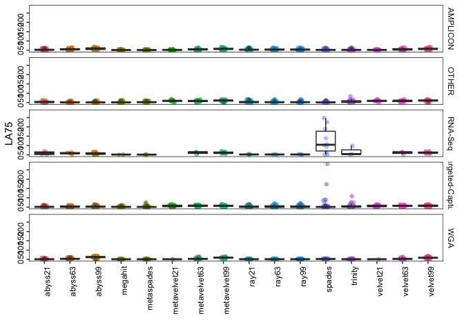<!-- -->

```r
#n50
make_boxplot = function(variableToPlot)
{
  x4 = xm %>% filter(Assembly == variableToPlot) 
  stat = x4 %>%
    group_by(X2, Assay_Type) %>%
    summarize(mean = mean(value, na.rm = TRUE),
            median = median(value, na.rm = TRUE))
  
  print(stat)
  plot = ggplot(x4, aes(X2, value)) +
    geom_jitter(alpha = .5, width = .1, aes(color = X2)) +
    geom_boxplot(alpha = 0.1) +
    #scale_color_viridis(discrete=TRUE) +
    #scale_fill_material("red") +
    xlab("") +
    ylab(variableToPlot) +
    facet_grid(Assay_Type~., scales = "free") +
    theme(panel.background = element_rect(fill = "white"),
        panel.border = element_rect(fill = NA, colour = "black", size = .5),
        axis.text = element_text(color = "black", angle = 90, hjust = 1),
        strip.background =element_rect(fill="white"),
        legend.position = "none") 
  print(plot)
  
  filename = str_replace_all(variableToPlot, "[[:punct:]]", "")
  ggsave(filename=paste(filename,".pdf", sep="_"), width = 12, height = 18, units = "cm", device = 'pdf')
}

make_boxplot("L50")
```

```
## # A tibble: 80 x 4
## # Groups:   X2 [16]
##    X2      Assay_Type         mean median
##    <fct>   <chr>             <dbl>  <dbl>
##  1 abyss21 AMPLICON           2.56      2
##  2 abyss21 OTHER             10.6       2
##  3 abyss21 RNA-Seq          155.       24
##  4 abyss21 Targeted-Capture   3.33      1
##  5 abyss21 WGA                5.08      1
##  6 abyss63 AMPLICON           3.22      3
##  7 abyss63 OTHER              9.18      1
##  8 abyss63 RNA-Seq           62.4       9
##  9 abyss63 Targeted-Capture   3.80      2
## 10 abyss63 WGA                7.51      2
## # … with 70 more rows
```

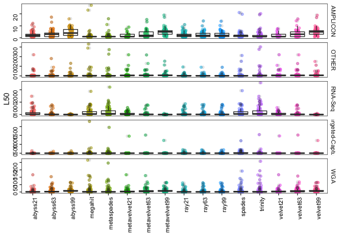<!-- -->

```r
# genomic feature
x4 = xm %>% filter(Assembly == "genomic features") 
x4$value.1 = gsub("part", "", x4$value.1)
x5 = data.frame(str_split_fixed(x4$value.1,"\\+", 2), x4) 
x6 = data.frame(assembly = x5$X2, match = as.numeric(as.character(x5$X1.1)), mismatch = as.numeric(as.character(x5$X2.1)))

# need to add assay_type
  ggplot(x6, aes(assembly, 100*(match/49))) +
    geom_boxplot(aes(color = assembly)) +
    geom_jitter(alpha = .5, width = .1, aes(color = assembly)) +
    xlab("") +
    ylab("% features mapped") +
    theme(panel.background = element_rect(fill = "white"),
        panel.border = element_rect(fill = NA, colour = "black", size = .5),
        axis.text = element_text(color = "black", angle = 90, hjust = 1)) 
```

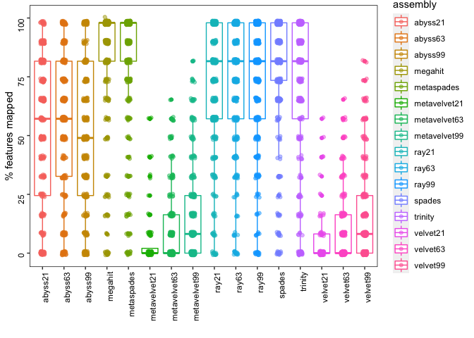<!-- -->

```r
ggsave("percent features mapped.pdf", width = 15, height = 10, units = "cm")
```

### 90% of the genome is covered by single contig


```r
library(tidyverse)
setwd("/Volumes/rony/drive/asm/covid19-Assembly/plots/")

#90%=29903*.9
contig = xm %>% filter(Assembly == "Largest contig") %>% filter(value >=26912.7)
ggplot(contig, aes(X2)) +
    geom_histogram(stat = "count") +
    xlab("") +
    ylab("Count") +
    facet_grid(~Assay_Type) +
    theme(panel.background = element_rect(fill = "white"),
        panel.border = element_rect(fill = NA, colour = "black", size = .5),
        strip.background =element_rect(fill="white"),
        axis.text = element_text(color = "black", angle = 90, hjust = 1)) 
```

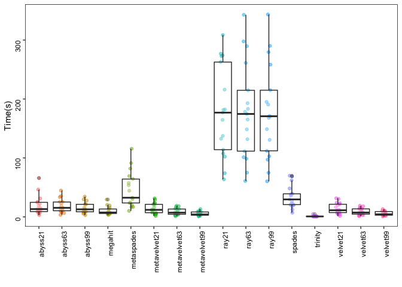<!-- -->

```r
ggsave("90_percent_genome_single_contig.pdf", width = 20, height = 6, units = "cm")
```

### correlation read vs genome


```r
library(tidyverse)
setwd("/Volumes/rony/drive/asm/covid19-Assembly/plots/")
#r = read.table("~/Gdrive_tutorial_edits/Assembly_COVID19/covid19-Assembly/files/read_QC_matrix.txt")[,c(1,4)]
r = read.table("/Volumes/rony/drive/asm/covid19-Assembly/files/read_QC_matrix.txt")[,c(1,4)]

r2 = data.frame(id = str_split_fixed(r$V1, "_", 2), read = r$V4)
head(r2$id[,1])
```

```
## NULL
```

```r
#sum every two rows of PE data
r3 = data.frame(id = unique(r2$id.1), read = (rowsum(r2[,3], as.integer(gl(nrow(r2), 2, nrow(r2))))))
rx = xm %>% filter(Assembly == "Genome fraction (%)")
rx2 = inner_join(r3, rx, by = c("id" = "X1"))
#rxm = left_join(rx2, meta2, by = c("id" = "Run"))
subset(is.na(rx2)) %>% dim()
```

```
## [1] 6027    9
```

```r
subset(!is.na(rx2)) %>% dim()
```

```
## [1] 6027    9
```

```r
# metavelve and ray have lots of NA genome frac values

ggplot(rx2, aes(value, read/1e6)) +
    geom_point(aes(color = X2), shape = 18) +
    geom_smooth(method='lm', formula= y~x) +
    xlab("Genome fraction (%)") +
    ylab("Number of reads (million)") + 
    facet_grid(~Assay_Type, scales = "free") +
    theme(panel.background = element_rect(fill = "white"),
        panel.border = element_rect(fill = NA, colour = "black", size = .5),
        strip.background =element_rect(fill="white"),
        axis.text = element_text(color = "black", angle = 0, hjust = 1),
        legend.position = "none") 
```

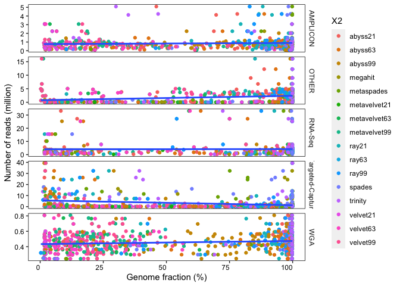<!-- -->

```r
ggsave("readVsGenome.pdf", width = 20, height = 6, units = "cm")

rx3 = na.omit(rx2)
cor(rx3$value, rx3$read, method = "spearman")
```

```
## [1] 0.09714612
```

```r
#read dist
dist = rx2 %>% distinct(id, .keep_all = T)
ggplot(dist, aes(Assay_Type, log10(read))) +
    geom_boxplot(notch = T, width = .5) +
    geom_jitter(alpha = .5, width = .1) +
    xlab("") +
    ylab("log10(Number of reads)") + 
    theme(panel.background = element_rect(fill = "white"),
        panel.border = element_rect(fill = NA, colour = "black", size = .5),
        strip.background =element_rect(fill="white"),
        axis.text = element_text(color = "black", angle = 90, hjust = 1)) 
```

<!-- -->

```r
ggsave("readDist.pdf", width = 7, height = 10, units = "cm")
```


### sample to assembler


```r
library(tidyverse)
setwd("/Volumes/rony/drive/asm/covid19-Assembly/plots/")

rx2 %>% filter(Assembly == "Genome fraction (%)") %>% na.omit() %>%
    ggplot(aes(fct_reorder(id, read), X2, color = X2)) +
    geom_point(aes(size = value, alpha = .5)) +
    ylab("") +
    xlab("Samples are sorted by number of reads") + 
    theme(panel.background = element_rect(fill = "white"),
        panel.border = element_rect(fill = NA, colour = "black", size = .5),
        axis.text = element_text(color = "black", angle = 0, hjust = 1),
        axis.text.x=element_blank()) 
```

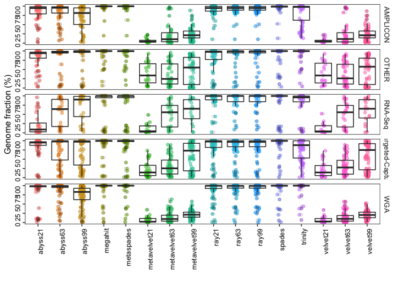<!-- -->

```r
ggsave("sampleVsassembler_color_bk.pdf", width = 30, height = 20, units = "cm")

# select 4 samples with high and low mean frac to plot in mvista
#high = SRR11578289 (97.4), SRR11597206 (94.4)
#low = SRR11828432, SRR11828424
#ref: MN908947.3

mvista = x3 %>% filter(Assembly == "Genome fraction (%)") %>% na.omit() %>%
    group_by(X1) %>%
    summarise(mean = mean(value)) %>% arrange(mean)
```

### dataset preparation


```r
library(tidyverse)
library(knitr)

c = read_tsv("~/Gdrive_tutorial_edits/Assembly_COVID19/covid19-Assembly/files/SraRunTable_COVID19_14.06.20.txt")

c2 = tibble(c$Platform, c$Run, c$SRA_Sample, c$Instrument, c$LibraryLayout, c$Assay_Type, c$LibrarySelection, c$LibrarySource, c$Organism, c$geo_loc_name, c$host, c$host_disease, c$Consent)

names(c2) <- gsub("c\\$", "", names(c2))
colSums(!is.na(c2))
```

```
##         Platform              Run       SRA_Sample       Instrument 
##            15007            15007            15007            15007 
##    LibraryLayout       Assay_Type LibrarySelection    LibrarySource 
##            15007            15007            15007            15007 
##         Organism     geo_loc_name             host     host_disease 
##            15007             5508             5373             5297 
##          Consent 
##            15007
```

```r
#
#write_csv(c2, "~/Gdrive_tutorial_edits/Assembly_COVID19/covid19-Assembly/files/COVID19_14.06.20_metadata_final.csv")

# summarise metadata
#colnames(c2)

#good code example: https://uc-r.github.io/descriptives_categorical
table3 <- table(c2$Instrument, c2$Assay_Type)
table3 <- table( c2$Assay_Type, c2$LibrarySource)
table3 <- table(c2$Assay_Type, c2$LibrarySource, c2$LibraryLayout)
ftable(table3)
```

```
##                                      PAIRED SINGLE
##                                                   
## AMPLICON         GENOMIC                  0      0
##                  METAGENOMIC              0     41
##                  METATRANSCRIPTOMIC       0      0
##                  SYNTHETIC                0    136
##                  TRANSCRIPTOMIC           0      0
##                  VIRAL RNA             5254   6507
## OTHER            GENOMIC                  0      0
##                  METAGENOMIC              1      0
##                  METATRANSCRIPTOMIC       0      0
##                  SYNTHETIC                0      0
##                  TRANSCRIPTOMIC           0      0
##                  VIRAL RNA               68      0
## RNA-Seq          GENOMIC                  1      0
##                  METAGENOMIC              9      9
##                  METATRANSCRIPTOMIC       9      0
##                  SYNTHETIC                0      0
##                  TRANSCRIPTOMIC          16      3
##                  VIRAL RNA              682    654
## Targeted-Capture GENOMIC                  0      0
##                  METAGENOMIC              0      0
##                  METATRANSCRIPTOMIC       0      0
##                  SYNTHETIC                0      0
##                  TRANSCRIPTOMIC           0      0
##                  VIRAL RNA              194    241
## WGA              GENOMIC                  6      0
##                  METAGENOMIC              5      0
##                  METATRANSCRIPTOMIC       0      0
##                  SYNTHETIC                0      0
##                  TRANSCRIPTOMIC           0      0
##                  VIRAL RNA             1061      0
## WGS              GENOMIC                 11      0
##                  METAGENOMIC              6      0
##                  METATRANSCRIPTOMIC       0      0
##                  SYNTHETIC                0      0
##                  TRANSCRIPTOMIC           0      0
##                  VIRAL RNA               93      0
```

```r
# will add table paper
df = c2 %>% 
    group_by(Assay_Type, LibrarySource, LibraryLayout) %>%
    tally() 

kable(df, caption = "Summary of all data. This table will add table paper")
```


Table: Summary of all data. This table will add table paper

|Assay_Type       |LibrarySource      |LibraryLayout |    n|
|:----------------|:------------------|:-------------|----:|
|AMPLICON         |METAGENOMIC        |SINGLE        |   41|
|AMPLICON         |SYNTHETIC          |SINGLE        |  136|
|AMPLICON         |VIRAL RNA          |PAIRED        | 5254|
|AMPLICON         |VIRAL RNA          |SINGLE        | 6507|
|OTHER            |METAGENOMIC        |PAIRED        |    1|
|OTHER            |VIRAL RNA          |PAIRED        |   68|
|RNA-Seq          |GENOMIC            |PAIRED        |    1|
|RNA-Seq          |METAGENOMIC        |PAIRED        |    9|
|RNA-Seq          |METAGENOMIC        |SINGLE        |    9|
|RNA-Seq          |METATRANSCRIPTOMIC |PAIRED        |    9|
|RNA-Seq          |TRANSCRIPTOMIC     |PAIRED        |   16|
|RNA-Seq          |TRANSCRIPTOMIC     |SINGLE        |    3|
|RNA-Seq          |VIRAL RNA          |PAIRED        |  682|
|RNA-Seq          |VIRAL RNA          |SINGLE        |  654|
|Targeted-Capture |VIRAL RNA          |PAIRED        |  194|
|Targeted-Capture |VIRAL RNA          |SINGLE        |  241|
|WGA              |GENOMIC            |PAIRED        |    6|
|WGA              |METAGENOMIC        |PAIRED        |    5|
|WGA              |VIRAL RNA          |PAIRED        | 1061|
|WGS              |GENOMIC            |PAIRED        |   11|
|WGS              |METAGENOMIC        |PAIRED        |    6|
|WGS              |VIRAL RNA          |PAIRED        |   93|

```r
#write_tsv(df, "~/Gdrive_tutorial_edits/Assembly_COVID19/covid19-Assembly/files/summary_data.tsv")

df2 = df %>% filter(LibrarySource == "VIRAL RNA")
kable(df2, caption = "Summary of VIRAL RNA data")
```


Table: Summary of VIRAL RNA data

|Assay_Type       |LibrarySource |LibraryLayout |    n|
|:----------------|:-------------|:-------------|----:|
|AMPLICON         |VIRAL RNA     |PAIRED        | 5254|
|AMPLICON         |VIRAL RNA     |SINGLE        | 6507|
|OTHER            |VIRAL RNA     |PAIRED        |   68|
|RNA-Seq          |VIRAL RNA     |PAIRED        |  682|
|RNA-Seq          |VIRAL RNA     |SINGLE        |  654|
|Targeted-Capture |VIRAL RNA     |PAIRED        |  194|
|Targeted-Capture |VIRAL RNA     |SINGLE        |  241|
|WGA              |VIRAL RNA     |PAIRED        | 1061|
|WGS              |VIRAL RNA     |PAIRED        |   93|

```r
##subsample main paper
#PE
set.seed(2020)
a1 = c2 %>% filter(LibraryLayout == "PAIRED" & Assay_Type == "AMPLICON" & LibrarySource == "VIRAL RNA") %>%
    mutate(LibType = "PE: AMPLICON of VIRAL RNA") %>% sample_n(100)

set.seed(2020)
a2 = c2 %>% filter(LibraryLayout == "PAIRED" & Assay_Type == "OTHER" & LibrarySource == "VIRAL RNA") %>%
    mutate(LibType = "PE: OTHER of VIRAL RNA")

set.seed(2020)
a3 = c2 %>% filter(LibraryLayout == "PAIRED" & Assay_Type == "RNA-Seq" & LibrarySource == "VIRAL RNA") %>%
    mutate(LibType = "PE: RNA-Seq of VIRAL RNA") %>% sample_n(100)

set.seed(2020)
a4 = c2 %>% filter(LibraryLayout == "PAIRED" & Assay_Type == "Targeted-Capture" & LibrarySource == "VIRAL RNA") %>%
    mutate(LibType = "PE: Targeted-Capture of VIRAL RNA") %>% sample_n(100)

set.seed(2020)
a5 = c2 %>% filter(LibraryLayout == "PAIRED" & Assay_Type == "WGA" & LibrarySource == "VIRAL RNA") %>%
    mutate(LibType = "PE: WGA of VIRAL RNA") %>% sample_n(100)

set.seed(2020)
a6 = c2 %>% filter(LibraryLayout == "PAIRED" & Assay_Type == "WGS" & LibrarySource == "VIRAL RNA") %>%
    mutate(LibType = "PE: WGS of VIRAL RNA")

#SE
set.seed(2020)
b1 = c2 %>% filter(LibraryLayout == "SINGLE" & Assay_Type == "AMPLICON" & LibrarySource == "VIRAL RNA") %>%
    mutate(LibType = "SE: AMPLICON of VIRAL RNA") %>% sample_n(100)

set.seed(2020)
b2 = c2 %>% filter(LibraryLayout == "SINGLE" & Assay_Type == "RNA-Seq" & LibrarySource == "VIRAL RNA") %>%
    mutate(LibType = "SE: RNA-Seq of VIRAL RNA") %>% sample_n(100)

set.seed(2020)
b3 = c2 %>% filter(LibraryLayout == "SINGLE" & Assay_Type == "Targeted-Capture" & LibrarySource == "VIRAL RNA") %>%
    mutate(LibType = "SE: Targeted-Capture of VIRAL RNA") %>% sample_n(100)

#dataset
ab_pe = rbind(a1, a2, a3, a4, a5, a6)
ab_se = rbind(b1, b2, b3)
#write_csv(ab_pe, "~/Gdrive_tutorial_edits/Assembly_COVID19/covid19-Assembly/files/PE_561samples_final.csv")
#write_csv(ab_se, "~/Gdrive_tutorial_edits/Assembly_COVID19/covid19-Assembly/files/SE_300samples_final.csv")
#write.table(ab_pe$Run, "~/Gdrive_tutorial_edits/Assembly_COVID19/covid19-Assembly/files/PE_561samples_final_561runs.txt", col.names = F, row.names = F, quote = F)
#write.table(ab_se$Run, "~/Gdrive_tutorial_edits/Assembly_COVID19/covid19-Assembly/files/SE_300samples_final_300runs.txt", col.names = F, row.names = F, quote = F)
#write_csv(a1, "~/Gdrive_tutorial_edits/Assembly_COVID19/covid19-Assembly/files/PE_100samples_amplicon_bioRxiv.csv")
#write.table(a1[,2], "~/Gdrive_tutorial_edits/Assembly_COVID19/covid19-Assembly/files/PE_100samples_amplicon_bioRxiv_100runs.txt", col.names = F, row.names = F, quote = F)

# test ram and cpu
set.seed(2020)
#20 samples will be selected from amplicon with similar depth
#ram = a1 %>% sample_n(20)

ab = rbind(ab_pe, ab_se)
ab2 = ab %>% group_by(LibType) %>% tally()
kable(ab2, caption = "List of total 9 different categories. Maximum 100 samples are randomly selected")
```


Table: List of total 9 different categories. Maximum 100 samples are randomly selected

|LibType                           |   n|
|:---------------------------------|---:|
|PE: AMPLICON of VIRAL RNA         | 100|
|PE: OTHER of VIRAL RNA            |  68|
|PE: RNA-Seq of VIRAL RNA          | 100|
|PE: Targeted-Capture of VIRAL RNA | 100|
|PE: WGA of VIRAL RNA              | 100|
|PE: WGS of VIRAL RNA              |  93|
|SE: AMPLICON of VIRAL RNA         | 100|
|SE: RNA-Seq of VIRAL RNA          | 100|
|SE: Targeted-Capture of VIRAL RNA | 100|

